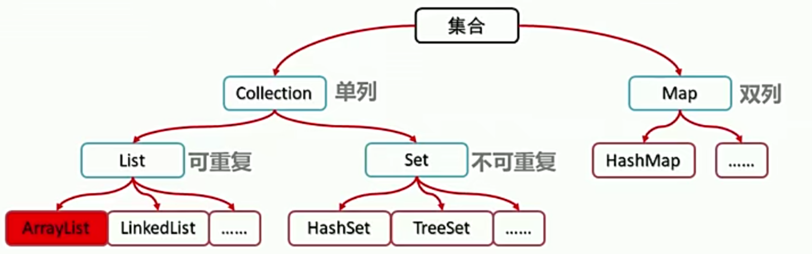
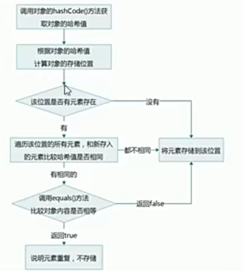

# 1 异常

> 异常：就是程序出现了不正常的情况

**异常体系：**


Error：严重问题，不需要处理

Exception：称为异常类，他表示程序本身可以处理的问题

- RuntimeException：在编译器不需要检查，出现问题后，需要回来修改代码。
- 非RuntimeException：编译时就需要处理，否则程序不能通过编译，不能正常运行。

## 1.1 JVM默认处理方式

如果程序出现了问题，最终JVM会做默认的处理。

- 把异常的名称，异常原因及异常出现的位置等信息输出在控制台
- 程序停止执行

程序演示

```java
package com.study.nanyu.day08;

public class ExceptionDemo {
    public static void main(String[] args) {
        System.out.println("开始");
        show();
        System.out.println("结束");

    }
    public static void show(){
        int [] arr={1,2,3};
        System.out.println(arr[4]);
    }
}
/*
输出结果
开始
Exception in thread "main" java.lang.ArrayIndexOutOfBoundsException: 4
	at com.study.nanyu.day08.ExceptionDemo.show(ExceptionDemo.java:12)
	at com.study.nanyu.day08.ExceptionDemo.main(ExceptionDemo.java:6)
*/
```

## 1.2 try...catch

格式：

```java
try{
	可能出现异常的代码;
}catch(异常类名 变量名){
	异常的处理代码;
}
```

执行流程：

程序从`try`里面的代码开始执行，出现异常会自动生成异常类对象，该异常类对象将被自动提交给`Java`运行时系统。

当`Java`运行时系统接收到异常对象时，会到`catch`中去找匹配的异常类，找到后进行异常处理。

执行完毕之后，程序可以继续往下执行。


程序实例：

```java
package com.study.nanyu.day08;

public class ExceptionDemo {
    public static void main(String[] args) {
        System.out.println("开始");
        show();
        System.out.println("结束");

    }
    public static void show(){
        try {
            int[] arr = {1, 2, 3};
            System.out.println(arr[4]);
            //catch()中填入异常对象的名称
        }catch (ArrayIndexOutOfBoundsException e){
            System.out.println("出问题啦！数组索引越界啦！");
        }
        }
}
/*
输出结果
开始
出问题啦！数组索引越界啦！
结束
*/
```

## 1.3 Throwable

`Throwable`类是所有异常类的父类

| 方法名                        | 说明                            |
| ----------------------------- | ------------------------------- |
| public String getMessage()    | 返回此throwable的详细信息字符串 |
| public String toString()      | 返回此可抛出的简短描述          |
| public void printStackTrace() | 把异常的错误信息输出在控制台上  |

程序实例：

因为`Throwable`是所有异常类的父类，所以`ArrayIndexOutOfBoundsException`继承了`Throwable`类中的方法。

- printStackTrace()方法：

```java
package com.study.nanyu.day08;

public class ExceptionDemo {
    public static void main(String[] args) {
        System.out.println("开始");
        show();
        System.out.println("结束");

    }
    public static void show() {
        try {
            int[] arr = {1, 2, 3};
            System.out.println(arr[4]);
        } catch (ArrayIndexOutOfBoundsException e) {
            e.printStackTrace();
        }
    }
}
/*
输出结果
开始
结束
java.lang.ArrayIndexOutOfBoundsException: 4
	at com.study.nanyu.day08.ExceptionDemo.show(ExceptionDemo.java:14)
	at com.study.nanyu.day08.ExceptionDemo.main(ExceptionDemo.java:6)
*/
```

- getMessage()方法

```java
package com.study.nanyu.day08;

public class ExceptionDemo {
    public static void main(String[] args) {
        System.out.println("开始");
        show();
        System.out.println("结束");

    }

    public static void show() {
        try {
            int[] arr = {1, 2, 3};
            System.out.println(arr[4]);
        } catch (ArrayIndexOutOfBoundsException e) {
            System.out.println(e.getMessage());
        }
    }
}
/*
输出结果
开始
4
结束
*/
```

- toString()方法

```java
package com.study.nanyu.day08;

public class ExceptionDemo {
    public static void main(String[] args) {
        System.out.println("开始");
        show();
        System.out.println("结束");

    }

    public static void show() {
        try {
            int[] arr = {1, 2, 3};
            System.out.println(arr[4]);
        } catch (ArrayIndexOutOfBoundsException e) {
            System.out.println(e.toString());
        }
    }
}
/*
输出结果
开始
java.lang.ArrayIndexOutOfBoundsException: 4
结束
*/
```

## 1.4 编译时异常与运行时异常

`Java`中的异常被分为两大类:编译时异常和运行时异常，也被称为受检异常和非受检异常。

所有的`RuntimeException`类及其子类被称为运行时异常，其他的异常都是编译时异常.

- 编译时异常:必须显示处理，否则程序就会发生错误，无法通过编译
- 运行时异常:无需显示处理，也可以和编译时异常一样处理

```java
package com.study.nanyu.day08;

import java.text.SimpleDateFormat;
import java.util.Date;

public class ExceptionDemo {
    public static void main(String[] args) {
        method1();
    }

    //运行时异常
    public static void method1() {
        int[] arr = {1, 2, 3};
        System.out.println(arr[4]);
    }
    //编译时异常
    public static void method2(){
        String date="2021-06-06";
        SimpleDateFormat df=new SimpleDateFormat("yyyy-MM-dd");
        Date parse = df.parse(date);//报错，导致无法运行程序
        System.out.println(parse);

    }
}
```

## 1.5 throws

虽然我们通过try...catch.….可以对异常进行处理，但并不是所有的情

况我们都有权限进行异常的处理.

格式：

```java
throws 异常类名;
```

**注意：**throws跟在方法的括号后面

```java
package com.study.nanyu.day08;

import java.text.ParseException;
import java.text.SimpleDateFormat;
import java.util.Date;

public class ExceptionDemo {
    public static void main(String[] args) throws ParseException {
        method1();
    }

    //运行时异常
    public static void method1() throws ParseException {
        String date="2021-06-06";
       SimpleDateFormat df=new SimpleDateFormat("yyyy-MM-dd");
        Date parse = df.parse(date);
        System.out.println(parse);
    }
}
```

- 编译时异常必须要进行处理，两种处理方案: try..catch ..或者throws，如果采用throws这种方案，将来谁调用谁处理
- 运行时异常可以不处理，出现问题后，需要回来修改代码

## 1.6 自定义异常

自定义异常类并继承`Exception`类

```java
package com.study.nanyu.day08.one;

public class ScoreExceptiom extends Exception{
    public ScoreExceptiom(){};
    public ScoreExceptiom(String message){
        super(message);
    };
}
```

定义一个`Teacher`类

```java
package com.study.nanyu.day08.one;

public class Teacher {
    public void checkScore(int score)throws ScoreExceptiom {
        if (score < 0 || score > 100) {
            //手动抛异常
            throw new ScoreExceptiom("分数有误！");
        }else{
            System.out.println("分数正常");
        }
    }
}
```

定义一个测试类

```java
package com.study.nanyu.day08.one;

import java.util.Scanner;

public class TeacherDemo {
    public static void main(String[] args) {
        Scanner sc=new Scanner(System.in);
        int score=sc.nextInt();
        Teacher t=new Teacher();
        try {
            t.checkScore(score);
        } catch (ScoreExceptiom scoreExceptiom) {
            scoreExceptiom.printStackTrace();
        }
    }
}
/*
输出结果
123
com.study.nanyu.day08.one.ScoreExceptiom: 分数有误！
	at com.study.nanyu.day08.one.Teacher.checkScore(Teacher.java:7)
	at com.study.nanyu.day08.one.TeacherDemo.main(TeacherDemo.java:11) 
 */
```

### 1.6.1 throw与throws区别

`throws`
用在方法声明后面，跟的是异常类名表示抛出异常，由该方法的调用者来处理，表示出现异常的可能性，并不一定会发生异常

`throw`
用在方法体内，跟的是异常对象名表示抛出异常，由方法体内的语句处理，执行`throw`一定抛出了异常


# 2 集合

集合类的特点：提供一种存储空间可变的存储模型，存储的数据容量可以随时发生改变。集合的体系结构如下：



蓝色框表示接口，红色框表示实现类，接口无法直接实例化，需要先实现该接口，再通过其实现类进行实例化。

- Collection：单列接口，它是所有单列接口的父接口
- Map：双列接口，它是所有双列接口的父接口，其实现类有HashMap
- List：存储可重复元素的单列接口，其具体的实现类有ArrarlList、LikedList等
- Set：存储不可重复元素的单列接口，其具体实现类有HashSet、TreeSet

**集合存储的是引用数据类型，对于一般数据类型需要使用包装类**

```java
TreeSet<Integer> set=new TreeSet<>();
LinkedList<String> set=new LinkedList<>();
HashSet<Short> set=new HashSet<>();
```

## 2.1 Collection

Collection集合概述：

- 是单例集合的顶层接口，它表示一组对象，这些对象也称为Collection的元素
- **JDK不提供Collection接口的任何直接实现**，它提供更具体的子接口（如Set和List）实现

创建Collection集合的对象

- 多态的方式
- 具体的实现类`ArrayList`

```java
package com.study.nanyu.day09;
import java.util.ArrayList;
import java.util.Collection;

public class CollectionDemo {
    public static void main(String[] args) {
        // 多态方式创建Collection对象
        Collection<String> c=new ArrayList<String>();
        c.add("Hello");
        c.add("World!");
        System.out.println(c);
    }
}
/*
输出结果
[Hello, World!]
*/
```

总结：Collection如果要进行实例化，有两种方法，一种是通过多态的形式，二是通过其子接口的实现类实现实例化。

### 2.1.1 Collection常用方法

| 方法名                     | 说明                           |
| -------------------------- | ------------------------------ |
| boolean add(E e)           | 添加元素                       |
| boolean remove(Object o)   | 从集合中移除指定元素           |
| void clear()               | 清空集合中的元素               |
| boolean contains(Object o) | 判断集合是否包含指定元素       |
| boolean isEmpty()          | 判断集合是否为空               |
| int size()                 | 集合的长度，即集合中元素的个数 |

程序实例：

```java
package com.study.nanyu.day09;
import java.util.ArrayList;
import java.util.Collection;

public class CollectionDemo {
    public static void main(String[] args) {
        Collection<String> c=new ArrayList<String>();
        c.add("Hello ");
        c.add("World ");
        c.add("Java");
        System.out.println(c);
        // 移除集合中某一元素
        c.remove("Java");
        // 判断集合是否包含某一元素
        System.out.println(c.contains("Java"));
        // 判断集合是否为空
        System.out.println(c.isEmpty());
        // 集合中元素个数 2
        System.out.println(c.size());
    }
}
```

### 2.1.2 Collection集合的遍历

Iterator：迭代器，集合的专用遍历方式

- Iterator<E> iterator()：返回集合中元素的迭代器，通过集合的iterator()方法获得
- **迭代器是通过集合的iterator()方法得到的，所以说它是依赖于集合存在的。**

Iterator中的常用方法

- E next()：返回迭代中的下一个元素。

- boolean hashNext():如果迭代器有更多元素，则返回true。

程序实例：

```java
package com.study.nanyu.day09;

import java.util.ArrayList;
import java.util.Collection;
import java.util.Iterator;

public class IteratorDemo {
    public static void main(String[] args) {
        Collection<String> c=new ArrayList<String>();
        c.add("a");
        c.add("b");
        c.add("c");
        // 获取迭代器：iterator，其实是一种多态的形式
        Iterator<String> iterator = c.iterator();
//        System.out.println(iterator.next());
//        System.out.println(iterator.next());
//        System.out.println(iterator.next());
//          System.out.println(iterator.next()); 会报错，表示元素不存在
        // 使用迭代器遍历集合
        while (iterator.hasNext()){
            System.out.println(iterator.next());
        }

    }
}
/*
输出结果：
a
b
c
*/

```

### 2.1.3 集合存储学生对象

创建学生类

```java
package com.study.nanyu.day09;

public class Student {
    private String name;
    private int age;

    public Student() {

    }
  // get和set以及toString方法已省略
}
```

创建测试类

```java
package com.study.nanyu.day09;

import java.util.ArrayList;
import java.util.Collection;
import java.util.Iterator;

public class StudentDemo {
    public static void main(String[] args) {
        //创建集合对象
        Collection<Student> s=new ArrayList<Student>();
        //创建对象
        Student s1=new Student("张三",18);
        Student s2=new Student("李四",29);
        Student s3=new Student("王五",68);
        //添加数据
        s.add(s1);
        s.add(s2);
        s.add(s3);
        //遍历集合
        Iterator<Student> iterator = s.iterator();
        while (iterator.hasNext()){
            System.out.println(iterator.next());
            //System.out.println(iterator.next().getName());
        }
    }
}
/*
学生集合{姓名:'张三', 年龄:18}
学生集合{姓名:'李四', 年龄:29}
学生集合{姓名:'王五', 年龄:68}
*/
```

## 2.2 List集合

List集合概述：

- 有序集合(也称为序列)，用户可以精确控制列表中每个元素的插入位置，还可以通过整数索引访问元素，并搜索列表中的元素，
- 与Set集合不同，List集合中允许有重复的元素。

List集合特点：

- 有序，存储和取出的元素顺序一致；
- 可重复，存储的元素可以重复。

程序实例：

```java
package com.study.nanyu.day10;

import java.util.ArrayList;
import java.util.Iterator;
import java.util.List;

public class ListDemo {
    public static void main(String[] args) {
        List<String> list=new ArrayList<String>();
        //添加元素
        list.add("hello");
        list.add("world");
        list.add("java");
        //可重复
        list.add("hello");
//        System.out.println(list);
//    遍历集合
        Iterator<String> iterator = list.iterator();
        while(iterator.hasNext()){
            System.out.println(iterator.next());
        }
    }

}
/*
hello
world
java
hello
*/
```

### 2.2.1 list特有方法

| 方法名                        | 说明                               |
| ----------------------------- | ---------------------------------- |
| void add(int index,E element) | 指定位置插入元素                   |
| E remove(int index)           | 移除指定位置元素，返回删除的元素   |
| E set(int index,E element)    | 修改指定位置元素，返回被修改的元素 |
| E get(int index)              | 获取指定位置元素                   |

程序实例：

```java
package com.study.nanyu.day10;

import java.util.ArrayList;
import java.util.Iterator;
import java.util.List;

public class ListDemo {
    public static void main(String[] args) {
        // 多态的形式创建List对象
        List<String> list=new ArrayList<String>();
        //添加元素
        list.add("hello");
        list.add("world");
        list.add("java");
        //指定位置添加元素
        list.add(1,"java");
        //删除指定位置元素,返回被删除的元素
        list.remove(2);
        //修改指定位置元素
        list.set(2,"modify");
        //返回指定位置元素
        list.get(2);
        System.out.println(list);
for (int i=list.size()-1;i>=0;i--){
    System.out.println(list.get(i));
}
        }
}
/*
[hello, java, modify]
modify
java
hello
*/
```

### 2.2.2 ListIterator

`ListIterator`：列表迭代器，继承自`Iterator`

- 通过List集合的listlterator()方法得到，所以说它是list集合特有的迭代器。
- 用于允许程序员沿任一方向遍历列表的列表迭代器，在迭代期间修改列表，并获取列表中迭代器的当前位置。

常用方法：

- E next()：返回迭代中的下一个元素。
- boolean hasNext()：如果迭代具有更多元素，则返回true。
- E previous()：返回列表中的上一个元素。
- boolean hasPigvious()：如果此列表迭代器在相反方向遍历列表时具有更多元素，则返回true。
- void add(e)：将指定的元素插入列表。

```java
package com.study.nanyu.day10;

import java.util.ArrayList;
import java.util.Iterator;
import java.util.List;
import java.util.ListIterator;

public class ListDemo {
    public static void main(String[] args) {
        List<String> list=new ArrayList<String>();
        //添加元素
        list.add("hello");
        list.add("world");
        list.add("java");
        ListIterator<String> lt = list.listIterator();
        //正向遍历(很少用)
        while (lt.hasNext()){
            System.out.println(lt.next());
        }
        System.out.println("------------------");
        //反向遍历（很少用）
        while (lt.hasPrevious()){
            System.out.println(lt.previous());
        }
        System.out.println("------------------");
        //添加元素(很常用)
        while (lt.hasNext()){
            String s = lt.next();
            if(s.equals("java")){
                lt.add("添加了一个元素！");
            }
        }
        System.out.println(list);

    }

}
/*
hello
world
java
------------------
java
world
hello
------------------
[hello, world, java, 添加了一个元素！]
*/
```

### 2.2.3 ArrayList、LinkedList

**List集合常用子类：ArrayList、LinkedList**

- ArrayList：底层数据结构是数组，查询快，增删慢（数组特点：查询快、增删慢）
- LinkedList：底层数据结构是链表，查询慢，增删快（链表特点：查询慢，增删快）

程序实例：

```java
package com.study.nanyu.day10;

import java.util.ArrayList;
import java.util.LinkedList;

public class ListSon {
    public static void main(String[] args) {
        // ArrayList列表练习
        ArrayList<String> al=new ArrayList<String>();
        al.add("hello");
        al.add("world");
        for(String s:al){
            System.out.println(s);
        }
        System.out.println("------------------");
        // LinkedList列表练习
        LinkedList<String> ll=new LinkedList<String>();
        ll.add("你好");
        ll.add("世界");
        for(String s:ll){
            System.out.println(s);
        }
    }
}
/*
hello
world
------------------
你好
世界
*/
```

### 2.2.2 LinkedList特有方法

LinkedList底层基于链表，链表有查询慢、增删快的特点，增删起来比较方便，只需要修改节点中下一个节点的地址即可。

| 方法名                    | 说明                     |
| ------------------------- | ------------------------ |
| public void addFirst(E e) | 在该列表开头插入指定元素 |
| public void addLast(E e)  | 在该列表末尾追加指定元素 |
| public E getFirst()       | 返回此列表第一个元素     |
| public E getLast()        | 返回此列表最后一个元素   |
| public E removeFirst()    | 删除此列表中第一个元素   |
| public E removeLast()     | 删除此列表中最后一个元素 |

## 2.3 Set集合

Set集合特点：

- 不包含重复元素集合（元素不重复）
- 没有带索引的方法，不能使用普通for循环遍历
- 存储没有顺序
- Set是一个接口，不能直接实例化，需要根据其实现类，以多态的形式进行实例化
- Set最主要的两个实现类：HashSet、TreeSet

Set集合与Collection集合没有很大的区别，最重要的不同在于Set集合中没有重复的元素，本章**主要探究Set集合如何保证集合中没有重复元素。**

程序实例：

```java
package day11;

import java.util.HashSet;
import java.util.Iterator;
import java.util.Set;

public class SetDemo {
    public static void main(String[] args) {
        //Set是一个接口，不能直接实现化，所以要用它的实现类,要用多态的形式实例化
        Set<String> set=new HashSet<>();
        // Set<String> set1=new LinkedHashSet<>();
        // Set<String> set2=new TreeSet<>();
        set.add("java");
        set.add("Hello");
        set.add("world");
        for(String s:set){
            System.out.println(s);
        }
        System.out.println("----------------");
        Iterator<String> iterator = set.iterator();
        while(iterator.hasNext()){
            System.out.println(iterator.next());
        }
    }
}
/*
java
world
Hello
----------------
java
world
Hello
*/
```

### 2.3.1 哈希值

哈希值：是JDK根据**对象的地址**或者**字符串**或者**数字**计算出来的int类型的**数值**。需要明确的是哈希值并不是对象的地址值。

Object类中有一个方法可以获取对象的哈希值

```java
package day11;

import com.study.nanyu.day09.Student;

public class HashDemo {
    public static void main(String[] args) {
        Student s1 = new Student("钉子君", 39);
        //同一对象多次调用hashcode()方法，返回哈希值相同
        System.out.println(s1.hashCode());//460141958
        System.out.println(s1.hashCode());//460141958
        System.out.println("-----------------------");
        Student s2 = new Student("钉子君", 39);
        //不同对象调用hashcode()方法，返回哈希值不相同
        //通过方法重写，可以实现不同对象的哈希值相同
        System.out.println(s2.hashCode());//1163157884
        System.out.println("-----------------------");
        System.out.println("hello".hashCode());//99162322
        System.out.println("-----------------------");
        System.out.println("world".hashCode());//113318802
        System.out.println("-----------------------");
        System.out.println("南雨".hashCode());
        System.out.println("博客".hashCode());
    }
}
/*
460141958
460141958
-----------------------
1163157884
-----------------------
99162322
-----------------------
113318802
-----------------------
700017
684936

*/
```

默认情况下不同对象的地址值不相同，计算出的哈希值也不同，但在实体类中可以通过重写`hashCode()`方法来实现让不同的对象哈希值也相同。

因为Java中所有类都默认继承自Object，`hashCode()`方法就是来自Object，只需要重写该方法，并return一个自己设置的哈希值即可。如果重写了`hashCode()`方法，每次实例化对象时，对象的哈希值就会变为`hashCode()`中return的值。

程序实例：

```java
package com.study.nanyu.day09;

import java.util.Objects;

public class Student {
    private String name;
    private int age;
    
    //省略get和set以及toString方法

    @Override
    public int hashCode() {
        return 100;
    }
}
```

**总结：**

> 哈希值是计算出来的，同一对象的地址值相同，根据对象的地址值计算出来的哈希值是相同的，所以同一对象的哈希值相同，默认情况下不同对象的地址值不同，所以计算出的哈希值也不同，但通过重写`hashCode()`可以改变对象的哈希值。

### 2.3.2 HashSet

HashSet具有以下几个特点：

- 底层的数据结构是哈希表
- 无序：对集合的迭代顺序不做任何保证，即不能保证存储的和取出的元素一致
- 无法通过索引获取元素（不能使用普通for循环遍历数据），但可以通过迭代器和增强for循环遍历集合
- 顶层接口为Set集合，所以不包含重复的元素

程序实例：

观察HashSet集合添加数据时的顺序与最终遍历的数据，发现顺序并不一致，原因如下：

> HashSet底层基于哈希表，HashSet集合每添加一个数据，就会计算该数据的哈希值，从而计算这个数据应该在哈希表的什么位置。
>
> 比如，添加的第一个字符串“java”，计算出哈希值为10123，进一步计算出“java”应该在哈希表的第一个位置；第二个添加的字符串为“hello”，计算出哈希值为12723，进一步计算出“hello”应该在哈希表的第3个位置；第三个添加的字符串为“world”，计算出哈希值为93421，进一步计算出“world”应该在哈希表的第二个位置。
>
> 遍历输出时就会按照哈希表中的排列顺序依次输出java world Hello

```java
package com.study.nanyu.day11;

import java.util.HashSet;
import java.util.Iterator;
import java.util.Set;

public class SetDemo {
    public static void main(String[] args) {
        //Set是一个接口，不能直接实现化，所以要用它的实现类,要用多态的形式实例化
        Set<String> set=new HashSet();
        set.add("java");
        set.add("Hello");
        set.add("world");
        for(String s:set){
            System.out.println(s);
        }
        System.out.println("----------------");
        Iterator<String> iterator = set.iterator();
        while(iterator.hasNext()){
            System.out.println(iterator.next());
        }
    }
}
/*
java
world
Hello
----------------
java
world
Hello
*/
```

### 2.3.3 HashSet存储元素不重复原理

其实看源码就可以搞明白，HashSet底层基于哈希表，其保证存储元素不重复的原理其实与存储元素的哈希值有关。**<font color="red">换句话说，HashSet之所以能保证存储元素不重复，其实是根据元素的哈希值进行判断的</font>**，源码刨析：

下面是使用add方法添加数据的代码，

```java
HashSet<String> set=new HashSet();
set.add("java");
set.add("Hello");
set.add("world");
```

- add()方法：不妨以add()方法入手，查看其源码的实现，HashSet源码中add()方法的实现如下，add()方法中又调用了put()方法，put()方法的第一个参数e就是我们添加的元素。

```java
public boolean add(E e) {
    return map.put(e, PRESENT)==null;
}
```

- put()方法：下面进一步深入put()方法，put()方法中调用了putVal()方法，第一个参数调用了一个hash()方法来计算元素的哈希值，将元素的哈希值作为参数传递至putVal()方法中，第二个参数是添加的元素。

```java
public V put(K key, V value) {
    return putVal(hash(key), key, value, false, true);
}
```

hash()方法其实就是调用hashCode()方法来计算元素的哈希值

```java
static final int hash(Object key) {
    int h;
    return (key == null) ? 0 : (h = key.hashCode()) ^ (h >>> 16);
}
```

- putVal()方法：该方法是核心，里面主要做的工作就是根据元素的哈希值判断元素是否已存在，具体见代码中的注释。

```java
final V putVal(int hash, K key, V value, boolean onlyIfAbsent,
               boolean evict) {
    /**
    
    **/
    // 定义一个哈希表（哈希表是基于数组的）
    Node<K,V>[] tab; 
    Node<K,V> p; 
    int n, i;
    
    /**
    判断哈希表是否被初始化，如果没有被初始化就初始化哈希表
    **/
    if ((tab = table) == null || (n = tab.length) == 0)
        n = (tab = resize()).length;
    
    /**
    根据对象（元素）的哈希值计算对象的存储位置，如果该位置没元素，则直接存储，如果有元素，则做进一步判断。
    **/
    if ((p = tab[i = (n - 1) & hash]) == null)
        tab[i] = newNode(hash, key, value, null);
    else {
        Node<K,V> e; K k;
        
    /**
    如果该位置有元素，则比较要存的元素与之前元素的哈希值
    	如果哈希值不同，则继续详细执行，则继续向下执行，替换原数据，存储该元素
    	如果哈希值相同，，则调用对象的equal()方法比较key（即添加的元素与之前的元素）
    		如果返回false，则替换原始数据，存储新数据
    		如果返回true，则说明元素重复，不存储。
    **/
        if (p.hash == hash &&
            ((k = p.key) == key || (key != null && key.equals(k))))
            e = p;
        else if (p instanceof TreeNode)
            e = ((TreeNode<K,V>)p).putTreeVal(this, tab, hash, key, value);
        else {
            for (int binCount = 0; ; ++binCount) {
                if ((e = p.next) == null) {
                    p.next = newNode(hash, key, value, null);
                    if (binCount >= TREEIFY_THRESHOLD - 1) // -1 for 1st
                        treeifyBin(tab, hash);
                    break;
                }
                if (e.hash == hash &&
                    ((k = e.key) == key || (key != null && key.equals(k))))
                    break;
                p = e;
            }
        }
        if (e != null) { // existing mapping for key
            V oldValue = e.value;
            if (!onlyIfAbsent || oldValue == null)
                e.value = value;
            afterNodeAccess(e);
            return oldValue;
        }
    }
    ++modCount;
    if (++size > threshold)
        resize();
    afterNodeInsertion(evict);
    return null;
}
```

流程图



要保证HashMap元素的唯一性，元素要重写hashCode()方法和equals()方法。比如字符串。

程序实例：

使用HashSet集合存储学生对象，要求只要对象中的成员变量都相等就认为是一个对象。

```java
public class HashSetDemo {
    public static void main(String[] args) {
        HashSet<Student> hs=new HashSet<>();

        Student student1=new Student("张三",10);
        Student student2=new Student("李四",13);
        Student student3=new Student("王五",17);
        // student4与student1应被视为同一对象，只存储一个
        Student student4=new Student("张三",10);
        hs.add(student1);
        hs.add(student2);
        hs.add(student3);
        hs.add(student4);

        for (Student student:hs){
            System.out.println(student);
        }
        System.out.println("-----------");

        Iterator<Student> iterator = hs.iterator();
        while (iterator.hasNext()){
            System.out.println(iterator.next());
        }
    }
}
```

要保证成员变量相等就认为是一个对象，需要在Student实体类中重写hashCode()与equals()方法。

```java
package com.study.nanyu.day09;

import java.util.Objects;

public class Student {
    private String name;
    private int age;

    public Student() {

    }
    // 已省略get和set以及toString方法

    @Override
    public boolean equals(Object o) {
        if (this == o) return true;
        if (o == null || getClass() != o.getClass()) return false;
        Student student = (Student) o;
        return age == student.age && Objects.equals(name, student.name);
    }
}
/**
学生集合{姓名:'王五', 年龄:17}
学生集合{姓名:'张三', 年龄:10}
学生集合{姓名:'李四', 年龄:13}
-----------
学生集合{姓名:'王五', 年龄:17}
学生集合{姓名:'张三', 年龄:10}
学生集合{姓名:'李四', 年龄:13}
**/
```

### 2.3.4 LinkedHashSet集合

> 奇技淫巧：对比之前学的LinkedList可知，LinkedList是基于链表的，而Linked翻译成中文也有链、链接的意思，因此我们不妨推断带有Linked单词的列表底层必然与链表有着很大的关系。本章的LinkedHashSet底层也是基于链表的，同时还是基于哈希表。

LinkedHashSet集合的特点：

- 底层**由哈希表和链表实现的Set接口**，具有可以预测的迭代次序
- 由链表保证元素有序，也就是说元素的存储和取出顺序是一致的（HashSet没有的特点）
- 由哈希表保证元素的唯一，也就是说没有重复的元素（LinkedList没有的特点）

注意：LinkedHashSet不是HashSet集合的子集，它与HashSet平级，LinkedHashSet同样实现了Set接口，只不过底层与HashSet不太一样而已。

程序实例：

```java
public class LinkedHashSetDemo {
    public static void main(String[] args) {
        //多态的方式将Set实例化
        LinkedHashSet<String> set=new LinkedHashSet<>();
        set.add("hello");
        set.add("hello");
        set.add("world");
        set.add("world");
        set.add("你好");
        set.add("1");
        set.add("2");
        set.add("3");
        set.add("4");
        set.add("5");

        for (String s:set){
            System.out.println(s);
        }
    }
}
/**
hello
world
你好
1
2
3
4
5
**/
```

如上面程序演示所示，集合中不能有重复元素，并且输入数据与输出数据顺序一致

### 2.3.5 TreeSet集合

TreeSet并非直接实现Set接口，而是间接实现Set集合。

TreeSet集合具有以下特点：

- 元素有序：这里的顺序并不是指存储和取出的顺序，而是按照一定的规则进行排序，具体的排序方法取决于构造方法
  - TreeSet()：根据其元素的自然排序进行排序
  - TreeSet(Comparator comparator)：根据指定的比较器进行排序
- 没有带索引的方法，遍历需要用增强for循环或迭代器，不能用普通for循环。
- 间接实现Set接口，所以不包含重复元素

程序实例：

```java
public class TreeSetDemo {
    public static void main(String[] args) {
        TreeSet<Integer> set=new TreeSet<>();
        set.add(1);
        set.add(2);
        set.add(1);
        set.add(12);
        set.add(14);
        set.add(15);
        set.add(5);

        for (Integer i:set){
            System.out.println(i);
        }
    }
}
/**
1
2
5
12
14
15
**/
```

从上面代码的输出结果看，添加数据时是乱序的，然而输出的时候已经经过了排序，这其实是TreeSet在内部使用了自然排序的结果。

为什么TreeSet能实现对上面添加的数据的自然排序？

> 集合中存储的是引用类型数据，如Stirng、Integer、Short等等，这些数据类型都实现了Comparable（下面会讲）接口，实现了Comparable接口中的compareTo方法，使得这些元素可以调用compareTo方法与其他元素作比较。
>
> 比如，上面输入了Integer类型的2，这里的2是对象不是一般数据类型的int，2会调用compareTo方法与1作比较。

**总结：**

TreeSet间接继承了Set接口，因此还是不能有重复元素，另外与其他Set接口的实现类不同的是，TreeSet在内部实现了对添加的数据的排序，使用无参构造器的话，元素将会按照默认的自然排序法进行排序，但需要在元素对应的实体类中实现Comparable接口，使用有参构造器可以传递一个排序器，将元素按照该排序器进行排序。

### 2.3.6 自然排序Comparable

Comparable<T>是一个接口，接口中只有一个方法(T是泛型，可以是Stirng、Integer、对象等等)

```java
@Override
public int compareTo(T t) {
    return 0;
}
```

方法剖析：

- compareTo(T t) ：传递的参数t是需要比较的数据，比如传入5，则就是与5作比较，传入个对象Student就是与该对象作比较。

- return：比较结果的返回值
  - 0：表示两个数据对比相等
  - 1(正数)：表示正序排序
  - -1(负数)：表示倒序排序

<hr>

对于`Integer`、`String`等引用数据类型，其都实现了`Comparable`接口，重写了`compareTo()`方法，因此添加至`TreeSet`集合中后，元素都可以调用`compareTo()`方法，从而进行排序。

但是对于我们自己创建的对象该如何进行自然排序？

**只需要对象的实体类继承`Comparable`接口，并实现`compareTo`方法即可。**

以一个例子来说明自然排序`Comparable`，要求：以年龄对输入的对象进行排序，如果年龄相同则比较姓名。

1. Student实体类

该类实现Comparable接口，并重写compareTo方法，在该方法中做对应要求的操作

```java
public class Student implements Comparable<Student> {
    private String name;
    private int age;

    public Student() {

    }

    public Student(String name, int age) {
        this.name = name;
        this.age = age;
    }
    
    //get、set、toString方法已省略

    @Override
    public int compareTo(Student s) {
        int num = this.age - s.age;
        //String实现了Comparable接口，并重写了compareTo方法，可以直接调用该方法与其他字符串比较
        // 三元表达式，如果num=0，则说明年龄相等，则比较姓名，如果不相等，则继续比较年龄
        int num1 = num == 0 ? this.name.compareTo(s.name) : num;
        return num1;
    }
}
```

2. 测试类：

添加数据，并遍历集合，查看排序结果

```java
public class ComparableDemo {
    public static void main(String[] args) {
        TreeSet<Student> set=new TreeSet<Student>();
        Student student1=new Student("zhangsan",12);
        Student student2=new Student("lisi",20);
        Student student3=new Student("wangwu",23);
        Student student4=new Student("xiaoming",9);
        Student student5=new Student("huangfeihong",23);

        set.add(student1);
        set.add(student2);
        set.add(student3);
        set.add(student4);
        set.add(student5);

        for(Student s:set){
            System.out.println(s);
        }
    }
}
/**
排序结果：

学生集合{姓名:'xiaoming', 年龄:9}
学生集合{姓名:'zhangsan', 年龄:12}
学生集合{姓名:'lisi', 年龄:20}
学生集合{姓名:'huangfeihong', 年龄:23}
学生集合{姓名:'wangwu', 年龄:23}
**/
```

结论：

- 用TreeSet集合存储自定义对象，无参构造方法使用的是**<font color="red">自然排序</font>**对元素进行排序
- 自然排序，就是**<font color="red">让元素所属的类实现Comparable接口，重写compareTo(T o)方法</font>.**
- 重写方法时，注意排序规则按照要求编写。

### 2.3.7 Comparator比较器

上面使用的是TreeSet的无参构造方法，所以使用的是默认的自然排序，我们可以使用TreeSet的带参构造器，传递一个比较器，使用该比较器对数据进行比较。

而这一章节的Comparator就是一个比较器。

以例子说明，要求如下：

- 存储学生对象并遍历，创建TreeSet集合使用带参构造方法
- 按照年龄大小，从小到大排序，年龄相同则按照姓名的首字母进行排序

```java
package com.study.nanyu.day11;

import com.study.nanyu.pojo.User;

import java.util.Comparator;
import java.util.TreeSet;

public class TreeSetDemo {
    public static void main(String[] args) {
        // 有参构造的形式创建TreeSet集合
        TreeSet<User> set=new TreeSet<>(new Comparator<User>() {
            @Override
            public int compare(User u1, User u2) {
                int num=u1.getAge()-u2.getAge();
                int num1=num==0?u1.getName().compareTo(u2.getName()):num;
                return num1;
            }
        });


        User u1=new User("张三",12);
        User u2=new User("李四",23);
        User u3=new User("王五",16);
        User u4=new User("赵六",38);
        User u5=new User("丁七",38);

        set.add(u1);
        set.add(u2);
        set.add(u3);
        set.add(u4);
 		set.add(u5);
        System.out.println(set);
    }
}
/*
输出结果：
[User{name='张三', age=12}, User{name='王五', age=16}, User{name='李四', age=23}, User{name='丁七', age=38}, User{name='赵六', age=38}]
*/
```

上面使用的是Treeset的有参构造创建的集合，其中参数是一个比较器，该比较器是匿名内部类的方式传递的。

结论：

- 用TreeSet集合存储自定义的对象，无参构造方法采用的是**<font color=red>默认的排序</font>**方法对元素进行排序
- 用TreeSet集合存储自定义的对象，有参构造方法采用的是**<font color=red>比较器排序</font>**对元素进行排序
- 比较器排序**<font color=red>就是让集合接收Comparator的实现类对象</font>**，重写compare(T o1,T o2)方法
- 重写方法时一定要注意排序规则必须要按照要求的主要条件和次要条件来写

### 2.3.8 案例：成绩排序

需求：用TreeSet集合存储多个学生信息（姓名、语文成绩、数学成绩）并遍历该集合

要求：按照总分从高到低出现

实现思路：

1. 定义学生类
2. 创建Treeset集合，通过比较器排序
3. 创建学生对象
4. 将学生对象a至集合
5. 遍历集合

```java
package com.study.nanyu.day11;

import com.study.nanyu.pojo.Student;

import java.util.Comparator;
import java.util.TreeSet;

public class Example {
    public static void main(String[] args) {
        TreeSet<Student> set=new TreeSet<>(new Comparator<Student>() {
            @Override
            public int compare(Student s1, Student s2) {
                int grade1=s1.getChineseGrade()+s1.getMathGrade();
                int grade2=s2.getChineseGrade()+s2.getMathGrade();
                int num=grade2-grade1;
                int num1=num==0?s1.getUsername().compareTo(s2.getUsername()):num;
                return num1;
            }
        });

        Student st1=new Student("张三",78,89);
        Student st2=new Student("李四",67,90);
        Student st3=new Student("王五",12,67);
        Student st4=new Student("赵六",89,78);

        set.add(st1);
        set.add(st2);
        set.add(st3);
        set.add(st4);


        for(Student student:set){
            System.out.println(student);
        }
    }
}

/*
输出结果：
Student{username='张三', chineseGrade=78, mathGrade=89}
Student{username='赵六', chineseGrade=89, mathGrade=78}
Student{username='李四', chineseGrade=67, mathGrade=90}
Student{username='王五', chineseGrade=12, mathGrade=67}
*/
```

### 2.3.9 案例：不重复随机数

需求：编写一个程序，获取10个1-20之间的随机数，要求随机数不能重复，并在控制台输出
思路：

- 创建Set集合对象
- 创建随机数对象
- 判断集合的长度是不是小于10
  - 是：产生一个随机数，添加到集合

- 遍历集合

```java
package com.study.nanyu.day11;

import java.util.*;

public class Example {
    public static void main(String[] args) {
       Set<Integer> set=new HashSet<Integer>();
        Random random=new Random();
        while (set.size()<10){
            int num=random.nextInt(20)+1;
            set.add(num);
        }

        for(Integer i:set){
            System.out.println(i);
        }
    }
}

/*
输出结果：
16
1
17
2
18
3
5
7
11
12
*/

```

## 2.4 泛型

### 2.4.1 泛型概述

泛型是JDK5中引入的特性，它提供了编译时类型安全检测机制，该机制允许在编译时检测到非法的类型。它的本质是**<font color=red>参数化类型</font>**，也就是说所操作的数据类型被指定为一个参数。

一提到参数，最熟悉的就是定义方法时有形参，然后调用方法时传递实参，那么参数化类型怎么理解？顾名思义，就是**<font color=red>将类型由原来的具体的类型参数化，然后在使用/调用时传入具体的类型</font>**。这种参数类型可以用在类、方法、接口中，分别被称作泛型类、泛型方法、泛型接口。

简单来说就是先不指定具体的数据类型，比如一个方法的返回值先不指定，先用一个参数占着位，当以后调用该参数的时候再指定该方法的返回类型，这就可以使得一个方法能返回不同的数据类型，供不同的场景使用。

泛型定义格式：

- <类型>指定一种类型的格式。这里的类型可以看成是形参
- <类型1,类型2...>：指定多种类型的格式，多种类型之间用逗号隔开。这里的类型可以看成是形参
- 将来具体调用时给定的类型可以看成是实参，并且实参的类型只能是引用数据类型

程序实例：

看下面两段代码，一段是不使用泛型的，另一段是使用泛型的：

- 不使用泛型

```java
package com.study.nanyu.day11;

import java.util.ArrayList;
import java.util.Collection;
import java.util.Iterator;

public class TClass {
    public static void main(String[] args) {
        // 不使用泛型
        Collection c = new ArrayList();
        c.add("hello");
        c.add("world");
        c.add(100); // 不报错
        Iterator iterator = c.iterator();
        while (iterator.hasNext()) {
            String obj =(String) iterator.next();
            System.out.println(obj);
        }
    }
}
```

这段代码因为没指定泛型，所以默认向集合中添加的是Object元素。在向集合中添加元素时分别添加了String类型和int类型的数据，因为String和int都能自动向上转型为Object，遍历集合的时候把所有输出结果全部强制转换为String类型。

这段代码虽然放在编辑器中不会报错，但只要一运行就会发生错误，错误的原因在于我们在添加元素时添加了一个Integer（int）类型的数据，添加时发生了向上转型，转成了集合可以接受的Object，所以在这个阶段没有报错，但是当遍历集合数据时把所有数据强制转换为了String，就发生了错误，因为Integer不能强制转换为String（**<font color=red>这种报错在编译阶段不会提示，但是运行起来就会提示，被称为运行时异常</font>**）

- 使用泛型

```java
package com.study.nanyu.day11;

import java.util.ArrayList;
import java.util.Collection;
import java.util.Iterator;

public class TClass {
    public static void main(String[] args) {
	// 使用泛型
    Collection<String> collection=new ArrayList<>();
    collection.add("hello");
    collection.add("world");
    collection.add(100); //报错
    Iterator it = collection.iterator();
     //Iterator迭代器也可以加泛型，之后就不需要强制转换
    // Iterator<String> it = collection.iterator();
    while (it.hasNext()) {
        String str = (String) it.next();
        System.out.println(str);
    }
 }
}
```
这段代码直接发生了报错，因为使用了泛型，在创建集合时使用了泛型，即该集合只接受指定类型的数据，其他类型的数据传递过来直接报错，不能接收。这段代码中在创建集合时指定了泛型为Stirng，即告诉别人，该集合只接受String类型的元素（**<font color=red>这种报错会在编译时直接提示出来告诉编写者必须要去处理才能执行程序，被称为编译时异常</font>**）

如果把Iterator迭代器也加上泛型，则就不需要下面的强制转换了

```java
//Iterator迭代器也可以加泛型，之后就不需要强制转换
Iterator<String> it = collection.iterator();
while (it.hasNext()) {
    String str = it.next();
    System.out.println(str);
}
```

**泛型的好处：**

- 将运行时期的问题提前到编译期间
- 避免了强制类型转换

### 2.4.2 泛型类

- 格式：修饰符 class 类名<类型>{}
- 范例：public class Student<T>{}：此处的T可以随便写为任意标识，常见的如：T、E、K、V等形式的参数常用于表示泛型

如下，定义一个泛型类

```java
package com.study.nanyu.pojo;

public class Generic <T>{
    private T t;

    public T getT() {
        return t;
    }

    public void setT(T t) {
        this.t = t;
    }
}
```

测试代码如下：

```java
package com.study.nanyu.day12;

import com.study.nanyu.pojo.Generic;
import com.study.nanyu.pojo.Student;

public class TDemo {

    public static void main(String[] args) {
        Generic<String> g1 = new Generic<String>();
        g1.setT("南雨");
        Generic<Integer> g2 = new Generic<Integer>();
        g2.setT(1);
        Generic<Student> g3=new Generic<Student>();
        Student student=new Student("南雨",100,98);
        g3.setT(student);

        System.out.println(g1.getT());
        System.out.println(g2.getT());
        System.out.println(g3.getT());

    }
}
/*
输出结果：
南雨
1
Student{username='南雨', chineseGrade=100, mathGrade=98}
*/
```

泛型类的好处：

- 原本几个类完成的功能，一个类就能完成

### 2.4.3 泛型方法

- 格式：修饰符 <类型> 返回值 方法名(){}
- 范例：public <T> void save(){}

具体实例如下：

```java
package com.study.nanyu.pojo;

public class Generic {

    // 定义泛型方法
    public <T> void save(T t) {
        System.out.println(t);
    }

    /*
    public String saveString(String str){
        System.out.println(str);
        return str;
    }

    public boolean savBoolean(boolean flag){
        System.out.println(flag);
        return flag;
    }

    public int savInt(int num){
        System.out.println(num);
        return num;
    }
    */

}
```

测试代码如下：

```java
package com.study.nanyu.day12;

import com.study.nanyu.pojo.Generic;
import com.study.nanyu.pojo.Student;

public class TDemo {

    public static void main(String[] args) {
        Student student=new Student("南雨",90,88);
        Generic g = new Generic();
        g.save("你好");
        g.save(12);
        g.save(true);
        g.save(3.1415926);
        g.save(student);
    }
}

/*
输出结果：
你好
12
true
3.1415926
Student{username='南雨', chineseGrade=90, mathGrade=88}
*/
```

分析上面代码，只创建了一个Generic对象，却可以往该对象内传不同数据类型的值，如果不使用泛型，那么需要下面这种方法

```java
public String saveString(String str){
    System.out.println(str);
    return str;
}

public boolean savBoolean(boolean flag){
    System.out.println(flag);
    return flag;
}

public int savInt(int num){
    System.out.println(num);
    return num;
}

...
```

这样每增加一个返回类型的需求，就需要多写一个方法，这将会非常的麻烦，那么如过使用泛型方法会怎么样呢？只需要下面这一个方法即可，遵循循环利用的倡导。

```java
public <T> void save(T t) {
    System.out.println(t);
}
```

泛型方法的好处：

- 与泛型类一样，可以大大减少冗余代码，原本几个方法完成的操作，一个方法就能完成

### 2.4.4 泛型接口

- 格式：修饰符 interface 接口名<类型>{}

- 范例：public interface show<T>{}

程序实例：

泛型接口：

```java
package com.study.nanyu.pojo.inter;

public interface Generic <T>{
    void show(T t);
}
```

接口实现：

```java
package com.study.nanyu.pojo;

import com.study.nanyu.pojo.inter.Generic;

public class GenericImpl<T> implements Generic<T> {

    @Override
    public void show(T t) {
        System.out.println(t);
    }   
}
```

测试类：

```java
package com.study.nanyu.day12;

import com.study.nanyu.pojo.GenericImpl;

public class TDemo {

    public static void main(String[] args) {
        GenericImpl<String> g = new GenericImpl<String>();
        g.show("张三");
        g.show("李四");
        g.show("王五");
        g.show("赵六");
    }
}
/*
输出结果：
张三
李四
王五
赵六
*/
```

> 如果一个接口是泛型接口，那么它的实现类也是泛型，被称为泛型类。

对于泛型接口的理解可以联想List集合，为什么List集合可以存入不同的数据类型？原因就是List是泛型接口，其实现类是泛型方法。

List集合是一个接口，该接口是一个泛型接口，其实现类ArrayList、LinkedList等都是泛型类

下面是List接口类的框架

```java
//泛型接口List<E>
public interface List<E> extends Collection<E> {}
```

List接口的实现类是泛型类，如下ArrayList类的框架

```java
public class ArrayList<E> extends AbstractList<E>
        implements List<E>, RandomAccess, Cloneable, java.io.Serializable{}
```

### 2.4.5 类型通配符

为了表示各种泛型List的父类，可以使用类型通配符

- 类型通配符：**<font color=red><?></font>**
- List<?>：表示元素类型未知的List，它的元素可以匹配到**<font color=red>任何的类型</font>**
- 这种带通配符的List仅表示它是各种泛型List的父类，并不能把元素添加到其中。


类型通配符的上限：

如果我们不希望List<?>是任何泛型List的父类，只希望它代表某一类泛型的父类，可以使用类型通配符的上限。

- 类型通配符上限：**<font color=red><? extends 类型></font>**
- List<? extends Number>：Number是最大的类，类型必须是**<font color=red>Number或者其子类型</font>**


类型通配符的下限：

除了可以指定类型通配符的上限，还可以指定类型通配符的下限

- 类型通配符下限：**<font color=red><? super 类型></font>**
- List<? super Number>：Number是最小的类，类型必须是**<font color=red>Number或者其父类型</font>**

程序实例：

```java
package com.study.nanyu.day12;

import com.study.nanyu.pojo.GenericImpl;

import java.util.ArrayList;
import java.util.List;

public class TDemo {

    public static void main(String[] args) {
        // 类型通配符
       List<?> list1=new ArrayList<Number>();
        List<?> list2=new ArrayList<Object>();
        List<?> list3=new ArrayList<String>();
        List<?> list4=new ArrayList<Integer>();

        // 类型通配符上限 Number就是最大的，只能只能找Number或是Number的字类
        // List<? extends Number> list5=new ArrayList<Object>();  会报错
        List<? extends Number> list6=new ArrayList<Number>();
        List<? extends Number> list7=new ArrayList<Integer>();

        
        // 类型通配符的下限 Number就是最小的，只能找Number或Number的父类
        // List<? super Number> list8=new ArrayList<Integer>();  报错

        List<? super Number> list9=new ArrayList<Object>();
        List<? super Number> list10=new ArrayList<Number>();
    }
}
```

### 2.4.6 可变参数

可变参数即参数的个数可变，不固定，作为函数的形参出现时，该函数的参数个数就是可变的了。

- 格式：修饰符 返回值类型 方法名(数据类型...变量名)
- 范例：public static int sum(int..a ){}

为什么需要可变参数？

加入不使用可变参数，看下面代码：

```java
public int add(int a, int b, int c) {
    return a + b + c;
}

public int add(int a, int b, int c, int d) {
    return a + b + c + d;
}

public int add(int a, int b, int c, int d, int e) {
    return a + b + c + d + e;
}


public int add(int a, int b, int c, int d, int e, int f) {
    return a + b + c + d + e + f;
}

public int add(int a, int b, int c, int d, int e, int f, int g) {
    return a + b + c + d + e + f + g;
}
```

如果要完成上面的需求，需要写很多代码，如果以后还要传递更多的参数进行累加，那么将会更加麻烦，所以此时便需要用到可变参数。

使用可变参数解决上面需求就非常简单了：

```java
public int addNum(int... a) {
    int num = 0;
    for (int i = 0; i < a.length; i++) {
        num += a[i];
    }
    return num;
}

public int addNum1(int b,int... a) {
    int num = 0;
    for (int i = 0; i < a.length; i++) {
        num += a[i];
    }
    return num;
}
```

可变参数的方法使用起来也非常简单。

注意：可变参数传参数时传递的是一组数据，**<font color=red>这些数据以数组的形式传递到方法中，无论传递多少个参数，都会封装到一个数组中，然后将参数以数组的形式传递到方法种</font>**。同时需要注意，参数的传递整体可分为下面两种

- addNum(int... a)：这种方法传递参数时，无论传递多少个参数都会封装到一个数组中。
-  addNum1(int b,int... a)：传递时第一个参数单独传递，后面的参数以数组的形式传递

```java
public class TDemo {

    public static void main(String[] args) {
        GenericImpl g = new GenericImpl();
        g.addNum(12, 12, 23, 45, 67, 8);
        g.addNum(45, 9, 45, 76);
        g.addNum1(45, 9, 45, 76);
        g.addNum1(12, 12, 23, 45, 67, 8);
    }
}
/*
结果输出：
167
175
175
167
*/
```

### 2.4.7 可变参数的使用

可变参数的使用还看Java为我们提供的样例：

- 样例一：返回由指定数组支持的固定大小的列表

```java
public class TDemo {

    public static void main(String[] args) {
     List<String> list= Arrays.asList("hello","world","java");
     for (String str:list){
         System.out.println(str);
     }
    }
}

/*
输出结果：
hello
world
java
*/
```

## 2.5 Map集合

### 2.5.1 Map集合概述

Map集合是一个接口，与List、Set一样，不能被实例化，可以被实现后通过实现类进行实例化或通过多态的形式实例化。

**<font color=red>Map集合存储的数据是键值对，其中键不能重复，相当于id（底层通过哈希进行判断），值允许重复，值的类型可以是普通数据类型也可以是引用数据类型</font>**。

总结Map集合：

- Interface Map<K,V>	K：键的类型；V：值的类型
- Map集合是将键映射到值上的对象；不能包含重复的键；每个键可以映射到最多一个值上
- 例子：<1000,"张三">、<1001,"李四">、<1002,"王五">

**Map接口最常用的实现类是HashMap，**这里创建Map对象的方式有两种，一种是以多态的形式创建，另一种直接创建其实现类HashMap的实现类。

Map集合添加元素是通过put()方法实现的，当第一次put某个键值对时是往集合种添加元素，当添加的某个键值对的键在集合中已经存在，则会直接替换掉该键值对对应的原来的值。

```java
public class TDemo {

    public static void main(String[] args) {
        Map<String,String> map=new HashMap<>();
        map.put("10001","张三");
        map.put("10002","李四");
        map.put("10003","王五");
        map.put("10004","赵六");
        map.put("10001","南雨");

        System.out.println(map);
    }
}
/*
结果输出
{10002=李四, 10001=南雨, 10004=赵六, 10003=王五}
*/
```

### 2.5.2 Map集合的基本功能

| 方法名                              | 说明                               |
| ----------------------------------- | ---------------------------------- |
| V put(K key,V value)                | 添加元素                           |
| V remove(Object key)                | 按键删除键值对元素                 |
| void clear()                        | 清空集合                           |
| boolean containsKey(Object key)     | 判断集合中是否包含指定键           |
| boolean containsValue(Object value) | 判断集合中是否包含指定值           |
| boolean isEmpty()                   | 判断集合是否为空                   |
| int size()                          | 获取集合长度，即集合中键值对的个数 |

程序实例：

```java
package com.study.nanyu.day12;


import java.util.Arrays;
import java.util.HashMap;
import java.util.List;
import java.util.Map;

public class TDemo {

    public static void main(String[] args) {
        Map<String, String> map = new HashMap<>();

        // put方法
        map.put("1001","张三");
        map.put("1002","李四");
        map.put("1003","王五");

        System.out.println(map);

        // remove方法
        map.remove("1001");
        System.out.println(map);

        // containsKey
        System.out.println(map.containsKey("1001"));
        System.out.println(map.containsKey("1002"));
        // containsValue
        System.out.println(map.containsValue("李四"));
        System.out.println(map.containsValue("南雨"));

        // size方法
        System.out.println(map.size());

        // isEmpty方法
        System.out.println(map.isEmpty());

        // clear方法
        map.clear();
        System.out.println(map.isEmpty());

    }
}
/*
结果输出：
{1003=王五, 1002=李四, 1001=张三}
{1003=王五, 1002=李四}
false
true
true
false
2
false
true
*/
```

### 2.5.3 Map集合的获取功能

| 方法                               | 说明                     |
| ---------------------------------- | ------------------------ |
| V get(Object key)                  | 根据键获得值             |
| Set<K> keySet()                    | 获取所有键的集合         |
| Collection<V> values()             | 获取所有值的集合         |
| **Set<Map.Entry<K,V>> entrySet()** | 获取所有键值对对象的集合 |

程序实例：

```java
package com.study.nanyu.day12;


import java.util.*;

public class TDemo {

    public static void main(String[] args) {
        Map<String, String> map = new HashMap<>();

        // put方法
        map.put("1001","张三");
        map.put("1002","李四");
        map.put("1003","王五");


        // get方法
        System.out.println(map.get("1001"));

        // keySet方法：获取Map集合中所有的键，并存储到Set集合中
        Set<String> strings = map.keySet();
        for(String str:strings){
            System.out.println(str);
        }

        // values方法：获取Map结合中所有的值，并存储到Collection结合中
        Collection<String> values = map.values();
        for (String str:values){
            System.out.println(str);
        }

        // entrySet方法：获取到Map集合中所有的键值对，并将其存入Set集合中,形式如下：
        //  {<1001=张三>,<1002=李四>,<1003=王五>}
        Set<Map.Entry<String, String>> entries = map.entrySet();
        for (Map.Entry<String,String> entry:entries){
            System.out.println(entry);
        }
    }
}
/*
结果输出：
张三
1003
1002
1001
王五
李四
张三
1003=王五
1002=李四
1001=张三
*/
```

注意：

**<font color=red>尤其关注`entrySet`方法，它获取的是Map集合中全部的键值对，让后将键值对转换为entry形式（key=value）存入到Set集合中</font>**

其实它也是遍历Map集合的一种方法：

```java
public class TDemo {

    public static void main(String[] args) {
        Map<String, String> map = new HashMap<>();

        // put方法
        map.put("1001","张三");
        map.put("1002","李四");
        map.put("1003","王五");

        // entrySet方法：获取到Map集合中所有的键值对，并将其存入Set集合中,形式如下：
        // {<1001=张三>,<1002=李四>,<1003=王五>}
        Set<Map.Entry<String, String>> entries = map.entrySet();
        for (Map.Entry<String,String> entry:entries){
            String key= entry.getKey();
            String value=entry.getValue();
            System.out.println(key+":"+value);
        }
    }
}
/*
输出结果：
1003:王五
1002:李四
1001:张三
*/
```

### 2.5.4 HashMap集合练习

- 需求一：

使用Map集合存储学生对象，要求键是字符串，值是学生对象。最后对集合进行遍历

解决1：

```java
package com.study.nanyu.day12;


import com.study.nanyu.pojo.Student;

import java.util.*;

public class TDemo {

    public static void main(String[] args) {
        Map<String, Student> map = new HashMap<>();

        Student student1=new Student("张三",12,78);
        Student student2=new Student("李四",90,98);
        Student student3=new Student("王五",67,80);

        map.put("1001",student1);
        map.put("1002",student2);
        map.put("1003",student3);

        Set<Map.Entry<String, Student>> entries = map.entrySet();
        for(Map.Entry<String,Student> entry:entries){
            String key=entry.getKey();
            Student value=entry.getValue();
            System.out.println("学号："+key+"\n"+"学生信息："+value);
        }


    }
}
/*
输出结果：
学号：1003
学生信息：Student{username='王五', chineseGrade=67, mathGrade=80}
学号：1002
学生信息：Student{username='李四', chineseGrade=90, mathGrade=98}
学号：1001
学生信息：Student{username='张三', chineseGrade=12, mathGrade=78}
*/
```

- 需求二：

ArrayList集合存储HashMap元素并遍历。创建一个ArrayList集合，存储三个元素，每一个元素都是HashMap，每一个HashMap的键和值都是String，并遍历。

```java
package com.study.nanyu.day12;


import com.study.nanyu.pojo.Student;

import java.util.*;

public class TDemo {

    public static void main(String[] args) {
        ArrayList<Map<String,String>> list=new ArrayList<>();

        Map<String, String> map1 = new HashMap<>();
        map1.put("1001","张三");
        map1.put("1002","李四");

        Map<String, String> map2 = new HashMap<>();
        map2.put("1003","王五");
        map2.put("1004","赵六");

        Map<String, String> map3 = new HashMap<>();
        map3.put("1005","丁二");
        map3.put("1006","周一");

        list.add(map1);
        list.add(map2);
        list.add(map3);


        // 遍历方式一
        // ListIterator<Map<String, String>> mapListIterator = list.listIterator();

        // 遍历方式二
        // Iterator<Map<String, String>> iterator = list.iterator();

        // 遍历方式三
       for(Map<String,String> map:list){
           Set<Map.Entry<String, String>> entries = map.entrySet();
           for(Map.Entry<String,String> entry:entries){
               String key = entry.getKey();
               String value = entry.getValue();
               System.out.println(key+":"+value);
           }
       }


    }
}
```

回顾以下ArrayList集合的遍历，ArrayList集合遍历的迭代器有两种，一种是List集合通用的迭代器`Iterator`，另一种是`ListIterator`，这两种迭代器有什么区别？

> `ListIterator`迭代器可以正向遍历和逆向遍历，而`Iterator`只能正向遍历。


- 需求三：

HashMap集合存储ArrList集合。

```java
package com.study.nanyu.day12;


import com.study.nanyu.pojo.Student;

import java.util.*;

public class TDemo {

    public static void main(String[] args) {
        HashMap<String, ArrayList<String>> map = new HashMap<>();

        ArrayList<String> list1 = new ArrayList<>();
        list1.add("唐僧");
        list1.add("孙悟空");
        map.put("西游记", list1);

        ArrayList<String> list2 = new ArrayList<>();
        list2.add("鲁智深");
        list2.add("武松");
        map.put("水浒传", list2);


        ArrayList<String> list3 = new ArrayList<>();
        list3.add("曹操");
        list3.add("诸葛亮");
        map.put("三国演义", list3);


        Set<Map.Entry<String, ArrayList<String>>> entries = map.entrySet();
        for (Map.Entry<String,ArrayList<String>> entry:entries){
            String key = entry.getKey();
            ArrayList<String> value = entry.getValue();
            for(String v:value){
                System.out.println(key+":"+v);
            }
        }
    }
}
/*
输出结果：
水浒传:鲁智深
水浒传:武松
三国演义:曹操
三国演义:诸葛亮
西游记:唐僧
西游记:孙悟空
*/
```

- 需求四：

通过键盘录入一段字符串，统计字符串中每个字符出现的次数

```java
package com.study.nanyu.day12;


import com.study.nanyu.pojo.Student;

import java.util.*;

public class TDemo {

    public static void main(String[] args) {

        Scanner sc=new Scanner(System.in);
        System.out.println("请输入资格字符串:");
        String line = sc.nextLine();

        HashMap<Character, Integer> map = new HashMap<>();

        // 向hashMap集合中添加元素
        for (int i=0;i<line.length();i++){
            // 遍历字符串
            char key = line.charAt(i);

            Integer integer = map.get(key);
            if(integer!=null){
                integer++;
                map.put(key,integer);
            }else {
                map.put(key,1);
            }

        }

        // 遍历集合中的元素
        Set<Map.Entry<Character, Integer>> entries = map.entrySet();
        StringBuilder sb=new StringBuilder();

        for (Map.Entry<Character, Integer> entry:entries){
            Character key = entry.getKey();
            Integer value = entry.getValue();
            sb.append(key).append(":").append(value).append("\n");
        }
        String s = sb.toString();
        System.out.println(s);

    }
}

/*
结果输出：
请输入资格字符串:
qwesdfsfasfda
q:1
a:2
s:3
d:2
e:1
f:3
w:1
*/
```

此时如果向对这些字符进行排序，该如何操作？

在学习Set集合时我们学到了TreeSet集合，回顾一下TreeSet集合的特点：

- 间接实现Set接口，不包含重复元素
- 没有带索引的方法，不能通过索引获取元素，遍历需要用增强for或者迭代器
- 元素有序，如果使用TreeSet的无参构造器创建集合对象，则默认集合内部的元素使用自然排序进行排序，如果使用TreeSet的有参构造器创建集合对象，则需要传递一个比较器，集合内的元素会按照比较器的规则进行排序。

对TreeSet集合有了一定的了解，那么我们同样可以使用Treemap集合对Map集合内的元素进行排序（按照Key进行排序），如下，其他代码不变，只需要改一行即可。

```java
TreeMap<Character, Integer> map = new TreeMap<>();、
    
/*
输出结果：
asdafagf
a:3
d:1
f:2
g:1
s:1
*/
```

## 2.6 综合练习

### 2.6.1 模拟斗地主

需求：

通过程序实现斗地主的洗牌，发牌和看牌操作。

实现思路：

1. 创建一个牌盒，即定义一个集合对象，用ArrayList集合实现、
2. 在牌盒里装牌
3. 洗牌，将牌的顺序打乱，使用Collections的shuffle()方法
4. 发牌，遍历集合，为三个玩家发牌

```java
package com.study.nanyu.day12;

import java.util.ArrayList;
import java.util.Collections;

public class PlayPoke {
    // 斗地主发牌

    public static void main(String[] args) {
        ArrayList<String> poke = new ArrayList<>();

        // 定义花色与牌号
        String[] colors = {"♥", "♠", "♦", "♣"};
        String[] nums = {"2", "3", "4", "5", "6", "7", "8", "9", "10", "J", "Q", "K", "A"};

        // 组合花色与牌号存入列表
        for (String color : colors) {
            for (String num : nums) {
                String p = color + num;
                poke.add(p);
            }
        }

        // 加入大小王
        poke.add("大王");
        poke.add("小王");

        // 洗牌
        Collections.shuffle(poke);

        //发牌
        ArrayList<String> play1 = new ArrayList<>();
        ArrayList<String> play2 = new ArrayList<>();
        ArrayList<String> play3 = new ArrayList<>();
        ArrayList<String> dp = new ArrayList<>();

        for (int i = 0; i < poke.size(); i++) {

            String s = poke.get(i);

            if (i >= poke.size() - 3) {
                dp.add(s);
            } else if (i % 3 == 0) {
                play1.add(s);
            } else if (i % 3 == 1) {
                play2.add(s);
            } else if (i % 3 == 2) {
                play3.add(s);
            }
        }
        System.out.println(play1);
        System.out.println(play2);
        System.out.println(play3);
        System.out.println(dp);

    }
}
/*
输出结果：
[♣7, ♥7, ♠5, ♣4, ♣9, ♣Q, ♣K, ♥3, ♠6, ♣6, ♦K, ♦9, ♦3, ♠A, ♠10, ♦A, ♣8]
[♥A, ♣5, ♠4, ♦8, ♠J, ♠Q, ♥9, 大王, ♣A, ♥2, ♦5, ♣10, ♦Q, ♠2, ♦10, ♥8, ♦4]
[♥K, ♥10, ♦J, ♠3, ♥5, ♥Q, ♣2, ♠9, ♥J, ♣J, ♠7, ♣3, ♦6, ♥6, 小王, ♦7, ♦2]
[♠8, ♥4, ♠K]
*/
```

### 2.6.2 模拟斗地主进阶

需求：

对上面发到玩家手里的牌进行排序

思路：

1. 创建HashMap，键是编号，值是牌
2. 创建ArrayList，存储编号
3. 创建花色数组和点数数组
4. 从0开始往HashMap里面存储编号，并存储对应的牌。同时往ArrayList中存储编号
5. 洗牌，洗的是编号，用Collection的shuffle打乱存储编号的ArrayList列表
6. 发牌，发的也是编号，为保证编号是排序的，创建TreeSet集合接收

7. 调用看牌方法

```java
package com.study.nanyu.day12;

import java.util.*;

public class PlayPoke1 {

    public static void main(String[] args) {
        HashMap<Integer, String> pokes = new HashMap<>();

        ArrayList<Integer> indexs = new ArrayList<>();

        // 定义花色与牌号
        String[] colors = {"♥", "♠", "♦", "♣"};
        String[] nums = {"2", "3", "4", "5", "6", "7", "8", "9", "10", "J", "Q", "K", "A"};

        int index = 0;
        // 组合花色与牌号存入列表
        for (String color : colors) {
            for (String num : nums) {
                String poke = color + num;
                pokes.put(index, poke);
                indexs.add(index);
                index++;
            }
        }

        pokes.put(index, "大王");
        indexs.add(index);
        index++;
        pokes.put(index, "小王");
        indexs.add(index);

        // 洗牌，只洗索引即可
        Collections.shuffle(indexs);

        // 发牌
        TreeSet<Integer> play1 = new TreeSet<>();
        TreeSet<Integer> play2 = new TreeSet<>();
        TreeSet<Integer> play3 = new TreeSet<>();
        TreeSet<Integer> dp = new TreeSet<>();

        for (int i = 0; i < indexs.size(); i++) {
            Integer num = indexs.get(i);

            if (i >= indexs.size() - 3) {
                dp.add(num);
            } else if (i % 3 == 0) {
                play1.add(num);
            } else if (i % 3 == 1) {
                play2.add(num);
            } else if (i % 3 == 2) {
                play3.add(num);
            }
        }

        lookPoke("play1",play1,pokes);
        lookPoke("play2",play2,pokes);
        lookPoke("play3",play3,pokes);
        lookPoke("dp",dp,pokes);


    }
    public static void lookPoke(String name,TreeSet<Integer> treeSet,HashMap<Integer,String> map){
        System.out.println("角色："+name);
        for(Integer tr:treeSet){
            String poke = map.get(tr);
            System.out.print(poke+" ");
        }

        System.out.println();

    }
}

/*
输出结果：
角色：play1
♥6 ♥9 ♥10 ♥A ♠2 ♠4 ♠6 ♠9 ♠K ♦2 ♦10 ♦J ♣6 ♣8 ♣J ♣K 小王 
角色：play2
♥2 ♥4 ♥5 ♥8 ♥J ♥Q ♥K ♠7 ♦3 ♦4 ♦6 ♦7 ♦9 ♦K ♣2 ♣7 ♣Q 
角色：play3
♥3 ♠3 ♠5 ♠8 ♠10 ♠J ♠A ♦5 ♦8 ♦Q ♣3 ♣4 ♣5 ♣9 ♣10 ♣A 大王 
角色：dp
♥7 ♠Q ♦A 
*/
```

上面实现的原理：

- 将所有扑克牌放入HashMap集合中，键为0-54的索引，值为扑克牌（意为牌盒）
- 通过ArrayList存储索引，并使用shuffle方法打乱索引（意为洗牌）
- 将索引发放到每个用户的TreeSet列表中（意为发牌并排序）
- 根据每个用户TreeSet中的索引获取HashMap中的扑克牌

