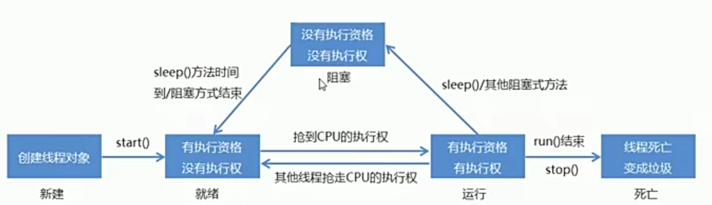
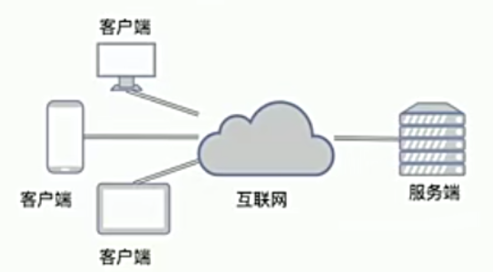

# 1. 多线程

## 1.1 进程与线程

进程：进程是程序的一次执行过程，**<font color=red>进程是系统进行资源分配和调用你的基本单位，每一个进程都有自己的内存空间和系统资源</font>**

线程：线程是进程中的单个顺序控制流，是一条执行路径，一个进程中可以有多个线程。**<font color=red>一个进程中的所有线程共享进程的存储空间和系统资源，线程是CPU调度的最小单位。</font>**线程分为单线程与多线程。

- 单线程：一个进程如果只有一条执行路径，则称其为单线程程序。比如炒菜这个进程，需要先放油，等油热了再放菜，不可能同时放油又放菜，这就是一个线程。

- 多线程：一个进程如果有多条执行路径，则称为多线程程序。比如我们经常玩的扫雷程序，在玩游戏的过程中会自动计时，计时不会随着你的操作停止，玩游戏和计时是两个同时进行的步骤，这就是两个线程。

## 1.2 实现多线程方式一

进程是应用程序的一次执行过程，程序是静态的，进程是动态的。Java虚拟机允许应用程序执行多个线程，即允许一个进程中包含多个线程。

要想新开辟一个线程，有两种方法：

1. 让自定义的线程类继承自Thread类（Thread即为线程类，Java提供的，无需导包即可使用），这个自定义的线程类中需要重写Thread类中的run方法，run方法中是该线程具体要执行的操作代码。
2. 自定义Runnable类，并实现Runnable接口，重写其中的run方法，run方法种编写该线程需要执行的程序代码，创建自定义的Runnable类的对象，通过Thread类的有参构造创建线程（该有参构造的参数就是自定义的Runnable对象）

这一小节我们介绍第一种创建线程的方法。总结一下该方法实现多线程的步骤如下：

- 定义一个自定义线程类MyThread，让其继承自Thread
- 在MyThread类中重写run()方法
- 创建MyThread的对象
- 启动线程

程序实例：

定义MyThread并集成Thread

```java
package com.study.nanyu.day12;

public class MyThread extends Thread {
    @Override
    public void run() {
        for (int i = 0; i < 10; i++) {
            System.out.println(i);
        }
    }
}
```

创建测试类

```java
package com.study.nanyu.day12;

public class ThreadDemo {
    public static void main(String[] args) {
        // 创建第一个线程
        MyThread t1=new MyThread();
        // 创建第二个线程
        MyThread t2=new MyThread();
        // 创建第三个线程
        MyThread t3=new MyThread();

        // t1.run();
        t1.start();
        t2.start();
        t3.start();
    }
}
```

创建一个自定义类的`MyThread`类的对象就相当于创建了一个线程。启动线程使用的方法是线程对象调用`start()`方法。

> 注意：启动线程调用的不是run方法，如果使用对象调用run()方法，那只是普通的方法调用并不是启动线程。启动线程的方法是Thread提供的start()方法。

问题1：为什么要重写run方法？

> 因为run()方法是用来封装被线程执行的代码

问题2：run()方法和start()方法的区别？

> run()：封装线程执行的代码，直接调用的话相当于普通方法的调用
>
> start()：启动线程，然后由JVM调用此线程run()方法

## 1.3 设置和获取线程名称

Thread类提供了设置和获取线程名称的方法：

| 方法                      | 说明                               |
| ------------------------- | ---------------------------------- |
| void setName(String name) | 将线程名称更改为等于参数name       |
| String getName()          | 返回线程的名称                     |
| Thread(String name)       | 通过Thread提供的有参构造设置线程名 |

其实看上面的方法不难发现，其实name就是Thread类的一个私有属性，并且Thread为这个私有属性提供了get、set方法以便设置和获取这个属性的值。

### 1.3.1 获取线程名

因为MyThread直接集成自Thread，所以Thread类中的所有非private和非final修饰的方法都可以直接使用。

```java
package com.study.nanyu.day12;

public class MyThread extends Thread {
    @Override
    public void run() {
        for (int i = 0; i < 3; i++) {
            System.out.println(getName()+":"+i);
        }
    }
}
```

测试类：

```java
package com.study.nanyu.day12;

public class ThreadDemo {
    public static void main(String[] args) {
        // 创建第一个线程
        MyThread t1=new MyThread();
        // 创建第二个线程
        MyThread t2=new MyThread();
        // 创建第三个线程
        MyThread t3=new MyThread();
        
        t1.start();
        t2.start();
        t3.start();

    }
}

/*
输出结果：
Thread-0:0
Thread-2:0
Thread-1:0
Thread-2:1
Thread-0:1
Thread-2:2
Thread-1:1
Thread-1:2
Thread-0:2
*/
```

思考：为什么直接获取线程名，结果会是Thread-num？

这个需要分析其源码：

> 首先我们是通过无参构造器创建的线程对象，同时我们没有使用setName方法为线程名name属性赋值，所以我们并没有为线程中的属性赋值，也就是说，Thread线程中的name此时使用的是默认的线程名，是Thread自动生成的线程名。
>
> 既然我们是通过无参构造器创建的MyThread对象，则相当于调用了Thread无参构造器，要想了解Thread是如何为新线程提供默认的线程名的，还需要了解这个用来创建对象的Thread无参构造器。

如下，Thread()源码如下：

```java
public Thread() {
    init(null, null, "Thread-" + nextThreadNum(), 0);
}

// 第一个init方法
private void init(ThreadGroup g, Runnable target, String name,
                  long stackSize) {
    init(g, target, name, stackSize, null, true);
}

// 第二个init方法
private void init(ThreadGroup g, Runnable target, String name,
                   long stackSize, AccessControlContext acc,
                   boolean inheritThreadLocals) {
     // 核心代码
     if (name == null) {
         throw new NullPointerException("name cannot be null");
     }

     this.name = name;
     
     // 此处省略若干行代码
 }

// nextThreadNum方法
 private static int threadInitNumber;
 private static synchronized int nextThreadNum() {
     return threadInitNumber++;
 }

```

`nextThreadNum`方法是为线程名设置序号的，开始时定义一个静态的变量`threadInitNumber`，它的值默认为0，如果有新的线程则会先返回`threadInitNumber`的值，然后再把`threadInitNumber`加1，依次为新线程设置序号。

为name的赋值经过了两个init方法，最终在第二个init方法中先判断了name是否为空，不为空的情况下使用`this.name=name`将name的值赋给name属性。

这就解释了，如果我们没有使用有参构造或setName()方法为线程设置名称，则当我们获取线程名称时，Thread的无参构造会自动为我们创建一个默认的名称。

### 1.3.2 设置线程名

设置线程名有两种方式：

| 方法                | 说明                                 |
| ------------------- | ------------------------------------ |
| String setName()    | 通过set方法设置线程名                |
| Thread(String name) | 通过Thread提供的有参构造器设置线程名 |

代码演示：

```java
package com.study.nanyu.day12;

public class MyThread extends Thread {
    @Override
    public void run() {
        for (int i = 0; i < 3; i++) {
            System.out.println(getName()+":"+i);
        }
    }
}
```

测试类：

```java
package com.study.nanyu.day12;

public class ThreadDemo {
    public static void main(String[] args) {
        // 创建第一个线程
        MyThread t1=new MyThread();
        t1.setName("张飞");
        // 创建第二个线程
        MyThread t2=new MyThread();
        t2.setName("关羽");
        // 创建第三个线程
        MyThread t3=new MyThread();
        t3.setName("刘备");

        // t1.run();
        t1.start();
        t2.start();
        t3.start();

    }
}

/*
结果输出：
刘备:0
张飞:0
关羽:0
张飞:1
刘备:1
张飞:2
关羽:1
刘备:2
关羽:2
*/
```

第二种方法是通过有参构造形式设置线程名：

自定义线程类MyThread中需要定义一个有参构造

```java
package com.study.nanyu.day12;

public class MyThread extends Thread {

    public MyThread() {
    }
    
    public MyThread(String name){
        super(name);
    }

    @Override
    public void run() {
        for (int i = 0; i < 3; i++) {
            System.out.println(getName() + ":" + i);
        }
    }
}
```

测试类：

```java
package com.study.nanyu.day12;

public class ThreadDemo {
    public static void main(String[] args) {
        MyThread t1=new MyThread("猪八戒");
        MyThread t2=new MyThread("孙悟空");
        MyThread t3=new MyThread("沙悟净");

        t1.start();
        t2.start();
        t3.start();

    }
}

/*
结果输出：
猪八戒:0
沙悟净:0
孙悟空:0
沙悟净:1
猪八戒:1
沙悟净:2
孙悟空:1
孙悟空:2
猪八戒:2
*/
```

Thread提供的有参构造源码如下：

```java
// 有参构造
public Thread(String name) {
    init(null, null, name, 0);
}

// 第一个init方法
private void init(ThreadGroup g, Runnable target, String name,
                  long stackSize) {
    init(g, target, name, stackSize, null, true);
}

// 第二个init方法
private void init(ThreadGroup g, Runnable target, String name,
                  long stackSize, AccessControlContext acc,
                  boolean inheritThreadLocals) {
    
    // 核心代码
    if (name == null) {
        throw new NullPointerException("name cannot be null");
    }

    this.name = name;
    
    // 省略若干行代码
}
```

该方法与通过无参构造设置默认的线程名思路完全一样。

### 1.3.3 currentThread方法

如何获取当前正在执行的线程对象的引用呢？

> Thread提供了currentThread方法来获取当前正在执行的线程的对象的引用，该方法是静态的，可以通过Thread直接调用。

以每个类中的入口方法main为例介绍一下currentThread的使用方法：

```java
package com.study.nanyu.day12;

public class ThreadDemo {
    public static void main(String[] args) {
        // 获取main方法所属线程的线程对象的引用
        Thread thread = Thread.currentThread();
        // 获取main方法的所属线程的线程名
        String name = thread.getName();
        // 设置main方法的所属线程的线程名
        // thread.setName("good");
        System.out.println(name);
    }
}

/*
输出结果：
main
*/
```

## 1.4 线程优先级

线程调度：

- 分时调度：所有线程轮流使用CPU，平均分配每个线程占用CPU的时间片
- 抢占式调度：优先让优先级高的线程使用CPU，如果线程的优先级相同，那么会随机选择一个。优先级较高的线程，获取CPU时间片相对较多

**<font color=red>Java使用的是抢占式调度模型</font>**

假如一个计算机只有一个CPU，那么CPU在某个时刻只能执行一条指令，线程只有得到CPU时间片，也就是使用权才可以执行指令。所以说多线程程序的执行有**<font color=red>随机性</font>**。

Thread类中设置和获取线程优先级的方法如下：

| 方法                                           | 说明               |
| ---------------------------------------------- | ------------------ |
| public final int getPriority                   | 返回此线程的优先级 |
| public final void setPriority(int newPriority) | 更改此线程的优先级 |

如果我们没有为线程设置优先级，那这个线程是否有优先级，有的话是多少？

```java
package com.study.nanyu.day12;

public class ThreadDemo {
    public static void main(String[] args) {

        MyThread t1=new MyThread("武松");
        MyThread t2=new MyThread("林冲");
        MyThread t3=new MyThread("宋江");

        System.out.println(t1.getPriority());
        System.out.println(t2.getPriority());
        System.out.println(t3.getPriority());

    }
}
/*
输出结果：
5
5
5
*/
```

通过上面代码我们发现，如果没有手动为线程设置优先级，那么该线程优先级默认为5。

下面我们手动为这些线程设置优先级

```java
package com.study.nanyu.day12;

public class ThreadDemo {
    public static void main(String[] args) {

        MyThread t1 = new MyThread("武松");
        MyThread t2 = new MyThread("林冲");
        MyThread t3 = new MyThread("宋江");

        // 为线程设置优先级
        t1.setPriority(8);
        t2.setPriority(2);
        t3.setPriority(5);


        System.out.println(t1.getPriority());
        System.out.println(t2.getPriority());
        System.out.println(t3.getPriority());
        System.out.println("-------------");

        t1.start();
        t2.start();
        t3.start();

    }
}

/*
输出结果：
8
2
5
-------------
宋江:0
林冲:0
武松:0
武松:1
武松:2
林冲:1
宋江:1
宋江:2
林冲:2
*/
```

注意：

**<font color=red>线程的优先级只能设置在1-10之间，否则会出错，优先级越高说明该线程抢占CPU的几率越大。优先级高的线程 并不一定先执行完毕，优先级高只能说明该线程抢占CPU的概率比较大，并不能保证该线程一定先执行完毕。</font>**

## 1.5 线程控制

| 方法                           | 说明                                                         |
| ------------------------------ | ------------------------------------------------------------ |
| static void sleep(long millis) | 使当前正在执行的线程停留（暂停执行）指定的毫秒数             |
| void join()                    | 等待这个线程死亡，这个线程没死亡之前不会执行其他线程         |
| void setDaemon(boolean on)     | 将此线程标记为守护线程，当运行的线程都是守护线程时，Java虚拟机将退出 |

### 1.5.1 sleep()方法

自定义的MyThread线程类：

使用sleep方法时每输出一个数字就会使该线程睡眠1s

```java
package com.study.nanyu.day12;

public class MyThread extends Thread {

    public MyThread() {
    }

    public MyThread(String name){
        super(name);
    }

    @Override
    public void run() {
        for (int i = 0; i < 3; i++) {
            System.out.println(getName() + ":" + i);
            try {
                sleep(1000);
            } catch (InterruptedException e) {
                e.printStackTrace();
            }
        }
    }
}
```

测试类：

```java
package com.study.nanyu.day12;

public class ThreadDemo {
    public static void main(String[] args) {

        MyThread t1 = new MyThread("武松");
        MyThread t2 = new MyThread("林冲");
        MyThread t3 = new MyThread("宋江");

        t1.start();
        t2.start();
        t3.start();

    }
}
/*
输出结果：
林冲:0
武松:0
宋江:0
宋江:1
林冲:1
武松:1
宋江:2
武松:2
林冲:2
*/
```

第一个抢到CPU的线程输出一个数字，进入睡眠状态，然后剩下两个开始强CPU，第二个抢到CPU的线程输出一个数字然后进入睡眠状态；此时第一个睡眠的线程可能已经睡眠结束（也可能没结束），会和第三个线程抢CPU。

### 1.5.2 join()方法

如果一个线程调用了join()方法，则这个线程执行完毕之后其他线程才能执行，如下程序实例：

```java
package com.study.nanyu.day12;

public class ThreadDemo {
    public static void main(String[] args) {

        MyThread t1 = new MyThread("武松");
        MyThread t2 = new MyThread("林冲");
        MyThread t3 = new MyThread("宋江");

        try {
            t2.join();
        } catch (InterruptedException e) {
            e.printStackTrace();
        }

        t1.start();
        t2.start();
        t3.start();

    }
}
/*
输出结果：
林冲:0
林冲:1
林冲:2
宋江:0
武松:0
武松:1
宋江:1
武松:2
宋江:2
*/
```

### 1.5.3 setDaemon()方法

当主线程结束，Java虚拟机中只剩下守护线程时，Java虚拟机会退出。

下面以关羽、张飞为守护线程、刘备为主线程为例：

自定义的MyThread：

```java
package com.study.nanyu.day12;

public class MyThread extends Thread {

    public MyThread() {
    }

    public MyThread(String name){
        super(name);
    }

    @Override
    public void run() {
        for (int i = 0; i < 100; i++) {
            System.out.println(getName() + ":" + i);
        }
    }
}
```

测试类：

```java
package com.study.nanyu.day12;

public class ThreadDemo {
    public static void main(String[] args) {

        MyThread t1 = new MyThread("关羽");
        MyThread t2 = new MyThread("张飞");

      // 设置main方法为主线程
        Thread thread = Thread.currentThread();
        thread.setName("刘备");

        t1.setDaemon(true);
        t2.setDaemon(true);

        t1.start();
        t2.start();


        // 主线程中数字的遍历
        for(int i=0;i<3;i++){
            System.out.println(thread.getName() + ":" + i);
        }

    }
}
/*
输出结果：
刘备:0
张飞:0
张飞:1
张飞:2
张飞:3
关羽:0
张飞:4
刘备:1
张飞:5
关羽:1
刘备:2
关羽:2
关羽:3
张飞:6
关羽:4
张飞:7
关羽:5
张飞:8
关羽:6
张飞:9
关羽:7
张飞:10
关羽:8
张飞:11
关羽:9
张飞:12
关羽:10
张飞:13
关羽:11
张飞:14
*/
```

从输出结果来看，关羽和张飞都没有输出到99，只有刘备输出完毕，原因就是刘备这个线程是主线程，当主线程执行结束后，剩下的关羽和张飞两个线程都是守护线程，当Java虚拟机发现剩下的线程都是守护线程时，虚拟机会关闭，所以线程将不再执行。

为什么刘备线程执行完毕之后关羽和张飞线程没有立即被停止？

> 可以理解为缓冲，CPU执行的很迅速，在Java虚拟机关闭的那一段时间CPU还在执行线程。

## 1.6 线程的生命周期

线程的生命周期如下：



文字描述：

- 首先创建一个线程，并调用start()方法启动线程，此时处于新建态
- 此时的线程有执行的资格，但没有执行的权力（此时线程获得了出CPU以外的所有资源），此时处于就绪态
- 线程抢到CPU，获得执行的权力，执行该线程，此时处于运行态
- 其他高优先级线程抢走CPU，此时线程处于就绪状态
- 如果线程运行的过程中调用sleep()方法或其他阻塞式方法，线程会变为阻塞态，该状态下线程没有执行的资格，也没有执行的权力。
- 当处于阻塞态下的某线程sleep()方法时间到或调用了其他结束阻塞的方法，线程会进入就绪态，抢夺CPU
- 当处于运行态的某线程自然执行结束，或调用了stop()方法，会转变为死亡态，变成垃圾

## 1.7 实现多线程方式二

这一小节记录实现多线程的第二种方式，总结一下该方法实现多线程的步骤、

1. 自定义MyRunnable类，并实现Runnable接口
2. 重写run()方法，在run()中编写线程需要执行的代码
3. 创建MyRunnable对象
4. 使用Thread的有参构造（Thread(Runnable,name)）创建线程，并将MyRunnable对象作为有参构造的参数传递进去
5. 调用线程的start()方法，启动线程

程序实例：

自定义一个MyRunnable类，并集成Runnable接口，重写run()方法

```java
package com.study.nanyu.day12;

public class MyRunnable implements Runnable{
    @Override
    public void run() {
        for(int i=0;i<10;i++){
            System.out.println(Thread.currentThread().getName()+":"+i);
        }
    }
}
```

创建MyRunnable对象，使用Thread有参构造创建线程对象，并将MyRunnable对象和线程名作为参数传递进去

```java
package com.study.nanyu.day12;

public class ThreadDemo {
    public static void main(String[] args) {

        MyRunnable runnable = new MyRunnable();

        Thread t1 = new Thread(runnable,"孙悟空");
        Thread t2 = new Thread(runnable,"刘备");
        Thread t3 = new Thread(runnable,"诸葛亮");

        t1.start();
        t2.start();
        t3.start();

    }
}

/*
结果输出：
刘备:0
诸葛亮:0
孙悟空:0
诸葛亮:1
刘备:1
诸葛亮:2
孙悟空:1
诸葛亮:3
刘备:2
诸葛亮:4
孙悟空:2
孙悟空:3
孙悟空:4
刘备:3
刘备:4
*/
```

**总结：**

上面一共有两种创建线程的方式：

- 继承Thread
- 实现Runnable接口

那这两种创建线程的方式我们改用哪个呢？**<font color=red>推荐使用第二种实现Runnable接口的方式</font>**

相比于继承Thread，实现Runnable接口有以下好处：

- 避免了Java单继承的局限性，因为Java只能单继承，多以如果使用继承Thread方式就不能再继承其他类，而实现Runnable接口的方式则可以再继承其他类，从而进一步扩展功能
- 适合多个相同程序的代码去处理同一资源的情况，把线程和程序的代码、数据有效的分离，较好的体现了面向对象的思想


## 1.8 案例：卖票

需求：某动物园有10张票，有三个卖票窗口，以此设计一个程序模拟电影院卖票

实现思路：

1. 定义一个类SellTicket实现Runnable接口，里面定义一个成员变量：private int tickets=100;表示100张票
2. 在SellTicket类中重写run()方法实现卖票，代码步骤如下：
   - 判断票数大于0，就卖票，并告知哪个窗口
   - 卖了票之后，总票数减1
   - 票没有了，也可能有人来问，所以使用死循环让卖票一直执行

3. 定义一个测试类SellTicketDemo，里面有main方法，代码步骤如下：
   - 创建SellTicket类的对象
   - 创建三个Thread类的对象，把SellTicket对象作为构造方法的参数，并给出对应的窗口名称。
   - 启动线程

程序实例：

自定义的SellTicket类

```java
package com.study.nanyu.day12;

public class SellTicket implements Runnable {

    private int tickets = 10;

    @Override
    public void run() {

        // 保证一直能卖票，即使票数为0，也可以告知麦票人
        while (true) {
            if (tickets > 0) {
                System.out.println(Thread.currentThread().getName() + "正在出售第" + tickets + "张票");
                tickets--;
            }
        }
    }
}
```

测试类：

```java
package com.study.nanyu.day12;

public class ThreadDemo {
    public static void main(String[] args) {

        SellTicket runnable = new SellTicket();

        Thread t1 = new Thread(runnable,"窗口1");
        Thread t2 = new Thread(runnable,"窗口2");
        Thread t3 = new Thread(runnable,"窗口3");

        t1.start();
        t2.start();
        t3.start();

    }
}
/*
结果输出：
窗口1正在出售第10张票
窗口3正在出售第10张票
窗口2正在出售第10张票
窗口3正在出售第8张票
窗口1正在出售第9张票
窗口3正在出售第6张票
窗口2正在出售第7张票
窗口3正在出售第4张票
窗口1正在出售第5张票
窗口3正在出售第2张票
窗口2正在出售第3张票
窗口1正在出售第1张票
*/
```

其实从上面的输出情况中我们就可以看出一些问题，窗口1、窗口2、窗口3同时出售第10张票，这显然是有问题的，这个问题我们下一章节会分析并解决它。

## 1.9 卖票程序缺陷

正常情况下出票是有一定时间的，所以我们可以在出票前加个延时来模拟真实的卖票场景，代码如下：

```java
package com.study.nanyu.day12;

public class SellTicket implements Runnable {

    private int tickets = 10;

    @Override
    public void run() {

        // 保证一直能卖票，即使票数为0，也可以告知麦票人
        while (true) {
            if (tickets > 0) {
                try {
                    Thread.sleep(1000);
                } catch (InterruptedException e) {
                    e.printStackTrace();
                }
                System.out.println(Thread.currentThread().getName() + "正在出售第" + tickets + "张票");
                tickets--;
            }
        }
    }
}
```

如上，在出票之前加了一个时长为1s的sleep()。测试和输出结果如下：

```java
package com.study.nanyu.day12;

public class ThreadDemo {
    public static void main(String[] args) {

        SellTicket runnable = new SellTicket();

        Thread t1 = new Thread(runnable,"窗口1");
        Thread t2 = new Thread(runnable,"窗口2");
        Thread t3 = new Thread(runnable,"窗口3");

        t1.start();
        t2.start();
        t3.start();

    }
}

/*
输出结果
窗口3正在出售第10张票
窗口1正在出售第10张票
窗口2正在出售第10张票
窗口3正在出售第7张票
窗口2正在出售第7张票
窗口1正在出售第7张票
窗口1正在出售第4张票
窗口2正在出售第4张票
窗口3正在出售第4张票
窗口1正在出售第1张票
窗口3正在出售第1张票
窗口2正在出售第1张票
*/
```

从输出结果上我们可以发现出现了很大的问题，同一张票，竟然被三个窗口同时售卖（和上一节出现的问题相似）。那究竟是怎么产生这个问题的呢？分析如下：

> 其实问题就出在下面这段代码中，当窗口1执行代码到Thread.sleep(1000)时，窗口1线程进入休眠状态；此时窗口2线程刚好也执行到Thread.sleep(1000)，窗口2也进入休眠；窗口3线程此时刚好执行到Thread.sleep(1000)。
>
> 此时刚好窗口1线程醒来，继续执行打印门票，此时ticket假设等于10，窗口1输出正在出售第10张票。
>
> 此时窗口2醒来，从醒来的地方开始继续执行代码，由于是从醒来的地方继续执行代码，所以ticket仍然等于10，窗口2输出正在出售第10张票。
>
> 此时窗口3醒来，从醒来的地方开始继续执行代码，由于是从醒来的地方继续执行代码，所以ticket仍然等于10，窗口3输出正在出售第10张票。
>
> 三个窗口线程都执行完了打印门票这一步骤，又都进入tickets--操作，窗口1线程执行tickets--，窗口2执行tickets--，窗口3执行tickets--，一共执行了三次tickets--，所以最后票一下子少了三张。

```java
if (tickets > 0) {
    try {
        Thread.sleep(1000);
    } catch (InterruptedException e) {
        e.printStackTrace();
    }
    System.out.println(Thread.currentThread().getName() + "正在出售第" + tickets + "张票");
    tickets--;
}
/*
结果输出：
窗口3正在出售第10张票
窗口1正在出售第10张票
窗口2正在出售第10张票
窗口3正在出售第7张票
窗口2正在出售第7张票
窗口1正在出售第7张票
窗口1正在出售第4张票
窗口2正在出售第4张票
窗口3正在出售第4张票
窗口1正在出售第1张票
窗口3正在出售第1张票
窗口2正在出售第1张票
*/
```

为什么出现上面的问题？

> 因为线程的执行具有随机性，对于一个公共资源，三个线程可能"同时"在操作，因此就造成了上面的结果。对于这种问题的解决就引出了线程同步

## 1.10 线程同步

### 1.10.1 问题描述

为什么会出现上面的问题（这也是我们判断多线程程序是否会有数据安全问题的标准）

- 是否是多线程环境
- 是否有共享数据
- 是否有多条语句操作共享数据（每条语句来自一个线程）

**<font color=red>同时满足上面三个条件一定会出现数据安全问题，也被称为多线程安全问题</font>**

如何解决多线程安全问题？

> 基本思想：让程序没有安全问题的环境，只需要破坏上面出现线程安全问题条件的其中一个即可。
>
> 多线程环境：不可破坏
>
> 共享数据：也不可破坏
>
> 多条语句操作共享数据：可破坏

如何实现？

- 把多条语句操作共享数据的代码给锁起来，让任意时刻只能有一个线程执行即可。
- Java提供了同步代码块的方式来解决

### 1.10.2 同步代码块

基本思想：

> 既然线程安全问题造成的原因之一是因为存在对共享数据进行操作的代码。那么我么可以就让同一时刻只能有一个线程执行该代码块，只要有线程正在执行这段操作共享数据的代码，其他线程就不允许执行该代码块，等这个线程完成了自己的操作之后，其他线程才能执行该代码块，同样还是同一时刻只能有一个线程执行代码。

其实Java提供了解决线程安全问题的办法，就是使用同步代码块，思想就是上面的思想。**<font color=red>当有一个线程进入代码块执行代码时，使用同步代码块，将操作共享数据的代码块锁起来，其他线程禁止入内，当该线程执行结束，会解锁，放一个线程进如同步代码块，再次上锁，由此避免线程安全问题。</font>**

同步代码块书写格式如下：

```java
synchronized (任意对象) {
    // 多条语句操作共享数据的代码
}
```

**这个代码就相当于给代码块上了一把锁，大括号相当于围墙，任意对象相当于那把锁，任意对象就是可以是任意类型的对象都可以实现上锁**

如下代码就是把对共享数据操作的那一块代码上了锁，同一时刻只能进入一个线程，保证了线程安全。

注意：那把锁不一定非要是Object对象，可以是任意对象，比如：Integer、String、Math、Random、Thread等等，任意对象均可。

```java
package com.study.nanyu.day12;

public class SellTicket implements Runnable {

    private int tickets = 10;
    private Object object=new Object();

    @Override
    public void run() {

        // 保证一直能卖票，即使票数为0，也可以告知麦票人
            while (true) {
                synchronized (object) {
                    if (tickets > 0) {
                    try {
                        Thread.sleep(100);
                    } catch (InterruptedException e) {
                        e.printStackTrace();
                    }
                    System.out.println(Thread.currentThread().getName() + "正在出售第" + tickets + "张票");
                    tickets--;
                }
            }
        }
    }
}

```

测试类：

```java
package com.study.nanyu.day12;

public class ThreadDemo {
    public static void main(String[] args) {

        SellTicket runnable = new SellTicket();

        Thread t1 = new Thread(runnable,"窗口1");
        Thread t2 = new Thread(runnable,"窗口2");
        Thread t3 = new Thread(runnable,"窗口3");

        t1.start();
        t2.start();
        t3.start();
    }
}
/*
结果输出：
窗口1正在出售第10张票
窗口1正在出售第9张票
窗口1正在出售第8张票
窗口3正在出售第7张票
窗口3正在出售第6张票
窗口3正在出售第5张票
窗口3正在出售第4张票
窗口3正在出售第3张票
窗口3正在出售第2张票
窗口3正在出售第1张票
*/
```

同步代码块下多线程执行流程：

```java
// 1. 窗口1线程进入同步代码块执行
// 4. 窗口2线程抢到CPU，开始执行
// 6. 窗口3线程抢到CPU，开始执行
while (true) {
    // 5. 窗口2线程发现代码上了锁，等待
    // 7. 窗口3线程发现代码上了锁，等待
     synchronized (object) {
             // 2， 代码上锁，票数大于0，继续往下执行
         if (tickets > 0) {
         try {
             // 3. 休眠100毫秒，下CPU
             Thread.sleep(100);
         } catch (InterruptedException e) {
             e.printStackTrace();
         }
             // 8. 窗口1线程休眠结束，重新夺回CPU，继续执行同步代码块中的代码，出票
         System.out.println(Thread.currentThread().getName() + "正在出售第" + tickets + "张票");
             // 9. 票数减一
         tickets--;
     }
    }
    // 执行完毕，出代码块，解锁
}
```

同步的优缺点：

- 优点：**<font color=red>解决了多线程数据安全问题</font>**

- 缺点：**<font color=red>当线程很多时，每个线程都会去判断同步上的锁，这是很消耗资源的，无形中会降低程序的运行效率</font>**

注意：

**<font color=red>一个锁可以同时锁多个代码块，如果两个 `synchronized (object) {}`同步代码块用的是同一把锁，比如Object，则Object这把锁可以同时锁住两个代码块，只要一个代码块中有线程在执行，那么这两个同步代码块都会被上锁。如下：</font>**

```Java
while (true) {
    if (tickets > 0) {
        synchronized (object) {
            try {
                Thread.sleep(100);
            } catch (InterruptedException e) {
                e.printStackTrace();
            }
            System.out.println(Thread.currentThread().getName() + "正在出售第" + tickets + "张票");
            tickets--;
        }
    } else {
        synchronized (object) {
            System.out.println("上面被锁的同时，我也被锁了");
        }
    }
}
```

### 1.10.3 同步方法

同步方法：就是将synchronized关键字加到方法上

格式：修饰符 synchronized 返回值类型 方法名(方法参数){}

<hr>

其实上面的代码可以优化成下面形式：

```java
package com.study.nanyu.day12;

public class SellTicket implements Runnable {

    private int tickets = 10;
    private Object object = new Object();

    @Override
    public void run() {

        // 保证一直能卖票，即使票数为0，也可以告知麦票人
        while (true) {
            setTickets();
        }
    }

    public synchronized void setTickets() {
            if (tickets > 0) {
                try {
                    Thread.sleep(100);
                } catch (InterruptedException e) {
                    e.printStackTrace();
                }
                System.out.println(Thread.currentThread().getName() + "正在出售第" + tickets + "张票");
                tickets--;
            }
    }
}
```

上面就是使用同步方法解决问题的形式，但使用同步方法时应注意如下几点

- **<font color=red>非静态同步方法的锁是this，this表示的是本类对象。</font>**如下，在同步代码块中也使用this（本类对象）作为锁可以同时锁住同步代码块中的内容，也可以锁住方法中的内容。

```java
package com.study.nanyu.day12;

public class SellTicket implements Runnable {

    private int tickets = 10;

    @Override
    public void run() {

        // 保证一直能卖票，即使票数为0，也可以告知麦票人
        while (true) {
            synchronized (this) {
                if (tickets > 0) {
                    try {
                        Thread.sleep(100);
                    } catch (InterruptedException e) {
                        e.printStackTrace();
                    }
                    System.out.println(Thread.currentThread().getName() + "正在出售第" + tickets + "张票");
                    tickets--;
                }else{
                    setTickets();
                }
            }
        }
    }

    public synchronized void setTickets() {
            if (tickets > 0) {
                try {
                    Thread.sleep(100);
                } catch (InterruptedException e) {
                    e.printStackTrace();
                }
                System.out.println(Thread.currentThread().getName() + "正在出售第" + tickets + "张票");
                tickets--;
        }
    }
}
```

- **<font color=red>静态同步方法的锁是该类的字节码文件，</font>**static修饰的是与类相关的，所以静态同步方法的锁是该类的字节码文件对象。

```java
package com.study.nanyu.day12;

public class SellTicket implements Runnable {

    private int tickets = 10;

    @Override
    public void run() {

        // 保证一直能卖票，即使票数为0，也可以告知麦票人
        while (true) {
            synchronized (SellTicket.class) {
                if (tickets > 0) {
                    try {
                        Thread.sleep(100);
                    } catch (InterruptedException e) {
                        e.printStackTrace();
                    }
                    System.out.println(Thread.currentThread().getName() + "正在出售第" + tickets + "张票");
                    tickets--;
                }else{
                    setTickets();
                }
            }
        }
    }

    public static synchronized void setTickets() {
            if (tickets > 0) {
                try {
                    Thread.sleep(100);
                } catch (InterruptedException e) {
                    e.printStackTrace();
                }
                System.out.println(Thread.currentThread().getName() + "正在出售第" + tickets + "张票");
                tickets--;
        }
    }
}
```

### 1.10.4 小结

- 出现线程安全问题的三个条件
  - 处于多线程环境
  - 是否有共享数据
  - 是否有多条语句操作共享数据
- 解决线程安全问题的措施：破环多条语句操作共享数据这一条件
- 同步代码块格式：`synchronized (任意对象) {// 多条语句操作共享数据的代码}`，其中任意对象充当的角色是一把锁
- 同步方法：`public （static） synchronized void setTickets() {// 操作共享数据的代码块}`
  - 非静态同步方法的锁对象是this
  - 静态同步方法的锁对象是该类的字节码文件对象（类.class）

## 1.11 线程安全的类

Java提供的线程安全的类有：StringBuffer、Vector、HashTable

StringBuffer

- 线程安全，可变的字符序列
- 从版本JDK5开始，被StringBuilder替代。通常使用StringBuilder类，因为它支持所有相同的操作，但它更快
- StringBuffer中部分同步方法

```java
@Override
public synchronized int length() {
    return count;
}

@Override
public synchronized int capacity() {
    return value.length;
}
```

Vector

- 从Java2平台v1.2开始，该类改进了List接口，使其称为Java Collection Framework的成员。与新的集合实现不同，Vector被同步，如果不需要被同步，建议使用ArrayList替代Vector
- Vector类中部分同步方法

```java
public synchronized void trimToSize() {
    modCount++;
    int oldCapacity = elementData.length;
    if (elementCount < oldCapacity) {
        elementData = Arrays.copyOf(elementData, elementCount);
    }
}

public synchronized void ensureCapacity(int minCapacity) {
    if (minCapacity > 0) {
        modCount++;
        ensureCapacityHelper(minCapacity);
    }
}
```

HashTable

- 该类实现了一个哈希表，它将键映射到值，任何非null对象都可用作键或者值
- 从Java2平台v1.2开始，该类进行了改进，实现了Map接口，使其成为Java Collection Framework的成员，与新的集合不同，HashTable被同步。如果不需要被同步，HashTable
- HashTable中部分同步方法

```java
public synchronized int size() {
    return count;
}

public synchronized boolean isEmpty() {
    return count == 0;
}

public synchronized Enumeration<K> keys() {
    return this.<K>getEnumeration(KEYS);
}
```

总结：

- StringBuffer对标的是StringBuilder，StringBuffer是StringBUilder线程安全的替代类
- Vector对标的是ArrayList集合，Vector是ArrayList线程安全的替代类
- HashTable对标的是HashMap，HashTable是HashMap线程安全的替代类
- **<font color=red>所有线程安全的类相比于其线程不安全的替代类，都有效率低，速度慢的特点，原因在于线程安全的类往往需要判断线程是否处于安全状态，增加了耗时。</font>**
- **<font color=red>单线程环境下，推荐用线程非安全的类</font>**

## 1.12 Lock锁

虽然我们可以理解同步代码块和同步方法的锁对象问题，但是我们并没有直接看到在哪里加了锁，在哪里释放了锁，为了更清晰的表达如何加锁和释放锁，**<font color=red>Jdk5以后提供了一个新的锁对象Lock。</font>**

Lock实现提供了比使用synchrinized方法和语句可以获得更广泛的锁定操作，他提供了下面两个方法获得锁和释放锁

```java
void lock() // 获得锁
void unlock() // 释放锁
```

Lock是一个接口，不能用来实例化，应该使用它的实现类已多态的形式实例化，或者直接实例化其实现类。我们通常使用它的实现类ReentranLock来实例化，使用ReentranLock的无参构造器创建对象

```java
ReentranLock() // 创建一个ReentranLock的实例
```

程序实例：

```java
package com.study.nanyu.day12;

import java.util.concurrent.locks.Lock;
import java.util.concurrent.locks.ReentrantLock;

public class SellTicket implements Runnable {

    // 共享数据
    private int tickets = 10;
    // 创建锁对象
    private Lock lock=new ReentrantLock();

    @Override
    public void run() {
        while (true) {
            // 加锁
            lock.lock();
                if (tickets > 0) {
                    try {
                        Thread.sleep(100);
                    } catch (InterruptedException e) {
                        e.printStackTrace();
                    }
                    System.out.println(Thread.currentThread().getName() + "正在出售第" + tickets + "张票");
                    tickets--;
                }
                // 解锁
                lock.unlock();
}}}
```

上面的代码虽然能够实现加锁解锁的操作，但是我们一般不会这样使用，因为，当`lock.lock();`与`lock.unlock();`中间的代码出现了问题时，就会停止执行，不会执行到释放锁的位置，所以，我们一般不采用这种形式加锁与释放锁，而是使用`try...catch`的形式，在finally中释放锁，这样就能保证无论如何都会把锁释放。代码如下：

```java
package com.study.nanyu.day12;

import java.util.concurrent.locks.Lock;
import java.util.concurrent.locks.ReentrantLock;

public class SellTicket implements Runnable {

    // 共享数据
    private int tickets = 10;
    // 创建锁对象
    private Lock lock = new ReentrantLock();

    @Override
    public void run() {

        while (true) {
            try {
                // 加锁
                lock.lock();

                if (tickets > 0) {
                    try {
                        Thread.sleep(100);
                    } catch (InterruptedException e) {
                        e.printStackTrace();
                    }
                    System.out.println(Thread.currentThread().getName() + "正在出售第" + tickets + "张票");
                    tickets--;
                }

            }finally {
                // 解锁
                lock.unlock();
            }

        }
    }
}
```

## 1.13 生产者与消费者

生产者消费者模式是一个十分经典的多线程协作模式，弄懂了生产者消费者问题能够让我们对多线程编程的理解更加深刻
所谓的生产者消费者问题，实际上主要包含了两类线程

- 一类是生成者线程用于生成数据
- 一类是消费者线程用于消费数据
为了解耦生产者与消费者的关系，通常会采用共享的数据区域，就像一个仓库
- 生产者生产了数据之后直接放置在共享数据区中，并不需要关心消费者行为
- 消费者只需要从共享数据区中获取数据，并不需要关心生产者行为。

举例解释：

> 现有两个角色，一个是送牛奶的A，一个是和牛奶的B，送牛奶A的每天会送一瓶牛奶到B家门口的牛奶箱box中，喝牛奶的B每天会从奶箱box中取出牛奶来喝。这就是一个消费者与生产者的问题。
>
> 送牛奶的A就是成产者线程，喝牛奶的B就是消费者线程，奶箱box就是存放生产出数据的仓库（可以理解为临界区）


为了体现生产者和消费者过程中的等待和唤醒，Java提供了下面几个方法供我们使用，这几个方法在Object类中

| 方法名           | 说明                                                         |
| ---------------- | ------------------------------------------------------------ |
| void wait()      | 导致当前线程等待，直到另一个线程调用该对象的notify()方法或notifyAll()方法 |
| void notify()    | 唤醒正在等待对象监视器的单个线程                             |
| void notifyAll() | 唤醒正在等待对象监视器的所有线程                             |

生产者与消费者案例：

类结构：
- 奶箱类（Box）：定义一个成员变量，表示第x瓶奶，提供存储牛奶和获取牛奶的操作
- 生产者类（Producer）：实现Runnable接口，重写run()方法，调用存储牛奶的操作
- 消费者类（Cunstomer）：实现Runnable接口，重写run()方法，调用获取牛奶的操作
- 测试类（BoxDemo）：里面有main方法，main方法中代码步骤如下：
  - 创建奶箱对象，这是共享数据区域
  - 创建生产者对象，把奶箱对象作为构造方法参数传递，因为在这个类中要调用存储牛奶的操作
  - 创建消费者对象，把奶箱对象作为构造方法参数传递，因为在这个类中要调用获取牛奶的操作
  - 创建两个线程对象，分别把生产者和消费者对象作为构造方法参数传递

程序实例：

Box类：

```java
package com.study.nanyu.day12.example;

public class Box {

    // 表示第i瓶牛奶
    private int milk;
    // 表示奶箱的状态,奶箱中有牛奶味true，没有为false
    private boolean statue=false;

    public synchronized void set(int milk){
        // 如果奶箱中有牛奶，等待消费完再生产
        if(statue){
            try {
                wait();
            } catch (InterruptedException e) {
                e.printStackTrace();
            }
        }
        // 如果奶箱中没牛奶，就会生产牛奶
        this.milk=milk;
        System.out.println("送奶工正在把第"+this.milk+"瓶奶放进奶箱");

        // 生产完毕之后，修改奶箱状态为true
        statue=true;

        // 唤醒被等待的获取牛奶的进程来消费牛奶
        notifyAll();
    }

    public synchronized void get(){
        //  如果奶箱中没有牛奶，则等待生产
        if(!statue){
            try {
                wait();
            } catch (InterruptedException e) {
                e.printStackTrace();
            }
        }

        // 如果奶箱中有牛奶，则获取牛奶
        System.out.println("顾客正在享用第"+this.milk+"瓶奶");
        // 获取牛奶后，设置奶箱状态为false
        statue=false;
        // 唤醒被等待的生产牛奶的进程来生产牛奶
        notifyAll();
    }
}
```

生产者类：

```java
package com.study.nanyu.day12.example;

public class Producer implements Runnable{

    private Box box;

    public Producer(Box box){
       this.box=box;
    }

    @Override
    public void run() {
       // 发牛奶
       for (int i=1;i<=5;i++){
           box.set(i);
       }
    }
}
```

消费者类：

```java
package com.study.nanyu.day12.example;

public class Customer implements Runnable{

    private Box box;

    public Customer(Box box){
         this.box=box;
    }

    @Override
    public void run() {
        // 获取牛奶
        while (true) {
            box.get();
        }
    }
}
```

测试类：

```java
package com.study.nanyu.day12.example;

public class BoxDemo {

    public static void main(String[] args) {
        Box box=new Box();

        Producer producer=new Producer(box);
        Customer customer=new Customer(box);

        Thread p=new Thread(producer,"生产者");
        Thread c=new Thread(customer,"消费者");

        p.start();
        c.start();
    }
}
```

注意：

**生产和消费方法一定要加上同步，原因在于线程的执行具有随机性，加上同步的可以在生产者调用set()方法生产牛奶的同时会锁定获取牛奶的方法，从而达到生产牛奶的时候不能获取牛奶。反之也是，保证消费者通过get()方法获取牛奶的同时，生产者不能生产牛奶。保证不会出现线程安全问题**

# 2. 网络编程

## 2.1 网络编程概述

计算机网络：

- 是指将地理位置不同的具有独立功能的多台计算机及其外部设备，通过通信线路连接起来，在网络操作系统，网络管理软件及网络通信协议的管理和协调下，实现资源共享和信息传递的计算机系统。



网络编程
- **<font color=red>在网络通信协议下，实现在网络互联的不同计算机上运行的程序间可以进行数据交换</font>**

## 2.2 网络编程三要素

**<font color=red>IP地址：</font>**

- 要想让网络中的计算机之间能够互相通信，必须为每台计算机指定一个标识号，通过这个标识号来指定要接收数据的计算机和识别发送的计算机，而这个IP地址就是这个标识号，也就是设备的标识。更简单来说，IP地址就是在网络中的门牌号，通过门牌号你可以找到别人，并给别人发送数据，别人也可以通过你的门牌号找到你，并向你发送数据。

**<font color=red>端口：</font>**

- 网络的通信，本质上是两个应用程序之间的通信。每台计算机都有很多个应用程序，那么在网络通信时，如何区分这些应用程序呢？如果说IP地址可以唯一标识网络中的设备，那么端口号就可以唯一标识设备中的应用程序，也就是应用程序的唯一标识。更简单来说，IP地址时为了让别人在网络中找到你这台计算机的位置，而端口则是让计算机可以找到应用程序在计算机中的位置。
- 两台计算通信本质上是两台计算机上的应用程序在通信，以QQ为例，两台计算机中的QQ可以相互发信息，那是因为两台计算机中的QQ采用了相同的端口号，双方在发送信息给对方时都会找对方计算机中端口对应的应用程序进行通信。又比如QQ不能直接发信息到微信，原因就是QQ与微信使用的不是相同的端口号，双方发送信息给对方电脑，但是不能通过QQ端口号找到微信。

**<font color=red>协议：</font>**

- 通过计算机网络可以使多台计算机连接起来，位于同一网络中的计算机在进行连接和通信时需要遵守一定的规则，这就好比在道路上行驶要遵守交通规则一样。在计算机网络中，这些连接和通信的规则被称为网络通信协议，**<font color=red>它对数据的传输格式、传输速率、传输步骤等做了统一规定</font>**，通信双方必须同时遵守协议才能完成数据交换，**<font color=red>常见的协议有UDP和TCP协议。</font>**


## 2.3 IP地址

IP地址：IP地址是网络中设备的唯一标识

IP地址分为两大类：

- IPV4：为每个连接在网络上的主机分配一个32bit的地址，按照TCP/IP规定，IP地址用二进制表示，每个IP地址长32bit，也就是4个字节。例如一个采用二进制形式的Ip地址是`11000000 10101000 00000001 01000010`，这样以来不便我们记忆，我们通常使用更好记忆的十进制来表示IP地址`192.168.1.66`，以十进制表示的IP地址叫做”点分十进制表示法“。
- IPV6：互联网用户的数量不断激增导致IP地址的需求变得越来越大，IPV4已经不够用户使用了，所以为了扩大地址空间，通过IPV6重新定义地址空间，采用128为地址长度，每16个字节一组，分成8组十六进制数。据说IPV6可以为地球上的每一粒沙子都分配一个IP地址。

获取本机IP地址：

- Win系统：ipconfig

- Linux系统：ip a

测试IP是否可用：

- ping ip

特殊IP地址：

- 127.0.0.1：回送地址，可代表本机，一般用来测试

## 2.4 InetAddress的使用

为了方便我们对IP地址的获取和操作，Java提供了一个类InetAddress供我们使用。

InetAddress：此类表示Interne协议（IP）地址。

该类内部没有构造器，我们无法通过构造器的形式创建InetAddress对象，但InetAddress内部提供了获取InetAddress对象的静态方法：

| 方法                                                      | 说明                                                   |
| --------------------------------------------------------- | ------------------------------------------------------ |
| static InetAddress getAllByname(String host)              | 根据主机名称，根据系统上配置的名称服务返回其IP地址数组 |
| static InetAddress getByAddress(byte [] addr)             | 根据二进制的IP地址创建InetAddress对象                  |
| static InetAddress getByAddress(String host,byte [] addr) | 根据提供的主机名和IP地址创建InetAddress对象            |
| static InetAddress getByName(String host)                 | 根据主机名称或IP地址获取InetAddress对象                |

另外，InetAddress中比较常用的方法有

| 方法                    | 说明                         |
| ----------------------- | ---------------------------- |
| String getHostName()    | 获取此IP地址的主机名         |
| String getHostAddress() | 返回文本显示中的IP地址字符串 |

程序实例：

nanyu：是我电脑的主机名

```java
package com.study.nanyu.day13;

import java.net.InetAddress;
import java.net.UnknownHostException;

public class InetAddressDemo {
    public static void main(String[] args) throws UnknownHostException {
        // 通过主机名获取InetAddress对象
        InetAddress inetAddress = InetAddress.getByName("nanyu");
        
        // 通过IP地址获取InetAddress对象
        // InetAddress inetAddress = InetAddress.getByName("192.168.154.1");
        String address = inetAddress.getHostAddress();
        String hostName = inetAddress.getHostName();
        System.out.println(address);
        System.out.println(hostName);
    }
}
/*
输出结果：
192.168.154.1
nanyu
*/
```

## 2.5 端口与协议

端口：设备上应用程序的唯一标识

端口号：用两个字节表示的整数，它的取值范围是0~65535。其中0~1023之间的端口号用于一些指明的网络服务和应用，普通的应用程序需要使用1024以上的端口号。如果端口号被玲一个服务或应用占用，会导致当前程序启动失败。

<hr>

协议：计算机网络中，连接和通信的规则被称为网络通信协议。

- UDP协议：
  - 用户数据包协议（User Datagram Protocol）


