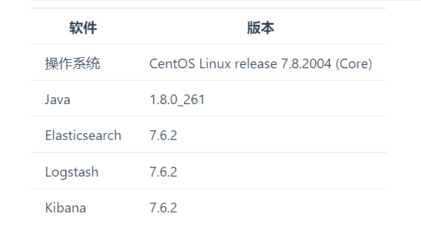

# 1.1 简介


`Elasticsearch`是一个高度可扩展的开源全文搜索和分析引擎。它允许您快速，近实时地存储，搜索和分析大量数据。它通常被用作基础的技术来赋予应用程序复杂的搜索特性和需求。

- 假设你有一个在线网上商城，提供用户搜索你所卖的商品功能。在这个例子中，你可以使用`Elasticsearch`去存储你的全部的商品目录和存货清单并且提供搜索和搜索自动完成以及搜索推荐功能。
- 假设你想去收集日志或者业务数据，并且去分析并从这些数据中挖掘寻找市场趋势、统计资料、摘要信息或者反常情况。在这个例子中，你可以使用`Logstash`(`ELK`架构中的一个模块)去收集、聚合并且解析你的数据，然后通过`Logstash`将数据注入`Elasticsearch`。一旦数据进入`Elasticsearch`，你就可以运行搜索和聚集并且从中挖掘任何你感兴趣的数据。
- 假设你运行一个价格预警平台，它可以让那些对价格精明的客户指定一个规则，比如：“我相中了一个电子产品，并且我想在下个月任何卖家的这个电子产品的价格低于多少钱的时候提醒我”。在这个例子中，你可以抓取所有卖家的价格，把价格放入`Elasticsearch`并且使用`Elasticsearch`的反向搜索(过滤器/抽出器)功能来匹配价格变动以应对用户的查询并最终一旦发现有匹配结果时给用户弹出提示框。
- 假设您有分析/业务智能需求，并希望快速调查，分析，可视化并询问有关大量数据的特定问题（试想数百万或数十亿条记录）。在这种情况下，您可以使用`Elasticsearch`存储数据，然后使用`Kibana`（`ELK`架构中的一个组件）构建自定义仪表板，以便可视化对您来说重要的数据方面。此外，您可以使用`Elasticsearch`聚合功能针对您的数据执行复杂的商业智能查询。

Elasticsearch与其他数据库的对比

<table><thead><tr><th>指标</th><th style="text-align:center;">Redis</th><th style="text-align:center;">MySQL</th><th style="text-align:center;">Elasticsearch</th><th style="text-align:center;">HBase</th><th style="text-align:center;">Hadoop/Hive</th></tr></thead><tbody><tr><td>容量/容量扩展</td><td style="text-align:center;">低</td><td style="text-align:center;">中</td><td style="text-align:center;">较大</td><td style="text-align:center;">海量</td><td style="text-align:center;">海量</td></tr><tr><td>查询时效性</td><td style="text-align:center;">极高</td><td style="text-align:center;">中等</td><td style="text-align:center;">较高</td><td style="text-align:center;">中等</td><td style="text-align:center;">低</td></tr><tr><td>查询灵活性</td><td style="text-align:center;">较差 k-v模式</td><td style="text-align:center;">非常好，支持SQL</td><td style="text-align:center;">较好，关联查询较弱，但是可以全文检索，DSL语言可以处理过滤、匹配、排序、聚合等各种操作</td><td style="text-align:center;">较差，主要靠RowKey, Scan的话性能不行，或者建立二级索引</td><td style="text-align:center;">非常好，支持SQL</td></tr><tr><td>写入速度</td><td style="text-align:center;">极快</td><td style="text-align:center;">中等</td><td style="text-align:center;">较快</td><td style="text-align:center;">较快</td><td style="text-align:center;">慢</td></tr><tr><td>一致性、事务</td><td style="text-align:center;">弱</td><td style="text-align:center;">强</td><td style="text-align:center;">弱</td><td style="text-align:center;">弱</td><td style="text-align:center;">弱</td></tr></tbody></table>

# 1.2  Lucene

`Lucene`是`apache`软件基金会`jakarta`项目组的一个子项目，是一个开放源代码的全文检索引擎工具包，但它不是一个完整的全文检索引擎，而是一个全文检索引擎的架构，提供了完整的查询引擎和索引引擎。

目前市面上流行的搜索引擎软件，主流的就两款，`Elasticsearch`和`solr`,这两款都是基于`Lucene`的搭建的，可以独立部署启动的搜索引擎服务软件。由于内核相同，所以两者除了服务器安装、部署、管理、集群以外，对于数据的操作，修改、添加、保存、查询等等都十分类似。就好像都是支持`SQL`语言的两种数据库软件。只要学会其中一个另一个很容易上手。

从实际企业使用情况来看，`ElasticSearch`的市场份额逐步在取代`solr`，国内百度、京东、新浪、滴滴都是基于`ElasticSearch`实现的搜索功能。国外就更多了 像维基百科、`GitHub`、`Stack Overflow`等等也都是基于`ES`的。

# 1.3 环境搭建

## 1.3.1 环境要求

`Elasticsearch`至少需要`Java 8`版本。`ES`要求的用户为非`root`用户。 



## 1.3.2 文件下载

[ElasticSearch](https://www.elastic.co/cn/downloads/past-releases/elasticsearch-7-6-2)

ES目录结构

<table><thead><tr><th>目录名</th><th>含义</th></tr></thead><tbody><tr><td>bin</td><td>运行ES实例和管理插件的一些脚本</td></tr><tr><td>config</td><td>配置文件目录</td></tr><tr><td>lib</td><td>ES所需要使用的库</td></tr><tr><td>data</td><td>ES存放数据的地方</td></tr><tr><td>logs</td><td>日志文件夹</td></tr><tr><td>modules</td><td>加载的模块列表，其实就是内置插件目录</td></tr><tr><td>plugins</td><td>自定义插件目录</td></tr></tbody></table>

## 1.3.3 安装ES

ES不能在Root目录下启动，需要另外创建一个新的用户，在该用户下启动。

- 环境配置

```bash
##创建用户和用户组【所有节点同时操作】
[root@node01 ~]# groupadd es
[root@node01 ~]# useradd es -g es -p 123456
##关闭防火墙并禁止开机自启【所有节点同时操作】
[root@node01 ~]# systemctl stop firewalld
[root@node01 ~]# systemctl disable firewalld.service
##创建相应目录并赋权给es用户【所有节点同时操作】
[root@node01 ~]# mkdir -p /var/es/logs
[root@node01 ~]# mkdir -p /var/es/data
[root@node01 ~]# chown -R es:es /var/es/*
# 解压
[root@node01 apps]# tar -zxvf elasticsearch-7.6.2-linux-x86_64.tar.gz
##赋予权限【所有节点同时操作】
[root@node01 apps]# chown -R es:es /opt/apps/elasticsearch-7.6.2/*
##修改配置文件
[root@node01 elasticsearch-7.6.2]# vim config/elasticsearch.yml
#配置es的集群名称，es会自动发现在同一网段下的es，如果同一网段下有多个集群，可以用这个属性来区分不同的集群。
cluster.name: nanyu
#节点名称
node.name: node01
#设置索引数据的存储路径，可以设置多个存储路径，用逗号隔开
path.data: /var/es/data
#设置日志文件的存储位置
path.logs: /var/es/logs
#设置为true来锁住内存，因为当JVM开始swapping时候es的效率会降低，所以保证它不swap，可以把ES_MIN_MEM和ES_MAX_MEM两个环境变量设置成同一个值，所以保证机器有足够的内存分配给es
bootstrap.memory_lock: true
#设置绑定的ip地址，可以是ipv4或者ipv6，默认为0.0.0.0,如果配置，对应的是各个节点的IP地址
network.host: 192.168.100.101
#设置对外服务的http端口，默认为9200
http.port: 9200
#此设置通常应包含群集中所有可以成为master节点的地址
discovery.seed_hosts: ["node01", "node02", "node03"]
#指定了哪些节点在初始化的时候将会参加选举
cluster.initial_master_nodes: ["node01", "node02", "node03"]
#只要此许多数据或主节点已加入群集，即可恢复。
gateway.recover_after_nodes: 2
#对一些人来说，能够用单个命令来删除所有数据可能会导致可怕的后果。设置为true，可以避免这种情况
action.destructive_requires_name: true
# 支持跨域访问
http.cors.enabled: true
http.cors.allow-origin: "*"
##三台虚拟机同时操作
[root@node01 elasticsearch-7.6.2]# vim /etc/security/limits.conf
es soft nofile 65536
es hard nofile 65536	
es soft memlock unlimited
es hard memlock unlimited
[root@node01 elasticsearch-7.6.2]# vim /etc/sysctl.conf
vm.max_map_count=262144
# 让设置立即生效
[root@node01 elasticsearch-7.6.2]# sysctl -p
```

- 启动集群

```bash
## 将node01上的es目录远程拷贝到其他节点
[root@node01 apps]# scp -r elasticsearch-7.6.2 root@node02:/opt/apps/
[root@node01 apps]# scp -r elasticsearch-7.6.2 root@node03:/opt/apps/
## 对应每个节点修改节点名称
#节点名称
node.name: node02
network.host: 192.168.154.102
## 启动【所有节点同时操作】
# 切换用户
[root@node01 apps]# su es
[es@node01 elasticsearch-6.5.0]$ ./bin/elasticsearch
# 返回root用户,需要输入密码
[es@node01]$ su root
```

测试是否启动成功

http://192.168.154.101:9200/

```bash
{
  "name" : "node01",
  "cluster_name" : "nanyu",
  "cluster_uuid" : "JV-92EKkTlGPAiE4QSLTlQ",
  "version" : {
    "number" : "7.6.2",
    "build_flavor" : "default",
    "build_type" : "tar",
    "build_hash" : "ef48eb35cf30adf4db14086e8aabd07ef6fb113f",
    "build_date" : "2020-03-26T06:34:37.794943Z",
    "build_snapshot" : false,
    "lucene_version" : "8.4.0",
    "minimum_wire_compatibility_version" : "6.8.0",
    "minimum_index_compatibility_version" : "6.0.0-beta1"
  },
  "tagline" : "You Know, for Search"
}
```

- 查看集群状态

http://192.168.154.101:9200/_cluster/health

```bash
{
"cluster_name":"nanyu",
"status":"green",
"timed_out":false,
"number_of_nodes":3,
"number_of_data_nodes":3,
"active_primary_shards":0,
"active_shards":0,
"relocating_shards":0,
"initializing_shards":0,
"unassigned_shards":0,
"delayed_unassigned_shards":0,
"number_of_pending_tasks":0,
"number_of_in_flight_fetch":0,
"task_max_waiting_in_queue_millis":0,
"active_shards_percent_as_number":100.0
}
```

- 问题集锦

此问题是由于先使用root用户执行了，执行后会导致产生了root用户创建的一些临时文件，而切换至es用户启动后，es用户没有权限删除或修改这些文件

```bash
# es用户没有修改文件的权限
FileNotFoundException: /var/es/logs/nanyu_server.json (权限不够)
# 使用下面命令修改指定文件夹
cd /var/es
chown es:es -R logs/
```

## 1.3.4 安装Head插件

Head 插件就是一个集群监控和操作的一个可视化软件

```bash
## 安装解压缩软件
[root@node01 es]# yum install zip unzip -y
## 安装http服务，用于访问head
[root@node01 es]# yum install httpd -y
## 进入到html目录，上传head
[root@node01 es]# cd /var/www/html
## 解压
[root@node01 html]# tar -zxvf elasticsearch-head-5.0.0.tar.gz
## 重命名
[root@node01 html]# mv elasticsearch-head-5.0.0 head
## 重启httpd服务
[root@node01 html]# systemctl restart httpd、
## 修改es的配置文件
# 是否支持跨域
http.cors.enabled: true
# 支持哪些域名，这里表示支持所有域名
http.cors.allow-origin: "*"
http.cors.allow-credentials: true
```

- 测试是否安装成功：

http://node01/head


## 1.3.5 安装Kibana

Kibana实现数据可视化，其作用就是在ElasticSearch中进行分析。Kibana能够以图表的形式呈现数据，并且具有可扩展的用户界面，可以全方位的配置和管理ElasticSearch。 Kibana最早的时候是基于Logstash创建的工具，后被Elastic公司在2013年收购。

- Kibana可以提供各种可视化的图表；

- 可以通过机器学习的技术，对异常情况进行检测，用于提前发现可疑问题；

```bash
## 解压
[root@node01 module]# tar -zxvf kibana-7.17.2-linux-x86_64.tar.gz
## 重命名
[root@node01 module]# mv kibana-7.17.2-linux-x86_64 kibana
## 修改配置文件
[root@node01 kibana]# vim config/kibana.yml
# 访问端口
server.port: 5601
#主机地址
server.host: "node01"
#ES集群地址
elasticsearch.host: ["http://node01:9200", "http://node02:9200", "http://node03:9200", "http://node04:9200", "http://node05:9200"]
#kibana数据索引
kibana.index: ".kibana"
#语言环境
i18n.locale: "zh-CN"
##启动

```

