## Scala基础知识

#### 1.1 什么是Scala


> Scala是一门**多范式**的编程语言，一种类似java的编程语言 ，设计初衷是实现可伸缩的语言、并集成**面向对象编程**和**函数式编程**的各种特性。

**<font color=red>函数式编程</font>**更适合用于Map/Reduce和大数据计算，比java更适合用于大数据计算。

Scala作者是JVM的开发者之一，它能运行在java虚拟机之上，并兼容现有的java程序，他开发Scala的目的即解决编写Java时的繁琐的规范。

Spark、Flink等都是采用Scala开发和编写的，所以学好Scala是学好大数据的关键。

**Scala官网：**<u>[点我进入](https://scala-lang.org/)</u>


#### 1.2 Scala特点

Scala是一种有趣的语言。它一方面吸收继承了多种语言中的优秀特性，一 方面又没有拋弃Java这个强大的平台，它运行在Java虚拟机(Java Virtual Machine)之上，轻松实现和丰富的Java类库互联互通它既支持面向对象的编程方式，又支持函数式编程。它写出的程序像动态语言一样简洁，但事实上它确是严格意义上的**<font color=red>静态语言</font>**。

**<font color=red>静态语言:</font>**需要先编译再执行，比如java、C++

**<font color=red>动态语言:</font>**不需要经过编译直接来运行，比如Html、JS。

Scala有以下四个特点：

>- 即包含面向对象，又包含函数式编程
>- 属于静态类型
>- 可扩展性
>- 并发性


#### 1.3 Scala函数式编程

纯粹的函数式编程语言编写的函数没有变量，因此，任意一个函数，只要输入是确定的，输出就是确定的，这种纯函数我们称之为没有副作用。而允许使用变量的程序设计语言，由于函数内部的变量状态不确定，同样的输入，可能得到不同的输出，因此，这种函数是有副作用的。


函数式编程的特点：

>- 函数是一等公民
>- 以表达式为中心
>- 无副作用
>- 不修改状态
>- 引用透明

函数式编程优势：

> - 代码简洁，开发速度快
> - 接近自然语言，易理解
> - 易于代码管理
> - 适合并发编程
> - 适用于热升级


#### 1.4 Scala的优点

**优雅**:这是框架设计师第一个要考虑的问题，框架的用户是应用开发程序员，API是否优雅直接影响用户体验。

**速度快**: <u>Scala语言表达能力强，一行代码抵得上Java多行，开发速度快  Scala是静态编译的</u>;，所以和JRuby, Groovy比起来速度会快很多(体验度比java等其他语言好)。

**能融合到Hadoop生态圈**: Hadoop现在 是大数据事实标准，Spark并不是要取代Hadoop，而是要完善Hadoop生态。JVM语言 大部分可能会想到Java，但Java做出来的API太丑，或者想实现-一个优雅的API太费劲。


#### 1.5 JDK\Scala的安装及环境配置

因为Scala是运行在JVM之上 , 因此需要先安装**JDK1.8 **并且配置java环境变量 ,最后安装和配置Scala SDK

##### 1.5.1 JDK1.8安装

双击JDK1.8安装包 ,开始安装

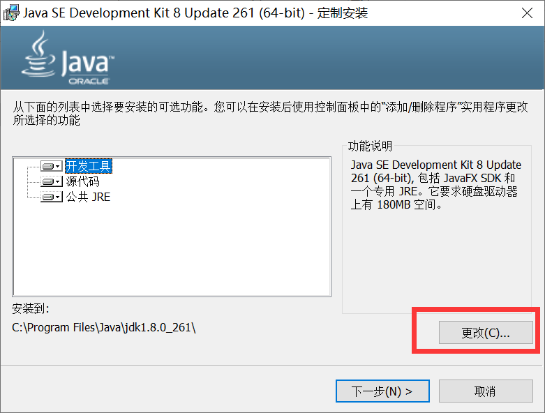

尽量放到C盘以外的盘 ,修改好后点击确定.

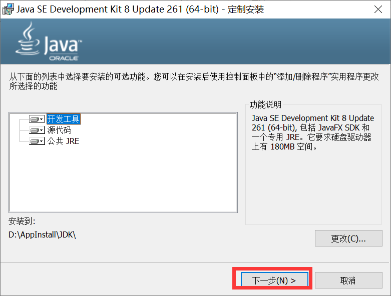

等待安装成功.

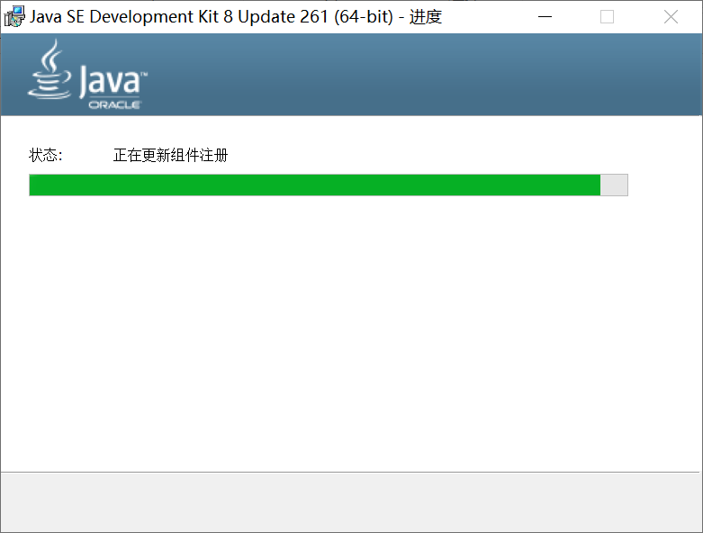

更改java安装位置

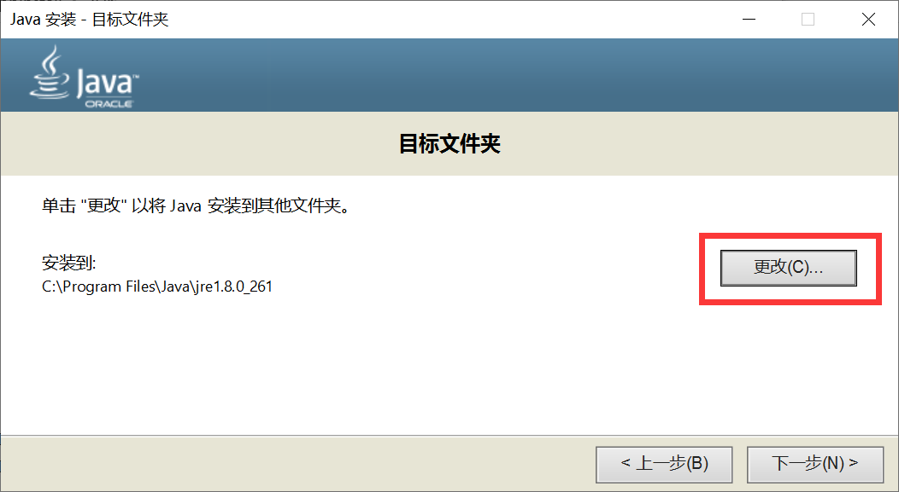

修改完成之后点击下一步,等待安装完成即可.

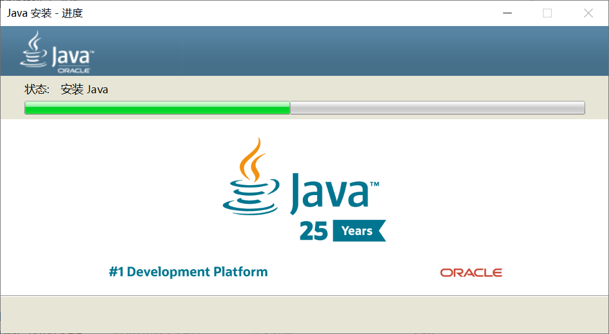


##### 1.5.2 环境变量配置

打开文件管理器 , 找到此电脑 , 鼠标右击 , 选择属性.

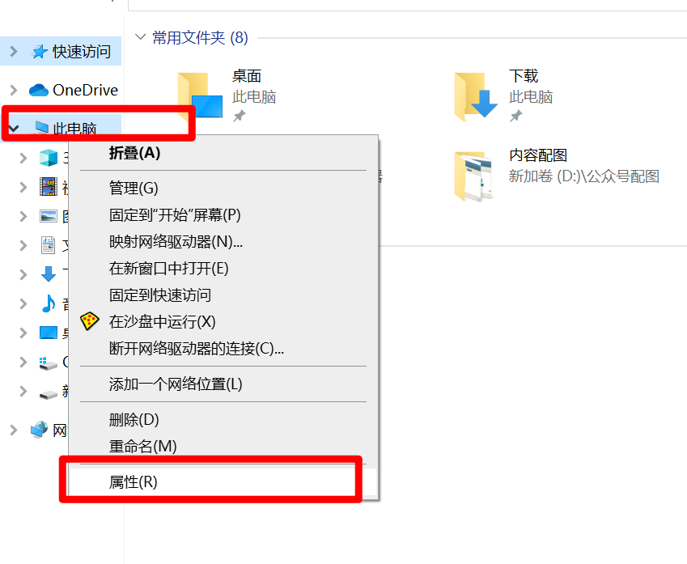

点击最左侧的高级系统设置 , 随后点击环境变量.


在系统变量中点击新建 , 输入如下变量.


随后在系统变量中找到Path , 选择后点击编辑.


在Path中添加以下内容


java环境变量配置完成 , 使用命令`Java -version`检验环境变量是否配置成功


##### 1.5.3 Scala下载

到Scala官网下载安装包 , 选择所有版本.


找到Scala2.11.8版本 , 点击进去.


如下图 , 如果是Linux和Windows下载这两个版本就行.


如果是Windows系统,双击下载好的.msi文件即可安装,安装步骤较为简单 , 傻瓜式操作即可.

##### 1.5.4 Scala环境变量配置

Scala的环境变量配置与JDK类似 , 与上图中JDK一样,先打开环境变量设置窗口 , 将变量值设置为自己Scala的安装路径


找到Path并选择 , 点击编辑.


添加一行如下图的内容即可.


最后测试Scala环境变量是否配置完成


至此 , JDK与Scala环境变量全部配置完成!


## Scala简单代码

> 选择**<font color=red>IDE</font>**作为开发Scala程序的工具


#### 2.1 Scala编写的HelloWord 

第一个Scala编写的HelloWord程序代码如下:

`object HelloWord{`

`def main(Args:Array[String]):Unit={` 

 `println("HelloWorld")`

 `} }`


#### 2.2 Scala解释器

使用Win+R命令打开终端，在终端中输入**Scala**，终端可以自动解释所输入的代码(前提是先配置环境变量)

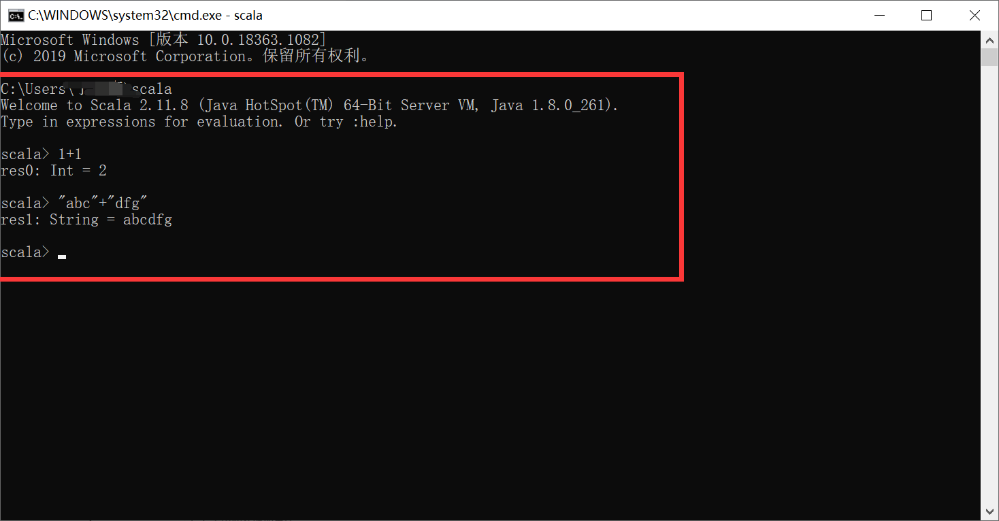


>  Scala解释器读到一个表达式，对它进行求值，将它打印出来，接着再继续读下一一个表达式。这个过程被称做读取--求值一打印-循环，即: REPL。
> 从技术上讲，scala程序并不是一个解释器。实际发生的是，你输入的内容被快速地编译成字节码，然后这段字节码交由Java虛拟机执行。正因为如此，大多数scala程序员更倾向于将它称做“REPL”
>

```scala
`scala
scala>" Hello'
resl: String = Hello
scala> 1+2
res5: Int = 3
scala> "Hello". filter(line=>(line!=' I'))
res2: String = Heo` 
```

#### 2.3 Scala变量

字段/变量的定义Scala中使用var/val 变量/不变量名称:类型的方式进行定义，例如:
`var index1 : Int=1`
`val index2 : Int = 1`

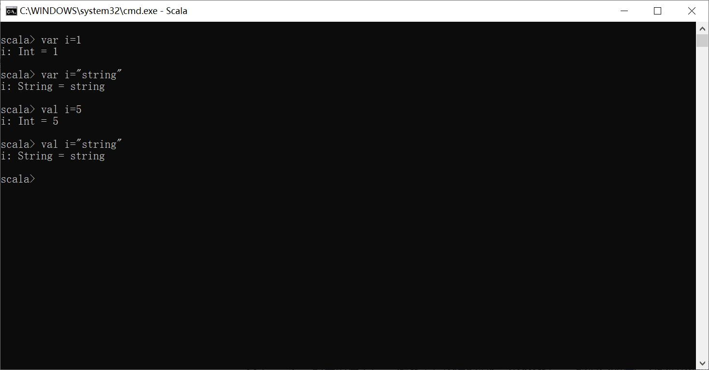


其中var与va1的区别在于，var是变量，以后的值还可以改变，va1的值只能在声明的时候赋值，但是val不是
常量，只能说是不变量或只读变量。

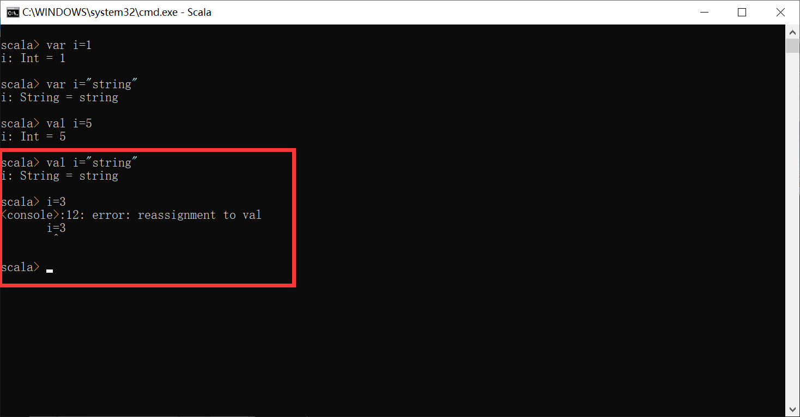


类型推断:
`var index1 = 1`
`val index2 = 1`

类型推断(type inference) 的能力，它能让scala自动理解你省略了的类型。这里，你用int字面量初始化
index1,因此scala推断index1的类型是Int。对于可以由Scala解释器(或编译器)自动推断类型的情况，就没有必
要非得写出类型标注不可。


其实根据函数式编程思想中，var变量是个不好的存在，Scala中 推荐大家尽可能的采用val的不变量，
主要原因是:

> - vaI的不可变有助于理清头绪，但是相对的会付出一部分的性能代价。
>
> - 另外一点就是如果使用var，可能会担心值被错误的更改。
>
> - 使用val而不是var的第二点好处是他能更好地支持等效推论


#### 2.4 Scala的数据类型

>  scala拥有和java-样的数据类型，和java的数据类型的内存布局完全一致$ 精度也完全一致。下面表格中是scala支持的数据类型:


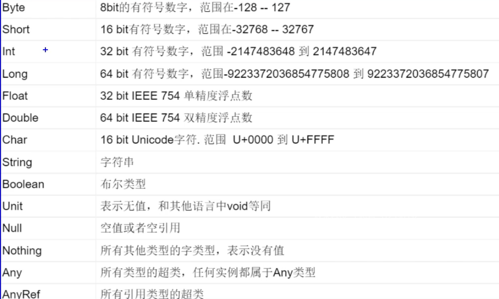


#### 2.5 Scala数学运算

Scala里，可以舍弃方法调用的空括号。例外就是如果方法带有副作用就加上括号，如println(),不过如果方法没有副作用就可以去掉括号，如String.上调用的toLowerCase，你可以通过中缀操作符，加号(+)，减号(-)，乘号(*)，除号(/)和余数(%)，在任何数类型上调用数学方法，scala中的基础运算与java-致。


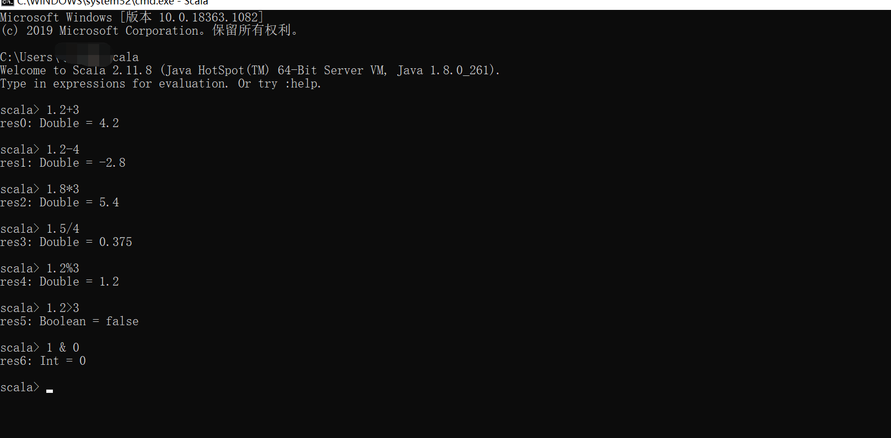


#### 2.6 Scala表达式

Scala中的任何表达式都具有返回值，Scala中的Unit（）与java中的void（）相同，代表没有返回值。


##### 2.6.1 什么是表达式

>  一个具有执行结果的代码块，结果是具体的值或没有值（）


##### 2.6.1 表达式与语句的区别

- 表达式有返回值，语句被执行。表达式一般是一个语句块，执行后返回一个值。

  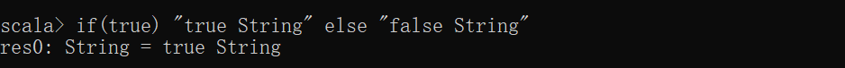

- 不使用return语句，最后一个表达式即是返回值。

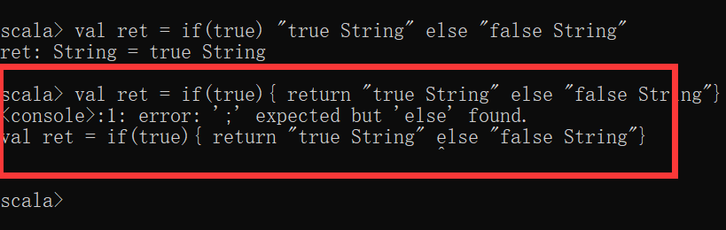


#### 2.7Scala-if循环表达式

> if/else表达式有值，这个值就是跟在if或者else之后的表达式的值。每一个表达式都有一个类型；条件表达式有值；混合型表达式，结果是Any或AnyVal；**<font color=red>Scala中没有switch语句</font>**

- 单分支
  基本语法: if (条件表达式) {执行代码块}
  说明:当条件表达式为ture时，就会执行{ }的代码。
- 双分支
  基本语法: if (条件表达式) {执行代码块1 } else {执行代码块2 }
  说明:当条件表达式成立，即执行代码块1，否则执行代码块2。
- 多分支
  基本语法: if (条件表达式1) {执行代码块1}
  else if (条件表达式2) {执行代码块2 }
  else {执行代码块n }

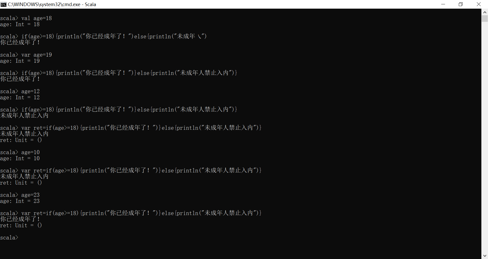


#### 2.8 Scala块表达式

在Java或C++中，块语句是- -个包含于I[{}中的语句序列。每当需要在逻辑分支或循环中执行多个动作时，
你都可以使用块语句。
在Scala中，{}块包含一 些列表达式，其结果也是- -个表达式。块中最后- -个表达式式的值就是块的值。


```
var f=3
varn=10
varm= 1
val d = if(n < 18){f=f+n;m=m+n; f+m}
==> d=24
```


注意:前面提到过，scala中的语句终止就是换行，也就是一行一个语句，此时便可以省略 ”;”，但是当
一行有多条语句的时候，就应该使用”;”分隔。在表达式块中同样可以使用换行作为一条语句的分隔。


#### 2.9 Scala循环简介

**概述**
在scala中有for循环和while循环，用for循环比较多。其中while循环和do. .. while循环和java中得语法结构一致，for循环稍有差异。

**to和until**
to和until主要是用于生成一个列表或者范围。
i to j (包含i和j)
i until j (包含i,但不包含j)

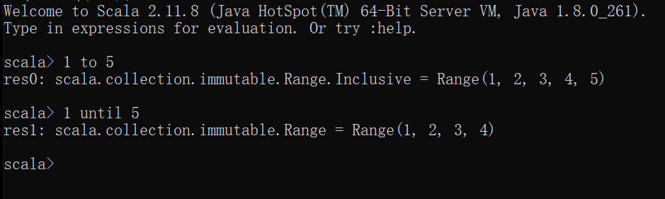


#### 2.10 IDEA整合Scala插件

##### 2.10.1 IDEA下载Scala插件

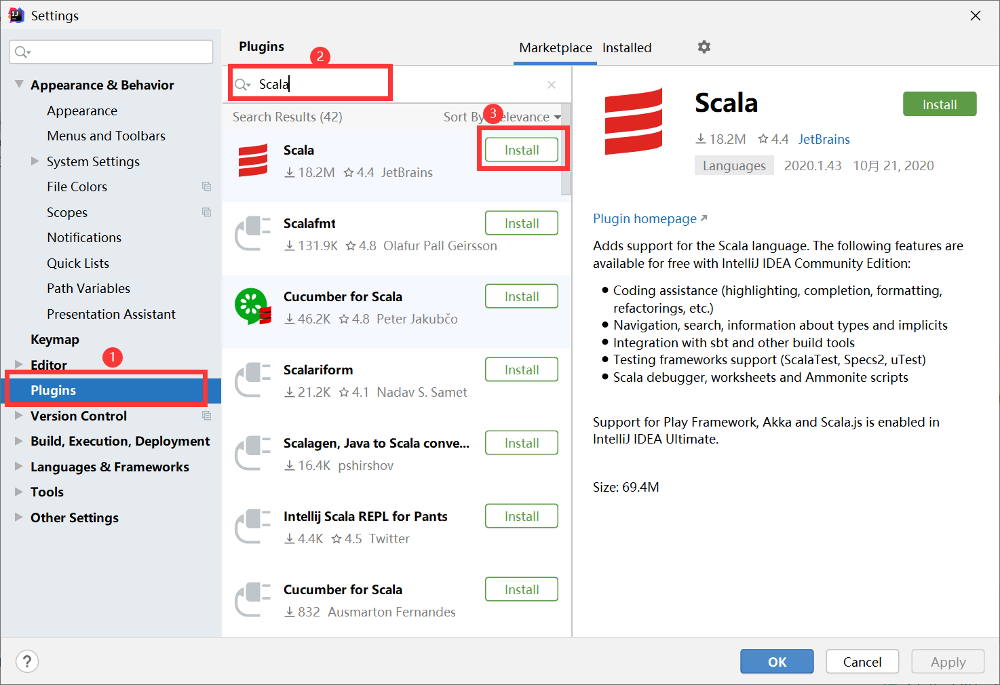


##### 2.10.2 创建Scala项目

接下来就可以通过IDEA创建一个新的Scala项目

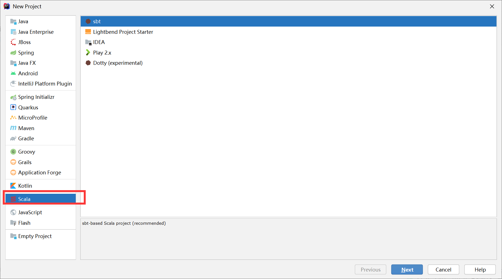![)


#### 2.11 基于Maven来创建项目

> 在实际开发中，更多的时基于<b><font color=red>Maven</font></b>来构建Scala项目

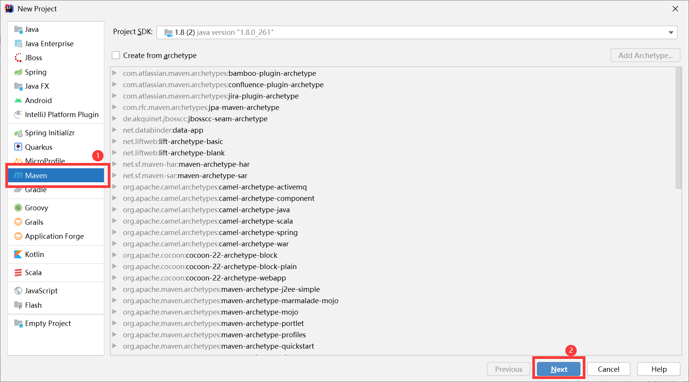


新建项目之前，首先先设置Scala模块，方法如下；

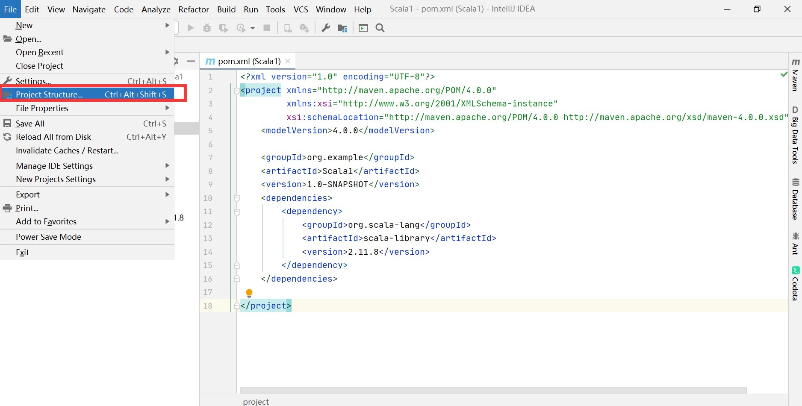


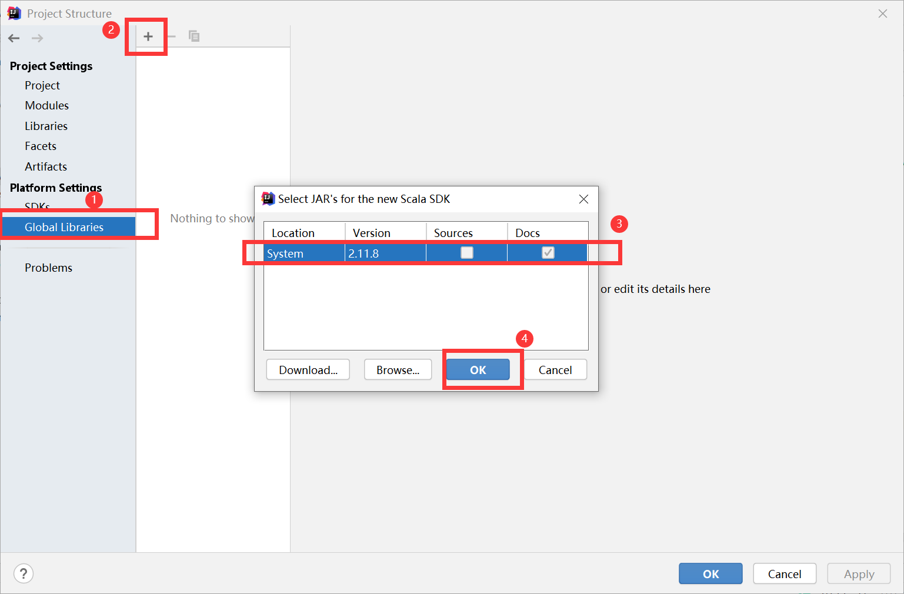


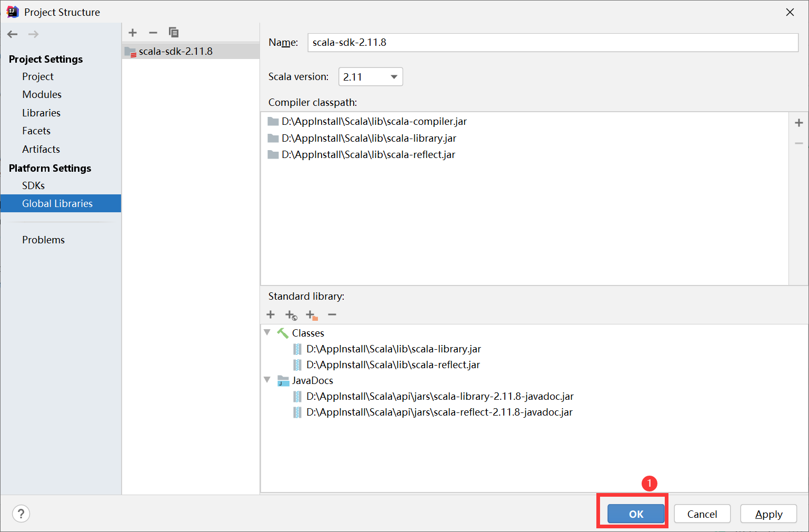


此时点击New可以新建一个Scala项目。

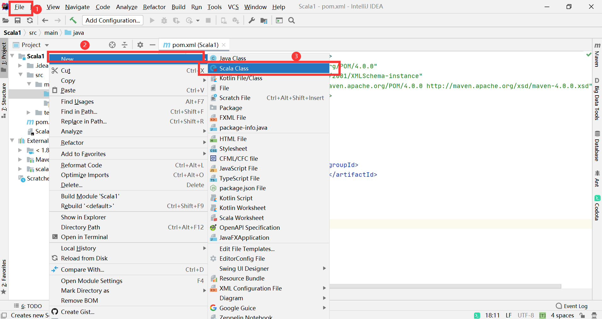


模块创建完成之后，在新项目创建完成之后，在pom.xml中添加依赖。

```scala
<dependencies>
    <dependency>
        <groupId>org.scala-lang</groupId>
        <artifactId>scala-library</artifactId>
        <version>2.11.8</version>
    </dependency>
</dependencies>
```

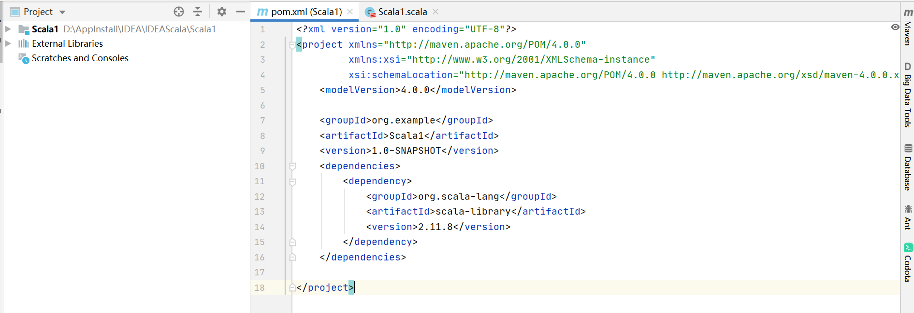


##### 2.11.1 编写第一个HelloWorld

使用Scala写的第一个Scala代码

```scala
package com.zut.nanyu.scala

object one {
  def main(args: Array[String]): Unit = {
    println("HelloWorld")
  }
}
```


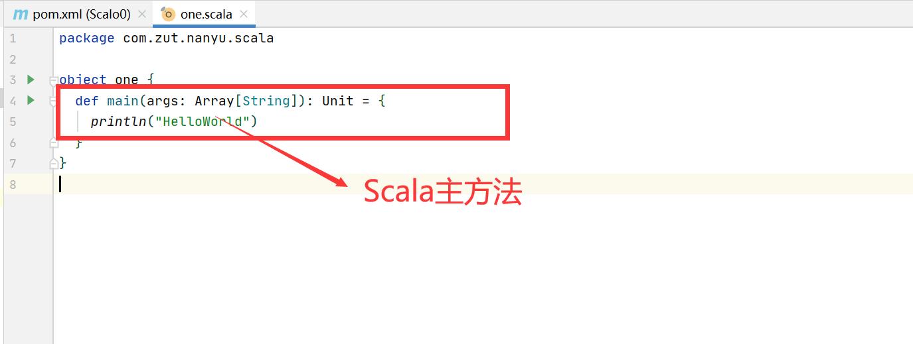


## Scala中的流程控制-循环

#### 3.1 Scala中的while循环

> 需要注意的是Scala中 ; 可加可不加，不会产生影响。 <b><font color=red>Scala中不能用++或--来代替 自增或自减，</font></b>因为++/—-是Scala中集合的一个函数

```scala
package com.zut.nanyu.scala

/**
 * While循环
 * java语言实现
  int sum=0;
  int n=1;
  while(n<10){
  sum=sum+n;
 n++
 }
  System.out.println("sum="+sum);
 */

/*
Scala语言实现While循环
 */
object WhileDemo {
  //Scala中的 ; 可加可不加
  def main(args: Array[String]): Unit = {
    var sum=0;
    var n=1;
    while(n<10){
      sum=sum+n;
      //n++; Scala中不能用++或--来代替 自增或自减，因为++/—-是Scala中集合的一个函数
      n=n+1;
    }
    println(sum);
  }
}
```


#### 3.2 Scala中的do-while循环

```scala
package com.zut.nanyu.scala
/**do-While循环
 *java语言实现
   int sum=0;
   int n=1;
   do{
  sum=sum+n;
   n++;
  }while(n<10)
   System.out.println("sum="+sum);
 */

/*
Scala语言实现循环
 */
object DoWhileDemo {
  def main(args: Array[String]): Unit = {
    var sum=0;
    var n=0;
    do {
      sum =sum+n;
      n=n+1;
    }while(n<10)
    println(sum)
  }
}
```


#### 3.3 while-if循环控制练习

> **题目要求：**登录用户名密码的游戏:三次机会，从控制台输入用户名密码，如果成功登录，返回登录成功，失败，则反馈错误信息!

```scala
package com.zut.nanyu.scala
import scala.io.StdIn
/*
使用Scala简单实例
 */
object WhileIfDemo {
  def main(args: Array[String]): Unit = {
    val Username="钉子君"
    val Passwd="123456"
    var n=3;
    //Scala中从控制台输入的api是StdIn.Line/StdIn.Int/StdIn.next等等，与Java不同，使用方法如下
    while(n>0) {
      var user=StdIn.readLine("请输入用户名：");
      var pw=StdIn.readLine("请输入密码：");
      if (Username==user&&Passwd==pw){
      println("登录成功！");
        n=0;
    }else{
      println("登录失败！请重新输入");
        n=n-1;
    }
    }
  }
  }
```


#### 3.4 for循环

在java中有2中写法，普通的for循环for (变量;条件;自增或自减) {循环体} or for(类型 变量:集合) {}。

scala中的for循环该如何定义呢?scala中并没有像java中普通for循环的语法结构，更像是高级for循环。

>  语法格式: 
> for (变量<-集合) {
> }

```scala
package com.zut.nanyu.scala
/*
Java中的for循环
int sum=10;
for(int i=0;i<=sum;i++){
system.out.println(i);
}
Scala中的For循环
 */
object ForDemo {
  def main(args: Array[String]): Unit = {
    var sum=0;
    for(n<-1 to 10){
      sum =sum+n;
    }
    println(sum);
  }
}
```


#### 3.5 for循环的嵌套

除了for循环的基本形态之外，Scala也提供了其它丰富的高级特性。比如可以在for循环括号里同时包含多组”变量<- 表达式”结构，组之间用分号分隔
`for (i <- 1 to 3; j <-1 to 3) print ((10*i+j) +”")`for循环的这种结构类似Java中的嵌套循环结构。

if循环守卫可以为嵌套循环通过if表达式添加条件
`for(i<-1to3;j<-1to3ifi!=j)print((10*i+j)+"")`
if表达式是否添加括号，结果无变化。
`for(i<-1to3;j<-1to3if(i!=j))print((10*i+j)+"")`
注意:注意在if之前并没有分号。

```scala
package com.zut.nanyu.scala
/*
打印一个五行五列的矩阵
*****
*****
*****
*****
*****
 */
object ForDemo {
  def main(args: Array[String]): Unit = {
    println("---------------------打印矩形---------------------");
for(n<-0 until 5){
for (m<-1 to 5){
  print("*");
}
  println;
}
    println("---------------------打印下三角---------------------");
    for(n<-1 to 5){
      for (m<-1 to n){
        print("*");
      }
      println;
    }
    println("---------------------打印上三角---------------------");
    for(n<-1 to 5){
      for (m<-1 to 5){
      if(m>=n){
        print("*");
      }else{
        print(" ");
      }
      }
      println;
    }
    println("---------------------打印九九乘法表---------------------");
  for(n<-1 to 9){
    for(m<-1 to n){
      print(m+"*"+n+"="+(m*n)+"\t");
    }
    println();
  }
    println("---------------------for循环另外一种写法---------------------");
    for(n<-1 to 9;m<-1 to n){
        print(m+"*"+n+"="+(m*n)+"\t");
      if(n==m){
        println();
      }
    }
}
}
```


#### 3.6 循环终止的三种方式

在java中终止循环有关键字，continue, bHreak, return,但是在scala中没有前两者continue和break。在scala中有三种方式来结束循环:

> - **使用return语 句来控制循环结束**
>
> - **使用循环结束的条件来进行控制，比如上例中的count >= 0**
>
> - **还可以使用breakable函数体来进行控制**


##### 3.6.1 使用return来终止循环

```scala
object WhileIfDemo {
  def main(args: Array[String]): Unit = {
    val Username="钉子君"
    val Passwd="123456"
    var n=3;
    //Scala中从控制台输入的api是StdIn.Line/StdIn.Int/StdIn.next等等，与Java不同，使用方法如下
    while(n>0) {
      var user=StdIn.readLine("请输入用户名：");
      var pw=StdIn.readLine("请输入密码：");
      if (Username==user&&Passwd==pw){
      println("登录成功！");
        //n=0;
        //使用return来结束循环
        return;
    }else{
      println("登录失败！请重新输入");
        n=n-1;
    }
    }
  }
  }
```


##### 3.6.2使用循环结束条件来结束循环

```scala
object WhileIfDemo {
  def main(args: Array[String]): Unit = {
    val Username="钉子君"
    val Passwd="123456"
    var n=3;
    //Scala中从控制台输入的api是StdIn.Line/StdIn.Int/StdIn.next等等，与Java不同，使用方法如下
    while(n>0) {
      var user=StdIn.readLine("请输入用户名：");
      var pw=StdIn.readLine("请输入密码：");
      if (Username==user&&Passwd==pw){
      println("登录成功！");
        //使用循环结束条件来结束循环，比如n作为计数器，作为循环结束条件
        n=0;
        return;
    }else{
      println("登录失败！请重新输入");
        n=n-1;
    }
    }
  }
  }
```


##### 3.6.3使用breakable函数结束循环

```scala
//导入Breaks下面的所有包
import scala.util.control.Breaks._
object WhileIfDemo {
  def main(args: Array[String]): Unit = {
    val Username="钉子君"
    val Passwd="123456"
    breakable{//使用breakable作为外壳，套在循环外
      var n=3;
      while(n>0) {
      var user=StdIn.readLine("请输入用户名：");
      var pw=StdIn.readLine("请输入密码：");
      if (Username==user&&Passwd==pw){
        println("登录成功！");
//        n=0;
//        return;
        break();//此时便能可以通过调用break（）函数来结束循环
      }else{
        println("登录失败！请重新输入");
        n=n-1;
      }
    }
    }

  }
  }
```


### 3.7 Scala异常控制和懒加载

##### 3.7.1 异常控制

Scala的异常处理和其它语言比如Java类似，一个方法可以通过抛出异常的方法而不返回值的方式终止相关代码的运行。调用函数可以捕获这个异常作出相应的处理或者直接退出，在这种情况下，异常会传递给调用函数的调用者，依次向上传递，直到有方法处理这个异常。

```scala
try {
//vari=1 / 0
lazy val num = Integer. valueOf (”abcd' ")
val file = new FileInputStream("abedefg")
} catch {
case e: ArithmeticException => println(e. getMessage)
case el: NumberFormatException => el. printStackTrace ()
case_ :Exception => {//_下划线代表上述没有匹配到的其他的异常
println("文件找不到")
}
```


Scala中文件从磁盘中读取（即Scala中的IO流）

```scala
package com.zut.nanyu.scala
import scala.io.Source
object ExceptionsDemo {
  def main(args: Array[String]): Unit = {
    //Source为Scala中读取文件的接口，即Scala中的IO.读取磁盘中的Hello.txt文件
    val lines = Source.fromFile("D:\\AppInstall\\IDEA\\IDEAScala\\Scalo0\\data\\Hello.txt");
    //得到从磁盘中的得到的内容
    val cont = lines.mkString
    println(cont)
  }
}
```

> 结果：D:\AppInstall\JDK\bin\java.exe 
> Hellojava!
> HelloScala!
> HelloWeb!


当Source找不到文件时，就会出现FileNotFoundException错误，Scala中需要用try{}catch{}做抛出异常操作。

```scala
package com.zut.nanyu.scala
import java.io.FileNotFoundException
import scala.io.Source
object ExceptionsDemo {
  def main(args: Array[String]): Unit = {
    try {
      //Source为Scala中读取文件的接口，即Scala中的IO.读取磁盘中的Hello.txt文件
      val lines = Source.fromFile("D:\\AppInstall\\IDEA\\IDEAScala\\Scalo0\\data\\Hello1.txt"); //Hello1文件并不存在，所以会有异常
      //得到从磁盘中的得到的内容
      val cont = lines.mkString
      println(cont)
    } catch {
      case fnfe: FileNotFoundException => {
        println(fnfe.getMessage)
      }
    }
  }
}
```

> j结果：D:\AppInstall\IDEA\IDEAScala\Scalo0\data\Hello1.txt (系统找不到指定的文件。)


Scala中如果代码中有多个异常需要抛，可以一个一个用case（**不推荐**），也可以使用通用异常处理方法，只用写一个case即可

一个一个用case抛的案例（如果异常过多，会很麻烦）

```scala
object ExceptionsDemo {
  def main(args: Array[String]): Unit = {
        //Source为Scala中读取文件的接口，即Scala中的IO.读取磁盘中的Hello.txt文件
        val cont = Source.fromFile("D:\\AppInstall\\IDEA\\IDEAScala\\Scalo0\\data\\Hello.txt").mkString; //Hello1文件并不存在，所以会有异常
        //得到从磁盘中的得到的内容
        println(cont)
    try {
      var i = 1 / 0;
    } catch {
      case fnfe: FileNotFoundException => {
        println(fnfe.getMessage)}//用于处理文件不存在的异常
      case am:ArithmeticException =>{
        println(am.getMessage)}//用于处理数字运算异常
    }
  }
}
```


使用通用抛异常的方法，只需要一个case就能解决

```scala
object ExceptionsDemo {
  def main(args: Array[String]): Unit = {
        //Source为Scala中读取文件的接口，即Scala中的IO.读取磁盘中的Hello.txt文件
        val cont = Source.fromFile("D:\\AppInstall\\IDEA\\IDEAScala\\Scalo0\\data\\Hello.txt").mkString; //Hello1文件并不存在，所以会有异常
        //得到从磁盘中的得到的内容
        println(cont)
    try {
      var i = 1 / 0;
    } catch {
      case _ => {// — 在Scala中表示全部的意思
          println("通用异常处理")
        }
    }
  }
}
```


#####  3.7.2 懒加载

> lazy : 懒加载，被lazy所修饰的变量，之后当第一次被调用的时候才会进行初始化，之前只是做了语法结构的正确性判断。

```scala
object ExceptionsDemo {
  def main(args: Array[String]): Unit = {
    try {
        //Source为Scala中读取文件的接口，即Scala中的IO.读取磁盘中的Hello.txt文件
        lazy val cont = Source.fromFile("D:\\AppInstall\\IDEA\\IDEAScala\\Scalo0\\data\\Hello1.txt").mkString; //Hello1文件并不存在，所以会有异常
        //得到从磁盘中的得到的内容
        //println(cont)
    } catch {
      case _ => {
          println("通用异常处理")
        }
    }
  }
}
```

在cont前加上lazy之后，cont就延迟被加载一次，即不会执行这条命令，**只有当cont被调用时才会被加载（即把Println（cont）取消注释之后就会执行lazy）**

懒加载的使用场景：打开博客网站时，页面会出现一些文章，而当点击底部的**更多文章**时，就会出现更多的文章，这些文章都是通过懒加载实现的，只有被点击调用时才会被加载，呈现出来。


### 3.8 Scala函数与方法的定义

Scala除了方法外还支持函数。方法对对象进行操作，函数不是。要定义函数，你需要给出函数的名称、参
数和函数体，就像这样:


> def:相当于Java中private、public、protect
>
> welcome：相当于Java中的方法名
>
> name：String：相当于Java中的参数
>
> String：相当于Java中的返回值类型


1、你必须给出所有参数的类型。不过，只要函数不是递归的，你就不需要指定返回类型。Scala编译器 可以通过=符号右侧的表达式的类型推断出返回类型。
2、“=”并不只是用来分割函数签名和函数体的，它的另-个作用是告诉编译器是否对函数的返回值进行类型推断!
如果省去=,则认为函数是没有返回值的!

Scala中函数的定义

```scala
/*
Scala中函数的定义
 */
object FunctionDemo {
  def main(args: Array[String]): Unit = {
    val Str = PrintDemo("钉子君");
    println(Str)
  }

  def PrintDemo(name: String): String = {
    "Hello" + name;
  }
}
```

 

>  如果定义的函数写了返回值类型，则必须要加"=",不然编译器通不过

```scala
//当有返回值，且返回值后不加 “=” 时，编译器会报错
def PrintDemo1(name: String): String{
  "Hello" + name;
}
```


> 如果没有写返回值类型， 但是加了"="，编译器会自动的进行类型推断

```scala
//当无返回值，且加 “=” 时，编译器会自动识别返回类型
def PrintDemo1(name: String)={
  "Hello" + name;
}
```


>  如果没有写返回值类型，也没有加"=”，编译器认为你该函数没有返回值类型， 或者返回值类型unit

```scala
//当无返回值，且不加 “=” 时，编译器没有返回类型或返回类型为unit
def PrintDemo1(name: String){
  "Hello" + name;
}
```


### 3.9 Scala基本函数

Scala的几个基本函数:

- 无返回值的函数

  ```scala
  //没有返回值的函数
  def PrintDemo1(name: String){
    println("Hello" + name)
  }
  ```

- 空参函数: <b><font color=red> 如果一个函数在定义的时候没有参数,在调用时,可以省略掉() ,如果在定义一个空参函数时,省略了(),则在调用时也要省略掉()</font></b>

  ```scala
  object FunctionDemo {
    def main(args: Array[String]): Unit = {
      PrintDemo1("于士豪");
      PrintDemo2();
      PrintDemo2;//可以省略掉()
      PrintDemo3;//必须省略()
    }
    //空参函数
    def PrintDemo2(){
      println(System.currentTimeMillis())
    }
     def PrintDemo3{
      println(System.currentTimeMillis())
    }
  ```

- 单行函数:必须要使用" ="将函数与函数体连接

  ```scala
  object FunctionDemo {
    def main(args: Array[String]): Unit = {
      PrintDemo1("于士豪");
      PrintDemo2();
      PrintDemo2;
      PrintDemo3("中国");
    }
    //单行函数
    def PrintDemo3(name: String) = println(name + "加油！");
  ```

- 递归函数

```scala
object FunctionDemo {
  def main(args: Array[String]): Unit = {
    PrintDemo1("于士豪");
    PrintDemo2();
    PrintDemo2
    PrintDemo3("中国")
    var sum=PrintDemo4(5)
    println(sum);
  }
  //没有返回值的函数
  def PrintDemo4(n: Int):Int= {
 if(n<=1){
   1
 }else{
   n*PrintDemo4(n-1);
 }
  }
```


### 4.0 Scala中的默认参数和带名参数


1、**我们在调用某些函数时并不显式地给出所有参数值，对于这些函数我们可以使用默认参数。**
def sayDefaul tFunc (name: String, address: String = "Beijing"， tellphone: String = *13********) ={
println (name +" address=>" + address +"\t teIlphone=>" + tellphone)

2、**不指定具体参数时:给出默认值**
sayDefaultFunc("Garry”)

3、**如果相对参数的数量,你给出的值不够，默认参数会从后往前逐个应用进来。**

sayDefaultFunc ("Garry ", "Shanhai ”)

4.**给出全部的参数值**

sayDefaultFunc("Garry ", "Shanhai ”,”13709872335*)

5、**帶名参数可以让函数更加可读。它们对于那些有很多默认参数的函数来说也很有用。**
sayDefaul tFunc (address =” 上海”，tellphone=' "12109876543 ", name= "Tom”)

6、**你可以混用未命名参数和带名参数,只要那些未命名的参数是排在前面的即可:**
sayDefaultFunc("Tom" tellphone= ”12109876543 , address = "上海”)


class word{

}

//单例对象，写入主方法mian

object word{

}