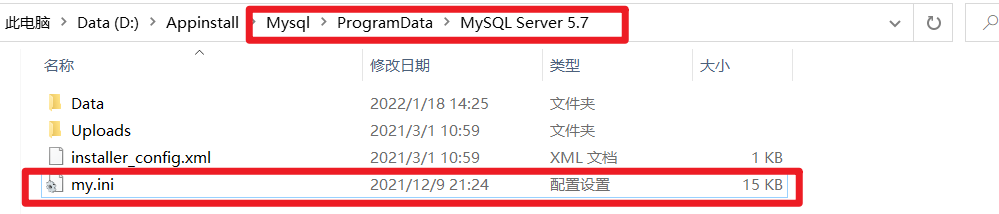
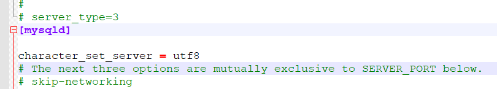

在使用JDBC做数据查询时总是查询失败，找了找原因最终发现是编码问题，对于编码问题的解决，有以下两种方案

- 第一种：使用jdbc连接时，指定编码

```java
String url = "jdbc:mysql:///project?useSSL=false&useUnicode=true&characterEncoding=utf8";
```

- 第二种：修改MySQL配置文件

找到MySQL中的my.ini配置文件



再[mysqld]下面添加下面一行：

```ini
character_set_server = utf8
```



然后保存重启MySQL服务

