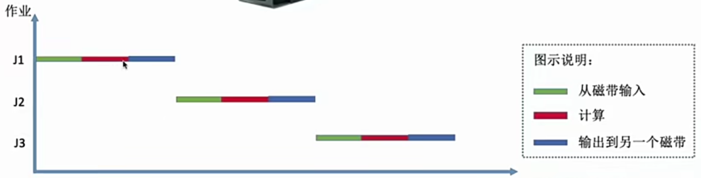
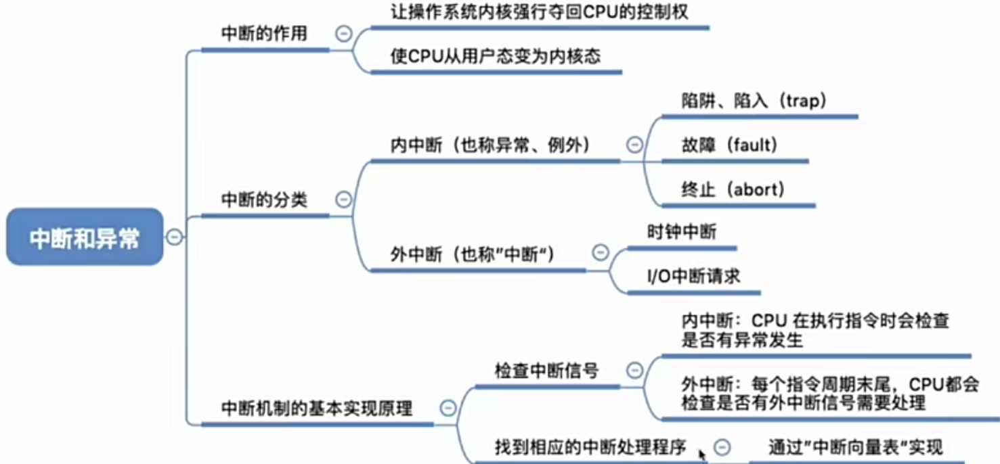

# 第一章 计算机系统概述

## 1.1 操作系统概念

一台电脑的诞生：

- 厂家组装一台裸机
- 出售前安装操作系统
- 用户安装QQ、微信、联盟等应用
- 使用QQ聊天


**操作系统的定义**：（Operating System OS）是指控制和**管理**整个计算机系统的**硬件和软件**资源，并合理地组织调度计算机的工作和资源的分配；以**提供给用户和其他软件方便的接口和环境**；它是计算机系统中最基本的系统软件。

- 操作系统是**系统资源的管理者**，即对上层软件进行管理也对下层硬件进行管理。
- 操作系统为上层提供易用的服务。
- 操作系统是软件而不是硬件，它是最接近硬件的一层软件。


直观的例子：打开Windows的任务管理器，如下：


左边百度网盘、PPT、Typora等都是操作系统对软件的管理，右边CPU、内存、磁盘、网络、GPU等都是操作系统对硬件的管理。

### 1.1.1 作为资源的管理者

> 执行一个程序前需要**先将该程序放到内存中**，才能被CPU处理。

作为资源的管理者，主要提供的管理功能有：处理机管理、存储器管理、文件管理、设备管理。


用QQ和朋友聊天的过程表示出操作系统作为资源的管理者的具体呈现：

1. 在各个文件夹中找到QQ安装的位置，如D:/Tencent/QQ/Bin（文件管理功能）
2. 双击打开QQ.exe（存储器管理：把该程序的相关数据放入内存）
3. QQ程序正常运行（处理机管理：对应的进程被处理机即CPU处理）
4. 开始和朋友视频聊天（设备管理：将摄像头设备分配给进程）

### 1.1.2 为上层提供方便易用的服务


> 封装思想：操作系统把一些丑陋的硬件功能封装成简单易用的服务，使用户能更方便的使用计算机，用户无需关心底层硬件的原理，只需要对操作系统发出命令即可。

操作系统为上层提供的服务：


- 现代：比如GUI（图形化用户接口），用户可以使用形象的图形化界面进行操作，而不需要记忆复杂的命令、参数。例如：在Win系统中，删除一个文件只需要把文件”拖拽“到回收站即可。

- 早期：早期操作系统并没有GUI，而是提供给用户命令接口（即命令行形式）的形式与用户交互，命令接口又分为两种形式：一种是联机命令接口，一种是脱机命令接口。

  - 联机命令接口（交互式命令接口）：使用Win+R键，输入cmd可调出终端，如下：

  

  - 脱机命令接口（批处理命令接口）：使用Win系统的搜索功能，搜索C盘种的*.bat文件，用记事本打开任意一个，里面是一堆命令。

  

- 程序接口：可以在程序种进行**系统调用**来使用程序接口，普通用户不能直接使用程序接口，只能通过程序代码间接使用。

  > 系统调用类似函数调用，是应用程序请求操作系统服务的唯一方式


### 1.1.3 操作系统的功能和目标

**需要实现对硬件机器的扩展**，没有任何软件支持的计算机成为裸机。在裸机上安装的操作系统，可以提供资源管理功能和方便用户的服务功能，将裸机改造成功能更强、使用更方便的机器。通常把覆盖了软件的机器成为扩充机器，又称之为虚拟机

类比汽车：发动机-只会转，轮子-只会滚，如果在原始的硬件机器上，再加一层传动系统，让发动机带着轮子转，使原始的硬件机器得到扩展。

> 操作系统对硬件机器的拓展：将CPU、内存、磁盘、显示器、键盘等硬件合理地组织起来，让各种硬件能够相互协调配合，实现更多更复杂的功能。

### 1.1.4 总结


## 1.2 操作系统的特征

操作系统有四个特征，分别是：并发、共享、虚拟、异步，其中并发与共享是最基本的特征，两者互为存在条件。


### 1.2.1 并发

- 并发：指两个或多个事件再同一时间间隔内发生。这些事件<font color=red>宏观上是同时发生的</font>，但<font color=red>微观上是交替发生的</font>。

- 并行：两个或多个事件在同一时刻同时发生。

两者区别：


> 操作系统的并发性是指计算机系统”同时“运行着多个程序，这些程序宏观上看是同时运行的，而微观上看是交替运行的。

操作系统是伴随着”多道程序技术“而出现的。因此**<font color=red>操作系统和程序并发是一起诞生的。</font>**

### 1.2.2 共享

共享即资源共享，是指系统中的资源可供内存中多个并发执行的进程共同使用。

两种资源共享方式：

- 互斥共享方式：系统中的某些资源，虽然可以提供给多个进程使用，但**一个时间段内只允许一个进程访问资源。**
- 同时共享方式：系统中的某些资源，允许一个时间段内由多个进程”同时“对他们进行访问。

所谓的”同时“，往往是宏观上的，而在微观上，这些进程可能是交替地对该资源进行访问（即分时共享）

实例：
互斥共享方式：使用QQ和微信视频，同一时间内摄像头只能分配给其中一个进程。

同时共享方式：使用QQ发送文件A，同时使用微信发送文件B。宏观上看，两边都在同时读取并发送文件，说明两个进程都在访问硬盘资源，从中读取数据。微观上看，两个进程是交替访问硬盘。

### 1.2.3 并发与共享的关系

并发性指计算机系统中同时存在多个运行着的软件。

共享性指计算机系统中的资源可供内存中多个并发执行的进程共同使用。

共享与并发的关系：以使用QQ发送文件A，微信发送文件B为例。

1. 两个进程正在并发执行
2. 需要共享地访问硬盘资源

如果失去并发性，则系统中只有一个程序在运行，共享性就失去了它的意义；如果失去共享性，QQ和微信不能同时访问硬盘资源，就无法实现同时发送资源，并发性也就失去了意义。因此：

> **<font color=red>操作系统的共享性和并发性是相互依存的。</font>**

### 1.2.4 虚拟

虚拟是把一个物理上的实体变为若干个逻辑上的对应物。物理上的实体是真实存在的，而逻辑上的对应物是用户感受到的。

- 例子1：

**注意：一个程序需要先放入内存并给他分配CPU才能执行。**

情景：GTAS需要4GB的运行内存，QQ需要256MB内存，微信需要256MB内存，网易云需要256GB内存。

我的电脑：4GB运行内存

问题：这些软件同时运行的话需要的内存远大于4GB，为什么还可以同时在电脑上运行？

原因：计算机采用了虚拟存储技术，实际只有4GB内存，在用户看来远远大于4GB（空分复用）

- 例子2：

情景：某单核CPU中，用户同时打开了QQ、微信、迅雷、GTAS软件

问题：既然一个程序需要被分配到CPU才能正常执行，那么为什么单核CPU电脑上能同时执行这么多程序？

原因：计算机采用了虚拟处理器技术，实际只有一个单核CPU，在用户看来有6个CPU同时为自己服务（时分复用，微观上还是一个CPU在交替执行）

**虚拟技术：**

- 时分复用（如虚拟处理器技术）
- 空分复用（虚拟存储器技术）

如果失去了并发性，在同一时间段内只运行一个程序，则虚拟性也就失去了意义。

### 1.2.5 异步

异步是指在多道程序环境下，允许多个程序并发执行，但由于资源有限，进程的执行不是一贯到底的，而是走走停停，以不可预知的速度向前推进，这就是进程的异步性。

举例：老渣要和两个女孩约会

第一道程序：

- 一号女孩的指令1：老渣陪我吃饭

- 一号女孩的指令2：老渣把心给我

第二道程序：

- 二号女孩的指令1：老渣把心给我

- 二号女孩的指令2：老渣陪我吃饭

与一、二号的约会=两道并发执行的程序

老渣的心=有限的系统资源


由于并发运行的程序会争抢着使用系统资源，而系统中的资源有限，因此进程的执行不是一贯到底的，而是走走停停的，以不可预知的速度向前推进。如果失去了并发性，即系统只能串行地运行各个程序，那么每个程序的执行会一贯到底，只有系统拥有并发性，才有可能导致异步性。

### 总结


## 1.3 操作系统的发展与分类

### 1.3.1 手工操作阶段

手工操作流程：

程序员先将自己的程序放在纸袋机上，计算机把纸袋机上的数据读取到计算机中（非常慢），计算机处理程序（非常快），再将程序结果输出到纸袋机上，最后程序员取走程序结果（非常慢）。


时间图示：


主要缺点：**用户独占全机，人机速度矛盾导致资源利用率极低。**

### 1.3.2 批处理阶段-单道批处理系统

引入**<font color=red>脱机输入/输出技术</font>**（用外围机+磁带完成），并由监督程序负责控制作业的输入、输出。

单道批处理流程：

各程序员把自己的程序放入纸袋机上，由外围机负责把各程序存入磁带中，计算机从磁带中读取程序并处理（非常快），将处理结果再写入磁带中（快）。


时间图示：



主要优点：缓解了一定程序的人机速度矛盾，资源利用率有所提升

主要缺点：**<font color=red>内存中仅能有一道程序运行，</font>**只有该程序运行结束之后才能运行下一道程序。**<font color=red>CPU有大量的实践再空闲等待I/O完成</font>**。资源利用率依旧很低。


### 1.3.3 批处理阶段-多道批处理系统

> 操作系统正式诞生，用于支持多道程序并发运行


图示：


主要优点：多道程序并发执行，共享计算机资源。资源利用率大幅度提升，CPU和其他资源更能保持“忙碌”状态，系统吞吐量增大。此处的计算机资源包括：输入设备、CPU、输出设备

主要缺点：用户响应时间长，**<font color=red>没有人机交互功能</font>**（用户提交自己的作业后只能等待计算机处理完成，中间不能控制自己作业的执行。eg:无法调试程序/无法在程序运行过程中输入一些参数）


### 1.3.4 分时操作系统

分时操作系统：计算机以**<font color=red>时间片</font>**为单位**<font color=red>轮流为各个用户/作业服务</font>**，各个用户可通过终端与计算机交互。


主要优点：用户请求可以被及时响应，**<font color=red>解决了人机交互问题</font>**。允许多个用户同时使用一台计算机，并且用户对计算机的操作系统相互独立，感受不到别人的存在。（在用户看来仿佛自己独占全机）

主要缺点：**<font color=red>不能优先处理一些紧急的任务</font>**。操作系统对各个用户/作业都是完全公平的，循环地为每个用户作业服务一个时间片，不区分任务的紧急性。

### 1.3.5 实时操作系统

在实时操作系统的控制下，计算机系统接收到外部信号后及时进行处理，并且要在严格的时限内处理完事件。实时操作系统的主要特点是及时性和可靠性。

主要优点：依旧基于时间片处理任务，但**<font color=red>能够优先响应一些紧急任务</font>**，某些任务不需要时间片排队。

- 硬实时系统：必须在绝对严格的时间规定内完成任务（比如导弹控制系统、自动驾驶系统）。
- 软实时系统：可以接受偶尔违反规定的时间（比如12306订票系统）。


### 1.3.6 其他操作系统

- 网络操作系统：是伴随着计算机网络的发展而诞生的，能把网络中各个计算机有机地结合起来，实现数据传送等功能，实现网络中各种资源的共享（如文件共享）和各台计算机之间的通信。(如:Windows NT就是一种典型的网络操作系统，网站服务器就可以使用)
- 分布式操作系统：主要特点是分布性和并行性。系统中的各台计算机地位相同，任何工作都可以分布在这些计算机上，由它们并行、协同完成这个任务。
- 个人计算机操作系统:如 Windows XP、MacOS，方便个人使用。


## 1.4 操作系统的运行机制

### 1.4.1 程序是如何运行的


一条高级语言的代码翻译过来可能会对应多条机器指令，比如下方的代码：

```java
private int a;
a++;
```

其经过编译器翻译之后的产生的二进制代码可能如下：

```java
101010100101101010111
100100010010101101010
000110101010101010101
010101100111101101011
```

**程序运行的过程其实就是CPU执行一条条的机器指令的过程。**

**<font color=red>指令：是处理器（CPU）能识别、执行的最基本的命令</font>**

> 注意：Linux、Windows、MacOS系统中的“小黑框”中使用的命令与本节中的指令有所区别，前者属于**交互式命令接口**，而后者属于二进制机器指令。

### 1.4.2 内核

**应用程序：**普通程序员写的程序就是应用程序。

**内核程序：**苹果、微软有一帮人负责实现操作系统，他们写的是内核程序

**内核：**有很多内核程序组成了操作系统内核，简称**内核**，内核是操作系统**最核心的部分**，**也是最接近硬件的部分**。操作系统的功能之一即：**操作系统需要对系统资源进行管理，依靠的即是内核**。

**<font color=red>甚至可以说一个操作系统只需要有内核就足够了（如Docker仅需要Linux内核）</font>**

但并非操作系统的所有功能都在内核中，比如图形化用户界面GUI

> 操作系统内核作为“管理者”，有时会让CPU执行一些“特权指令”，如内存清零指令。这些指令影响重大，只允许“管理者”--即操作系统内核来使用。
>
> 应用程序只能使用非“特权指令”，比如加法指令、减法指令等。

在**<font color=red>CPU设计和产生的时候就划分了特权指令和非特权指令，</font>**因此CPU执行一条指令前就能判断出其类型。

### 1.4.3 内核态与用户态

CPU能判断出指令类型，但是它如何区分现在正在运行的是内核程序还是应用程序？

CPU有两种状态：**<font color=red>内核态</font>**和**<font color=red>用户态</font>**

- 内核态（核心态/管态）：当CPU处于内核态时，说明此时正在执行的是内核程序，此时可以执行特权指令
- 用户态：当CPU处于用户态时，说明此时正在执行的是应用程序，此时只能执行非特权指令

> 扩展：CPU中有一个寄存器叫**<font color=red>程序状态寄存器（PSW）</font>**，其中有个二进制位，1表示内核态，0表示用户态。

故事：

1. 刚开机时，CPU位内核态，操作系统内核程序先上CPU运行
2. 开机完成后，用户可以启动某个应用程序
3. 操作系统内核程序在合适的时候主动让出CPU，让该应用程序上CPU执行（**<font color=red>操作系统内核在让出CPU之前,会用一条特权指令把 PSW的标志位设置为“用户态”</font>**）
4. 应用程序运行在用户态
5. 此时一位猥琐的黑客在应用程序中植入了一条特权指令，企图破坏系统
6. CPU发现接下来要执行的这条指令是特权指令，但自己又处于用户态
7. 这个非法事件会引发一个中断信号（**<font color=red>CPU检测到中断信号后，会立即变为“核心态”，并停止运行当前的应用程序，转而运行处理中断信号的内核程序</font>**）
8. 终端使操作系统再次夺回CPU的控制权
9. 操作系统会对引发中断的事件进行处理，处理完了再把CPU使用权交给别的应用程序。

- 内核态-->用户态：执行一条特权指令--修改PSW的标志位位用户态，这个动作意味着操作系统主动让出CPU使用权

- 用户态-->内核态：由中断引发，硬件自动完成变态过程，出发中断信号意味着操作系统强行夺回CPU使用权。

- 除了非法使用特权指令之外，还有很多事件会出发中断信号。一个共性是，但凡需要操作系统接入的地方，都会触发中断信号。

### 1.4.4 总结


## 1.5 中断和异常

### 1.5.1 中断的作用

> **<font color=red>中断会使CPU由内核态切换为用户态，是操作系统重新夺回对CPU的使用权。</font>**
>
> 中断，是**<font color=red>让操作系统内核夺回CPU使用权的唯一途径</font>**，如果没有中断机制，那么一旦应用程序上CPU运行，CPU就会一致运行这个应用程序，也就不会存在并发。

- 内核态-->用户态：执行一条特权指令--修改PSW的标志位位用户态，这个动作意味着操作系统主动让出CPU使用权

- 用户态-->内核态：由中断引发，硬件自动完成变态过程，出发中断信号意味着操作系统强行夺回CPU使用权。

### 1.5.2 中断的分类


- 内中断：与当前执行的指令有关，中断信号来自CPU内部，也称异常（√）
  1. 例子1：黑客向正在执行应用程序的CPU中植入了一条有害的特权指令，CPU执行这条指令时，发现这是特权指令，会引发中断。--故障
  2. 例子2 ：CPU在用户态执行除法指令时，发现除数为0，表示这条指令是非法的，当CPU执行这条指令时会引发中断。--终止
  3. 例子3：有时候应用程序想请求操作系统内核服务，此时**<font color=red>会执行一条特殊的非特权指令--陷入指令</font>**，该指令会出发一个中断信号。--陷入/trap/陷阱

- 外中断：与当前执行的指令无光，中断信号来自CPU外部，也称中断（狭义的中断）
  1. 例子1：时钟中断--由时钟部件发来的中断信号（并发的原理），时钟部件每隔一个时间片（如50ms）会给CPU发送一个时钟中断信号。--时钟中断
  2. I/O中断--由输入输出设备发来的中断信号，当输入输出任务完成时，向CPU发送中断信号。--I/O中断请求

### 1.5.3 中断机制的基本原理

**<font color=red>不同的中断信号，需要用不同的中断处理程序来处理</font>**。当CPU检测到中断信号后，会根据中断信号的类型去查询**<font color=red>“中断向量表”</font>**，以此来找到相应的中断处理程序在内存中的存放位置。


> **<font color=red>中断处理程序一定是内核程序，一定运行在内核态</font>**

### 1.5.4 总结



## 1.6 系统调用

**<font color=red>系统调用一定会设计到CPU状态的切换</font>**

操作系统作为用户和计算机硬件之间的接口，需要向上提供一些简单易用的服务。主要包括命令接口和程序接口。其中，程序接口由一组系统调用组成。


系统调用：是操作系统提供给应用程序（程序员/编程人员）使用的接口，可以理解为一种可供应用程序调用的特殊函数。**<font color=red>应用程序可以通过系统调用来请求获得操作系统内核的服务。</font>**

### 1.6.1 系统调用与库函数的区别


不涉及系统调用的库函数：如“取绝对值”的函数

涉及系统调用的函数：如“创建一个新文件夹”的函数

| 普通程序 | 可直接进行系统调用，也可使用库函数。有的库函数设计系统调用，有的不涉及 |
| -------- | ------------------------------------------------------------ |
| 编程语言 | 向上提供库函数。有时会将系统调用封装成库函数，以隐藏系统调用的一些细节，使程序员编程更加方便 |
| 操作系统 | 向上提供系统调用，使得上层程序能请求内核的服务。             |
| 裸机     |                                                              |

生活场景:

去学校打印店打印论文，你按下了WPS 的“打印”选项,打印机开始工作。你的论文打印到一半时，另一位同学按下了Word的“打印”按钮，开始打印他自己的论文。

思考:

如果两个进程可以随意地、并发地共享打印机资源，会发生什么情况?两个进程并发运行，打印机设备交替地收

到WPS和 Word两个进程发来的打印请求，结果两篇论文的内容混杂在一起了...

解决方法:

由操作系统内核对共享资源进行统一的管理，并向上提供“系统调用”，用户进程想要使用打印机这种共享资源，只能通过系统调用向操作系统内核发出请求。内核会对各个请求进行协调处理。

### 1.6.2 用到系统调用的功能

应用程序通过系统调用请求操作系统的服务（系统调用一定涉及中断和CPU状态切换）。而系统中的各种共享资源都由操作系统内核统一掌管，**<font color=red>因此凡是与共享资源有关的操作（如存储分配、l/O操作、文件管理等)，都必须通过系统调用的方式向操作系统内核提出服务请求，由操作系统内核代为完成</font>**。这样可以保证系统的稳定性和安全性，防止用户进行非法操作。


### 1.6.3 系统调用过程


传递系统调用参数->执行陷入指令->执行相应的内请求核程序处理系统调用（核心态）->返回应用程序。

> - 陷入指令实在用户态执行的，执行陷入指令后立即引发一个内中断，使CPU进入核心态
> - 发出系统调用是在核心态,而对系统调用的相应处理在核心态下进行.

流程描述：

CPU先处于用户态执行非特权指令，其中这些指令中包含传参指令，这些指令被执行后将参数传入寄存器，随后执行陷入指令，出发CPU中断信号，CPU切换为核心态，CPU切换为核心态后执行相应的中断处理程序，识别寄存器中的参数，判断执行什么样的内核程序，执行完毕之后主动将CPU状态切换为用户态，继续执行应用程序中的非特权指令。


### 1.6.4 总结


**<font color=red>系统调用一定会设计到CPU状态的切换</font>**

## 1.7 操作系统的体系结构


### 1.7.1 操作系统的内核


时钟管理：是实现外中断和并发的必须的内核程序。

原语:是一种特殊的应用程序,具有原子性。也即是说这段程序的运行必须一气呵成，中间不允许被中断。

**UbuntuCentOS的开发团队，其主要工作是实现非内核功能，而内核都是用了Linux内核**

**<font color=red>时钟管理、中断处理、原语是与硬件关联最紧密的部分</font>**


### 1.7.2 大内核与微内核

大内核：一些操作系统会把对系统资源进行管理的功能：如进程管理、存储器管理、设备管理等功能划分到内核中，这就是大内核。

微内核：一些操作系统不会把对系统资源进行管理的功能划分到内核中，这就是微内核。

> 操作系统内核功能需要运行在内核态，操作系统非内核功能需要运行在用户态


大内核与微内核性能上的区别：

如果一个应用程序想请求操作系统服务，而这个操作同时设计进程管理、存储器管理、设备管理


大内核情况下执行请求CPU只需切换两次状态，而微内核情况下需要切换六次状态

**<font color=red>CPU切换状态是有成本的，需要消耗不少时间，频繁的变态会降低操作系统的性能</font>**

### 1.7.3 总结


- 典型的大内核/宏内核单/内核操作系统：Linux、UNIX

- 典型的微内核：WindowsNT


# 第二章 进程

## 2.1 进程的概念组成特征

同时挂三个QQ，会对应三个QQ进程。


**<font color=red>程序：</font>**是静态的，就是存放在磁盘里的可执行文件，就是一些列的指令集合。

**<font color=red>进程：</font>**（Processs）是动态的，是程序的一次执行过程。同一个程序的多次执行会对应多个进程

**思考：操作系统是这些进程的管理者，它要怎么区分各个进程？**


### 2.1.1 进程控制块PCB

PID：当进程被创建时，操作系统会为该进程分配一个**<font color=red>唯一的、不重复的</font>**身份证号--PID（Process ID，进程ID）

进程控制块PCB：

- 操作系统要记录PID、进程所属用户ID（UID，基本的进程描述信息，可以让操作系统区分各个进程）

- 还要记录给进程分配了哪些资源（如分配了多少内存、正在使用哪些I/O设备、正在使用哪些文件）

- 还要记录进程的运行情况（如CPU使用时间、磁盘使用情况、网络流量使用情况等）

这些信息都被保存到一个数据结构PCB中（Process Control Block）中，即**<font color=red>进程控制块。</font>**

操作系统需要对各个并发运行的进程进行管理，**<font color=red>但凡管理时所需的信息，都会被放进PCB中。</font>**


### 2.1.2 进程的组成

一个进程除了包括PCB，还要包括程序段、数据段

- PCB：进程的唯一标识，是进程存在的唯一标识，当进程被创建时操作系统为其创建PCB，当进程结束时，会回收其PCB。

- 程序段：用于存放程序的代码。

- 数据段：用于存放程序运行过程中产生的数据。

PCB是给操作系统用的，而数据段与程序段是给自己用的。

> 同时挂3个QQ，会对应3个QQ进程，他们的PCB、数据段各不相同，但他们的代码段是相同的（都是运行着相同的QQ程序）


程序的运行过程：

> 一个**<font color=red>进程实体</font>**（进程映像）是由**<font color=red>PCB、程序段、数据段</font>**组成。
>
> 进程是动态的，**<font color=red>进程实体是静态的</font>**，进程实体更像进程在某一时刻的快照，**<font color=red>它反映了进程在某一时刻的状态</font>**

一个存放在硬盘中的程序经过双击运行后，会被加载的内存中，**开始运行前会从创建对应的进程，即创建对应的PCB，然后在内存中会创建对应的程序段和数据段，程序段中存放着应用程序被编译后生成的指令，数据段中存放着程序运行中生成的数据，比如变量等。**


**总结：**

**<font color=red>程序段、数据段、PCB三部分组成了进程实体（进程映像）</font>**，引入进程实体的概念后，可以把进程定义为：进程是进程实体的**<font color=red>运行过程</font>**，是系统进行**<font color=red>资源分配和调度</font>**的一个独立单位。（一个进程被调度就是指操作系统让这个进程上CPU运行）

### 2.1.3 进程的特征

程序是静态的，进程是动态的，相比程序，进程拥有以下特征：

- 动态性：进程是程序的一次执行过程，是动态地产生、变化、消亡的（最基本的特征）
- 并发性：内存中有多个进程实体，各进程可并发执行
- 独立性：进程是能独立运行的、独立获得资源、独立接受调度的基本单位
- 异步性：各进程按各自独立的、不可知的速度向前推进，操作系统要提供“进程同步机制”来解决异步问题（异步性会导致并发程序执行结果的不确定性）
- 结构性：每个进程都会配置一个PCB，从结构上看，进程是由程序段、数据段、PCB组成。


### 总结


## 2.2 进程的状态与转换、进程的组织

### 2.2.1 进程的状态与转换

> 进程的PCB中，会有一个变量state来表示进程当前的状态。如1表示创建态，2表示就绪态，3表示运行态.....

进程共有五种状态：**<font color=red>创建态、就绪态、运行态、阻塞态、退出态</font>**

- 创建态：进程正在被创建时，它的状态是“创建态”，在这个阶段操作系统会为进程分配资源、初始化PCB。

- 就绪态：当进程创建完成后，进入就绪态，处于就绪态的进程已经具备了运行条件，但由于没有空闲的CPU，暂时不能运行。
- 运行态：如果一个进程此时在CPU上运行，那么这个进程处于“运行态”，此时CPU会执行该进程对应的程序（执行指令序列）
- 阻塞态：进程执行的过程中，可能会请求等待某个时间的发生，比如某种系统资源的分配，或者等待其他进程的相应。在这个事件发生之前，进程无法继续往下执行，此时操作系统会让这个进程下CPU，并让他进入“阻塞态”
- 终止态：一个进程可以执行exit系统调用，请求操作系统终止该进程，此时该进程会进入“终止态”，操作系统会让该进程下CPU，并回收内存空间等资源，最后还要回收该进程的PCB。


**进程各状态转换的流程：**

进程在**<font color=red>被创建时处于创建态</font>**；当**<font color=red>系统完成创建进程的一些工作</font>**时进程转为**就绪态**，此时进程已具备执行的资源，但唯独缺少处理器**<font color=red>文字</font>**；**<font color=red>进程被调度后，被拿上CPU运行</font>**，此时进程处于**运行态**；进程用系统调用的方式申请某种系统资源（而该资源恰巧处于非空闲状态），或者请求**<font color=red>等待某个事件发生</font>**，此时进程进入**阻塞态**；当进程**<font color=red>申请的资源被分配，或等待的事件发生</font>**，此时进程又将进入**就绪态**；进程再次被调度后又会处于运行态；最后当**<font color=red>进程运行结束或运行过程中遇到不可修复的错误时</font>**，进程会进入**终止态**。


> - 就绪态可以通过进程调用转为运行态，当时间片用完或者CPU被抢占时进程状态会从运行态转为就绪态
> - 运行态到阻塞态的转换是一种进程自身做出的**<font color=red>主动行为</font>**
> - 阻塞态到就绪态不是进程自身能控制的，是一种**<font color=red>被动行为</font>**
> - **不能由阻塞态直接转换称运行态，也不能由就绪态直接转为阻塞态**（因为进入阻塞态意味着是进程主动请求的，必然需要进程在运行时才能发出这种请求）

**总结：**


注意：

- 进程的整个生命周期中，大部分时间处于运行态、阻塞态、就绪态三种基本状态
- 单CPU情况下，同一时刻只会有一个进程处于运行态，多核CPU中可能有多个进程处于运行态


### 2.2.2 进程的组织

为了对同一状态下的各进程进行统一股那里，操作系统会将各个进程的PCB组织起来，进程的组织方式有两种。

**大部分操作系统采用的都是链式组织方式。**

- 链接方式：


- 索引方式


**总结：**


### 2.2.3 总结


## 2.3 进程控制

### 2.3.1 什么是进程控制

> 进程控制的主要功能是对系统中的所有进程实施有效的管理，它具有创建新进程、撤销已有进程、实现进程状态转换等功能。

简化理解：

进程控制就是要实现进程状态转化


### 2.3.2 如何实现进程同步

**<font color=red>用原语实现：</font>**原语是一种特殊的程序，它的执行具有原子性，也就是说这段程序的运行必须一气呵成，不能被打断


思考：为什么进程控制的过程要一气呵成？

举例：假设PCB中的state表示当前进程所处状态，1表示就绪态，2表示阻塞态....


假设此时进程2等待的事件发生，则操作系统中，负责进程控制的内核程序至少需要做这样的两件事

- PCB2的state设置为1
- 将PCB2从阻塞队列放到就绪队列

假设第一步后收到中断信号，那么PCB2的state=1，但是他却被放在阻塞队列中。所以如果此转换操作不能一气呵成的执行，就有可能导致操作系统中的耨写关键数据结构信息不统一，这会影响操作系统进行别的管理工作。因此，**<font color=red>可以用原语来执行操作，不会被打断。</font>**


### 2.3.3 如何实现原语的原子性

原语的执行具有原子性，即执行过程只能一气呵成， 期间不允许被中断，可以用**<font color=red>关中断指令</font>**和**<font color=red>开中断指令</font>**实现原语的原子性。（**<font color=red>两个特权指令</font>**）


操作系统每执行一条指令，都会例行检查是否有中断信号，CPU执行关中断指令后，就不再例行检查中断信号，知道执行开中断指令后才会恢复检查。

这样关中断、开中断之间的这些指令序列就是不可被中断的，这就实现了原子性。

这两个特权指令不允许被用户程序执行，因为一旦被用户程序执行，可能就不会被终止。

### 2.3.4 进程控制相关原语

相关原语：

- 进程的创建：创建原语
- 进程的终止：撤销原语
- 进程的阻塞：阻塞原语
- 进程的唤醒：唤醒原语
- 进程的切换：切换原语


无论哪个进程控制原语，要做的无非就三件事

- 更新PCB信息
- 将PCB插入合适的队列
- 分配/回收资源

## 2.4 进程通信

进程间的通信方式有三种：**<font color=red>共享存储、消息传递、管道通信</font>**

### 2.4.1 什么是进程通信

进程间通信（Inter-Process Communication,IPC）指两个进程之间进行数据交换。

举例：

拼多多中的商品可以分享到微信中。


拼多多和微信分别所属两个进程，但如果拼多多中的商品需要分享到微信，则需要进行两个进程间的通信，传递数据。

### 2.4.2 进程通信需要操作系统支持

进程是分配系统资源的单位（包括内存地址空间），因此进程拥有的内存地址空间相互独立。**<font color=red>为了保证安全，一个进程不能直接访问另外一个进程的地址空间。</font>**


因此，操作系统为进程提供了三种进程通信方式：

- 共享存储
- 消息传递
- 管道通信

### 2.4.3 共享存储

共享存储又分为**<font color=red>基于内存空间共享和基于数据结构共享</font>**

- 基于内存空间的共享

操作系统在内存中划出一块共享存储区，**数据的形式、存储位置都由通信进程控制**，而不是操作系统。这种共享方式速度很快，**<font color=red>是一种高级通信</font>**


- 基于数据结构的共享

比如共享空间里只能放一个长度为10的数组，**这种共享方式速度慢、限制多**，**<font color=red>是一种低级通信</font>**


### 2.4.4 消息传递

进程间的数据交换以**<font color=red>格式化的消息为单位</font>**。进程通过操作系统提供的**<font color=red>发送消息/接收消息</font>**两个原语进行数据交换。

格式换的消息：


消息传递可分为：直接通信方式/间接通信方式

- 直接通信方式：消息发送进程要指明接收进程的PID


进程P如果想向进程Q发送数据，则需要在P的地址空间中封装好需要发送的格式化的数据，在操作系统的内核中存在进程Q的PCB，进程Q的PCB中存在一个进程Q的消息队列，进程P通过下面发送原语将数据发送到位于内核中进程Q的PCB的消息队列中。

```java
//发送原语
seng(Q,msg)
```

随后进程Q通过下面的接收原语接受进程P发送的数据，将数据从PCB的消息队列中迁移到进程Q的地址空间中。

```java
//接收原语
receive(P,&msg)
```

> 直接通信方式即点名道姓的消息传递

- 间接通信方式：又称信箱通信方式


进程P如果想想进程Q发送数据，需要先在进程P的地址空间中封装好格式化的数据，然后通过下面的发送原语，将数据发送到内核中的一个信箱中。

```java
//发送原语,A表示A信箱
send(A,msg)
```

进程Q通过接收原语将A信箱中的数据迁移到Q的地址空间中。

```java
//接收原语
receive(A,&msg)
```

> 可以多个进程往同一个信箱中send消息，也可以多个进程从同一个信箱中receive消息。


### 2.4.5 管道通信

管道是一种特殊的共享文件，又名pipe文件。其实就是在内存中开辟一个**<font color=red>大小固定的内存缓冲区。管道具有先进先出的特性（FIFO）</font>**，即先进入的数据，先被取出，类比水管


- 管道只能采用半双工通信，某一段时间内只能实现单向传输。如果要实现双向同时传输，则需要设立两条管道。


- 各进程要互斥的访问管道（由操作系统实现）
- 当管道写满时，写进程将阻塞，直到读进程将管道中的数据取走，即可唤醒写进程
- 当管道读空时，读进程将阻塞，直到写进程往管道中写入数据，即可唤醒读进程
- 管道中的数据一旦被读出，就彻底消失，当多个读进程读同一管道时，可能会错乱。对此，通常有两种解决方案。
  - 一个管道允许多个写进程，一个读进程（教材规定）
  - 允许有多个写进程，多个读进程，但操作系统会让各个读进程轮流从管道中读数据（Linux系统方案）

### 2.4.6 总结


写进程往管道写数据，即使管道没被写满，**<font color=red>只要管道没空，读进程就可以直接从管道中读数据</font>**

读进程从管道中读数据，即便管道没被读空，**<font color=red>只要管道没满，写进程就可以直接往管道中写数据</font>**

## 2.5 线程

### 2.5.1 为什么要引入线程

还没引入进程之前，系统中各个程序只能串行执行。如果想同时使用QQ开视频、文字聊天、传送文件仅靠一个进程是不能实现的（进程是程序的一次执行，但浙西功能显然不可能是由一个程序顺序处理就能实现的）。因此系统为QQ开辟了一个进程，而QQ为了实现同时开视频、文字聊天、传送文件这三个功能，又在进程中引入了线程。

进程引入的背景需求：

**有的进程可能需要同时做很多事情**（宏观上同时，微观上交替执行），而传统的进程只能串行地执行一系列程序。**<font color=red>为此引入了线程，来增加并发度。</font>**

传统的进程是程序执行流的最小单位


引入了线程后，线程成为了程序执行流的最小单位。CPU可以并发地执行一个进程中的多个线程。


可以把线程理解为“轻量级的进程”

**<font color=red>线程</font>**是一个**<font color=red>基本的CPU执行单元</font>**，**<font color=red>也是程序执行流的最小单位</font>**。引入线程之后，不仅是进程之间可以并发，进程内的各线程之间也可以并发，从而**<font color=red>进一步提升了系统的并发度</font>**，使得一个进程内也可以并发处理各种任务（比如QQ视频、文字聊天、传文件）

**<font color=red>引入线程后，进程只作为除CPU之外的系统资源的分配单元（如打印机、内存地址空间等），CPU要分配给进程。</font>**


### 2.5.2 线程引入带来的变化


### 2.5.3 线程的属性


## 2.6 线程的实现方式

>  操作系统只能识别到内核级线程，不能识别到用户级线程。


### 2.6.1 用户级线程

早期的操作系统只支持进程，不支持线程（如Linux）。当时的线程是由线程库实现的。


举例：

如果想要同时使用QQ的视频聊天、文字聊天、文件传输功能，则需要在QQ进程中开启对应的三个“线程”，按照早期的操作系统，每一个线程代表了一段实现该对应功能的代码。

```java
//进程1
public int run(){
	while(true){
		处理视频聊天的代码;
	}
}
//进程2
public int run(){
	while(true){
		处理文字聊天的代码;
	}
}
//进程3
public int run(){
	while(true){
		处理文件传输的代码;
	}
}
```

三个“线程的并发可以用如下代码实现”：

```java
//QQ进程
public int run(){
    int i=0;
    while(true){
        if(i=0){处理视频聊天的代码;}
        if(i=1){处理文字聊天的代码;}
        if(i=2){处理文件传输的代码;}
        i=(i+1)%3
    }
}
```

从代码角度看，线程其实就是一段代码逻辑。上述三段代码逻辑上可以看作三个“线程”。`while`循环就是一个弱智的“线程库”，线程库完成了对线程的管理工作（如调度）

> 很多编程语言提供了强大的线程库，可以实现线程的创建、销毁、调度等功能

**问题：**

- 线程的管理是由谁来完成？

用户级线程是通过线程库来完成的，也就是上述代码中的while循环（实际上真正实现起来复杂得多）

- 线程切换是否需要CPU变态

线程切换由while循环控制实现，不涉及到请求操作系统服务，因此线程的切换不需要CPU变态。

- 操作系统是否能意识到用户级线程的存在

在用户看来，是有多个线程。但操作系统内核只能看到进程（存在于操作系统中 ）的存在，**<font color=red>不能感知到用户级线程（存在于用户程序中）的存在</font>**。用户级线程就是从用户视角能看到的线程。

- 这种线程的实现方式有什么优点和缺点：

优点：用户级线程的切换在用户空间即可完成，**不需要切换到核心态，线程管理的系统开销小，效率高。**

缺点：**当一个用户级线程被阻塞后，整个进程都会被阻塞**，因为这些线程属于同一线程库，而操作系统只为该线程库分配了一个CPU，因此当该线程库种一个线程被阻塞时，该线程库种的其他进程都会被阻塞，并发度不高。**多个线程不可在多核处理机上运行。**


### 2.6.2 内核级别线程

内核级线程**<font color=red>：由操作系统支持的线程（一对一多线程模型）。</font>**

大多数现代操作系统都实现了内核级线程，如Linux、Windows，在多核处理机情况下，进程是系统分配资源的基本单位，而线程是处理机调度的基本单位，所以内核级线程可以实现多CPU并发执行，提升了并发效率


**问题：**

- 线程的管理工作谁来完成？

内核级线程是在操作系统层面实现的线程，因此**<font color=red>线程的管理工作</font>**是由**<font color=red>操作系统管理</font>**的。

- 线程切换是否需要CPU切换？

线程的调度、切换等工作都是由内核负责，因此**<font color=red>内核级线程的切换</font>**必然需要在**<font color=red>核心态</font>**下才能完成。

- 操作系统能否意识到内核级线程的存在？

操作系统会为每个内核级线程建立相应的TCB(Thread Control Block 线程控制块)，通过TCB对线程进行管理。“**<font color=red>内核级线程</font>**”就是“**<font color=red>从操作系统内核视角看到能看到的线程</font>**”

- 这种线程的实现方式有什么优点和缺点？

优点：当一个线程被阻塞后，别的线程还可以继续执行，并发能力强。多线程可在多核处理机上并行执行。

缺点：一个用户进程会占用多个内核级线程，线程切换由操作系统内核完成，需要切换到核心态，因此线程管理成本高，开销大。

> 两种方式都有自己的优点和缺点，因此需要一种方式使上述两种方式的优点和缺点结合起来。

### 2.6.3 多线程模型

> 在支持内核级线程的操作系统中，根据用户级线程与内核级线程的映射关系，可以划分为几种多线程模型。

#### 2.6.3.1 一对一模型

一对一模型就是上边介绍的情况。

**<font color=red>一对一模型</font>**：一个用户级线程映射到一个内核级线程。每个用户进程有与用户级线程同数量的内核级线程。

**<font color=red>优点</font>**：当一个线程阻塞时，其他线程还可以继续执行，并发能力强。多线程可在多核处理机上并行执行。

**<font color=red>缺点</font>**：一个用户进程会占用多个内核级线程，线程切换由操作系统完成，需要切换到核心态，因此线程管理成本高，开销大。


#### 2.6.3.2 多对一模型

**<font color=red>多对一模型</font>**：多个用户级别线程映射到一个内核级线程。且一个进程只被分配到一个内核级线程。

**<font color=red>优点</font>**：用户级线程的切换在用户空间即可完成，不需要切换到核心态，线程管理的系统开销小，效率高。

**<font color=red>缺点</font>**：当一个用户级线程被阻塞后，整个进程都会被阻塞，多个线程不可以在多核处理机上并行运行。


#### 2.6.3.3 多对多模型

**<font color=red>多对多模型</font>**：n个用户级线程映射到m个内核级线程（**<font color=red>n>=m</font>**）。每个用户进程对应m个内核级线程。

**<font color=red>优点</font>**：克服了多对一用户并发度不高的缺点（一个阻塞全体阻塞），又克服了一对一模型中一个用户进程占用太多内核级线程，开销过大的缺点。


### 2.7 总结

关于内核级线程与用户级线程的理解：

- 用户级线程是“代码逻辑的载体”

- 内核级线程是“运行机会的载体”

**<font color=red>内核级线程才是处理机分配的单位</font>**。例如：多核CPU环境下，上边的进程最多能被分配到两个CPU

**<font color=red>一段“代码逻辑”只有获得了“运行机会”才能被CPU执行。</font>**

内核级线程中可以运行任意一个有映射关系的用户级线程代码。只有两个内核级线程中正在运行的代码逻辑都被阻塞时，这个进程才会被阻塞。


## 2.7 处理机调度

### 2.7.1 调度的基本概念

例子1：


银行对普通客户的采取的措施就是先来先服务。对于VIP客户（存了几万个亿）可以优先被服务。

例子2：


排队上厕所时，时间短的人先进，时间长的最后进，如果时间相同，则谁排在前面谁先去。

> 当有一堆任务需要处理，但由于资源有限，这些事情没法同时处理。这就需要确定**<font color=red>某种规则</font>**来决定处理这些任务的**<font color=red>顺序</font>**，这就是调度研究的问题。

### 2.7.2 高级调度（作业调度）

> 作业：一个具体的任务
>
> 用户向系统提交了一个作业=用户让操作系统启动一个程序（来处理一个具体的任务）


内存空间有限，无法将用户提交的作业全部放入内存，而是将作业放到**<font color=red>处于外存的</font>**作业后备队列中

**<font color=red>高级调度（作业调度）</font>**：**<font color=red>调度的对象是作业（程序）</font>**，按一定的原则从外存的作业后备队列中挑选一个作业调入内存，并创建进程。**<font color=red>每个作业只调入一次，调出一次</font>**。作业调度时会建立PCB，调出时才会撤销PCB。

### 2.7.3 低级调度（进程调度/处理机调度）

**<font color=red>低级调度（进程调度/处理机调度）按照某种策略从就绪队列中选取一个进程，将处理机分配给它。</font>**：调度对象是进程，


进程调度时操作系统中最基本的一种调度，在一般操作系统中都必须配置进程调度。

进程调度的频率很高，一般几十毫秒一次。

### 2.7.4 中级调度（内存调度）

内存不够时，可将某些进程的数据调出外存。等内存空闲或者进程需要运行时再重新调度到内存中。

暂时调到外存等待的进程状态为挂起状态**<font color=red>文字</font>**。被挂起的进程PCB会被组织到挂起队列**<font color=red>文字</font>**。

**<font color=red>中级调度（内存调度）：调度对象是进程，</font>**按照某种策略决定将哪个处于挂起状态的进程重新调度到内存。一个进程可能会被多次调出、调入内存，因此**<font color=red>中级调度</font>**发生的**<font color=red>频率</font>**要比高级调度**<font color=red>更高</font>**。


### 2.7.5 进程的挂起态与七状态模型

暂时调到外存等待的进程状态为挂起状态（挂起态）

挂起态进一步可以分为就绪挂起、阻塞挂起两种状态。

进程的五状态模型：

- 创建态：进程正在被创建，此阶段操作系统会为创建PCB，为进程分配资源。
- 就绪态：此阶段进程已经具备了上处理机运行的条件，其他系统资源均已经就绪，除了CPU
- 运行态：此阶段进程在CPU上运行，此时会执行该进程对应的程序指令
- 阻塞态：当进程主动请求某一系统资源或等待某一时间发生时，进程会变为阻塞态（主动行为）
- 终止态：进程执行完毕，执行exit系统调用，请求操作系统终止该进程的服务，此时进程会进入“终止态”，操作系统会回收进程的内存空间地址等资源，撤销进程的PCB。

进程的五状态模型图：


进程的七状态模型：

- 创建态
- 就绪态
- 运行态
- 阻塞态
- 阻塞挂起
- 就绪挂起
- 终止态

进程七状态模型图：


**<font color=red>挂起态与阻塞态的区别：</font>**

> **<font color=red>两种状态都是进程暂时不能得到CPU服务，但是挂起态是将进程的映像调到外存（因为内存不足）中，而阻塞态进程映像还在内存中。</font>**

有的操作系统会把就绪挂起、阻塞挂起分为两个挂起队列，甚至会根据阻塞原因不同再把阻塞挂起进一步细分为多个挂起队列。

### 2.7.6 三层调度对比

|                      | 做什么                                                       | 调度发生在              | 发生频率 | 对进程的影响                       |
| -------------------- | ------------------------------------------------------------ | ----------------------- | -------- | ---------------------------------- |
| 高级调度（作业调度） | 按照某种规则，从后备队列中选择合适的作业将其调度到内存，并为其创建进程 | 外存->内存（面向作业）  | 低       | 无->创建态->就绪态                 |
| 中级调度（内存调度） | 按照某种规则，从挂起队列中选择合适的进程将其数据调回内存     | 外存->内存（面向进程）  | 中       | 挂起态->就绪态（阻塞挂起->阻塞态） |
| 低级调度（进程调度） | 按照某种规则，从就绪队列中选择一个进程为其分配处理机         | 内存>处理机（面向进程） | 高       | 就绪态->运行态                     |

### 2.7.7 总结


## 2.8 进程调度的切换时机与过程

### 2.8.1 进程调度的时机

**<font color=red>进程调度（低级调度）</font>**：就是按照某种算法从就绪队列中选择一个进程为其分配处理机

需要进行进程调度与切换的情况：

- 当前运行的进程**<font color=red>主动放弃</font>**处理机（有的操作系统中，只允许进程主动放弃处理机）
  - 进程正常终止
  - 运行过程中发生异常而终止
  - 进程主动请求阻塞（如等待I/O）
- 当前运行的进程**<font color=red>被动放弃</font>**处理机（有的操作系统中允许进程主动放弃处理机，当有紧急事情时也会强行结束进程运行）
  - 分给进程的时间片用完
  - 有更紧急的事情需要处理（如I/O中断）
  - 有更高优先级的进程进入就绪队列

不能进行进程调度与切换的情况

- **<font color=red>在处理中断的过程中</font>**。中断处理过程堵在、与硬件密切相关，很难做到在中断处理的过程中进行进程切换。
- **<font color=red>进程在操作系统内核程序临界区中</font>**。（进程位于普通的临界区中时可以进行调度与切换）
- **<font color=red>在原子操作系统过程中（原语）</font>**。原子具有不可中断性，要一气呵成的执行。

**区分：**

**<font color=red>进程在操作系统内核程序临界区中不能进行调度与切换---------√</font>**

**进程处于临界区时不能进程处理机调度--------------×**

> 临界资源：一个时间内只允许一个进程使用的资源，各进程需要互斥访问临界资源
>
> 临界区：访问临界资源的那段代码

**<font color=red>内核程序临界区</font>**一般指用来访问某种内核数据结构的，比如进程的就绪队列（由各就绪进程 的PCB组成）

两个案例：

1. 进程访问就绪队列

进程在访问就绪队列时，就绪队列会上锁（临界资源），避免其他进程访问就绪队列。内核程序临界区访问的临界资源如果不尽快释放的话，极有可能影响到操作系统内核的其他管理工作。因此在访问内核程序临界区间期间不能进行调度与切换。


2. 进程访问打印机

此处打印机也属于临界资源，在打印机完成打印任务之前，进程一直处于临界区内，临界资源不会解锁。但打印机又是慢速设备，此时如果一直不允许进程调度的话就会导致CPU一直空闲。


普通临界区访问的临界资源不会直接影响操作系统内核的管理工作。因此在访问普通临界区时可以进行调度与切换。

### 2.8.2 进程调度方式

- 非剥夺调度方式：又称非抢占式。即只允许进程主动放弃处理机。在运行过程中即便有更加急迫的任务到达，当前进程依然会继续使用处理机，直到该进程终止或主动请求进入阻塞态。
  - 特点：实现简单，系统开销小但是无法及时处理紧急任务，适用于载器的批处理系统。
- 剥夺调度方式：又称抢占式。当一个进程正在处理机上执行时，如果有一个更为重要或急迫的进程需要处理机，则立即暂停正在执行的进程，将处理机分配给该进程。
  - 特点：可以优先处理更紧急的进程，也可以让各进程按时间片轮流执行的功能。适用于分时操作系统、实时操作系统。

### 2.8.3 进程的切换与过程

**<font color=red>狭义的进程调度</font>**与**<font color=red>进程切换</font>**的区别：

- **<font color=red>狭义的进程调度</font>**指的是从就绪队列中选中一个要运行的进程。（这个进程可以是刚刚被暂停执行的进程，也可能是另一个进程，后一种情况就需要进程切换）
- **<font color=red>进程切换</font>**是指一个进程让出处理机，由另一个进程占用处理机的过程。
- **<font color=red>广义的进程调度</font>**包含选择一个进程和进程切换两个步骤

进程切换的过程主要完成了：

- 对原来运行进程各种数据的保存
- 对新进程各种数据的恢复（如程序计数器、程序状态字、各种数据寄存器等处理机现场信息，这些信息一般保存在PCB中）

**<font color=red>进程切换是有代价的</font>**，因此过于频繁的进程调度、切换必然会使整个系统的效率降低，使系统大部分时间都花在进程切换，而真正用于执行进程的时间减少。

### 2.8.4 总结


## 2.9 调度算法的评价指标

调度算法的评价指标：CPU利用率、系统吞吐量、周转时间、等待时间、响应时间。

### 2.9.1 CPU利用率

CPU利用率：指CPU"忙碌"的时间占总时间的比例

> 利用率=忙碌的时间/总时间

举例：某计算机只支持单道程序，某个作业刚开始需要在CPU上运行5秒，再用打印机打印输出5秒，之后在执行5秒，才能结束。在此过程中，CPU利用率，打印机利用率分别是多少？

CPU利用率：（5+5）/（5+5+5）=66.66%

打印机利用率：5/15=33.33%

通常会考虑多道程序并发执行的情况，可以用”甘特图“来辅助计算。

### 2.9.2 系统吞吐量

对于计算机来说，希望能尽可能少的时间处理完尽可能多的作业。

**<font color=red>系统吞吐量</font>**：单位时间内完成作业的数量

**<font color=red>系统吞吐量</font>**=总共完成了多少道作业/总共花了多少时间

举例：某计算机系统处理完10道作业，共花费100秒，则系统吞吐量为？

10/100=0.1道/秒

### 2.9.3 周转时间

对于计算机的用户来说，他很关心自己的作业从提交道完成花了多少时间。

**<font color=red>周转时间：</font>**指**<font color=red>从作业被提交给系统开始</font>**，到**<font color=red>作业完成为止</font>**的这段时间。

周转时间包括：

- 作业在外村后备队列上等待作业调度（高级调度）的时间
- 进程在就绪队列上等待进程调度（低级调度）的时间（可能发生多次）
- 进程在CPU上执行的时间（可能发生多次）
- 进程等待I/O操作完成的时间。（可能发生多次）

**<font color=red>周转时间（作业）</font>**=作业完成的时间-作业提交时间（用户关心的）

**<font color=red>平均周转时间</font>**=各作业周转时间之和/作业数（操作系统关心的）

> 有的作业运行时间短，有的作业运行时间长，因此在周转时间相同的情况下，运行时间不同的作业，给用户的感觉肯定是不一样的(因为周转时间相同，运行时间短的作业等待的时间肯定长)，因此引出了下面的带权周转时间。

**<font color=red>带权周转时间</font>**=作业周转时间/作业实际运行的时间=（作业完成时间-作业提交时间）/作业实际运行时间（作业提交者关注的）

**<font color=red>平均带权周转时间</font>**=各作业带权周转时间之后/作业数（操作系统关注的）


### 2.9.4 等待时间

计算机的用户希望自己的作业尽可能少的等待处理机

**<font color=red>等待时间</font>**：指进程/作业处于等待处理机状态时间之和，等待时间越长，用户满意度越低

对于进程来说，**<font color=red>等待时间就是指进程建立后等待被服务的时间之和</font>**，在I/O完成的期间其实进程也在被服务，所以不计入等待时间。

对于作业来说，**<font color=red>不仅要考虑建立进程后的等待时间，还要加上作业在外存后备队列中等待的时间</font>**。

一个作业共需要被CPU服务多久，被I/O设备服务多久一般是确定不变的，因此**<font color=red>调度算法只会影响作业/进程的等待时间</font>**。

### 2.9.5 响应时间

对于计算机用户来说，会希望自己提交的请求（比如通过键盘输入了一个调试命令）尽早的开始被系统服务、回应。

**<font color=red>响应时间：</font>**指从**<font color=red>用户提交请求</font>**到**<font color=red>首次产生响应</font>**所用的时间。

### 2.9.6 总结


## 2.10 几种作业/进程调度算法

本节介绍三种常见的调度算法：

- FCFS：先来先服务
- SJF：短作业优先
- HRRN：高响应比优先

学习几种调度算法时，需要考虑各个算法的算法思想、算法规则、属于作业调度还是进程调度、抢占式还是非抢占式、优点和缺点、是否会饥饿

### 2.10.1 先来先服务

- 算法思想：主要从公平的角度考虑（类似我们生活中排队买东西的例子）
- 算法规则：按照进程/作业到达的先后顺序进行排序
- 调度对象：用于作业调度时，考虑的是哪个作业先到达后备队列，用于进程调度时，考虑的是哪个进程先到达就绪队列
- 是否可抢占：非抢占式算法
- 优缺点：优点：公平、算法时间简单；缺点：排在长作业（进程）后面的短作业需要等待很长时间，带去按周转时间很大，对短作业用户体验不好。即**<font color=red>FCFS算法对长作业有利，对短作业不利</font>**
- 饥饿现象：不会

例子说明：

| 进程 | 到达时间 | 运行时间 |
| ---- | -------- | -------- |
| P1   | 0        | 7        |
| P2   | 2        | 4        |
| P3   | 4        | 1        |
| P4   | 5        | 4        |

先来先服务调度算法：按照到达的先后顺序调度，事实上就是等待时间越久的越优先的得到服务，调度顺序为：P1->P2->P3->P4


- 周转时间：完成时间-到达时间

P1=7-0=0，P2=11-2=9，P3=12-4=8，P4=16-5=11

- 带权周转时间：周转时间/运行时间

P1=7/7=1，P2=9/4=2.25，P3=8/1=8，P4=11/4=2.75

- 等待时间：周转时间-运行时间

P1=7-7=0，P2=9-4=5，P3=8-1=7，P4=11-4=7

本例中的进程都是纯计算型进程，一个进程到达后要么在等待，要么在运行。如果是又有计算、又有I/O操作的进程，其等待时间就是周转时间-运行时间-I/O操作时间。

- 平均周转时间：

（7+9+8+11）/4=**<font color=red>8.75</font>**

- 平均带权周转时间:

(1+2.25+8+2.75)/4=**<font color=red>3.5</font>**

- 平均带权周转时间：

（0+5+7+7）/4=**<font color=red>4.75</font>**

### 2.10.2 短作业优先

短作业优先按照是否为进程/作业是否是抢占式可分为：短进程优先（SPF）/短作业优先（SJF）、最短剩余时间优先（SNRT）

- 算法思想：追求最少的平均等待时间，最少的平均周转时间、最少的平均带权周转时间
- 算法规则：最短的作业/进程优先得到服务（最短，指要求被服务的时间最短）
- 调度对象：既可用于作业调度也可用于进程调度。用于进程调度时成为“短作业进程优先算法SPF（Short Process First）
- 是否可抢占：SJF和SPF都是非抢占算法，**<font color=red>但也有抢占式的版本——最短剩余时间优先算法SRTN</font>**（Short Remainding Time Next）
- 优缺点：优点：“最短的”平均等待时间、平均周转时间；缺点：不公平。**<font color=red>文字</font>**。可能产生饥饿现象。进程/作业的运行时间由用户提供，不一定真实，不一定能做到真正的短作业优先。
- 是否会导致饥饿：会，如果源源不断的有短作业/进程到来，**<font color=red>可能使长作业/进程长时间得不到服务</font>**，**<font color=red>产生饥饿现象</font>**。如果一直得不到服务，则称**<font color=red>饿死</font>**

例子说明：

| 进程 | 到达时间 | 运行时间 |
| ---- | -------- | -------- |
| P1   | 0        | 7        |
| P2   | 2        | 4        |
| P3   | 4        | 1        |
| P4   | 5        | 4        |

**非抢占式算法（SJF/SPF）:**

短作业优先SJF/段进程优先SPF算法：每次调度时选择当前已到达且运行时间最短的作业/进程。调度顺寻为：

P1->P3->P2->P4

0时刻只有P1到达，所以P1被服务，P1被服务完毕需要7秒，7秒后P2、P3、P4全部到达，此时根据谁的完成时间最小先服务谁，所以P3先被服务，P2、P4运行时间相同，所以两个任选其一被服务即可。


- 周转时间：完成时间-到达时间

P1=7-0=7，P2=12-2=10，P3=8-4=4，P4=16-5=11

- 带权周转时间=周转时间/运行时间

P1=7/7=1，P2=10/4=2.5，P3=4/1=4，P4=11/4=2.75

- 等待时间=周转时间-运行时间

P1=7-7=0，P2=10-4=6，P3=4-1=3，P4=11-4=7

- 平均周转时间：

（7+10+4+11）/4=**<font color=red>8</font>**

- 平均带权周转时间:

(1+2.5+4+2.75)/4=**<font color=red>2.56</font>**

- 平均带权周转时间：

（0+3+6+7）/4=**<font color=red>4</font>**

与FCFS算法相比，SPF/SJF算法的平均等待/周转/带权周转时间都要更低。

**抢占式算法（SRNT）:**

**<font color=red>最短剩余时间优先算法</font>**：每当有**<font color=red>进程加入就绪队列改变时就绪要调度</font>**，如果**<font color=red>新到达的进程剩余时间比当前运行的进程剩余时间更短</font>**，则由新进程抢占处理机，当前运行的进程重新回到就绪队列。另外，当一个**<font color=red>进程完成时也需要调度</font>**。


0时刻（P1到达）：**P1（7）**

2时刻（P2到达）：P1（5） **P2（4）**

4时刻（P3到达）：P1（5） P2（2） **P3（1）**

5时刻（P3完成且P4到达）：P1（5） **P2（2）** P4（4）

7时刻（P2运行完成）：P1（5） **P4（4）**

11时刻（P4运行完成）：**P1（5）**

16时刻（P5完成）

- 周转时间：完成时间-到达时间

P1=16-0=16，P2=7-2=5，P3=5-4=1，P4=11-5=6

- 带权周转时间：周转时间/运行时间

P1=16/7=2.28，P2=5/4=1.25，P3=1/1=1，P4=6/4=1.5

- 等待时间：周转时间-运行时间

P1=16-7=9，P2=5-4=1，P3=1-1=0，P4=6-4=**<font color=red>2</font>**

- 平均周转时间=（16+5+1+6）/4=**<font color=red>7</font>**
- 平均带权周转时间=（2.28+1.25+1+1.5）/4=**<font color=red>1.5</font>**
- 平均等待时间=（9+1+0+2）/4=**<font color=red>3</font>**

与非抢占算法SJF/SPF相比，平均周转时间、平均带权周转时间、平均等待时间均变小

**<font color=red>注意：</font>**

1. 如果题目中**<font color=red>未特别说明</font>**，所提到的短作业/短进程优先算法**<font color=red>默认都是非抢占式</font>**
2. 很多书上说“SJF调度算法的平均等待时间、平均周转时间最少”，但严格来说最短剩余时间优先算法（SRNT）得到的时间更少。应该加上在所有进程同时可运行时，采用SJF调度算法的平均等待、平均周转时间最少。
3. 虽然严格来说，SJF的平均等待时间、平均周转时间并不一定最少，但相比于其他算法（入FCFS），SJF依然可以获得较少的等待时间、平均周转时间

### 2.10.3 两种算法对比

- FCFS算法是在每次调度时选择一个等待时间最长的作业/进程为其服务，但是没有考虑作业的运行时间，因此导致了对短作业不友好的问题。
- SJF算法是选择一个执行时间最短的作业为其服务，但是又完全不考虑各个作业的平均等待时间，因此造成了对长作业不友好的问题，甚至还会造成饥饿问题。

因此，需要找到一种能顾及上述两种问题的算法

### 2.10.4 高响应比优先

> 响应比=（等待时间+要求服务的时间）/要求服务的时间

- 算法思想：综合考虑作业/进程的等待时间和要求服务的时间
- 算法规则：在每次调度时先计算各个作业/进程的响应比，选择响应比最高的作业/进程为其服务。
- 调度对象：进程调度、作业调度

- 是否可抢占：非抢占式算法，因为只有当前运行的进程或作业主动放弃处理机时，才需要调度，才需要计算响应比
- 优缺点：综合考虑了等待时间和运行时间，等待时间相同时，要求服务时间段的优先（SJF优点）；要求服务时间相同时，等待时间长的优先（FCFS优点）；对于长作业来说，随着等待时间越久，其响应比越大，从而避免了长作业饥饿问题
- 是否会饥饿：不会

举例说明：

| 进程 | 到达时间 | 运行时间 |
| ---- | -------- | -------- |
| P1   | 0        | 7        |
| P2   | 2        | 4        |
| P3   | 4        | 1        |
| P4   | 5        | 4        |

高响应比优先算法：非抢占式调度算法，只有当前运行的进程主动放弃CPU时（正常/异常完成、或主动阻塞），才需要进行调度，调度时计算所有就绪进程的响应比，选响应比最高的进程上处理机运行。


0时刻：只有P1到达，P1被服务

7时刻：P1完成服务，主动放弃处理机，各响应比：P2（响应比=（5+4）/4=2.25）、**P3（（3+1）/1=4）**、P4（（2+4）/4=1.5）

8时刻：P3完成，主动放弃，**P2（2.5）**、P4（1.75）

12时刻：P2完成，就绪队列中只剩P4

### 2.10.5 小结与回顾

| 算法    | 思想                                                   | 可抢占                  | 优点                                           | 缺点                                                   | 考虑等待时间&运行时间 | 导致饥饿 |
| ------- | ------------------------------------------------------ | ----------------------- | ---------------------------------------------- | ------------------------------------------------------ | --------------------- | -------- |
| FCFS    | 从公平角度考虑                                         | 非抢占                  | 公平、实现简单                                 | 对短作业不利                                           | 等待时间√运行时间×    | 不会     |
| SJF/SPF | 追求最少的平均等待时间、平均周转时间、平均带权周转时间 | SJF非抢占式；SRTN抢占式 | 最短的平均等待时间                             | 对长作业不利，可能会导致饥饿，难以做到真正的短作业优先 | 等待时间×；运行时间√  | 会       |
| HRRN    | 综合考虑作业/进程的等待时间/要求非服务的时间           | 非抢占式                | 上述两种算法的这种，综合考虑等待时间、运行时间 |                                                        | 等待时间√运行时间√    | 不会     |

注：这几种算法主要关心对**<font color=red>用户的公平性、平均周转时间、平均等待时间</font>**等评价系统整体性能的指标，但是不关心响应时间，也**<font color=red>不区分任务的紧急程度</font>**，因此对于用户来说，交互性很糟糕。因此这三种算法一般适用于早期的**<font color=red>批处理系统</font>**。

以下的算法才是现代计算机使用的交互算法。

### 2.10.6 时间片轮转

- 算法思想：公平的、轮流地为各个进程服务，让每个进程在一定时间间隔内都可以得到响应。
- 算法规则：按照各进程到达就绪队列的顺序，轮流让各个进程执行一个时间片。若进程未在一个时间片内执行完，则剥夺处理机，将进程重新放到就绪队列队尾重新排队。
- 调度对象：进程调度，只有作业放入内存建立了相应的进程后，才会被分配处理机时间片。
- 是否可抢占：若进程未能在时间片内运行完，将被强行剥夺处理机使用权，因此时间片轮转调度算法属于抢占式的算法。由时钟装置发出时钟中断来通知CPU时间片已到。
- 优缺点：
- 是否会饥饿：

举例：

| 进程 | 到达时间 | 运行时间 |
| ---- | -------- | -------- |
| P1   | 0        | 7        |
| P2   | 2        | 4        |
| P3   | 4        | 1        |
| P4   | 5        | 4        |


### 2.10.7 优先级调度


# 第三章 内存管理

## 3.1 内存的基础知识

### 3.1.1 什么是内存及其作用

内存可存放数据。**<font color=red>程序执行前需要先放入内存中才能被CPU统一处理</font>**

作用：缓和CPU与硬盘之间的速度矛盾。

> 思考：在多道程序环境下，系统中会有多个程序并发执行，也就是说会有多个程序的数据需要同时放到内存中，那么，如何区分各个程序的数据存放在什么地方。

**方案:**给内存的存储单元编地址

以酒店房间为例:


内存中也有一个一个的小房间,每个小房间就是一个一个的存储单元


### 3.1.2 指令的工作原理

代码在执行前需要编译成计算机可以识别的0/1机器语言


以CPU执行上边经过编译之后的机器指令为例,红色二进制码表示操作码,代表着要做什么操做

- 指令1:数据传送指令，将01001111寄存器中的数据传送到00000011寄存器中。


- 指令2：加法指令，将00000011中的数据进行加1操做。
- 指令3：数据传送指令，将00000011中的数据加1后传送到位于内存中01001111的数据段中。

CPU怎么找到这些数据的？

指令的工作方式（CPU执行指令的方式）是基于“地址”进行的，每一个地址对应着一个数据的存储单元。

### 3.1.3 写程序到运行程序


**<font color=red>编译：</font>**由编译程序将用户源代码编译成若干个目标模块（编译就是将高级语言翻译为机器语言）

**<font color=red>链接：</font>**由链接程序将编译后形成的一组目标模块，以及所需的库函数链接在一起，形成一个完整的装入模块。

**<font color=red>装入（装载）：</font>**由装入程序将装入模块装入到内存


### 3.1.4 三种装入方式

**<font color=red>装入其实就是解决逻辑地址向物理地址的改变</font>**

程序的执行流程：

程序的执行需要先使用编译器将高级语言编译成操做系统能识别的二进制机器指令，通过链接处理形成作业放到外存中的后备作业队列中，然后通过高级调度（作业调度）将作业加载到内存，操作系统为创建进程以及分配系统资源，通过处理机调度（低级调度）将作业（进程）拿上处理机运行。


#### 3.1.3.1 绝对装入

**<font color=red>绝对装入：</font>**在编译时，如果知道程序将放到内存中的哪个位置，编译程序将产生绝对地址的目标代码。装入程序按照转入模块中的地址，将程序和数据装入内存。

举例：如果知道装入模块要从地址为100的地方开始存放


如果在**<font color=red>编译时就知道程序装入模块要从哪个地方开始存放</font>**，则直接**<font color=red>在编译时就修改模块中与内存地址有关的参数。</font>**

>  绝对装入只适用于单道环境的装入

#### 3.1.3.2 可重定位装入

静态重定位：又称可重定位装入。编译、链接后的装入模块地址都是从0开始的，指令中使用的地址、数据存放的地址都是相对对于起始地址而言的逻辑地址。可根据当前内存的使用情况，将装入模块装入到内存的适当位置，装入时对地址进行重定位，将逻辑地址换位物理地址（**<font color=red>地址变换是在装入时一次完成的</font>**）


静态重定位的特点：在一个作业装入内存时，**<font color=red>必须分配其要求的全部内存空间</font>**，如果没有足够的内存，就不能装入该作业。**<font color=red>作业一旦进入内存后，在运行期间就不能再移动，也不能再申请内存空间</font>**


#### 3.1.3.3 动态重定位

**<font color=red>动态重定位：</font>**又称动态运行时装入**<font color=red>文字</font>**。编译、链接后的装入模块的地址都是从0开始的。装入程序把装入模块装入内存后，并不会立即把逻辑地址转换为物理地址，而是**<font color=red>把地址转换推迟到程序真正要执行的时候</font>**。因此装入内存后所有的地址依然是逻辑地址。这种方式需要一个**<font color=red>重定位寄存器</font>**的支持。


动态重定位的特点：**<font color=red>允许程序在内存中发生移动</font>**。并且可将程序分配到不连续的存储区中；在**<font color=red>程序运行前只需要装入它的部分代码</font>**即可投入运行，然后在**<font color=red>程序运行期间根据需要动态申请分配内存</font>**，便于程序段的共享，可以向用户提供一个比存储空间大得多的地址空间。

### 3.1.5 链接的三种方式

#### 3.1.5.1 静态链接

在程序运行前，先将各目标模块及他们所需的库函数连接成一个完整的可执行文件（装入模块），之后不再拆开。


#### 3.1.5.2 装入时动态链接

将各个目标模块装入内存时，边装入边链接的链接方式。


#### 3.1.5.3 运行时动态链接

在程序执行中需要该目标模块时，才对他进行链接。其优点是便于修改各更新，便于实现对目标模块的共享。


### 3.1.6 总结


## 3.2 内存管理的概念

操作系统作为系统资源的管理者，当然需要对内存进行管理，要管理些什么？

- 内存的分配与回收
- 对内存空间进行扩充
- 逻辑地址与物理地址的转换
- 内存保护，保证各进程在各自的存储空间内运行，互不干扰

### 3.2.1 内存分配与回收

当有新进程需要进入内存时，操作系统要记录哪些内存区域已经被分配出去了，哪些内存处于空闲态。当有进程运行结束之后，还要考虑如何将内存空间进行回收。

### 3.2.2 对内存空间进行扩充

虚拟技术：

- 虚拟存储器技术
- 虚拟处理机技术

### 3.2.3 地址转换

为了使编程方便，程序员写程序时应该只需要关注指令、数据的逻辑地址。而**<font color=red>逻辑地址到物理地址的转换</font>**（被称为**<font color=red>地址重定位</font>**）应该由操作系统负责，这样就保证了程序员写程序时不需要关注物理内存的实际情况。

逻辑地址到物理地址的转换，即程序的装入：

- 静态装入：编译时产生物理地址（早期单道批处理系统中）
- 可重定位装入：在**<font color=red>装入时将逻辑地址转换为物理地址</font>**（早期的多道批处理系统中）
- 动态运行时转入：**<font color=red>运行时将逻辑地址转换为物理地址</font>**，需要依靠重定位寄存器（现代操作系统中）

### 3.2.4 内存保护

内存保护即指各个进程仅在自己的内存区域中运行，与其他进程互不干扰


内存保护的两种方法：

1. 在CPU中设置一对上、下限寄存器，存放进程的上下限地址。进程的指令要访问某个地址时，CPU检查是否发生越界。


当进程的指令要访问内存时，会先经过CPU中的地址寄存器的检查，检查要访问的地址是否超出了范围


2. 采用**<font color=red>重定位寄存器（又称基地址寄存器）</font>**和**<font color=red>界地址寄存器（又称限长寄存器）</font>**进行越界检查。重定位寄存器中存放的是**<font color=red>起始物理地址</font>**。界地址寄存器中存放的是进程的**<font color=red>最大逻辑地址</font>**。


### 3.2 总结


## 3.3 覆盖与交换

内存扩充的技术：

- 覆盖技术
- 交换技术
- 虚拟存储技术

### 3.3.1 覆盖技术

背景：早期的计算机内存很小，比如IBM退出的第一台PC机最大只支持1MB大小的内存，进场会出现内存空间不够的情况。

后来引入了**<font color=red>覆盖技术</font>**，用来解决**<font color=red>程序大小超过物理内存总和的问题</font>**

覆盖技术的思想：（**多段程序公用一个内存块**）

将程序分为）**<font color=red>多个段（多个模块</font>**，常用的段常驻内存，不常用的段在需要时调度内存。

内存中分为一个**<font color=red>固定区</font>**和若干个**<font color=red>覆盖区</font>**

- **<font color=red>需要常驻内存的模块放在固定区，调入后就不再调出，除非运行结束。</font>**

- **<font color=red>不常用的段放在覆盖区，需要用到时调入内存，用不到时调出内存。</font>**


上图中A段程序需要经常被调用，因此需要把他放到内存中的固定区中，直到整个进程运行结束才能将其调出。

对于B、C程序，经常需要在两者之间调入调出的切换，因此可以把B、C两个程序段公用一个内存块（覆盖区），在这个内存块中可以根据处理机需求任意调入调出程序。

对于D、E、F三段程序，也经常需要在三者之间调入调出，因此把D、E、F三者公用一个内存块（覆盖区），在这个内存块中可以根据处理机需要任意调入调出三段程序。

**如果将ABCDEF六段程序分别给予一块内存，则共需要52K内存，但如果使用了覆盖技术仅需要30K内存空间即可。因此使用覆盖技术可以大大增加内存的空间。**

**<font color=red>缺点：</font>**

> 必须有程序员声明覆盖结构，操作系统自动实现覆盖，因此对用户不透明，增加了用户编程负担。

### 3.3.2 对换技术

对换技术思想：内存空间紧张时，系统将**<font color=red>内存中某些进程暂时换出外存</font>**，把**<font color=red>外存中某些已经具备运行条件的进程换入内存</font>**（进程在内存与磁盘间动态调度）-**<font color=red>中级调度</font>**

**<font color=red>中级调度（内存调度）</font>**：就是决定要将哪个挂起状态的进程重新调入内存。


扩展：

暂时换出外存等待的进程处于**<font color=red>挂起状态（挂起态）</font>**

挂起态又可以分为**<font color=red>就绪挂起、阻塞挂起</font>**两种状态

七状态模型：


**应该在外存什么位置保存被换出的进程？**

具有对换功能的操作系统中，通常把磁盘空间分为文件区和对换区两部分。

- 文件区主要用于存放文件，主要追求存储空间的利用率，因此对换区空间的管理采用离散分配方式；
- 对换区空间只占磁盘空间的小部分，被换出的进程数据就存放在对换区。由于对换的速度直接影响到系统的整体速度，因此对换区空间管理主要追求换入换出的速度，因此对换区采用连续分配方式。
- **<font color=red>对换区的I/O速度比文件区要快。</font>**


**什么时候完成交换？**

交换通常在许多进程运行且内存吃紧的时候进行，而系统负载降低就暂停

**应该换出哪些进程？**

可优先换出阻塞进程，可换出优先级低的进程，为防止优先级低的进程在被调入内存后很快又被调出，有的系统还会考虑进程在内存的驻留时间。

### 3.3.3 总结


## 3.4 连续分配管理方式


**<font color=red>连续分配：</font>**指为用户进程分配的内存必须是一个**<font color=red>连续的内存空间</font>**

### 3.4.1 单一连续分配

单一连续分配中内存被分为**<font color=red>系统区和用户区</font>**，操作系统将用户区内存划分成一个整体，只能供一个程序的进程使用，**<font color=red>用户程序独占一个用户空间</font>**。因此单一连续分配存在于单道批处理阶段。 

优点：实现简单，**<font color=red>无外部碎片</font>**，可以**<font color=red>采用覆盖技术扩充内存</font>**，不一定需要采取内存保护。

缺点：只能用于单用户、单任务的操作系统中；有**<font color=red>内部碎片</font>**；**<font color=red>存储利用率极低</font>**


### 3.4.2 固定分区分配

20世纪60年代出现了支持多道程序的系统，为了能在内存中装入多道程序，且这些程序之间又不会相互干扰，于是将**<font color=red>整个用户空间划分为若干个固定大小的分区</font>**，在**<font color=red>每个分区中只装入一道作业</font>**，这样就形成了最早的、最简单的一种可运行多道程序的内存管理方式。

固定分区分配又可分为：

- 分区大小相等


分区大小相等，缺乏灵活性，但是很适合用于用一台计算机控制多个相同对象的场合。

- 分区大小不相等


分区大小不相等，增加了灵活性，可以满足不同大小的进程需求。根据常在系统中运行的作业大小进行划分。

操作系统需要建立一张数据结构--分区说明表，来实现各个分区的分配与回收。每个表项对应一个分区，通常按分区大小排列。每个表项包括对应分区的大小、起始地址、状态。


当某用户程序想装入内存时，由操作系统内核程序根据用户程序大小检索该表，从中找到一个能满足大小的、未分配的分区，将之分配给该程序，然后修改状态为已分配。

优点：实现简单，**<font color=red>无外部碎片</font>**

缺点：当用户程序太大时，可能所有的分区都不能满足需求，此时不得不采用覆盖技术来解决，但这又会降低性能；**<font color=red>会产生内部碎片，内存利用率低。</font>**

### 3.4.3 动态分区分配

**<font color=red>动态分区分配又称为可变分区分配</font>**，这种分配方式**<font color=red>不会预先划分内存分区</font>**，而是再进程装入内存时根据进程大小**<font color=red>动态的建立分区</font>**，并使分区的大小正好适合进程需要，因此**<font color=red>系统分区的大小和数目是可变的</font>**。


# 考点

## 第一章

**<font color=red>重要考点：</font>**

1. > **单核CPU**同一时刻只能执行**一个程序**，各个程序只能**并发**执行。
   >
   > **多核CPU**同一时刻可以同时执行**多个程序**，多个程序可以**并行**执行

   举例：Intel的第八代i3处理器就是4核CPU，意味着可以并行执行4各程序。如同时执行QQ、微信、谷歌浏览器、PPT，此时如果有第五个程序想要执行，则必须替换掉四个程序中的一个(即并发执行)。

   即使对于4核CPU来说，只要有4各以上的程序需要“同时（宏观上）”运行，那么并发性依然是必不可少的，因此并发性是操作系统一个最基本的特性。

2. 理解并发与并行的区别；并发与共享互为存在条件；没有并发和共享就谈不上虚拟和异步，因此并发和共享是操作系统的两个最基本的特征。

3. 重点关注和理解各类操作系统主要用于解决什么问题，各自的优缺点

## 第二章

1. 


2. **<font color=red>操作系统只能看见内核级线程，因此只有内核级线程才是处理机分配的单位</font>**

