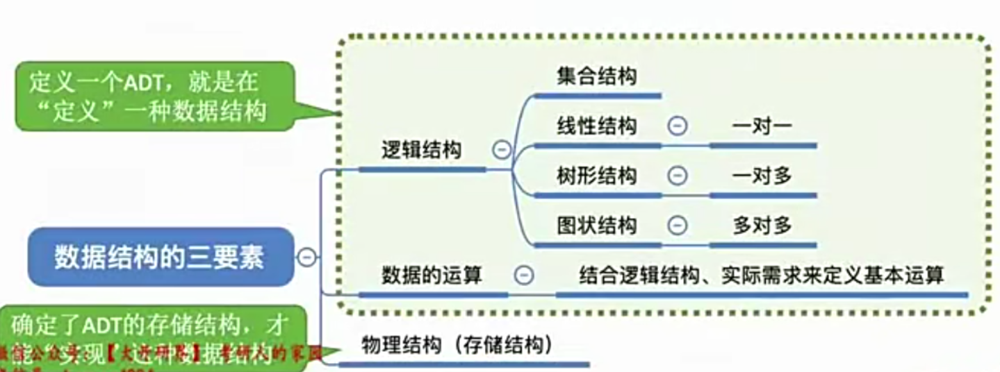
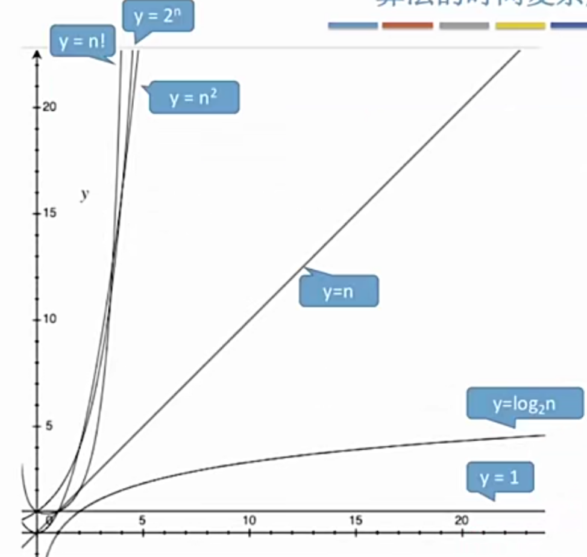

# 第一章

## 1.1 数据结构在学什么

- 如何用程序代码把现实世界的问题信息化
- 如何用计算机高效的处理这些信息从而创造价值


## 1.2 数据结构的基本概念

- 什么是数据？

画家用画笔描述世界，音乐家用音符描述世界，而计算机专业人员用数据描述世界。

数据：数据是**信息的载体**，是描述客观事物属性的数、字符及所有能输入到计算机中**并被计算机程序识别和处理（二进制0和1）**的符号的集合。数据是计算机程序加工的原料。

- 早期计算机处理的数据

世界上第一台通用计算机ENIAC，用于计算弹道轨迹等战争使用，**只用于计算处理纯数值型问题**。

- 现代计算机处理的数据

经常用于处理非数值型问题。

对于非数值型问题：我们关心每个个体的具体信息；关心个体之间的关系。

### 1.2.1 数据元素与数据项

数据元素：是数据的基本单位，通常作为一个整体进行考虑和处理

数据项：一个数据元素可以由若干个数据项组成，数据项是构成数据元素不可分割的最小单位。


**数据对象：**具有相同性质的数据元素的集合，是数据的一个子集。

**数据元素：**<font color=red>相互之间存在一种或多种特定关系的<b>数据元素</b>的集合。</font>


区别与联系：数据元素强调数据元素之间必须要有一定的关系，而数据对象强调数据元素之间只要有相同的性质就可以从属一个数据对象。同一个数据对象种的数据元素可以组成不同的数据结构，如线性结构、网状结构等。不同的数据元素也可以组成相同的数据结构。


由于各数据元素可以组成不同的数据结构，因此**数据结构这门课着重关注的是数据元素之间的关系，和对这些数据元素的操作。而不关心具体数据项的内容。**

## 1.3 数据结构的三要素


### 1.3.1 逻辑结构

数据元素之间有四种基本关系，分别为集合、线性、树形、图状。

408考试大纲中，集合的考纲已经删除，因此不需要过多学习。


### 1.3.2 数据的运算

针对某种逻辑结构，结合实际需求，定义基本运算。

比如，线性结构基本运算可以包含以下几个方面：

- 查找第i个数据元素
- 在第i个位置插入新的数据元素
- 删除第i个位置的数据元素

### 1.3.3 物理结构

如何用计算机表示数据元素的逻辑关系，即如何在计算机中实现逻辑结构中定义的几种数据结构。

数据的存储结构：

- 顺序存储
- 链式存储
- 索引存储
- 散列存储

下面以线性结构为例，分别表示四种存储结构的实现。

#### 1.3.3.1 顺序存储

> **逻辑上相邻的数据元素（因为是线性结构），存储在物理位置上也相邻的存储单元中。**元素之间的关系由存储单元的邻接关系来体现。


#### 1.3.3.2 链式存储

> **逻辑上相邻的数据元素在物理位置上可以不相邻**，借助指示元素存储地址的指针来表示元素之间的逻辑关系。


#### 1.3.3.3 索引存储

> 在物理内存中存储元素信息的同时，还建立附加的索引表。索引表中的每项称为索引项，索引项一般形式是（关键字，地址）


#### 1.3.3.4 散列存储

> 根据元素的关键字直接计算出该元素在物理内存中的存储地址，又称哈希（Hash）存储。


### 1.3.4 存储结构特点


- 若采用顺序存储，则各个数据元素在物理上必须是连续的；若采用非顺序存储，则各个数据元素在物理上是可以离散的。如果在物理内存上找不到一块连续的地址空间，则就没法完成顺序存储。而非顺序存储则无需考虑此类问题。
- 数据的存储结构会影响存储空间分配的方便程度。
- 数据的存储结构会影响对数据运算的速度。如：对于数据元素a、c、d、e，以顺序存储形式存于内存中，若要在ac之间插入数据f，则必须先把de向后移动。

**运算的定义是针对逻辑结构的**，指出运算的功能；**运算的实现（即代码实现）是针对存储结构的**，指出运算的具体操作步骤。

### 1.3.5 数据类型和抽象数据类型

数据类型是一个值的集合和定义在此集合上的一组操作的总称。包括原子类型和结构类型：

- 原子类型：其值不可再分的数据类型。比如bool（布尔类型）、int类型
- 结构类型：其值可以再分解为若干成分（分量）的数据类型。比如下面的结构：

```c
struct Coordinate{
int x;
int y;
};
```

抽象数据类型（ADT）：是抽象数据组织及与之相关的操作。




### 总结


## 1.4 算法的概念

### 1.4.1 什么是算法

> **程序=数据结构+算法**
>
> 数据结构：如何用数据正确的描述现实世界的问题，并存入计算机。
>
> 算法：如何高效的处理这些数据，以解决实际问题。是求解问题的步骤。

算法：是**<font color=red>对特定问题求解步骤的一中描述</font>**，它是指令的有限序列，其中每条指令表示一个或多个操作。

以制作西红柿炒鸡蛋为例：


其中数据结构对应的就是食材，算法对应的就是制作西红柿炒鸡蛋的步骤。

现在有以下需求：实现对下列任务按年龄从小到大排序的算法，下面五个元素呈线性关系。


算法：将该线性表按照年龄递增排序

- Step1：扫描5个元素，找到年龄最小的一个元素，插入到第1个位置
- Step2：扫描剩下的4个元素，找到年龄最小的一个元素，插入到第2个位置
- Step3：扫描剩下的3个元素，找到年龄最小的一个元素，插入到第3个位置
- Step4：扫描剩下的2个元素，找到年龄最小的一个元素，插入到第4个位置


### 1.4.2 算法的特性

> 算法有五个特性：**<font color=red>有穷性、确定性、可行性、输入、输出</font>**
>
> 只要其中一个不满足，就不能称之为算法。

- 有穷性：一个算法必须总在执行有穷步之后结束，且每一步都可在有穷时间内完成。注：算法必须是有穷的，而程序可以是无穷的。比如微信，不关闭就不会结束，因此可以说它是一个程序而不是算法，又比如for循环也不是算法。
- 确定性：算法中每条指令必须有明确的含义，对于相同的输入只能得到相同的输出。一个算法的结果输出必须确定。
- 可行性：算法中描述的操作都可以通过已经实现的基本运算执行有限次来实现。（说白了就是给出的算法能够用计算机代码来实现）
- 输入：一个算法有零个或多个输入，这些输入取自于某个特定的对象的集合。
- 输出：一个算法有一个或多个输出，这些输出是与输入有着某种特定关系的量。

### 1.4.3 好算法的特质

> 一个好的算法要具备：**<font color=red>正确性、可读性、健壮性、高效率和低存储量需求</font>**

- 正确性：算法能够正确的解决问题
- 可读性：算法应具有良好的可读性，以帮助人们理解
- 健壮性：输入非法数据时（比如年龄为负），算法能够适当的做出反应或进行处理，而不会产生莫名奇妙的输出结果。
- 高效率和低存储量需求：高效率指执行算法时电脑花的时间少（对应于时间复杂度），低存储量指执行算法时不费电脑内存（对应于空间复杂度低）

### 总结


## 1.5 算法的时间复杂度

### 1.5.1 事后估计运行时间的缺点

如果让算法先运行，**<font color=red>事后统计</font>**运行时间的话会存在什么问题？

- 与机器性能有关，如：超级计算机vs单片机
- 和编程语言有关，越高级的语言执行效率越低（如java>C）
- 和编译程序产生的机器指令质量有关
- 有些算法不能事后再统计的，如导弹控制算法

### 1.5.2 采用时间复杂度事先估计

通过分析**<font color=red>算法的时间复杂度</font>**，来评估算法的时间开销。

事前预估算法时间开销T(n)与问题规模n的关系（T表示time）

举个时间复杂度计算的例子：


如何计算代码的时间复杂度？


代码段中问题规模n=3000，所以：T(3000)=1+3001+2*3000+1

时间开销与问题规模n的关系表达式可以表示为：**<font color=red>T(n)=3n+3</font>**

**基于上述引出如下两个问题：**

- 问题1：是否可以忽略表达式的某一部分？

- 问题2：如果有好几千行代码，按这种方法需要一行一行读？

### 1.5.3 时间复杂度计算方式

#### 1.5.3.1 如何简化表达式

时间开销与问题规模n的关系


对于上述各时间复杂度，可以忽略掉表达式的某些部分，即转换成：

> T1（n）=3n
>
> T2(n)=n*n
>
> T3(n)=n* n *n

结论：可以只考虑阶数高的部分


- 加法规则：

> **多项相加，只保留最高阶的项，且系数变为1**


- 乘法规则：

> 多项相乘，都保留


各阶数大小排序（重点记忆）：




记忆口诀：**<font color=red>常对幂指阶</font>**

#### 1.5.3.2 代码量过多该如何计算

通过对上述如何简化时间复杂度表达式的研究，发现只需要保留最高阶的项以及使最高阶的项系数等于1即可，因此可以根据此对代码量多的算法，计算其时间复杂度。

**<font color=red>结论1：顺序执行的代码只会影响常数项，可以忽略</font>**

**<font color=red>结论2：只需要挑循环中的一个基本操作分析它的执行次数与n的关系即可。</font>**

**<font color=red>结论3：如果有多层嵌套循环，只需要关注最深处循环循环了几次。</font>**

- 例子1（嵌套循环）：


- 例子2：


- 例子3：


由于n的位置不确定，因此算法的时间复杂度也不确定，需要分情况讨论：

- 最好情况：元素n在数组的第一个位置上--最好时间复杂度为T(n)=O(1)
- 最坏情况：元素n在数组的最后一个位置上--最坏时间复杂度为T(n)=O(n)
- 平均情况：假设n在任意一个位置上的概率相同为1/n--平均时间复杂度为T(n)=O(n)

平均时间复杂度计算公式：


> 最坏时间复杂度：最坏情况下算法的时间复杂度（√）
>
> 平均时间复杂度：所有输入示例等概率出现的情况下，算法的期望运行时间（√）
>
> 最好时间复杂度：最好请款下算法的时间复杂度（× 一般不考虑）

### 1.5.4 总结


