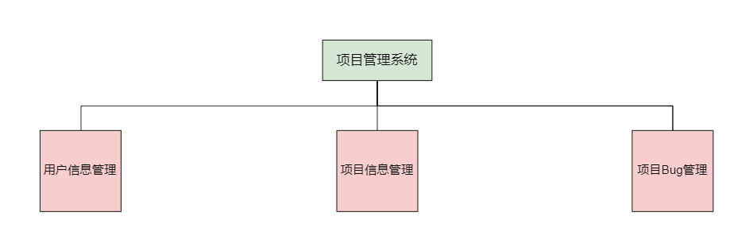

## 1. 项目介绍

项目名称：项目管理系统，是一个用于管理项目的项目，本项目的前后端均由我一人完成。用到的技术都是最底层技术，目的也是为了巩固基础知识，先把底层的原理学会，学透彻，将来学习框架才会更容易。

后续会学习Spring、Mybatis、SpringMVC、SpringBoot、Thymeleaf、微服务、Vue等，后期会使用新的技术对项目进行升级与完善。

### 1.1 项目说明

项目中用到的技术栈：JDBC+Servlet+JSP+MySQL+Maven

开发环境：

- Win10+JDK 1.8
- 数据库：MySQL 5.6
- 后端环境：JSP+Servlet+JDBC
- 前端环境：HTML+CSS+JS+JQuery
- 运行环境：Tomcat
- 开发工具：VScode+IDEA

### 1.2 时间安排

- 第一周：使用原生的Html、CSS、JS完成所有前端页面
- 第二周：使用Java+Servlet+Maven+JSP+JDBC完成所有后端业务

## 2. 系统分析

所谓项目管理系统，就是管理项目的系统，由于本人有归纳的爱好，所有的东西都想要整理归纳好，所以突发奇想做出这个项目，同时也是自己的练手项目，巩固之前学习的所有知识，将学的所有知识整合到一起。

### 2.1 需求分析



从需求分析上看，整个项目很简单，分为用户信息管理、项目信息管理、项目Bug管理三个需求，这些功能都是在用户注册登录的基础上才能实现的，但是目前该项目不打算开放注册，仅供自己使用。在这三个功能的基础上还会再新增一些其他功能用于丰富整个项目。

### 2.2 角色分析


这是一个简单的项目，简单到项目中的角色只有一种，所有用户都是自己项目的管理员，用户登录之后即可修改个人信息、添加项目、删除项目、搜索项目、修改项目信息、新增Bug、修改Bug、删除Bug。另外，还会提供给用户登出功能。

后期如果学到新的技术、或者产生新的想法会再加入一些功能，完善整个项目，目前由于是练手项目，所以暂时只实现了这几个功能。

## 3. 系统设计

### 3.1 系统概述


项目共分为三大模块，各模块概述如下：

- 用户管理：用户登录系统之后，可以对自己的个人信息进行修改，具体的修改内容有：用户名、密码、头像（不确定有没有），还可以执行系统登出。
- 项目管理：用户登录系统之后，可以添加项目、删除项目、修改项目、查找项目，修改项目时可修改的项目信息有：项目名称、项目技术栈、项目上线地址（选填）、项目简介，开源与否（选填）、开源地址（选填）
- Bug管理：每个项目都避免不了存在Bug，在每个项目下面又提供了添加Bug、删除Bug、修改Bug的操作，修改Bug时可以修改的信息有：Bug简介、是否解决、解决方法

### 3.2 数据库设计

数据库project中有三张表：

- 用户表（User）：id、用户名、密码、头像URL、创建时间、更新时间、标识字段（标识是否注销）
- 项目表（project）：id、项目名称、项目介绍、用户id、项目线上地址、技术栈、开源与否、开源地址、创建时间、更新时间
- Bug表（bug）：id、Bug简介、是否解决、解决方法、创建时间、更新时间，项目id、用户id

表的创建如下：

用户表：

`delete_flag`字段标识注销标识字段，判断用户是否注销，注销为1，没注销为0.

```sql
-- 创建数据库
create database project;
drop table users;
-- 创建表
create table users(
id int primary key auto_increment comment '用户id',
username varchar(20) unique not null comment '用户名',
passwd varchar(25) not null comment '用户密码',
avatar_url varchar(255) default 'https://picsum.photos/id/289/500/500' comment '头像地址',
create_time timestamp default current_timestamp comment '创建时间',
update_time timestamp default current_timestamp on update current_timestamp comment '更新时间',
delete_flag int(2) default 0 comment '注销标识字段'
)charset utf8 engine innodb;

-- 添加两条数据
insert into users (username,passwd) values("南雨","123456");
insert into users (username,passwd) values("张三","123456");
```

项目表：

```sql
-- 创建项目表
drop table projects;
create table projects(
id int primary key auto_increment comment '项目id',
project_name varchar(255) unique not null comment '项目名称',
content longtext comment '项目简介',
online_url varchar(255) not null comment '项目地址',
skill_stack varchar(255) not null comment '技术栈',
open_source int(2) not null default 0 comment '是否开源',
source_url varchar(255) comment '开源地址',
user_id int not null comment '所属用户id',
create_time timestamp default current_timestamp comment '创建时间',
update_time timestamp default current_timestamp on update current_timestamp comment '更新时间',
foreign key(user_id) references users(id) on update cascade on delete cascade
)charset utf8 engine innodb;
```

Bug表

```sql
drop table bugs;
-- Bug表
create table bugs(
id int primary key auto_increment comment 'Bug id',
content longtext not null comment 'Bug简介',
solver_flag int(2) not null default 0 comment '是否解决',
solver_content longtext comment '解决方法',
user_id int not null comment '所属用户id',
project_id int not null comment '所属项目id',
create_time timestamp default current_timestamp comment '创建时间',
update_time timestamp default current_timestamp on update current_timestamp comment '更新时间',
foreign key(user_id) references users(id) on update cascade on delete cascade,
foreign key(project_id) references projects(id) on update cascade on delete cascade
)charset utf8 engine innodb;
```

### 3.3 界面设计


## 4. 系统实现

### 4.1 环境搭建


### 4.2 用户信息管理


### 4.3 项目管理


### 4.4 Bug管理
