# 1.1 BootStrap介绍

官网：[点击下载](https://getbootstrap.com/)

中文网：[点击下载](https://www.bootcss.com/)

Bootstrap是一套现成的CSS样式集合，是两个推特的员工干出来的。Bootstrap是最受欢迎的HTML、CSS和JS框架，用于开发响应式布局、移动设备优先的WEB项目。Bootstrap特别适合那种没有设计师的团队(甚至说没有前端的团队)，可以快速的出一个网页。

## 1.1.1 BootStrap特点

- 简洁、直观、强悍的前端开发框架，html、css、javascript工具集，让 web开发更速、简单。
- 基于html5、css3的bootstrap，具有大量的诱人特性：友好的学习曲线，卓越的兼容性，响应式设计，12列格网，样式向导文档。
- 自定义JQuery插件，完整的类库，bootstrap3基于Less，bootstrap4基于Sass的CSS预处理技术
- Bootstrap响应式布局设计；让一个网站可以兼容不同分辨率的设备。Bootstrap响应式布局设计，给用户提供更好的视觉使用体验。
- 丰富的组件

# 1.2 下载与使用

BootStrap源码下载：[点击下载](https://v3.bootcss.com/getting-started/)

下载之后将Bootstrap源码中的dist中的css和js文件拷贝到我们的项目中。

由于bootstrap的js需要依赖于jquery.js才能使用，所以项目中还要引用jquery.js。

JQuery官网：[点击进入](https://jquery.com/)

jquery.js下载：在下面url中替换成要下载的版本，进入页面页面后右键另存即可。

```apl
https://code.jquery.com/${jquery的版本}
https://code.jquery.com/jquery-3.4.1.js
```

基本模板：

- 在线引入：需要电脑联网才能使用

```html
<!doctype html>
<html lang="zh-CN">
  <head>
    <meta charset="utf-8">
    <meta http-equiv="X-UA-Compatible" content="IE=edge">
    <meta name="viewport" content="width=device-width, initial-scale=1">
    <!-- 上述3个meta标签*必须*放在最前面，任何其他内容都*必须*跟随其后！ -->
    <title>Bootstrap 101 Template</title>

    <!-- Bootstrap -->
    <link rel="stylesheet" href="https://stackpath.bootstrapcdn.com/bootstrap/3.4.1/css/bootstrap.min.css" integrity="sha384-HSMxcRTRxnN+Bdg0JdbxYKrThecOKuH5zCYotlSAcp1+c8xmyTe9GYg1l9a69psu" crossorigin="anonymous">

    <!-- HTML5 shim 和 Respond.js 是为了让 IE8 支持 HTML5 元素和媒体查询（media queries）功能 -->
    <!-- 警告：通过 file:// 协议（就是直接将 html 页面拖拽到浏览器中）访问页面时 Respond.js 不起作用 -->
    <!--[if lt IE 9]>
      <script src="https://cdn.jsdelivr.net/npm/html5shiv@3.7.3/dist/html5shiv.min.js"></script>
      <script src="https://cdn.jsdelivr.net/npm/respond.js@1.4.2/dest/respond.min.js"></script>
    <![endif]-->
  </head>
  <body>
    <h1>你好，世界！</h1>

    <!-- jQuery (Bootstrap 的所有 JavaScript 插件都依赖 jQuery，所以必须放在前边) -->
    <script src="https://cdn.jsdelivr.net/npm/jquery@1.12.4/dist/jquery.min.js" integrity="sha384-nvAa0+6Qg9clwYCGGPpDQLVpLNn0fRaROjHqs13t4Ggj3Ez50XnGQqc/r8MhnRDZ" crossorigin="anonymous"></script>
    <!-- 加载 Bootstrap 的所有 JavaScript 插件。你也可以根据需要只加载单个插件。 -->
    <script src="https://stackpath.bootstrapcdn.com/bootstrap/3.4.1/js/bootstrap.min.js" integrity="sha384-aJ21OjlMXNL5UyIl/XNwTMqvzeRMZH2w8c5cRVpzpU8Y5bApTppSuUkhZXN0VxHd" crossorigin="anonymous"></script>
  </body>
</html>
```

- 离线引入：需要把源码下载下来，拷贝到项目中才能使用（**常用**）

```html
<!doctype html>
<html lang="zh-CN">

<head>
    <meta charset="utf-8">
    <meta http-equiv="X-UA-Compatible" content="IE=edge">
    <meta name="viewport" content="width=device-width, initial-scale=1">
    <link rel="stylesheet" href="bootstrap/css/bootstrap.min.css">
    <title>Bootstrap测试</title>
</head>
<body>
    <h1>你好，世界！</h1>

    <!-- 引入jquery.js -->
    <script src="js/jquery-3.4.1.js"></script>
    <!-- 引入bootstrap.js -->
    <script src="bootstrap/js/bootstrap.js"></script>
</body>
</html>
```

如果只用到bootstrap的样式的话可以不用引入bootstrap.js和jquery.js，而只需要引入css即可，但如果需要使用其插件就需要引入。

- viewport cmeta>标记用于指定用户是否可以缩放Web页面
- width和height指令分别指定视区的逻辑宽度和高度。他们的值要么是以像素为单位的数字，要么是一个特殊的标记符号。
- width 指令使用device-width标记可以指示视区宽度应为设备的屏幕宽度。
- height指令使用device-height标记指示视区高度为设备的屏幕高度。
- initial-scale指令用于设置Web页面的初始缩放比例。默认的初始缩放比例值因智能手机浏览器的不同而有所差异。通常情况下设备会在浏览器中呈现出整个Web页面，设为1.0则将显示未经缩放的Web文档,


# 1.3 布局容器与栅格系统

## 1.3.1 布局容器

1. .container：用于固定宽度并支持响应式布局的容器

```html
 <!-- container布局容器 -->
 <div class="container" style="background-color: aquamarine;">
     固定布局，内容不会占满全屏，页面两端会有空白间距,并且是响应式布局
 </div>
```

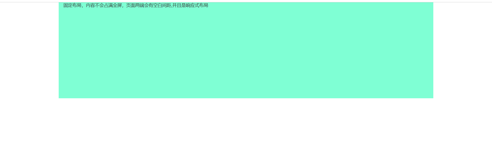

2. container-fluid：用于100%宽度布局，占据全部视口（viewport）的容器

```html
<!-- container-fluid布局容器 -->
<div class="container-fluid" style="background-color: plum;">
   会占据整个视口viewport，页面两端不会有空白间距
 </div>
```

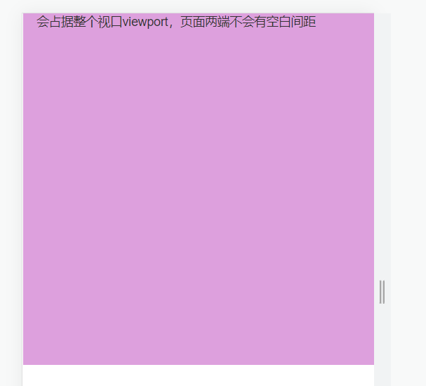

两种布局容器不能嵌套使用，但是同一种容器之间可以相互嵌套。

## 1.3.2 栅格系统

Bootstrap提供了一套响应式、移动设备优先的流式栅格系统，随着屏幕或视口(viewport)尺寸的增加，系统会自动分为最多**12列**。栅格系统用于通过一系列的行（row）)与列(column)的组合来创建页面布局，你的内容就可以放入这些创建好的布局中。

网格系统的实现原理非常简单，仅仅是通过定义容器大小，平分12份(也有平分成24份或32份，但12份是最常见的)，再调整内外边距，最后结合媒体查询，就制作出了强大的响应式网格系统。Bootstrap框架中的网格系统就是将容器平分成12份。

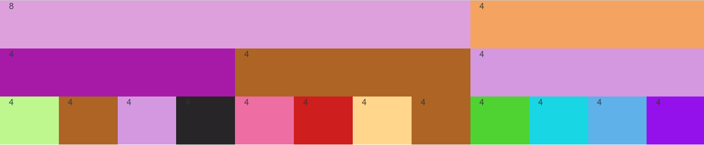

- 使用顺序应该是container->row->xs (xsmall phones)/sm (small tablets)/md (middle desktops)/lg (larger desktops)
- xs/sm/md/lg分别对应超小屏(自动)，小屏(750px)，中屏(970px)和大屏(1170px)，**<font color=red>几种样式可以同时使用，会根据屏幕大小响应式切换样式</font>**
- .row必须包含在容器.container中，以便为其赋予合适的对齐方式和内距(padding).
- .row中可以添加列.column，只有列column才可以作为行容器.row的直接子元素，但列数之和不能超过平分的总列数，比如12。如果大于12,则自动换到下一行。
- 具体内容应当放置在列容器(column)之内

### 1.3.2.1 列组合

总列数能超过12，超过12后会自动换行，是全部换行。

```html
<div class="container">
  <div class="row">
     <div class="col-md-8 col-lg-8" style="background-color: plum; height: 80px;">8</div>
     <div class="col-md-4 col-lg-4" style="background-color: sandybrown; height: 80px;">4</div>
  </div>
  <div class="row">
     <div class="col-md-4" style="background-color: rgb(167, 26, 167); height: 80px;">4</div>
     <div class="col-md-4" style="background-color: rgb(173, 100, 36); height: 80px;">4</div>
     <div class="col-md-4" style="background-color: rgb(212, 152, 224); height: 80px;">4</div>
   </div>
   <div class="row">
     <div class="col-md-1" style="background-color: rgba(161, 243, 94, 0.705); height: 80px;">4</div>
     <div class="col-md-1" style="background-color: rgb(173, 100, 36); height: 80px;">4</div>
     <div class="col-md-1" style="background-color: rgb(212, 152, 224); height: 80px;">4</div>
     <div class="col-md-1" style="background-color: rgb(39, 37, 39); height: 80px;">4</div>
     <div class="col-md-1" style="background-color: rgb(238, 109, 163); height: 80px;">4</div>
     <div class="col-md-1" style="background-color: rgb(206, 30, 30); height: 80px;">4</div>
     <div class="col-md-1" style="background-color: rgb(255, 214, 139); height: 80px;">4</div>
     <div class="col-md-1" style="background-color: rgb(173, 100, 36); height: 80px;">4</div>
     <div class="col-md-1" style="background-color: rgb(78, 211, 51); height: 80px;">4</div>
     <div class="col-md-1" style="background-color: rgb(24, 214, 228); height: 80px;">4</div>
     <div class="col-md-1" style="background-color: rgb(94, 177, 233); height: 80px;">4</div>
     <div class="col-md-1" style="background-color: rgb(149, 17, 236); height: 80px;">4</div>
   </div>
   <div class="row">
     <div class="col-md-4 col-xs-4" style="background-color: rgb(167, 26, 167); height: 80px;">4</div>
     <div class="col-md-4 col-xs-4" style="background-color: rgb(173, 100, 36); height: 80px;">4</div>
     <div class="col-md-4 col-xs-4" style="background-color: rgb(212, 152, 224); height: 80px;">4</div>
   </div>
</div>
```

如果总列数超过12了会自动换行

```html
<div class="container">
	<div class="row">
	   <div class="col-md-4 col-xs-4" style="background-color: rgb(235, 136, 22); height: 80px;">4</div>
	   <div class="col-md-4 col-xs-4" style="background-color: rgb(241, 35, 35); height: 80px;">4</div>
	   <div class="col-md-6 col-xs-4" style="background-color: rgb(152, 224, 184); height: 80px;">6</div>
	</div>
</div>
```

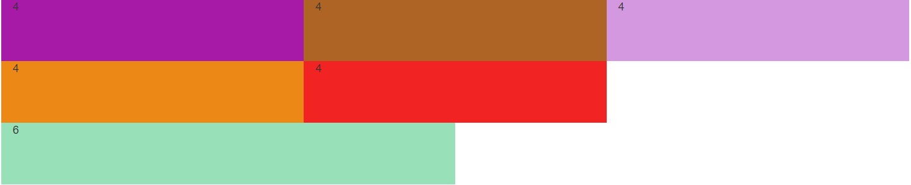

### 1.3.2.2 列偏移

如果我们不希望相邻的两个列紧靠在一起，但又不想使用margin或者其他的技术手段来。这个时候就可以使用列偏移(offset)功能来实现。使用列偏移也非常简单，只需要在列元素上添加类名`col-md-offset.*`(其中星号代表要偏移的列组合数)，那么具有这个类名的列就会向右偏移几个列数。例如，在列元素上添加`col-md-offset-8`
表示该列向右移动8个列的宽度(要保证列与偏移列的总数不超过12，不然会致列断，换行显示)。

```html
<div class="row">
	<!-- 列偏移 -->
	<div class="row">
	  <div class="col-md-4" style="background-color: rgb(235, 136, 22); height: 80px;">4</div>
	  <div class="col-md-4 col-md-offset-3" style="background-color: rgb(241, 35, 35); height: 80px;">4</div>
	</div>
</div>
```

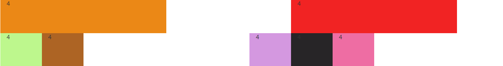

### 1.3.2.3 列排序

列排序其实就是改变列的方向，就是改变左右浮动，并且设置浮动的距离。在Bootstrap框架的网格系统中是通过添加类名`col-md-push-*`和`col-md-pull-*`(其中星号代表移动的列组合数)。往前pull，往后push,

```html
<div class="container">
	<!-- 列排序 -->
	<div class="row">
	   <div class="col-md-1 col-md-push-9" style="background-color: rgba(161, 243, 94, 0.705); height: 80px;">右移9格</div>
	   <div class="col-md-1" style="background-color: rgb(173, 100, 36); height: 80px;">4</div>
	   <div class="col-md-1  col-md-offset-4" style="background-color: rgb(212, 152, 224); height: 80px;">4</div>
	   <div class="col-md-1" style="background-color: rgb(39, 37, 39); height: 80px;">4</div>
	  <div class="col-md-1 col-md-pull-5" style="background-color: rgb(238, 109, 163); height: 80px;">左移5格</div>
	</div>
</div>
```

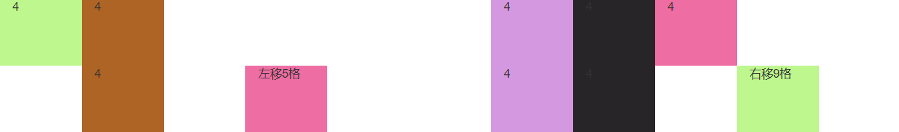

### 1.3.2.4 列嵌套

Bootstrap框架的网格系统还支持列的嵌套。可以在一个列中添加一个或者多个行row容器，然后在这个row中插入列。

```html
<div class="container">
	<div class="row">
	 <div class="col-md-4" style="background-color: rgba(161, 243, 94, 0.705); height: 80px;">
	     <!-- 嵌套一个row -->
	     <div class="col-md-7" style="background-color: red;">7</div>
	     <div class="col-md-5" style="background-color: blue;">5</div>
	 </div>
	 <div class="col-md-8" style="background-color: rgb(173, 100, 36); height: 80px;">
	     <div class="col-md-6" style="background-color: purple;">6</div>
	     <div class="col-md-6" style="background-color: yellow;">6</div>
	 </div>
	</div>
</div>
```

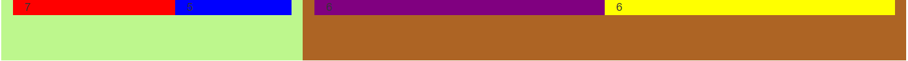


# 1.4 常用样式

## 1.4.1 排版

### 1.4.1.1 标题

Bootstrap和普通的HTML页面一样，定义标题都是使用标签<h1>到<h6>，只不过Bootstrap覆盖了其默认的样式。使用其在所有浏览器下显示的效果一样。

为了让非标题元素和标题使用相同的样式，还特意定义了.h1~.h6六个类名。同时后面可以紧跟着一行小的副标题<sma11></sma11>或使用.small

```html
<div class="container">
    <!-- 标题 -->
    <h2>二级标题：第一种形式</h2>
    <div class="h2">二级标题：第二种形式</div>

    <h2>二级标题：第一种形式，<small>副标题：第一种形式</small></h2>
    <div class="h2">二级标题：第二种形式，
        <span class="small">副标题：第二种形式</span>
    </div>
</div>
```


### 1.4.1.2 段落

通过.lead来突出强调内容，其主要是增大文本字号，加粗文本而且对行高和margin也做相应的处理。可以使用以下标签给文本做突出样式处理：

- <small>：小号字
- <b>/<strong>：加粗字体
- <i>/<em>：斜体

```html
<div class="container">
  <!-- 段落 -->
  <p class="lead">.lead的主要功能是增大文本字号，加粗文本而且对行高和margin也做相应的处理。</p>
  <p class="lead">现在的你，<small>一定</small>会<b>感激</b>现在<strong>努力</strong>的<i>自己。</i>，<em>加油</em></p>
</div>
```

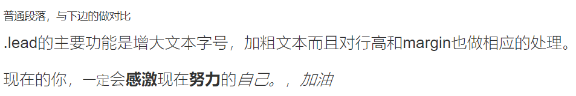

### 1.4.1.3 强调

定义了一套类名，这里称其为强调类名，这些强调类都是通过颜色来表示强调，具本说明如下:

- .text-muted：提示，使用浅灰色(#999)

- .text-primary：主要，使用蓝色(#428bca)

- .text-success：成功，使用浅绿色(#3c763d)

- .text-info：通知信息，使用浅蓝色(#31708f)

- .text-warning：警告，使用黄色(#8a6d3b)

- .text-danger：危险，使用褐色(#a94442)

```html
<!-- 强调 -->
<div class="text-muted">提示信息，使用浅灰色(#999)</div>
<div class="text-primary">提示信息，使用蓝色(#428bca)</div>
<div class="text-success">提示信息，使用浅绿色(#3c763d)</div>
<div class="text-info">提示信息，使用浅蓝色(#31708f)</div>
<div class="text-warning">提示信息，使用黄色(#8a6d3b)</div>
<div class="text-danger">提示信息，使用褐色(#a94442)</div>
```

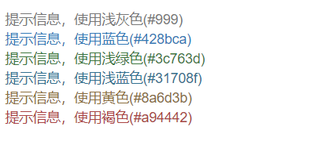

### 1.4.1.4 对齐

在CSS中常常使用text-align来实现文本的对齐风格的设置。其中主要有四种风格:

- 左对齐，取值left 
- 居中对齐，取值center
- 右对齐，取值right 
- 两端对齐，取值justify

为了简化操作，方便使用，Bootstrap通过定义四个类名来控制文本的对齐风格: 

- .text-left：左对齐
- .text-center：居中对齐
- .text-right：右对齐
- .text-justify：两端对齐。

```html
<div class="text-center" style="background-color: yellow;">居中</div>
<div class="text-left" style="background-color: antiquewhite;">左对齐</div>
<div class="text-right" style="background-color: aqua;">右对齐</div>
<div class="text-justify" style="background-color: rgb(238, 51, 51);">两端对齐</div>
```

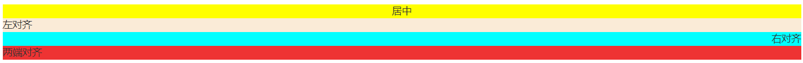

### 1.4.1.5 列表

HTML中的列表：

- 无序列表：(<ul><li>...</li></ul>)
- 有序列表：（<ol><li>...</li></ol>）
- 定义列表：（<dl><dt>...</dt><dd>...</dd></dl>）

```java
<ol>
    <li>无序列表</li>
    <li>无序列表</li>
    <li>无序列表</li>
</ol>
<ul>
    <li>无序列表</li>
    <li>无序列表</li>
    <li>无序列表</li>
</ul>
<dt>Html</dt>
<dd>超文本标记语言，学起来不难，用起来很棒</dd>
<dt>Java</dt>
<dd>编译型高级编程语言，知识体系很庞大，不是很好学</dd>
```

BootStrap中的列表：

- 去点列表：`class="list-unstyled"`

```html
<!-- 无序列表 -->
<div class="list-unstyled">
    <li>无序列表</li>
    <li>无序列表</li>
    <li>无序列表</li>
</div>
```

- 内联列表：`class="list-inline"`

```html
<!-- 内联列表 -->
<div class="list-inline">
    <li>无序列表</li>
    <li>无序列表</li>
    <li>无序列表</li>
</div>
```

- 自定义列表：`class="dl-horizontal"`

```html
<!-- 自定义列表 -->
<div class="dl-horizontal">
    <dt>Html</dt>
    <dd>超文本标记语言，学起来不难，用起来很棒</dd>
    <dt>Java</dt>
    <dd>编译型高级编程语言，知识体系很庞大，不是很好学</dd>
</div>
```


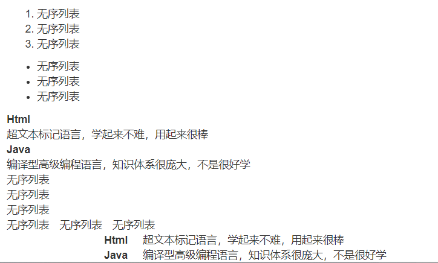

### 1.4.1.6 代码

在Bootstrap主要提供了三种代码风格：单行内联代码、多行代码、快捷键代码

- 使用<code></code>来显示单行内联代码

```html
 <!-- 单行内联代码 -->
 <p>单行内联代码演示：<code>a code</code></p>
```

- 使用<kbd>< /kbd>来显示用户输入代码,如快捷键

```html
<!-- 快捷键 -->
<p>快捷键：<kbd>ctrl+s</kbd>保存</p>
```

- 使用<pre></pre>来显示多行块代码

  样式:：pre-scrollable (height.max-height高度固定，为340px，超过存在滚动条)

```html
<!-- 多行代码 -->
<p>多行代码演示：</p>
<pre>
    public class HelloWorld{
        public static void main(String [] args){
            System.out.println("HelloWorld")
        }
    }
</pre>
```

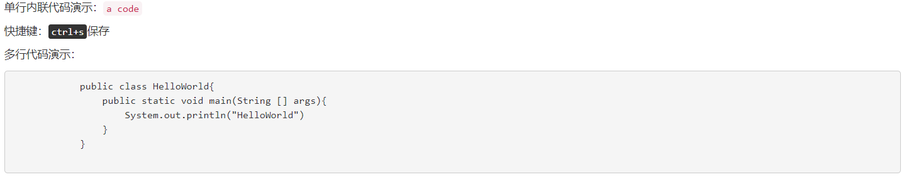

当内容长度超过指定值时，可以加个滚动条 

```html
<!-- 当内容长度超过指定值时，可以加个滚动条 -->
<pre class="pre-scrollable">
    <ol>
        <li>有序列表</li>
        <li>有序列表</li>
        <li>有序列表</li>
        <li>有序列表</li>
        <li>有序列表</li>
        <li>有序列表</li>
        <li>有序列表</li>
        <li>有序列表</li>
        <li>有序列表</li>
        <li>有序列表</li>
        <li>有序列表</li>
        <li>有序列表</li>
        <li>有序列表</li>
        <li>有序列表</li>
        <li>有序列表</li>
        <li>有序列表</li>
        <li>有序列表</li>
        <li>有序列表</li>
    </ol>
</pre>
```

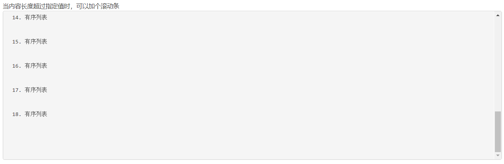

### 1.4.1.7 表格

Bootstrap为表格提供了**<font color=red>1种基础样式</font>**和**<font color=red>4种附加样式</font>**以及1个支持响应式的表格。在使用Bootstrap的表格中，只需要添加对应的类名就可以得到不同的表格风格：

- 基础样式：

1. .table：基础表格

- 附加样式：

1. .table-striped：斑马线表格
2. .table-bordered：带边框的表格
3. .table-hover：鼠标悬停高亮的表格
4. .table-condensed：紧凑型表格，单元格没内距或者内距较其他表格的内距小

- tr、th、td样式：

| 类       | 描述                             |
| -------- | -------------------------------- |
| .actice  | 将悬停的颜色应用在行或者单元格上 |
| .sucsess | 表示成功的操作                   |
| .info    | 表示信息变化的操作               |
| .warning | 表示警告的操作                   |
| .danger  | 表示危险的操作                   |

```html
 <!-- 表格 -->
 <table class="table table-bordered table-striped table-hover table-condensed">
     <tr class="active">
         <th>Java</th>
         <th>数据库</th>
         <th>Python</th>
     </tr>
     <tr class="success">
         <td>JVM</td>
         <td>MySQL</td>
         <td>Flask</td>
     </tr>
     <tr class="info">
         <td>面向对象</td>
         <td>Redis</td>
         <td>数据分析</td>
     </tr>
     <tr class="warning">
         <td>JVM</td>
         <td>MySQL</td>
         <td>Flask</td>
     </tr>
     <tr class="danger">
         <td>面向对象</td>
         <td>Redis</td>
         <td>数据分析</td>
     </tr>
 </table>
```

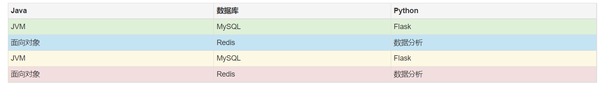

## 1.4.2 表单

表单主要功能是用来与用户做交流的一个网页控件，良好的表单设计能够让网页与用户更好的沟通。表单中常见的元素主要包括:文本输入框、下拉选择框、单选按钮、复选按钮、文本域和按钮等。

### 1.4.2.1 表单控件

- .form-control
- .input-lg：较大
- .input-sm：较小

.form-control是每一个表单控件必须要加的

1. 文本框input

```html
<div class="container">
    <div class="row">
        <div class="col-md-3">
            <!-- 表单 -->
            <input type="text" class="form-control" placeholder="普通"><br>
            <input type="text" class="form-control input-lg" placeholder="大型 "><br>
            <input type="text" class="form-control input-sm" placeholder="小型"><br>
        </div>
    </div>
</div>
```

2. 下拉复选框select

```html
<div class="container">
	<div class="row">
	    <div class="col-md-3">
	        <!-- 下拉选框 -->
	        <select class="form-control">
	            <option>请选择城市</option>
	            <option>上海</option>
	            <option>北京</option>
	            <option>浙江</option>
	        </select>
	        <br>
	        <hr>
	        <select class="form-control" multiple="multiple">
	            <option>请选择城市</option>
	            <option>上海</option>
	            <option>北京</option>
	            <option>浙江</option>
	        </select>
	    </div>
	</div>
</div>
```

3. 文本域textare

```html
<div class="container">        
   <div class="row">
    <div class="col-md-3">
           <!-- 文本域 -->
           <textarea class="form-control">
               
           </textarea>
       </div>
   </div>
</div>
```

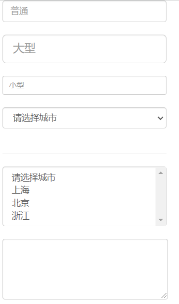

4. 复选框checkbox

垂直显示：.checkbox

水平显示：.chechbox-inline

```html
<div class="container"> 
	<div>
    <!-- 垂直显示 -->
    <div class="checkbox">
        <label> <input type="checkbox" name="sport">篮球</label>
    </div>
    <div class="checkbox">
        <label> <input type="checkbox" name="sport">乒乓球</label>
    </div>
</div>
<br>
	<div>
	    <!-- 水平显示 -->
	    <div class="checkbox-inline">
	        <label> <input type="checkbox" name="hobby">游戏</label>
	    </div>
	    <div class="checkbox-inline">
	        <label> <input type="checkbox" name="hobby">学习</label>
	    </div>
	</div>
</div>
```

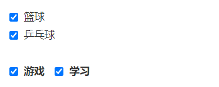

5. 单选框：.radio

```html
<div class="container">        
  <div>
      <div class="radio">
          <label><input type="radio" name="gender">男</label>
      </div>
      <div class="radio">
          <label><input type="radio" name="gender">女</label>
      </div>
  </div>
</div>
```

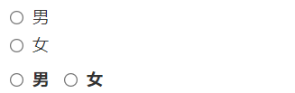

6. 按钮：.button

- 使用button实现

​	基础样式：.btn

​	附加样式：btn-primary btn-info btn-success btn-warning btn-danger btn-link btn-default

```html
<div class="container">
   <!-- 基础按钮 -->
   <button class="btn">普通按钮</button>
   <!-- 附加样式 -->
   <button class="btn btn-primary">基础按钮</button>
   <button class="btn btn-info">提示按钮</button>
   <button class="btn btn-warning">警告按钮</button>
   <button class="btn btn-danger">危险按钮</button>
   <button class="btn btn-link">链接按钮</button>
   <button class="btn btn-default">默认按钮</button>
</div>
```

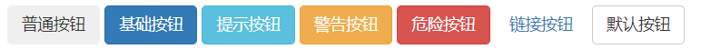

- 多标签支持：使用a、div等制作标签

```html
 <div class="container">
     <!-- 多标签支持 -->
     <div class="btn btn-info">div标签按钮</div>
     <span class="btn btn-primary">span标签按钮</span>
     <a class="btn btn-warning">a标签按钮</a>
 </div>
```


- 按钮大小

| 类名    | 说明     |
| ------- | -------- |
| .btn-xs | 超小按钮 |
| .btn-sm | 小型按钮 |
| .btn-lg | 超大按钮 |

```html
 <div class="container">
     <!-- 调整按钮大小 -->
     <button class="btn btn-primary btn-xs">超小按钮.btn-xs</button>
     <button class="btn btn-info btn-sm">小型按钮.btn-sm</button>
     <button class="btn btn-warning">正常按钮</button>
     <button class="btn btn-danger btn-lg">超大按钮.btn-lg</button>
 </div>
```

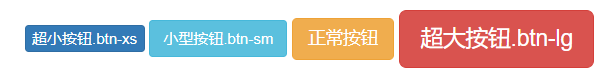

- 按钮禁用

**方式一：**添加disabled属性

```html
<div class="container">
    <!-- 禁用按钮 -->
    <button class="btn btn-danger" disabled="disabled">禁用按钮</button>
</div>
```

**方式二：**在元素标签中添加disabled类，**<font color=red>此方法只是在样式上禁用了，但实际上并没有禁用，可以通过JS或其他手段使用该按钮</font>**

```html
<div class="container">
    <!-- 禁用按钮 -->
    <button class="btn btn-info disabled">禁用按钮</button>
</div>
```

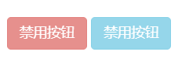

### 1.4.2.2 表单布局

基本的表单结构是Bootstrap自带的，个别的表单控件自动接收一些全局样式。下面列出了创建基本表单的步骤：

- <form元素添加role="form"
- 把标签和控件放在一个带有class.form-group的<div>中。这是获取最佳间距所必需的。
- 向所有的文本元素<input>、<textarea>和<select>添加class ="form-control"

#### 1.4.2.2.1 水平表单

同一行显示用.form-horizontal，配合BootStrap框架的网格系统

```html
<div class="container">
    <br>
    <!-- 水平布局form-horizontal，form标签中需要加role="form"属性-->
    <form action="" role="form" class="form-horizontal">
        <!-- 表单中的表单元素组,用div.form-group表示，一个div.form-group表示一个表单元素组-->
        <!-- 文本框 -->
        <div class="form-group">
            <label for="uname" class="control-label col-md-2">姓名</label>
            <div class="col-md-6">
                <input type="text" id="uname" class="form-control" placeholder="请输入用户名">
            </div>
        </div>
        <!-- 密码框 -->
        <div class="form-group">
            <label for="upwd" class="control-label col-md-2">密码</label>
            <div class="col-md-6">
                <input type="password" id="upwd" class="form-control" placeholder="请输入密码">
            </div>
        </div>
        <!-- 复选框 -->
        <div class="form-group">
            <label class="control-label col-md-2">爱好</label>
            <div class="col-md-8">
                <label class="checkbox-inline"> <input type="checkbox" name="sport">篮球</label>
                <label class="checkbox-inline"> <input type="checkbox" name="sport">乒乓球</label>
            </div>
        </div>
        <!-- 下拉框 -->
        <div class="form-group">
            <label class="control-label col-md-2">爱好</label>
            <div class="col-md-8">
                <select class="form-control">
                    <option>请选择城市</option>
                    <option>上海</option>
                    <option>北京</option>
                    <option>浙江</option>
                </select>
            </div>
        </div>
        <!-- 文本域 -->
        <div class="form-group">
            <label for="remark" class="control-label col-md-2">简介</label>
            <div class="col-md-8">
                <textarea id="remark" class="form-control"></textarea>
            </div>
        </div>
        <!-- 按钮 -->
        <div class="form-group">
            <div class="col-md-2  col-md-offset-5">
                <button class="btn btn-primary">提交</button>
            </div>
        </div>
    </form>
</div>

```

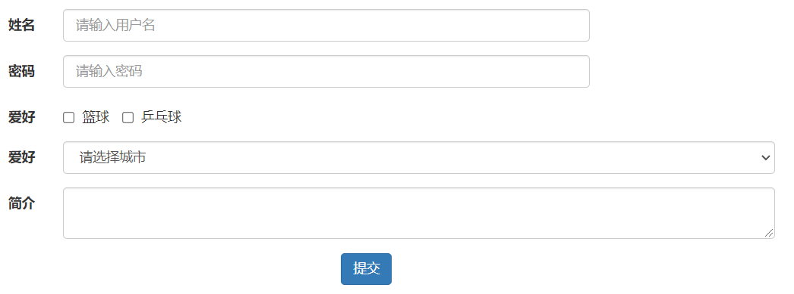

#### 1.4.2.2.2 内联表单

```html
 <div class="container">
     <!-- 内联级样式 -->
     <form class="form-inline">
         <div class="form-group">
             <label for="name">姓名</label>
             <input type="text" id="name" class="form-control" placeholder="请输入用户名" />
         </div>

         <div class="form-group">
             <label for="pawd">密码</label>
             <input type="password" id="pawd" class="form-control" placeholder="请输入密码" />
         </div>
         
         <div class="form-group">
             <button class="btn btn-primary">按钮</button>
         </div>
     </form>
 </div>
```

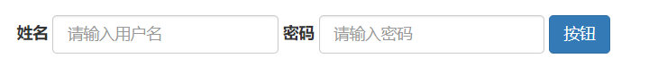

## 1.4.3 缩略图

缩略图在电商类的网站很常见，最常用的地方就是产品列表页面。缩略图的实现是配合网格系统一起使用。同时还可以让缩略图配合标题描述内容，按钮等。

```html
<div class="container">
    <br>
   <div class="row">
      <div class="col-md-3">
         <div class="thumbnail">
           
           <h3>天弘7号</h3>
           <p>来自于天弘星球，旁观者</p>
           <button class="btn btn-primary">
             <span class="glyphicon glyphicon-heart">喜欢</span>
           </button>
            <button class="btn btn-primary">
             <span class="glyphicon glyphicon-pencil">评论</span>
            </button>
         </div>
     </div>
	 <div class="col-md-3">
	     <div class="thumbnail">
	         
	                <h3>南雨</h3>
	                <p>出生于火星，保卫者</p>
	                <button class="btn btn-primary">
	                   <span class="glyphicon glyphicon-heart">喜欢</span>
	               </button>
	                <button class="btn btn-primary">
	                <span class="glyphicon glyphicon-pencil">评论</span>
	            </button>
	            </div>
	        </div>
	        <div class="col-md-3">
	            <div class="thumbnail">
	                
                    <h3>代号-Z</h3>
                    <p>来自于狮子座星云，侵略者</p>
                    <button class="btn btn-primary">
                       <span class="glyphicon glyphicon-heart">喜欢</span>
                   </button>
                    <button class="btn btn-primary">
                    <span class="glyphicon glyphicon-pencil">评论</span>
                </button>
                </div>
            </div>
            <div class="col-md-3">
                <div class="thumbnail">
                    
                    <h3>王五</h3>
                    <p>出生于金星，身份未知</p>
                    <button class="btn btn-primary">
                       <span class="glyphicon glyphicon-heart">喜欢</span>
                   </button>
                    <button class="btn btn-primary">
                    <span class="glyphicon glyphicon-pencil">评论</span>
                </button>
                </div>
            </div>
        </div>
    </div>
```


## 1.4.4 面板panel

默认的.panel组件所做的只是设置基本的边框(border）和内补(padding)来包含内容。

- panel-default：默认样式
- panel-heading：面板头
- panel-body：面板主体内容

```html
<div class="container">
        <br>
        <div class="panel panel-warning">
            <div class="panel-heading">
                明星合集
            </div>
            <div class="panel-body">
                <div class="row">
                    <div class="col-md-3">
                        <div class="thumbnail">
                            
                            <h3>天弘7号</h3>
                            <p>来自于天弘星球，旁观者</p>
                            <button class="btn btn-primary">
                               <span class="glyphicon glyphicon-heart">喜欢</span>
                           </button>
                            <button class="btn btn-primary">
                            <span class="glyphicon glyphicon-pencil">评论</span>
                        </button>
                        </div>
                    </div>
                    <div class="col-md-3">
                        <div class="thumbnail">
                            
                            <h3>南雨</h3>
                            <p>出生于火星，保卫者</p>
                            <button class="btn btn-primary">
                               <span class="glyphicon glyphicon-heart">喜欢</span>
                           </button>
                            <button class="btn btn-primary">
                            <span class="glyphicon glyphicon-pencil">评论</span>
                        </button>
                        </div>
                    </div>
                    <div class="col-md-3">
                        <div class="thumbnail">
                            
                            <h3>代号-Z</h3>
                            <p>来自于狮子座星云，侵略者</p>
                            <button class="btn btn-primary">
                               <span class="glyphicon glyphicon-heart">喜欢</span>
                           </button>
                            <button class="btn btn-primary">
                            <span class="glyphicon glyphicon-pencil">评论</span>
                        </button>
                        </div>
                    </div>
                    <div class="col-md-3">
                        <div class="thumbnail">
                            
                            <h3>王五</h3>
                            <p>出生于金星，身份未知</p>
                            <button class="btn btn-primary">
                               <span class="glyphicon glyphicon-heart">喜欢</span>
                           </button>
                            <button class="btn btn-primary">
                            <span class="glyphicon glyphicon-pencil">评论</span>
                        </button>
                        </div>
                    </div>
                </div>
            </div>
        </div>
    </div>
```

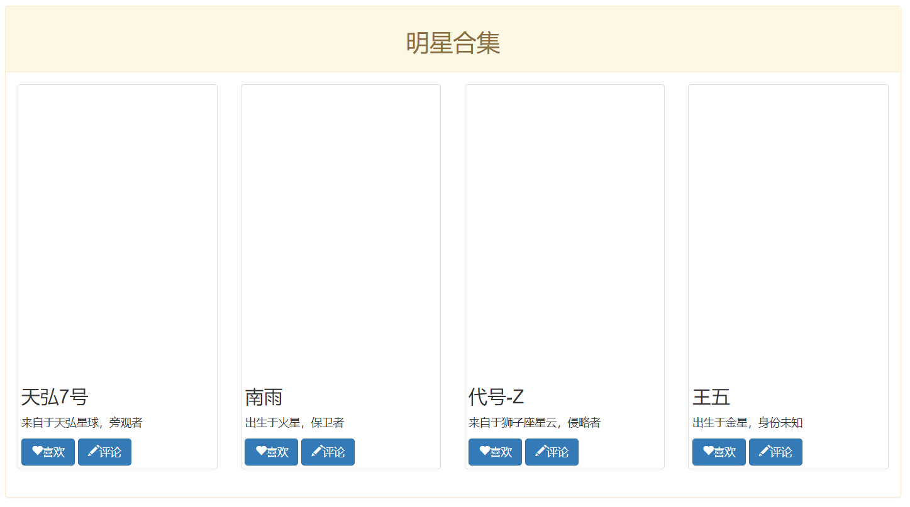

# 1.5 BootStrap

## 1.5.1 导航

使用下拉于按钮组合可以制作导航

要点：

> 1. 基本样式：.nav与".nav-tabs"、"nav-pills"组合制作导航
> 2. 分类：
>    - 标签型：nav-tabs导航
>    - 胶囊型：nav-pills导航
>    - 堆栈：nav-stacked导航
>    - 自适应：nav-justified导航，单独使用样式，不与nav一起使用，直接加入到ol、ul中即可，一般用于导航、主要起作用是告诉用户现在所处页面的位置。
>    - 状态：选中状态active；禁用状态disable
>    - 二级菜单

```html
 <div class="container">
     <p>标签式导航</p>
     <ul class="nav nav-tabs">
         <li class="active"><a href="#">Home</a> </li>
         <li><a href="#">SVN</a></li>
         <li><a href="#">IOS</a></li>
         <li><a href="#">Java</a></li>
         <li><a href="#">PHP</a></li>
     </ul>

     <br>
     <hr>

     <p>普通胶囊式导航</p>
     <ul class="nav nav-pills">
         <li><a href="#">Home</a> </li>
         <li><a href="#">SVN</a></li>
         <li class="active"><a href="#">IOS</a></li>
         <li><a href="#">Java</a></li>
         <li><a href="#">PHP</a></li>
     </ul>

     <br>
     <hr>

     <p>面包屑导航</p>
     <ul class="breadcrumb">
         <li><a href="#">Home</a> </li>
         <li><a href="#">SVN</a></li>
         <li><a href="#">IOS</a></li>
         <li><a href="#">Java</a></li>
         <li class="active"><a href="#">PHP</a></li>
     </ul>
 </div>
```

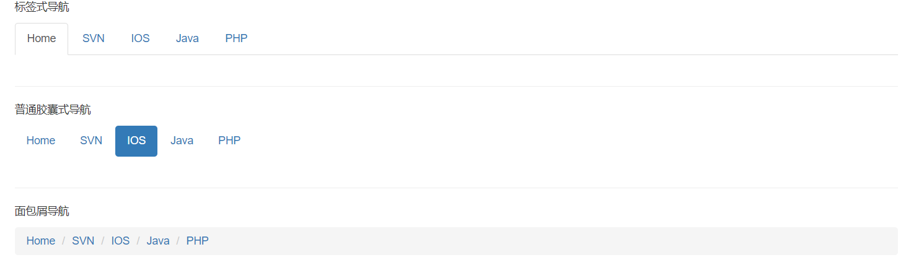

## 1.5.2 分页导航

分页随处可见，分为页码导航和翻页导航

页码导航：ul标签上加pagination [pagination-lg | pagination-sm]

翻页导航： ul标签上加pager

### 1.5.2.1 页码导航

```html
<div class="container">
    <p>页码导航</p>
    <ul class="pagination">
        <li><a href="#">&laquo;</a> </li>
        <li><a href="#">Home</a> </li>
        <li><a href="#">SVN</a></li>
        <li><a href="#">IOS</a></li>
        <li class="active"><a href="#">Java</a></li>
        <li><a href="#">PHP</a></li>
        <li><a href="#">&raquo;</a> </li>
    </ul>

    <p>翻页导航</p>
    <ul class="pager">
        <li><a href="#">上一页</a> </li>
        <li><a href="#">下一页</a></li>
    </ul>
</div>
```

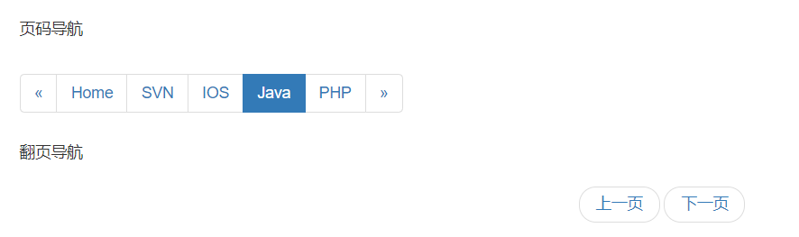

## 1.5.3 下拉菜单

在使用BootStrap框架的下拉菜单时，必须使用两个js

```html
<!-- 引入jquery.js -->
    <script src="js/jquery-3.4.1.js"></script>
<!-- 引入bootstrap.js -->
    <script src="bootstrap/js/bootstrap.js"></script>
```

使用要点：

- 使用一个类名为dropdown 或btn-group的div包裹整个下拉框:

```html
<div class="dropdown "></div>
```

- 默认向下dropdown。向上弹起加入`.dropup`即可

- 使用button作为父菜单，使用类名`.dropdown-toggle`和自定义`data-toggle`属性

```html
<button type="button" c1ass="btn btn-default dropdown-toggle" data-togg1e="dropdown"></button>
```

- 在button中使用font制作下拉箭头

```html
<span class="caret"></span>
```

- 下拉菜单项使用一个ul列表，并且定义一个类名为`.dropdown-menu`
- 分组分割线:<li>添加类名`.divider`来实现添加下拉分隔线的功能
- 分组标题：li添加类名`.dropdown-header`来实现分组的功能
- 对齐方式:
  - `dropdown-menu-left`左对齐默认样式
  - `dropdown-menu-right`右对齐

- 激活状态`.active`和禁用状态`.disabled`

```html
 <div class="container">
    <br>
    <div class="dropdown">
        <!-- 父菜单 -->
        <button type="button" class="btn btn-primary dropdown-toggle" data-toggle="dropdown">
            喜欢的视频
            <!-- 下拉图标 -->
            <span class="caret"></span>
        </button>
        <!-- 下拉菜单 -->
        <ul class="dropdown-menu">
            <!-- 下拉标题 -->
            <li class="dropdown-header">--搞笑--</li>
            <li><a href="#">脱口秀</a></li>
            <li><a href="#">德云社</a></li>
            <li><a href="#">极限挑战</a></li>
            <!-- 分割线 -->
            <li class="divider"></li>
            <li class="dropdown-header">--儿童--</li>
            <li><a href="#">大头儿子小头爸爸</a></li>
            <li><a href="#">喜羊羊与灰太狼</a></li>
            <!-- 禁用 -->
            <li class="disabled"><a href="#">哆啦A梦</a></li>
            <!-- 默认选择 -->
            <li class="active"><a href="#">开心超人</a></li>
        </ul>
    </div>
</div>
```

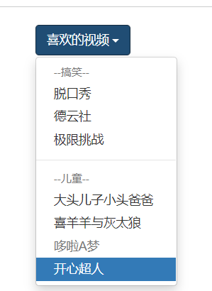

## 1.5.4 模态框

模态框(Modal）是覆盖在父窗体上的子窗体。通常，目的是显示来自一个单独的源的内容，可以在不离开父窗体的情况下有一些互动，子窗体可提供信息、交互等。

### 1.5.4.1 用法

两种使用方式，一种自动打开（通过属性），一种手动打开，通过JS

- 通过data属性：在控制器元素(比如按钮或者链接)上设置属性 data-toggle="modal"，同时设置data-
  target="#identifier"或href="#identifier"来指定要切换的特定的模态框(带有id="identifier")
- 通过JavaScript：使用下面这种技术，可以通过JavaScript来调用带有id="identifier"的模态框。

```html
$("#identifier").modal(option)
```

```html
    <div class="container">
        <br>
        <!-- 第一种打开模态框的方式 -->
        <!-- 按钮：用于打开模态框 -->
        <button type="button" class="btn btn-primary" data-toggle="modal" data-target="#myModal">
    自动打开模态框
  </button>

        <button type="button" class="btn btn-primary" id="btn">
    JS打开模态框
  </button>
        <!-- 模态框 -->
        <div class="modal fade" id="myModal">
            <div class="modal-dialog">
                <div class="modal-content">

                    <!-- 模态框头部 -->
                    <div class="modal-header">
                        <h4 class="modal-title">模态框头部</h4>
                        <button type="button" class="close" data-dismiss="modal">&times;</button>
                    </div>

                    <!-- 模态框主体 -->
                    <div class="modal-body">
                        模态框内容..
                    </div>

                    <!-- 模态框底部 -->
                    <div class="modal-footer">
                        <button type="button" class="btn btn-secondary" data-dismiss="modal">关闭</button>
                    </div>

                </div>
            </div>
        </div>
    </div>


    <script src="js/jquery-3.4.1.js"></script>
    <script src="bootstrap/js/bootstrap.js"></script>
    <script type="text/javascript">
        // 绑定点击按钮事件
        $('#btn').click(function() {
            // 手动打开模态框
            $("#myModal").modal("show");
        })
    </script>
```

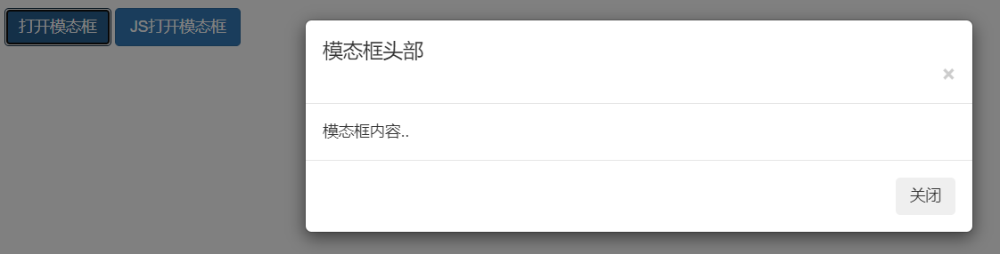
