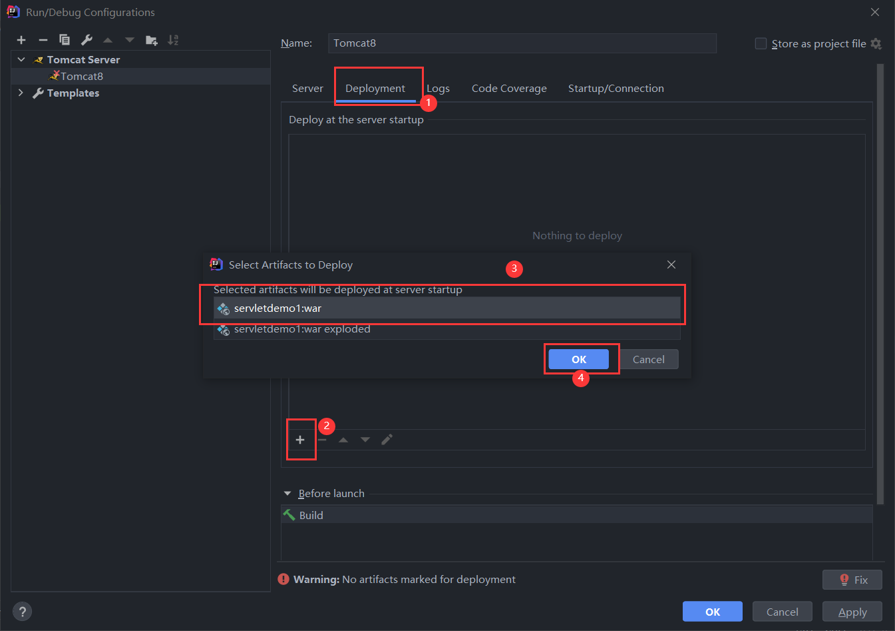
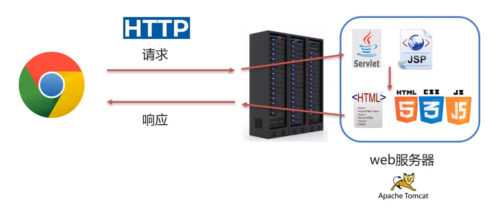
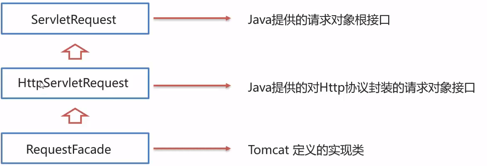
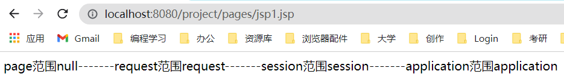

# 导言

这些笔记是JavaWeb基础知识必学部分，也是面试必问知识，学习了这些知识之后才能更好的学习基于此的框架（Spring、SpringBoot等）

JavaWeb三大组件：Servlet、Filter、Listener

# 1. JDBC

<hr>

> JDBC就是用Java语言操作关系型数据库的一套API

## 1.2 JDBC简介

基本概念：

全称：**Java DataBase Connectivity**，Java数据库连接

JDBC就是定义了一套能操作不同关系型数据库的接口，接口的实现类是由各个关系型数据库的公司实现的，这些实现类就是驱动。

**思考：为什么需要驱动？**

> 以关系型数据库为例，每个公司所使用的开发技术、开发环境、操作要求等是不同的，如MySQL、Oracle、MangoDB，用户使用这些关系型数据库时，需要用不同的技术或方式操作这些数据库，这就会给用户带来非常大的负担。所以为了简化用户负担，各软件厂商一般会提供对应的驱动，方便用户能用一套相同的方法操作不同厂商开发的软件。如各软件厂商会实现JDBC接口，以便一套接口可以同时对MySQL、Oracle、MangoDB等不同厂商开发的数据库操作，使方法具有通用性。


JDBC本质：

- 官方(sun公司)定义的一套操作**所有关系型数据库**的规则，即接口
- 各个数据库厂商去实现这套接口，提供数据库驱动jar包
- 我们可以使用这套接口(JDBC)编程，真正执行的代码是驱动jar包中的实现类

JDBC好处

- 各数据库厂商使用相同的接口，Java代码不需要针对不同数据库分别开发
- 可随时替换底层数据库，访问数据库的Java代码基本不变

## 1.3 JDBC快速入门

1. 创建工程，导入相应数据库的驱动Jar包（以Mysql为例）

` mysql-connector-java-5.1.48`

新建lib文件夹，将jar包拷贝至项目中。


然后右键点击**Add as Library**将jar包添加至项目


然后选择添加方式，三种添加方式分别对应全局添加、项目添加、模块添加，这里选择模块添加即可。


2. 注册驱动（采用了反射机制）

```java
//注册驱动
Class.forName("com.mysql.jdbc.Driver");
```

3. 获取连接

```java
//获取连接
String url="jdbc:mysql://127.0.0.1:3306/db2";
String username="root";
String password="123456";
Connection conn = DriverManager.getConnection(url, username, password);
```

4. 定义SQL语句

```java
//定义SQL语句
String sql="update jdbc set price=2000 where id=2";
```

5. 获取执行SQL对象

```java
//获取执行sql的对象
Statement state = conn.createStatement();
```

6. 执行SQL

```java
//执行sql语句,返回影响的行数
int count = state.executeUpdate(sql);
```

7. 处理返回结果

```java
//处理结果   1
System.out.println(count);
```

8. 释放资源

```java
//释放资源
state.close();
conn.close();
```


## 1.3 JDBC API详解

### 1.3.1 DriverManager

DriverManager驱动管理类的作用：

-  注册驱动
- 获取数据库连接

**功能一：注册驱动**

```java
//注册驱动
Class.forName("com.mysql.jdbc.Driver");
```

Driver类源码：

```java
public class Driver extends NonRegisteringDriver implements java.sql.Driver {
    public Driver() throws SQLException {
    }

    static {
        try {
            DriverManager.registerDriver(new Driver());
        } catch (SQLException var1) {
            throw new RuntimeException("Can't register driver!");
        }
    }
}
```

Driver类其实继承了NonRegisteringDriver类，类中实现了DriverManager注册驱动的静态代码块，即`DriverManager.registerDriver(new Driver())`部分代码。

我们每次使用`Class.forName("")`注册驱动时，会通过反射机制加载到Driver类，因为源码中注册驱动那部分代码被`static`所修饰，所以反射加载到Driver类时会自动加载到该部分代码，实现驱动注册。

**注意：**

- MySQL5之后的驱动包，可以省略注册驱动的步骤
- 自动加载jar包中的META-INF/services/java.sql.Driver文件中的驱动类

**功能二：获取数据库连接**

```java
Connection conn = DriverManager.getConnection(url, username, password);
```

参数说明：

url：表示要连接的数据库地址

```java
url="jdbc:mysql://数据库服务器地址/数据库名?参数1?参数2"
url="jdbc:mysql://127.0.0.1:3306/db2";
1. 如果连接的是本机的Mysql服务器，并且mysql默认端口是3306，则url可以简写为jdbc:mysql:///数据库名？键值对
2. 配置useSSL=false参数，禁用安全连接方式，解出警告提示
```

user：用户名

password：密码

```java
String url="jdbc:mysql:///db2?useSSL=false";
String username="root";
String password="123456";
Connection conn = DriverManager.getConnection(url, username, password);
```

### 1.3.2 Connection

Connection（数据库连接对象）作用：

- 获取执行SQL的对象
- 管理事务

**功能一：获取执行SQL的对象**

1. 普通执行SQL对象

```java
Statement state = conn.createStatement();
```

2. 预编译SQL的执行SQL对象，防止**<font color=red>SQL注入</font>**

```java
PreparedStatement pre = conn.prepareStatement(sql);
```

3. 执行存储过程的对象（不常用）

```java
CallableStatement call = conn.prepareCall(sql);
```

**功能二：事务管理**

1. MySQL事务管理

> 开启事务: BEGIN/START TRANSACTION
> 提交事务：COMMIT;
> 回滚事务：ROLLBACK;
>
> MySQL默认自动提交事务

JDBC事务管理：Connection中定义了三个对应的方法

> 开启事务：setAuto(boolean autoCommit)；值为true时自动提交事务，false时需手动提交
>
> 提交事务：commit（）
>
> 回滚事务：rollback（）

正常情况下手动提交事务

```java
public class JdbcDemo {
    public static void main(String[] args) throws Exception {

        //注册驱动
        Class.forName("com.mysql.jdbc.Driver");

        //获取连接
        String url = "jdbc:mysql:///db2?useSSL=false";
        String username = "root";
        String password = "123456";
        Connection conn = DriverManager.getConnection(url, username, password);
        
        //定义SQL语句
        String sql1 = "update jdbc set price=4000 where id=1";
        String sql2 = "update jdbc set price=7000 where id=2";
        
        //获取执行sql的对象
        Statement state = conn.createStatement();
        
        try {
            //开启事务
            conn.setAutoCommit(false);

            //执行sql1
            int count = state.executeUpdate(sql1);
            System.out.println(count);

            //执行sql2
            int count1 = state.executeUpdate(sql2);
            System.out.println(count1);

            //如果没有出现问题，则提交事务
            conn.commit();
        }catch(Exception e){
            //如果出现异常，则回滚事务
            conn.rollback();
            e.printStackTrace();
        }

        //释放资源
        state.close();
        conn.close();
    }
}
```

执行过程中出现异常，进行事务回滚，如下代码中，我在事务执行过程中加了一个`2/0`的除0异常，执行到此处时会捕获到该异常，执行事务回滚，因此数据库中的两条都被回滚到事务开始执行之前的状态，即数据都没有改变。

```java
public class JdbcDemo {
    public static void main(String[] args) throws Exception {

        //注册驱动
        Class.forName("com.mysql.jdbc.Driver");

        //获取连接
        String url = "jdbc:mysql:///db2?useSSL=false";
        String username = "root";
        String password = "123456";
        Connection conn = DriverManager.getConnection(url, username, password);

        //定义SQL语句
        String sql1 = "update jdbc set price=4000 where id=1";
        String sql2 = "update jdbc set price=7000 where id=2";


        //获取执行sql的对象
        Statement state = conn.createStatement();

        try {
            //开启事务
            conn.setAutoCommit(false);

            //执行sql1
            int count = state.executeUpdate(sql1);
            System.out.println(count);

            //增加一个异常项，使事务回滚
            int i=2/0;

            //执行sql2
            int count1 = state.executeUpdate(sql2);
            System.out.println(count1);

            //如果没有出现问题，则提交事务
            conn.commit();
        }catch(Exception e){
            //如果出现异常，则回滚事务
            conn.rollback();
            e.printStackTrace();
        }

        //释放资源
        state.close();
        conn.close();
    }
}
```

如果没有设置手动提交事务，则默认自动提交事务，每执行一条SQL语句会提交一个事务，如果两条语句中间出现异常则被执行过的SQL语句不会回滚。

```java
public class JdbcDemo {
    public static void main(String[] args) throws Exception {

        //注册驱动
        Class.forName("com.mysql.jdbc.Driver");

        //获取连接
        String url = "jdbc:mysql:///db2?useSSL=false";
        String username = "root";
        String password = "123456";
        Connection conn = DriverManager.getConnection(url, username, password);

        //定义SQL语句
        String sql1 = "update jdbc set price=3000 where id=1";
        String sql2 = "update jdbc set price=7000 where id=2";

        //获取执行sql的对象
        Statement state = conn.createStatement();


            //执行sql1
            int count = state.executeUpdate(sql1);
            System.out.println(count);

            //增加一个异常项
            int i=2/0;

            //执行sql2
            int count1 = state.executeUpdate(sql2);
            System.out.println(count1);

        //释放资源
        state.close();
        conn.close();
    }
}
```


### 1.3.3 Statement

Statement作用：

- 执行SQL语句

**执行SQL语句**

1. executeUpdate

DML语句：对**数据的增删改**操作

DDL语句：对**数据表和数据库的增删改查**操作

```java
int count = state.executeUpdate(sql)
```

返回值：（1）DML语句影响的行数（2）DDL语句执行后，执行成功也可能返回0

2. executeQuery

DQL语句：对**数据的查询**操作

```java
ResultSet resultSet = state.executeQuery(sql2);
```

返回值：ResultSet结果数据集对象

```java
public class JdbcDemo {
    public static void main(String[] args) throws Exception {

        //注册驱动
        Class.forName("com.mysql.jdbc.Driver");

        //获取连接
        String url = "jdbc:mysql:///db2?useSSL=false";
        String username = "root";
        String password = "123456";
        Connection conn = DriverManager.getConnection(url, username, password);

        //定义SQL语句
        String sql1 = "update jdbc set price=3000 where id=1";  // DML语句
        String sql2 = "create database db3;";  // DDL语句

        //获取执行sql的对象
        Statement state = conn.createStatement();
        
        //执行DML语句，返回受影响的行数
        int count = state.executeUpdate(sql1);
        System.out.println(count);

        // 执行DDL语句，执行成功返回的结果可能是0
        int i = state.executeUpdate(sql2);

        
        //释放资源
        state.close();
        conn.close();
    }
}
```


### 1.3.4 ResultSet

ResultSet作用：

- 封装DQL查询结果的语句

```java
ResultSet resultSet = state.executeQuery(sql3);
```

获取查询结果：

1. boolean next():（1）将光标从当前位置向前移动一行（2）判断当前行是否为有效行

   返回值：true：有效行，当前行有数据；false：无效行，当前行无数据

2. xxx getXxx(参数)：获取数据

   - xxx：数据类型，如int getInt(参数)；String getString(参数)
   - 参数：列的名称

使用步骤：

1. 游标向下移动一行，并判断该行是否有数据：next（）
2. 获取数据：getXxx（参数）

```java
// 循环判断游标是否是最后一行末尾
while(rs.next()){
	//获取数据
	rs.getXxx(参数);
}
```

```java
public class JdbcDemo {
    public static void main(String[] args) throws Exception {

        //注册驱动
        Class.forName("com.mysql.jdbc.Driver");

        //获取连接
        String url = "jdbc:mysql:///db2?useSSL=false";
        String username = "root";
        String password = "123456";
        Connection conn = DriverManager.getConnection(url, username, password);

        //定义SQL语句
        String sql3 = "select * from jdbc";  // DQL语句


        //获取执行sql的对象
        Statement state = conn.createStatement();

        //执行DQL语句，返回结果是一个ResultSet结果集
        ResultSet resultSet = state.executeQuery(sql3);

        //循环判断游标是否处于末尾
        while (resultSet.next()){
            // 获取数据
            // 第一列
            int id=resultSet.getInt(1);
            // 第二列
            int price=resultSet.getInt(2);
            System.out.println(id);
            System.out.println(price);
            System.out.println("------------");
        }


        //释放资源
        state.close();
        conn.close();
    }
}
```


ResultSet实例：查询Students表，将查询结果封装到Student对象中，最后保存到ArrayList数组中。


创建数据表：

```sql
create table students(
id int(10) primary key,
name varchar(20) not null,
class varchar(20) not null
)charset utf8;

insert into students values(1,"张三","软工1班"),(2,"李四","软工2班"),(3,"南雨","软工3班");
```


创建Student实体类

```java
package com.study.nanyu.jdbc.pojo;
public class Student {
     private int id;
     private String name;
     private String uclass;

     public int getId() {
          return id;
     }

     public void setId(int id) {
          this.id = id;
     }

     public String getName() {
          return name;
     }

     public void setName(String name) {
          this.name = name;
     }

     public String getUclass() {
          return uclass;
     }

     public void setUclass(String uclass) {
          this.uclass = uclass;
     }
    
     @Override
     public String toString() {
          return "Student{" +
                  "id=" + id +
                  ", name='" + name + '\'' +
                  ", uclass='" + uclass + '\'' +
                  '}';
     }
}
```

获取数据存入Student对象并存入数组。

```java
public class JdbcDemo {
    public static void main(String[] args) throws Exception {

        //注册驱动
        Class.forName("com.mysql.jdbc.Driver");

        //获取连接
        String url = "jdbc:mysql:///db2?useSSL=false";
        String username = "root";
        String password = "123456";
        Connection conn = DriverManager.getConnection(url, username, password);

        //创建一个列表
        List<Student> list=new ArrayList<>();

        String sql = "select * from students;";
        Statement state = conn.createStatement();
        ResultSet resultSet = state.executeQuery(sql);

        //获取数据并存入对象，最终保存至list列表
        while (resultSet.next()) {
         	//创建Student对象
        	 Student student = new Student();
            int id = resultSet.getInt(1);
            String name = resultSet.getString(2);
            String uclass = resultSet.getString(3);
            student.setId(id);
            student.setName(name);
            student.setUclass(uclass);
            list.add(student);
        }
        System.out.println(list);

        //释放资源
        resultSet.close();
        state.close();
        conn.close();
    }
}

//运行结果：[Student{id=1, name='张三', uclass='软工1班'}, Student{id=2, name='李四', uclass='软工2班'}, Student{id=3, name='南雨', uclass='软工3班'}]
```

### 1.3.5 PreparedStatement

PreparedStatement作用：

1. 预编译SQL语句并执行，**防止SQL注入问题**

**SQL注入**

SQL注入是通过操作输入事先定义好的SQL语句，用以达到执行代码对服务器进行攻击的方法。

最简单的一个例子：

比如下面一个登录案例，通过下面SQL语句查询用户输入的用户名和密码是否正确

```sql
select * from admin where username='"+name+"' and password='"password"';
```

使用一串简单的字符串就可以实现SQL注入。比如前端用户输入用户名和密码准备登录，这时后端会自动完成字符串的拼接

```sql
select * from admin where username="zhangsan" and password="123456";
```

这条语句非常简单，只需要满足where后面的` username="zhangsan" and password="123456";`为true即可实现登录，此时为用户名和密码都正确的正常情况。

但还有一种异常情况，如果仅仅满足where后面的条件为true即可登录成功，那么能不能有其他办法让where后面的条件恒为true。当然有，且很简单，在登录时只需要在密码框那里输入这样一串字符：`"or "1"="1`，这段字符串传到后端后，后端会进行如下处理：

```java
select * from admin where username="zhangsan" and password=""or "1"="1";
```

此时就会出现问题，仔细看where后面的条件语句`where username="zhangsan" and password=""or "1"="1";`，变成了先判断用户名和密码，因为输入密码时传递了一个字符串，与原有的字符串进行了拼接，导致`password`等于空，最后又拼接了一个`or "1"="1";`使得前面的用户名和密码无论输入的是否正确都会恒为true，最终都能成功登录。这就是SQL注入的原理。

其实出现这样的问题原因就在于字符串拼接，容易被别入非法修改，那么既然知道了问题所在，有没有解决办法呢？

**使用PrepareStatement对象解决SQL注入**

这种方法不再使用字符串拼接来，而是使用？作为占位符，后面再为此占位符赋值的操作

1. 获取PrepareStatement对象

```java
//SQL语句中的参数值，通过？占位符来代替
String sql = "select * from students where name=? and class=?;";
//通过Connection对象获取，并传入对应的sql语句
PreparedStatement preparedStatement = conn.prepareStatement(sql);
```

2. 设置参数

```java
PreapreStatement对象：setXxx(参数1，参数2)：给？赋值
Xxx：数据类型，如setInt(参数1，参数2)
参数：
参数1：？的位置编号，从1开始
参数2：？的值
```

3. 执行SQL

```java
executeUpdate();executeQuery();不需要传递SQL
```

```java
public class JdbcDemo {
    public static void main(String[] args) throws Exception {

        //注册驱动
        Class.forName("com.mysql.jdbc.Driver");

        //获取连接
        String url = "jdbc:mysql:///db2?useSSL=false";
        String username = "root";
        String password = "123456";
        Connection conn = DriverManager.getConnection(url, username, password);

        //模拟用户输入的用户名和密码
        String name="南雨";
        String uclass="软工1班";

        //创建sql，使用？作为参数的占位符
        String sql = "select * from students where name= ? and class= ?";
        //创建PreparedStatement对象，并执行SQl语句
        PreparedStatement preparedStatement = conn.prepareStatement(sql);

        //为SQL中的占位符赋值,第一个参数表示为第几个占位符赋值，第二个参数表示为该占位符赋什么值
        preparedStatement.setString(1,name);
        preparedStatement.setString(2,uclass);

        //执行SQL语句，不需要再传递SQL
        ResultSet resultSet = preparedStatement.executeQuery();

        if(resultSet.next()){
            System.out.println("成功！");
        }else {
            System.out.println("失败！");
        }

        //释放资源
        resultSet.close();
        preparedStatement.close();
        conn.close();
    }
}

```

PrepareStatement防止SQL注入其实是将敏感字符进行转义，比如**'**将会被转义为**\\'。**这样就避免了通过字符串拼接改变原有SQL语句的风险

**PrepareStatement原理：**

1. 在获取PrepareStatement对象时，先将sql语句发送给mysql服务器，先进行检查和编译（这些步骤很耗时），此时不执行
2. 后面在为sql语句中的占位符赋值或执行sql语句时，就不用再进行这些步骤了，会使速度更快
3. 如果sql模板一样，则只需进行一次检查和编译，会大大提高性能

### 1.3.6 MySQL日志配置

打开MySQL安装位置，打开该路径：**\ProgramData\MySQL Server 5.7**，找到该路径下MySQL核心配置文件my.ini，不同版本可能位置不一样。

打开该配置文件，将下面的配置粘贴到最后一行即可，下面配置里面的路径可自定义，输入之后保存即可。

```xml
# Mysql日志配置
log-output=FILE
general-log=1
general_log_file="D:\Appinstall\Mysql_log\mysql.log"
slow-query-log=1
slow_query_log_file="D:\Appinstall\Mysql_log\mysql_slow.log"
long_query_time=2
```

使用快捷键Win+R，输入cmd打开命令行，输入services.msc，找到MySQL，选中，点鼠标右键重启


重启之后到上面配置日志的路径下面查看是否有这两个日志文件生成


配置完成之后，每次执行SQL语句之后就会生成对应的日志，方便开发者查看和排错。


## 1.4 数据库连接池

### 1.4.1 数据库连接池简介

- 数据库连接池是个容器，负责**<font color="red">分配、管理</font>**数据库的连接（Connection）
- 它允许应用程序重复使用一个现有的数据库连接，而不是再重新建立一个
- 可以避免因为没有释放数据库连接而引起的数据库连接遗漏。
- 好处：
  - 资源重用，使用完先不关闭连接，可以被反复使用
  - 提升系统响应速度，提前申请连接，使用完了也不关闭，减少开销
  - 避免数据库连接遗漏，会自动对占着但不使用的连接重新分配

使用数据库连接池与不使用的两种情况：

1. 不使用数据库连接池

这种情况下当一个用户访问数据时会建立一个Connection连接，连接结束之后会释放该连接；如果此时又来一个用户则又需要建立一个连接，然后再释放；如果一直又新用户访问数据库则需要不停重复的创建数据库连接，然后关闭。这样做有很多缺点，首先是复用性太差，第二是资源消耗过大，**数据库连接的创建与释放都会消耗资源。**


2. 使用数据库连接池

在系统启动之前，会初始化一个容器（集合），在该容器中提前申请多个创建好的数据库连接，当有用户请求数据库连接时，会先从连接池中取出一个数据库连接分配个该用户，当用户执行完毕之后，该连接不会释放掉，而是会放回连接池中，供下一个用户使用。如果用户请求的连接数量大于连接池中的连接数量，则为了避免连接被遗漏，连接池还会检查已分配出去的连接，判断是否有用户占着资源而不使用，发现之后便会取消该连接，分配给其他请求。


总结来说，数据库连接池的作用就是实现对数据库连接的分配与管理，即能解决对连接的分配，又能解决对用户连接的管理。

### 1.4.2 数据库连接池实现

- 标准接口：DataSource
  - 官方（SUN公司）提供的数据库连接池标准接口，由第三方组织实现此接口
  - 功能：获取连接`Connection getConnection`
- 常见的数据库连接池：
  - DBCP
  - C3P0
  - Druid

- Druid（德鲁伊）：
  - Druid连接池是阿里巴巴开源的数据库连接池项目
  - 功能强大，性能优秀，是java语言最好的数据库连接池之一

### 1.4.3 Druid使用步骤

- 导入jar包，druid-1.1.10.jar
- 定义配置文件
- 加载配置文件
- 获取数据库连接池对象
- 获取连接

```java
package com.study.nanyu.jdbc;

import com.alibaba.druid.pool.DruidDataSource;
import com.alibaba.druid.pool.DruidDataSourceFactory;
import com.study.nanyu.jdbc.pojo.Student;

import javax.sql.DataSource;
import java.io.FileInputStream;
import java.sql.Connection;
import java.sql.PreparedStatement;
import java.sql.ResultSet;
import java.util.Properties;

/**
 * Druid数据库连接池
 */
public class DruidDemo {

    public static void main(String[] args) throws Exception {

        Integer id = 2;
        Student student = new Student();
        //1. 导入jar包

        //2. 定义配置文件

        //3. 加载配置文件
        Properties prop = new Properties();
        prop.load(new FileInputStream("D:/Appinstall/Idea/Project/Project01/src/druid.properties"));


        //4. 创建DataSource对象
        DataSource dataSource = DruidDataSourceFactory.createDataSource(prop);
        //5. 获取连接
        Connection conn = dataSource.getConnection();

        // 定义SQL
        String sql = "select * from students where id= ?";

        // 创建sql对象
        PreparedStatement preparedStatement = conn.prepareStatement(sql);
        preparedStatement.setInt(1, id);

        // 执行SQL
        ResultSet resultSet = preparedStatement.executeQuery();

        while (resultSet.next()) {
            int id1 = resultSet.getInt("id");
            String uname = resultSet.getString("uname");
            String uclass = resultSet.getString("uclass");
            student.setId(id1);
            student.setName(uname);
            student.setUclass(uclass);
        }
        System.out.println(student);
    }
}
```


# 2. Mybatis

Mybatis是一款优秀的**持久层**框架，用于简化JDBC开发，它的官网非常的友好，讲解也很详细：[Mybatis官网](https://mybatis.org/mybatis-3/zh/index.html)

**持久层：**

- 负责将数据保存到数据库的那一层代码
- JavaEE三层架构：表现层、业务层、持久层

**框架：**

- 框架是一个半成品的软件，是一套可重用的、通用的、软件基础代码模型
- 在框架基础上构建软件编写更加高效、规范、通用、可扩展

为什么会有Mybatis？

JDBC有以下缺点：

1. 硬编码：注册驱动、获取连接、SQL语句都要写死
2. 操作繁琐：需要手动设置参数，手动封装结果集

使用Mybatis有以下优点：

1. 使用配置文件的方式编写驱动注册、获取连接等操作
2. Mybatis可以自动实现对查询结果集的封装、参数的设置Mybatis也会自动完成。

Mybatis免除了几乎所有的JDBC代码，以及设置参数和获取结果的工作。

## 2.1 Mybatis快速入门

查询Student表中的数据为例，实现步骤如下：

1. 创建Student表，添加数据
2. 创建模块，导入坐标（即pom文件）
3. 编写Mybatis核心配置文件，替换连接信息，解决硬编码问题
4. 编写SQL映射文件，统一管理SQL语句，解决硬编码问题
5. 编码
   - 定义POJO类
   - 加载核心配置文件，获取SqlSessionFactory对象
   - 获取SqlSession对象，执行SQL语句
   - 释放资源

案例实操：

1. 在pom.xml中引入基本的依赖

引入基本的Mybatis和Mysql驱动的依赖即可。

```xml
<!--Mybatis依赖-->
<dependency>
    <groupId>org.mybatis</groupId>
    <artifactId>mybatis-spring</artifactId>
    <version>2.0.6</version>
</dependency>
<!--引入Mysql依赖-->
<dependency>
    <groupId>mysql</groupId>
    <artifactId>mysql-connector-java</artifactId>
    <version>5.1.49</version>
</dependency>
```

2. 创建实体类

该实体类与数据库中的students表相对应。

```java
package com.nanyu.pojo;

public class Student {

    private int id;
    private String uname;
    private String uclass;
    
    //省去了Get、Set以及toString方法
}
```

3. 创建Mybatis配置文件

该文件中配置了数据库的连接信息，以及各实体类对应的Mapper映射文件的路径

```xml
<?xml version="1.0" encoding="UTF-8" ?>
<!DOCTYPE configuration
        PUBLIC "-//mybatis.org//DTD Config 3.0//EN"
        "http://mybatis.org/dtd/mybatis-3-config.dtd">
<configuration>
    <environments default="development">
        <environment id="development">
            <transactionManager type="JDBC"/>
            <dataSource type="POOLED">
<!--                数据库连接信息-->
                <property name="driver" value="com.mysql.jdbc.Driver"/>
                <property name="url" value="jdbc:mysql:///db2?useSSL=false"/>
                <property name="username" value="root"/>
                <property name="password" value="123456"/>
            </dataSource>
        </environment>
    </environments>
    <mappers>
<!--        加载SQL映射文件-->
        <mapper resource="StudentMapper.xml"/>
    </mappers>
</configuration>
```

4. 创建StudentMapper.xml配置文件

该文件用于映射对students表操作的SQL语句。

`namespace`为命名空间，类似包名，即指定SQL语句属于哪一个命名空间下，用于辨别其他Mapper中的可能存在的相同SQL语句。

每一条SQL语句需要放在对应的标签中，主要标签有`select、insert、update、delete`等，每一条SQL语句存在一个唯一的id，用于辨别不同的SQL语句。

```xml
<?xml version="1.0" encoding="UTF-8" ?>
<!DOCTYPE mapper
        PUBLIC "-//mybatis.org//DTD Mapper 3.0//EN"
        "http://mybatis.org/dtd/mybatis-3-mapper.dtd">
<!--命名空间-->
<mapper namespace="test">
    <!--所属id，此id为唯一标识-->
    <select id="selectALL" resultType="com.nanyu.pojo.Student">
        select * from students;
    </select>
</mapper>
```

5. 创建测试类

获取到sqlSession对象后，只需要使用sqlSession执行对应的方法即可，方法中传入命名空间和SQL的id。

```java
package com.nanyu;

import com.nanyu.pojo.Student;
import org.apache.ibatis.io.Resources;
import org.apache.ibatis.session.SqlSession;
import org.apache.ibatis.session.SqlSessionFactory;
import org.apache.ibatis.session.SqlSessionFactoryBuilder;

import java.io.IOException;
import java.io.InputStream;
import java.util.List;

/**
 * Mybatis快速入门
 */
public class MybatisDemo {
    public static void main(String[] args) throws IOException {
        // 加载Mybatis核心配置文件，获取SqlSessionFactory对象
        String resource = "mybatis-config.xml";
        InputStream inputStream = Resources.getResourceAsStream(resource);
        SqlSessionFactory sqlSessionFactory = new SqlSessionFactoryBuilder().build(inputStream);

        //获取SqlSession对象，执行SQL
        SqlSession sqlSession = sqlSessionFactory.openSession();

        //执行Sql，传入SQL 的id
        List<Student> students = sqlSession.selectList("test.selectALL");

        System.out.println(students);

        //释放资源
        sqlSession.close();
    }

}
```

不过在上面的编码中仍然存在硬编码问题，比如在执行SQL时，需要传入命名空间和ID。因此，Mybatis推荐我们使用Mapper代理开发解决这一问题。

## 2.2 Mapper代理开发

**目的：**

- 解决原生方式中的硬编码问题
- 简化后期执行SQL

**代理开发步骤：**

1. 定义与SQL映射文件同名的Mapper接口，并将Mapper接口和SQL映射文件放置在同一目录下
2. 设置SQL映射文件的**namespace属性的值为Mapper接口的全限定名**（即包名+接口名）
3. 在Mapper接口中定义方法，**方法名就是SQL映射文件中SQL语句的id**，并保持参数类型和返回类型一致
4. 编码
   - 通过SqlSession的getMapper方法获取Mapper接口的代理对象
   - 通过调用对应方法完成执行SQL

**<font color='red'>如果Mapper接口名称和SQL映射文件名称相同，并在同一目录下，则可以使用包扫描的方式简化SQL映射文件的加载，如下只需要写包名即可，会自动扫描该目录下的同名xml文件。</font>**

```xml
<mappers>
	<!--加载SQL映射文件-->
   <mapper resource="com.nanyu.mapper"/>
</mappers>
```

> 小细节：正常情况下我们希望配置文件统一存放在resource中，经过编译之后resource目录中的配置文件会自动整合到项目的根目录，如果想让Mapper接口文件与其对应的mapper配置文件存在于同一文件下，只需要在resource中创建与Mapper的同名目录即可，这样编译之后就会自动整合。


如上图，编译之后会自动将resource中`com.nanyu.mapper`中的xml配置文件与接口文件整合到同一目录下。

案例实操：

项目结构如下图


1. 创建User实体类

```java
package com.nanyu.pojo;

public class User {
    private int id;
    private  String name;
    //省略get、set、toString方法
}
```

2. 创建UserMapper接口

```java
package com.nanyu.mapper;
import com.nanyu.pojo.User;
import java.util.List;

public interface UserMapper {

    User selectById(int id);
    List<User> selectAll();
}
```

3. 创建UserMapper.xml配置文件

```xml
<?xml version="1.0" encoding="UTF-8" ?>
<!DOCTYPE mapper
        PUBLIC "-//mybatis.org//DTD Mapper 3.0//EN"
        "http://mybatis.org/dtd/mybatis-3-mapper.dtd">

<!--namespace的属性值为该Mapper配置文件对应的Mapper接口的全路径（包名+接口名）-->
<mapper namespace="com.nanyu.mapper.UserMapper">
    <select id="selectAll" resultType="com.nanyu.pojo.User">
        select *
        from users;
    </select>

    <select id="selectById" resultType="com.nanyu.pojo.User">
        select *
        from users
        where id = #{id};
    </select>
</mapper>
```

4. Mybatis核心配置文件

加载映射文件的两种方式

- 第一种：`<mapper resource="com/nanyu/mapper/UserMapper.xml"/>`,这种方法可以加载任意目录下的映射文件，但缺点就是如果映射文件有很多，需要写很多行。
- 第二种：`<package name="com.nanyu.mapper"/>`,包扫描法，这种方法可以加载该包下所有映射文件，但前提是所有映射文件都在该包下。

```xml
<?xml version="1.0" encoding="UTF-8" ?>
<!DOCTYPE configuration
        PUBLIC "-//mybatis.org//DTD Config 3.0//EN"
        "http://mybatis.org/dtd/mybatis-3-config.dtd">
<configuration>
    <environments default="development">
        <environment id="development">
            <transactionManager type="JDBC"/>
            <dataSource type="POOLED">
                <!--数据库连接信息-->
                <property name="driver" value="com.mysql.jdbc.Driver"/>
                <property name="url" value="jdbc:mysql:///db2?useSSL=false"/>
                <property name="username" value="root"/>
                <property name="password" value="123456"/>
            </dataSource>
        </environment>
    </environments>
    <mappers>
        <!--加载SQL映射文件-->
        <!--<mapper resource="com/nanyu/mapper/UserMapper.xml"/>-->
        <!--使用包扫描的方式加载映射文件,与上面加载映射文件达到的效果相同，只不过这种更方便-->
        <package name="com.nanyu.mapper"/>

    </mappers>
</configuration>
```

5. 编写测试类

```java
package com.nanyu;

import com.nanyu.mapper.UserMapper;
import com.nanyu.pojo.Student;
import com.nanyu.pojo.User;
import org.apache.ibatis.io.Resources;
import org.apache.ibatis.session.SqlSession;
import org.apache.ibatis.session.SqlSessionFactory;
import org.apache.ibatis.session.SqlSessionFactoryBuilder;

import java.io.IOException;
import java.io.InputStream;
import java.util.List;

/**
 * Mybatis快速入门
 */
public class MybatisDemo {
    public static void main(String[] args) throws IOException {
        // 加载Mybatis核心配置文件，获取SqlSessionFactory对象
        String resource = "mybatis-config.xml";
        InputStream inputStream = Resources.getResourceAsStream(resource);
        SqlSessionFactory sqlSessionFactory = new SqlSessionFactoryBuilder().build(inputStream);

        //获取SqlSession对象，执行SQL
        SqlSession sqlSession = sqlSessionFactory.openSession();
        
        //获取接口对象
        UserMapper mapper = sqlSession.getMapper(UserMapper.class);
        
        //调用方法，执行sql
        List<User> users = mapper.selectAll();
        User user = mapper.selectById(0);
        
        System.out.println(users);
        System.out.println(user);

        //释放资源
        sqlSession.close();
    }

}

/**
执行结果

[User{id=0, name='你好'}, User{id=1, name='南雨'}]
User{id=0, name='你好'}
**/
```

## 2.3 Mybatis核心配置文件

详细配置可见官网：[Mybatis核心配置文件](https://mybatis.org/mybatis-3/zh/configuration.html)

```xml
<?xml version="1.0" encoding="UTF-8" ?>
<!DOCTYPE configuration
        PUBLIC "-//mybatis.org//DTD Config 3.0//EN"
        "http://mybatis.org/dtd/mybatis-3-config.dtd">
<configuration>
    
     <typeAliases>
        <package name="com.nanyu.pojo"/>
    </typeAliases>
    <environments default="development">
        <environment id="development">
            <transactionManager type="JDBC"/>
            <dataSource type="POOLED">
                <!--数据库连接信息-->
                <property name="driver" value="com.mysql.jdbc.Driver"/>
                <property name="url" value="jdbc:mysql:///db2?useSSL=false?useUnicode=true&amp;characterEncoding=utf8""/>
                <property name="username" value="root"/>
                <property name="password" value="123456"/>
            </dataSource>
        </environment>
        
        <environment id="product">
            <transactionManager type="JDBC"/>
            <dataSource type="POOLED">
                <!--数据库连接信息-->
                <property name="driver" value="com.mysql.jdbc.Driver"/>
                <property name="url" value="jdbc:mysql:///db2?useSSL=false"/>
                <property name="username" value="root"/>
                <property name="password" value="123456"/>
            </dataSource>
        </environment>
    </environments>
    <mappers>
        <!--加载SQL映射文件-->
        <mapper resource="com/nanyu/mapper/UserMapper.xml"/>
        <!--使用包扫描的方式加载映射文件,与上面加载映射文件达到的效果相同，只不过这种更方便-->
        <package name="com.nanyu.mapper"/>

    </mappers>

</configuration>
```

- environments：配置数据库连接环境信息，可以配置多个environment，通过default属性切换不同的environment，与Spring整合后，会被Spring所接管。
- datasource：数据库连接池的配置，mybatis默认的数据库连接池为POOLED，将来也会被Spring所接管。

- typeAliases：别名，可以用来指定实体类的名称，此处制定了实体类的包名，在映射文件中指定resultType时，只需要指定实体类名称即可，且不区分大小写。可以起到简化代码冗余的作用。

Mybatis核心配置文件中各配置的结构顺序必须如下：


## 2.4 结果映射

Mybatis操作的统一步骤：

1. 编写接口方法：Mapper接口
   - 参数传递
   - 返回结果
2. 在SQL映射文件中编写SQL语句
3. 执行方法，测试

先看一个查询全部数据的小案例。

定义了一个Brand的实体类，如下：

```java
package com.nanyu.pojo;

public class Brand {
    private int id;
    private String brandTitle;
    private String brandType;
    private int price;
}
```

数据库中brand表如下：


> 对比发现，在Java中的字段使用**驼峰命名法**，而数据库中的某些字段使用**下划线命名**，这就导致了数据库中的一些字段与实体类中的某些字段的命名不一致，从而无法将数据库中查询出的数据与实体类中的属性对应上，实体类对象不能完成封装数据，就会出现如下的情况：

```java
[Brand{id=1, brandTitle='null', brandType='null', price=2},
Brand{id=2, brandTitle='null', brandType='null', price=25}, 
Brand{id=3, brandTitle='null', brandType='null', price=12000}]
```

对应不上的地方就会变为null。

在实际开发中也经常遇到这种情况，在Mybatis中提供了解决这一问题的方法，主要有以下两种方法:

- 编写SQL语句时起别名，如下：

```sql
<select id="selectAll" resultType="Brand">
    select id,brand_title as brandTitle,brand_name as brandName,price from brand;
</select>
```

Mybatis还支持sql片段的形式编写sql语句

```sql
<sql id="brandColumn">
    id
    ,brand_title as BrandTitle,brand_type as BrandType,price
</sql>

<!--id:Mapper接口中对应的方法名，一个方法名对应一条SQL语句；resultType：返回值类型-->
<select id="selectAll" resultType="Brand">
    select <include refid="brandColumn"/>
    from brand;
</select>
```

**问题1：**

上面这种方法有一定的缺陷，在数据表的属性过多时，使用这种方法会变的比较麻烦，而且代码可读性不强。

**问题解决：**

使用ResultMap进行结果映射

- **ResultMap**结果映射：

```xml
<!--namespace的属性值为该Mapper配置文件对应的Mapper接口的全路径（包名+接口名）-->
<mapper namespace="com.nanyu.mapper.BrandMapper">
    <resultMap id="brandColumn" type="Brand">
        <id column="id" property="id"/>
        <result column="brand_title" property="brandTitle"/>
        <result column="brand_type" property="brandType"/>
    </resultMap>
    <!--id:Mapper接口中对应的方法名，一个方法名对应一条SQL语句；resultType：返回值类型-->
    <select id="selectAll" resultMap="brandColumn">
        select *
        from brand;
    </select>
</mapper>
```

**resultMap：**负责结果集的映射，对不统一的字段进行结果映射，相当于一张映射表，ResultMap中包含result和id。

1. 属性介绍：

- id：resultMap的唯一标识
- type：需要映射的类型，填写对应的实体类即可，此处我在Mybatis核心配置文件中配置了包名，所以只需要写一个类名，如果没配置则需要写包名+类名

2. id：专门负责id的映射，column表示数据库中的字段名称，property表示实体类中的名称
3. result：负责除id外的其他字段的映射，column表示数据库中的字段名称，property表示实体类中的名称

使用ResultMap结果集时只需要使用resultMap属性并将其属性值设为resultMap的id值即可，如下：

```sql
<select id="selectAll" resultMap="brandColumn">
    select *
    from brand;
</select>
```

另外，还需要补充一点知识：

参数占位符:

- #{ }：执行SQL时，会将占位符替换为？，将来自动设置参数值
- ${ }：拼SQL，会存在SQL注入问题
- 使用时机：
  - 参数传递，都使用#{ }
  - 如果要对表名、列名进行动态设置，只能使用${ }进行sql拼接。

SQL语句中特殊字符处理：转义字符、<![CDATA[内容]>

## 2.5 条件查询

在Mybatis中进行条件查询时SQL语句会做一些转换，如通过id查询用户映射文件中的SQl代码如下

```xml
<select id="selectById" resultType="com.nanyu.pojo.User">
    select *
    from users
    where id = #{id};
</select>
```

上面代码中有一个id参数，在进行参数传递时，SQL语句会转换成如下形式：

```sql
select * from users where id= ?;
```

在真正的SQL语句中，参数会使用占位符？来代替，参数传递过来时，会替换占位符。

<hr>

**问题思考：**

Mybatis中如何接收多个参数？当只有一个参数时，可以直接进行传递，Mybatis就会自动把参数传递到SQL语句中的占位符中，但是如果有多个参数呢？

问题解决：

Mybatis中实现多参数传递的方式有三种：散装参数、实体类封装参数、map集合

- 方法一：使用@Param注解可以指定需要传递的参数，如下所示

```java
//实体类中定义方法
 List<Brand> selectByTitleAndType(@Param("brandTitle") String title,
                        @Param("brandType") String type,
                        @Param("price") int price);
```

在BrandMapper.xml映射文件中编写SQL语句

```xml
<select id="selectByTitleAndType" resultMap="brandColumn">
    select *
    from brand
    where brand_title like #{brandTitle}
      and brand_type like #{brandType}
      and price = #{price};
</select>

<!--select * from brand where brand_title like ? and  brand_type like ? and price = ?-->
```

可以看到使用@Param注解可以将指定的参数传递到对应的占位符上

- 方法二：使用对象作为参数传递，需要在特定情况下使用，比如需要的参数就是一个对象中的所有字段，这时就可以将对象作为参数传递过去。

```java
List<Brand> selectByBrand(Brand brand);
```

在编写SQL时，未知参数不能随意起名，需要有一定的规范，要与Brand对象中的字段名相对应，Mybatis会自动匹配上这些参数。

```xml
<select id="selectByBrand" resultMap="brandColumn">
    select *
    from brand
    where brand_title like #{brandTitle}
      and brand_type like #{brandType}
      and price = #{price};
</select>
```

- 方法三：使用Map集合传递参数，原理和对象一样，将参数封装为Map集合，Map集合的键为参数名，值为参数值。

```java
/*
    Map map = new HashMap();
    map.put("brandTitle", "铅笔");
    map.put("brandType", "教育");
    map.put("price", 2);    
*/
List<Brand> selectByMap(Map map);
```

编写SQL时，未知值处的参数名要和Map集合中的键保持一致，Mybatis会自动匹配上这些参数。

```xml
<select id="selectByMap" resultMap="brandColumn">
    select *
    from brand
    where brand_title like #{brandTitle}
      and brand_type like #{brandType}
      and price = #{price};
</select>
```

## 2.6 动态条件查询

> 本章需记住以下几个标签：<if></if>、<where>、<choose>

SQL语句会随着用户输入或外部条件的变化而变化，称为动态SQL。

**问题1：**

用户在进行多条件查询时，可能不会输入全部的条件，如根据商品名、商品类型、商品价格查询商品信息时，用户可能只会输入前两个条件，这样就会造成查询失败。

**问题解决：**

使用动态SQL技术，即Java中所说的if-else判断。

Mybatis对动态SQL提供了以下的技术支持：

- if
- choose（when、otherwise）
- trim（where、set）
- foreach

如果不限制用户输入的条件个数可以用如下方式书写SQL，其中<if></if>标签为判断语句，和Java中的if标签作用相同，if标签的text属性值填写判断语句，<if>两个标签中为判断为真后的执行语句</if>。

```xml
<select id="selectByMap" resultMap="brandColumn">
    select *
    from brand
    where
    <if test="brandTitle!=null and brandTitle!=''">
        brand_title like #{brandTitle}
    </if>
    <if test="brandType!=null and brandType!=''">
       and  brand_title like #{brandType}
    </if>
    <if test="price!=null">
       and  price = #{price};
    </if>
</select>
```

**问题2：**

上面的方式仍然会出现问题，第一个判断语句不需要连接词and/or，比如用户输入后两个参数而不输入第一个参数时，SQL语句就会变成如下所示。这样的SQL语句会出现❌，不能执行，因为where后面直接跟了and从而出现语法错误。

```sql
select * from brand where and  brand_title like ? and price = ?;
```

这是普通方法不可避免的错误，解决这一错误有两种方法：

**问题解决：**

- 恒等式

在where后面紧跟一个1=1的恒等式，然后每个判断语句中都加入and，这样就不会出错，但是这种方法比较笨。

```xml
<select id="selectByMap" resultMap="brandColumn">
    select *
    from brand
    where 1=1
    <if test="brandTitle!=null and brandTitle!=''">
      and  brand_title like #{brandTitle}
    </if>
    <if test="brandType!=null and brandType!=''">
      and  brand_title like #{brandType}
    </if>
    <if test="price!=null">
      and  price = #{price};
    </if>
</select>
```

- <where>替换where

Mybatisy也提供了解决这种错误的方法。**就是将where换成<where>标签，<where>是Mybatis提供的专门用来解决在映射文件中写SQL出现部分语法错误的标签**。

```xml
<select id="selectByMap" resultMap="brandColumn">
    select *
    from brand
    <!--where 1=1-->
    <where>
        <if test="brandTitle!=null and brandTitle!=''">
          and  brand_title like #{brandTitle}
        </if>
        <if test="brandType!=null and brandType!=''">
          and  brand_title like #{brandType}
        </if>
        <if test="price!=null">
          and  price = #{price};
        </if>
    </where>
</select>
```

<where>标签提供了自动处理上面问题的能力，使用该标签后的SQL语句如下：

```sql
select * from brand where brand_title like ? and price = ?;
```

**问题3：**

如果用户想要从多个条件中选择一个条件该怎么办？

**问题解决：**

这里就要用到Mybatis提供的choose（when otherwise）标签，此标签类似Java中的switch-case语句。

```xml
<select id="selectByMap" resultMap="brandColumn">
    select *
    from brand
    where
    <choose>
        <when test="brandTitle!=null and brandTitle!=''">
            brand_title like #{brandTitle}
        </when>
        <when test="brandType!=null and brandType!=''">
            brand_type like #{brandType}
        </when>
        <when test="price!=null">
            price = #{price};
        </when>
        <otherwise>
            1=1
        </otherwise>
    </choose>
</select>
```

也可以使用如下方法省去otherwise标签

```xml
<select id="selectByMap" resultMap="brandColumn">
    select *
    from brand
    <where>
        <choose>
            <when test="brandTitle!=null and brandTitle!=''">
                brand_title like #{brandTitle}
            </when>
            <when test="brandType!=null and brandType!=''">
                brand_type like #{brandType}
            </when>
            <when test="price!=null">
                price = #{price};
            </when>
        </choose>
    </where>
</select>
```

- <choose>标签类似Java中的switch
- <when>标签类似Java中的case
- <otherwise>标签类似Java中的default

## 2.7 添加数据

添加数据相对比较简单，主要分为两种，一种是普通的添加数据，第二种是添加数据之后返回主键id，两种都有各自的使用场景。

- 第一种

```xml
<insert id="add">
    insert into brand (brand_title, brand_type, price)
    values (#{brandTitle}, #{brandType}, #{price})
</insert>
```

- 第二种

```xml
<insert id="add" useGeneratedKeys="true" keyProperty="id">
    insert into brand (brand_title, brand_type, price)
    values (#{brandTitle}, #{brandType}, #{price})
</insert>
```

参数说明：

1. useGeneratedKeys：表示是否要开启主键返回
2. keyProperty：表示需要返回的键值在实体类中的属性名

## 2.8 动态修改数据

修改数据的SQL（在映射文件中）如下所示：

```xml
<update id="update">
    update brand
    set brand_title=#{brandTitle},
        brand_type=#{brandType},
        price=#{price}
        where id = #{id}
</update>
```

**问题1：**

这种方法也存在一定的缺陷，即把SQL语句写死了，必须修改全部的数据，比如用户想修改资料，并且只想修改其中一个数据比如price，那么上面这种方法就没办法实现了。

**问题解决：**

使用动态SQL技术，同样使用if-else判断语句原理，与动态条件查询一样。如下，加入了<if>判断，这样即使用户只想修改其中的某一个或两个属性值，也不会引起其他值被动修改。

```xml
<update id="update">
    update brand
    set
    <if test="brandTitle!=null and brandTitle!=''">
        brand_title=#{brandTitle},
    </if>
    <if test="brandType!=null and brandType!=''">
        brand_type=#{brandType},
    </if>
    <if test="price!=null">
        price=#{price}
    </if>
    where id = #{id}
</update>
```

**问题2：**

上面的问题同样会出现问题，因为SQL语句中进行修改时最后一个属性后面不需要加**逗号**，所以如果最后一个条件不存在（即本例中的price为null），则SQL语句会变成如下形式：

```sql
update brand set brand_title= ?,brand_type= ?, where id = ?;
```

此时由于where后面多了个逗号，所以会报错。

**问题解决：**

Mybatis也考虑到了这一点，所以Mybatis提供了一种方法，即**把set替换为<set>，做法和处理where条件查询时的做法一样，<set>会自动处理这种语法问题**，我们无需再费心解决。

```xml
<update id="update">
    update brand
    <set>
        <if test="brandTitle!=null and brandTitle!=''">
            brand_title=#{brandTitle},
        </if>
        <if test="brandType!=null and brandType!=''">
            brand_type=#{brandType},
        </if>
        <if test="price!=null">
            price=#{price}
        </if>
    </set>
    where id = #{id}
</update>
```

## 2.9 删除数据

删除数据有两种形式，一种是单个删除，一种是批量删除：

### 2.9.1 单个删除

单个删除很简单，就是通过传入一个ID，然后通过该ID删除对应的数据

```xml
<delete id="delete">
    delete
    from brand
    where id = #{id};
</delete>
```

但实际场景中经常涉及到批量删除的操作，比如商品后台，多选某些商品，然后批量删除操作。

### 2.9.2 批量删除

批量删除其实就是传递过来一个装有id的数组，然后在写映射文件时通过for循环遍历，依次删除对应id的数据

```xml
<!--
对应的接口
void delete(@Param("ids")int [] ids);
-->
<delete id="delete">
    delete
    from brand
    where id in
    <foreach collection="ids" item="id" separator="," close=")" open="(">
        #{id}
    </foreach>
</delete>
```

属性介绍：

+ collection：要遍历的数组名称，如果在接口中没有用@Param指定参数名，则默认此处写array

- item：遍历的每一项
- separator：每一项之间用什么分割
- open：拼接开始字符串
- close：拼接结束字符串

上面批量删除转化为SQL语句如下：

```sql
# ?为占位符,()是拼接而成的
delete from brand where id in (?,?,?,?......);
```

## 2.10 参数传递原理

> 具体原理可以查看Mybatis提供的ParamNameResolver类

### 2.10.1 多个参数

下面一行代码是Mapper接口中定义的方法

```java
List<Brand> selectByTitleAndType(String title,String type);
```

在Mybatis中进行参数传递时会将这两个参数封装为map集合，其中arg0、agr1、param1、param2是Mybatis默认起的名字。

```java
map.put("arg0",参数值1);
map.put("param1",参数值1);
map.put("param2",参数值2);
map.put("arg1",参数值2);
```

我们完全可以按照下面的形式传递参数

```sql
<select id="selectByTitleAndType" resultMap="brandColumn">
    select *
    from brand
    where brand_title like #{arg0}
      and brand_type like #{arg1};
</select>
<!--
    <select id="selectByTitleAndType" resultMap="brandColumn">
        select *
        from brand
        where brand_title like #{param1}
          and brand_type like #{param2};
    </select>
-->
<!--
    <select id="selectByTitleAndType" resultMap="brandColumn">
        select *
        from brand
        where brand_title like #{arg0}
          and brand_type like #{param2};
    </select>
-->
```

此时如果使用@Param注解来指定参数名，则@Param中的参数名会替换默认的arg键名，如下使用@Param指定参数名：

```java
List<Brand> selectByTitleAndType(@Param("brandTitile")String title,@Param("brandType") String type);
```

指定后map集合会发生如下变化，所有位置的arg都会被@Param中指定的参数代替

```java
map.put("brandTitile",参数值1);
map.put("param1",参数值1);
map.put("param2",参数值2);
map.put("brandType",参数值2);
```

这样我们编写SQL语句时就可以直接使用我们指定的参数名来作为参数占位符

```xml
<select id="selectByTitleAndType" resultMap="brandColumn">
    select *
    from brand
    where brand_title like #{brandTitile}
      and brand_type like #{brandType};
</select>
<!--
    <select id="selectByTitleAndType" resultMap="brandColumn">
        select *
        from brand
        where brand_title like #{param1}
          and brand_type like #{param2};
    </select>
-->
```

此时就不能再使用arg作为参数占位符了，因为再map集合中找不到对应的键名。

### 2.10.2 单个参数

1. POJO类型：直接使用，属性名和参数占位符名一致
2. Map集合：直接使用，键名和参数占位符名保持一致
3. Collection：封装为Map集合，可以使用@Param注解替换Map集合中默认的arg名
   - map.put("arg0",collection集合)
   - map.put("collection",collection集合)
4. List：封装为Map集合，可以使用@Param注解替换Map集合中默认的arg名
   - map.put("arg0",List集合)
   - map.put("collection",List集合)
   - map.put("list",List集合)
5. Array：封装为Map集合，可以使用@Param注解替换Map集合中默认的arg名
   - map.put("arg0",数组)
   - map.put("array",数组)
6. 其他类型：直接使用，比如单个参数，无需使用@Param注解即可直接使用

**<font color="red">建议：将来都使用@Param注解来修改Map集合中默认的键名，并使用修改后的名称来获取值，这样可读性更高。</font>**

## 2.11 注解开发

使用注解开发会比映射文件开发更方便

- @Select：查询注解
- @Insert：添加注解
- @Update：更新注解
- @Delete：删除注解

注解开发的简单演示

```java
@Select("select * from brand where id=#{id}")
Brand selectById(int id);

@Delete("delete from brand where id=#{id}")
void deleteById(int id);
```

这里引用Mybatis官方一句话

> 使用注解来映射简单语句会使代码显得更加简洁，但对于稍微复杂一点的语句，Java注解不仅力不从心，还会让你本就复杂的SQL语句更加混乱不堪。因此，如果需要做一些很复杂的操作，最好用XML来映射语句。
>
> 选择何种方式来配置映射，以及认为是否应该要统一映射语句定义的形式，完全取决于你和你的团队。换句话说，永远不要拘泥于一种方式你可以很轻松的在基于注解和XML的语句映射方式间自由移植和切换。

简单总结一句话：**<font color="red">注解完成简单功能，xml配置文件完成复杂功能</font>**

# 3. JavaScript

JavaScript是一门跨平台、面向对象的脚本语言，来控制网页行为的，它能使网页可交互。此处省略了JavaScript基础语法部分，直接学习JavaScript的BOM和DOM两个对象。

记住一句话：**<font color="red">遇到的所有东西先往对象上想，想想它是不是对象，这一章节重点是对象</font>**

## 3.1 BOM对象

BOM：Brower Object Model，浏览器对象模型，**JavaScript将浏览器的各个组成部分封装为对象**

组成：

- Window：浏览器窗口对象（一个浏览器窗口或者叫标签页就是一个对象）
- Navigator：浏览器对象，整个浏览器是一个对象
- Screen：屏幕对象，整个屏幕就是一个对象
- History：历史记录对象，浏览器历史记录也是一个对象
- Location：地址栏对象，浏览器中的地址栏也是一个对象

此处Navigator、Screen因为用处不多，所以此处暂不介绍，后续会补上。

### 3.1.1 Window对象

- Window：浏览器窗口对象
- 获取：直接使用window，其中window可以省略
- 属性：获取其他BOM对象，使用window可以获取到History、Navigator、Screen、Location对象
- 方法：window在调用方法时，window可以省略

| 方法名        | 说明                                         |
| ------------- | -------------------------------------------- |
| alert()       | 显示带有一段消息和一个确认按钮的警告框       |
| confirm()     | 显示带有一段消息和取消按钮和确认按钮的警告框 |
| setInterval() | 按照指定的周期调用函数和计算表达式           |
| setTimeOut()  | 在指定的毫秒后调用函数和计算表达式           |

1. alert()方法：

```javascript
<script>
    // alert，弹出提示框，带确认按钮
    window.alert("hello")
        alert("hello~")
</script>
```

2. confirm()方法：

confirm带有返回值，返回的结果为true和false，当点击”确定“时返回true，当点击“取消”时返回false，可根据用户点击的行为来确定执行哪一个分支。

```javascript
<script>
    //confirm，弹出提示框，带确认和取消按钮
    window.confirm("你好")
    var b = confirm("你好~")
    if (b) {
        alert("你点了确定")
    } else {
        alert("你点了取消")
    }
</script>
```

3. setTimeout(方法,毫秒值)

在一定时间间隔后执行一个方法，只执行一次

```javascript
<script>
    // setTimeout
    setTimeout(function() {
        alert("hello")
    }, 3000)
</script>
```

4. setInterval(方法,毫秒值)

在一定时间间隔后执行一个方法，循环执行

```javascript
<script>
    // setInterval
    setInterval(function() {
        alert("hello")
    }, 3000)
</script>
```


### 3.1.2 Screen对象

后续补充


### 3.1.3 Navigator对象

后续补充


### 3.1.4 History对象

- History：历史记录
- 获取：使用window.history获取，其中window可以省略
- 方法：

| 方法      | 说明                         |
| --------- | ---------------------------- |
| back()    | 加载history列表中的前一个url |
| forward() | 加载history列表中的下一个url |

```javascript
<script>
    // 前一个url
    window.history.back()
    // 后一个url
    window.history.forward()
</script>
```

### 3.1.5 Location对象

- Location：地址栏对象
- 获取：使用window.location获取，其中window.可以省略

- 方法：

| 方法 | 说明                |
| ---- | ------------------- |
| href | 设置或返回完整的URL |

```javascript
<script>
    var flag = window.confirm("是否要跳转？")
    if (flag) {
        window.location.href = "https://www.dingzijun.top"
    } else {
        alert("取消跳转")
    }
</script>
```

小案例，3秒之后跳转链接

```javascript
<script>
    window.document.write("3秒之后跳转到个人博客！")
    setTimeout(function go() {
        location.href = "https://www.dingzijun.top"
    }, 3000);
</script>
```

## 3.2 DOM对象

DOM：Document Object Model，文档对象模型，JavaScript将标记语言的各个组成部分封装为对象

- Document：整个文档对象
- Element：元素对象
- Attribute：属性对象
- Text：文本对象
- Comment注释对象

### 3.2.1 获取Element对象

- Element：元素对象
- 获取：使用Document对象的方法来获取
  1. getElementById：根据Id属性值来获取，返回一个Element对象
  2. getElementsByTagName：根据标签名来获取，返回一个Element对象数组
  3. getElementsByName：根据name属性值来获取，返回一个Element对象数组
  4. getElementsByClassName：根据class属性值来获取，返回一个Element对象数组

```html
<!DOCTYPE html>
<html lang="en">

<head>
    <meta charset="UTF-8">
    <meta http-equiv="X-UA-Compatible" content="IE=edge">
    <meta name="viewport" content="width=device-width, initial-scale=1.0">
    <title>Document</title>
</head>

<body>

    

    <div class="test0">测试0</div>
    <div class="test0">测试1</div>

    <input type="checkbox" name="sport">跑步
    <input type="checkbox" name="sport">篮球
    <input type="checkbox" name="sport">足球
</body>
<script>
    // 通过id名获取元素对象
    var img = document.getElementById("light")
    alert(img)

    // 通过标签名获取元素对象
    var divs = document.getElementsByTagName("div")
    for (let i = 0; i < divs.length; i++) {
        alert(divs[i])
    }

    // 通过name值获取元素对象
    var inputs = document.getElementsByName("sport")
    for (let i = 0; i < inputs.length; i++) {
        alert(inputs[i])
    }

    //通过class获取元素对象
    var cls = document.getElementsByClassName("test0")
    for (let i = 0; i < cls.length; i++) {
        alert(cls[i])
    }
</script>
</html>
```

### 3.2.2 常见Html Element对象的使用

具体见：[元素对象文档](https://www.w3school.com.cn/jsref/index.asp)

所谓获取元素对象就是使用上面的方法，获取到指定的元素，此时获取出的元素是一个元素对象，比如`document.getElementById("light")`获取到img对象，img标签中的src、alt相当于img类中的属性值，img对象提供了修改这些属性值的方法（见文档）。

有些属性属于元素对象的私有属性，有些属性属于公共属性，比如下面四个例子

1. 下面img的src属性就是用来修改img标签值的私有属性。

```html
<script>
    // 通过id名获取元素对象
    var img = document.getElementById("light")
    // 使用img对象调用方法修改src的属性值
    img.src="https://www.dingzijun.top"
</script>
```

2. 下面修改input内复选框的checked属性是input的私有属性

```html
<!DOCTYPE html>
<html lang="en">

<head>
    <meta charset="UTF-8">
    <meta http-equiv="X-UA-Compatible" content="IE=edge">
    <meta name="viewport" content="width=device-width, initial-scale=1.0">
    <title>Document</title>
</head>
<body>
    <input type="checkbox" name="sport">跑步
    <input type="checkbox" name="sport">篮球
    <input type="checkbox" name="sport">足球
</body>
<script>
    var inputs = document.getElementsByName("sport")
    for (let i = 0; i < inputs.length; i++) {
        inputs[i].checked = true
    }
</script>
</html>
```


3. 下面修改字体颜色的style属性就是公共属性，所有元素对象都可以调用该属性

```html
<script>
    // 获取div数组对象
    var divs = document.getElementsByTagName("div")
    // 修改第一个div对象内字体的颜色
    divs[0].style.color = "red"
</script>
```

4. 下面修改div内部字体的innerHTML属性也是公共属性

```html
<!DOCTYPE html>
<html lang="en">

<head>
    <meta charset="UTF-8">
    <meta http-equiv="X-UA-Compatible" content="IE=edge">
    <meta name="viewport" content="width=device-width, initial-scale=1.0">
    <title>Document</title>
</head>

<body>
    <div class="test0">测试0</div>
    <div class="test0">测试1</div>
</body>
<script>
    var divs = document.getElementsByTagName("div")
    divs[0].style.color = "red"
    divs[1].innerHTML = "啦啦"
</script>
</html>
```


这些记忆起来很麻烦，只需要记住最常用的几个即可，其他的需要的时候查阅文档即可。

## 3.3 事件监听

事件：HTML事件是发生在HTML元素上的事情，比如：

- 按钮被点击
- 鼠标移动到元素之上
- 按下键盘按键

事件监听：JavaScript可以在事件被侦测到时执行代码

### 3.3.1 事件绑定

事件绑定的两种方式：

- 方式一：通过HTML标签中的事件属性绑定

```html
<body>
    <input type="button" onclick="on()" value="点我">
</body>
<script>
    function on() {
        alert("我被点击了！")
    }
</script>
```

这种方法是通过input标签内部的onclick属性绑定一个方法，每次input标签被点击时就会触发该方法。

- 方式二：通过DOM元素属性绑定（**推荐**）

```html
<body>
    <input id="click" type="button" value="点我">
</body>
<script>
    document.getElementById("click").onclick = function() {
        alert("我被点击了！")
    }
</script>
```

这种方法是先获取到对应的元素对象，然后再使用该元素对象的onclick属性绑定函数

### 3.3.2 常见事件

| 事件名      | 说明                     |
| ----------- | ------------------------ |
| onclick     | 鼠标点击事件             |
| onblur      | 元素失去焦点             |
| onfocus     | 元素获得焦点             |
| onload      | 某个页面或图像被完成加载 |
| onsubmit    | 当表单提交时出发         |
| onkeydown   | 某个键盘的键按下         |
| onmouseover | 鼠标移到某元素之上       |
| onmouseout  | 鼠标从某个元素上移开     |


# 4. HTTP协议

<hr>
了解HTTP协议之前先来了解一下浏览器（客户端）与服务器（服务端）交互流程，用一张图简单表示。


浏览器即我们的客户端，会根据一个URL向指定服务器发送一个请求（request），服务器接收到请求之后需要对请求进行处理，请求处理完毕后会将结果返回给浏览器，这个过程叫响应（response）。

**HTTP协议：**超文本传输协议Hypertext Trabsfer Protocol

HTTP协议是一个客户端请求和响应的标准协议，这个协议详细规定了浏览器和万维网服务器之间相互通信的规则。通俗的讲，就是在客户端和服务器通信上加一个标准（通信规则），这个标准规定了客户端发送请求时应该怎样发送，服务器端收到请求时该怎么回应。

就像是两个说着不同方言的人交流，两个人说各自的方言谁都听不懂，所以这时就需要有一个标准来使双方在交流的过程中都能明白双方传达的什么意思，HTTP协议就是这个标准，就是双方的通信规则。

通信规则规定了客户端发送给服务器的内容格式，也规定了服务器发送给客户端的内容格式。客户端发送给服务器的格式叫“**<font color=red>请求协议</font>**”，服务器发送给客户端的格式叫“**<font color=red>响应协议</font>**”。


## 4.1 浏览器中的书写格式

服务端资源需要通过浏览器进行，此时由浏览器将我们黑出的请求解析为满足HTTP协议的格式并发出。我们发出的请求格式需要按照浏览器规定的格式来书写，在浏览器中书写格式如下：


当浏览器获取到信息以后，按照特定格式解析并发送即可。接收到服务器端给出的响应时，也按照HTTP协议进行解析获取到各个数据，最后按照特定格式展示给用户。

## 4.2 HTTP协议的特点

- 支持客户/服务器模式。
- 简单快速：客户向服务器请求服务时，只需传送请求方法和路径。请求方法常用的有GET、POST。每种方法规定了客户与服务器联系的类型不同。由于 HTTP协议简单，使得HTTP服务器的程序规模小，因而通信速度很快。
- 灵活：HTTP 允许传输任意类型的数据对象。传输的类型由Content-Type加以标记。
- 无连接：无连接是表示每次连接只处理一个请求。服务器处理完客户的请求，并收到客户的应答后，即断开连接。采用这种方式可以节省传输时间。
  HTTP1.1版本后支持可持续连接。通过这种连接，就有可能在建立一个TCP连接后，发送请求并得到回应，然后发送更多的请求并得到更多的回应。通过把建立和释放TCP连接的开销分摊到多个请求上，则对于每个请求而言，由于TCP而造成的相对开销被大大地降低了。而且，还可以发送流水线请求,也就是说在发送请求1之后的回应到来之前就可以发送请求⒉.也可以认为，一次连接发送多个请求，由客户机确认是否关闭连接，而服务器会认为这些请求分别来自不同的客户端。
- 无状态：HTTP协议是无状态协议。无状态是指协议对于事务处理没有记忆能力。缺少状态意味着如果后续处理需要前面的信息，则它必须重传，这样可能导致每次连接传送的数据量增大。另一方面，在服务器不需要先前信息时它的应答就较快。

## 4.3 URL格式

日常我们在浏览器冲浪时，经常在浏览器地址栏中输入一个链接，敲个回车就能跳转到想去的页面，这个链接就是URL，中文名叫**统一资源定位符**，比如下面访问我博客的地址：

```xml
http://www.dingzijun.top
```

实际上，HTTP URL的格式如下：

```java
http://host[:port]/[path]
http://IP:端口/访问的资源路径
```

- http：表示要通过HTTP来定位网络资源
- host：表示合法的主机域名或IP地址
- port：指定一个端口号，为空则默认80（80称为缺省端口）
- path：指定请求资源的路径

## 4.4 HTTP请求

HTTP请求由三部分组成，分别是：请求行、请求头、请求体。

### 4.4.1 Get请求


Get请求不包含请求体，如果需要传递参数，则其参数直接跟到请求路径后，比如使用百度搜索时：

```java
https://www.baidu.com/s?wd=你好
https://www.baidu.com/s?wd=你好&你不好
```

上面路径中www.baidu.com表示要访问的主机对应的域名，s表示要请求的资源路径，需要传递参数时用？隔开，wd=你好表示需要传递的键值对形式的参数，当需要传递多个参数时，只需要用&隔开即可。

### 4.4.2 POST请求


Post请求会向后端服务器传递一组数据，最常见的使用场景是登录、注册功能时使用。

## 4.5 HTTP响应

在接收和解释请求消息后，服务器返回一个HTTP响应消息。HTTP响应也是由三个部分组成，分别是：响应行、响应头、响应体。

- 响应行：响应数据的第一行，其中HTTP/1.1表示协议版本，200表示响应状态码，OK表示状态码描述
- 响应头：第二行开始，格式为key：value形式
- 响应体：最后一部分数据，存放响应数据。

# 5. Tomcat

Web服务器是一个应用程序（软件)，对HTTP协议的操作进行封装，使得程序员不必直接对协议进行操作，让Web开发更加便捷。主要功能是“提供网上信息浏览服务”


概念: Tomcat是Apache软件基金会一个核心项目，是一个开源免费的轻量级Web服务器，支持Servlet/JSP少量JavaEE规范。
心
JavaEE: Java Enterprise Edition，Java企业版。指Java企业级开发的技术规范总和。包含13项技术规范:JDBC、JNDI、EJB、RMI、JSP、Servlet、XML、JMS、Java IDL、JTS、JTA、JavaMail、JAF

Web服务器的作用：

- 封装HTTP协议操作，简化开发
- 可以将Web项目部署到服务器中，对外提供网上浏览服务

Tomcat是一个轻量级的Web服务器，支持Servlet/JSP少量JavaEE规范，也称为Web容器，Servlet容器。

## 5.1 下载与安装

Tomcat下载页：[下载页](https://archive.apache.org/dist/tomcat/)

选择对应的版本下载即可。


我这里选择8版本


找到bin目录


根据你电脑的位数选择对应的压缩包下载，zip结尾是Windows系统的，gz结尾是Linux系统的。根据自己系统和位数下载即可。（也可以下载.exe文件）


Tomcat的安装比较简单，如果你下载的是zip压缩包形式，直接解压，解压目录不要有中文，然后配置环境变量即可（可选）


各文件夹简介


## 5.2 基本使用

找到bin目录，点击startup.bat启动Tomcat，shutdown.bat关闭Tomcat


启动后会出现乱码，需要修改一下编码：


找到conf下的logging.properties


用记事本打开，修改日志输出的编码为GBK


修改完成之后就不会出现乱码


在server.xml中可以配置Tomcat的启动端口号和其他配置


Tomcat默认端口号为8080


webapps目录是Tomcat存放项目文件的目录，里面存放了几个Tomcat的默认项目，在浏览器输入URL后默认启动的是ROOT项目。如果要部署自己的项目，只需要将自己的项目文件放在webapps目录下即可，如图中myproject就是我自己的项目。


输入URL后即可访问到项目


访问自己的项目时需要加上对应路径。


> Java项目打包一般会被打包成war包，Tomcat可以自动识别并解压war包，只需要将war包放到webapps目录下，无需解压，Tomcat启动时会自动解压war包。

## 5.3 创建Maven Web项目

在IDEA中创建Maven Web项目的方式有两种，一种是使用骨架的方式创建，一种是不使用骨架的方式创建。

- 骨架方式创建Web项目

在创建Maven项目时选中Create from archetype，然后在下面选中：maven-archetype-webapp，点击next


修改项目名称以及项目信息，然后点next


下面是项目信息，直接点finash即可


项目创建完成，项目结构如下：


但是这个项目中还缺少了两个目录，即用来写java代码和存放资源的的java和resource目录，选中main，右键创建这两个目录即可。


为了简化项目，把pom.xml中多余的依赖和插件全部删掉，只保留部分重要配置，保留如下配置


此时便是一个纯净的Maven Web项目。

> pom.xml中的<packaging>配置尤为重要，因为是Web项目，所以需要打包为war包，如果不加这个配置，则默认会打成jar包。

- 不使用骨架

创建mave项目，直接点击next


修改项目名称及基本信息


项目目录


在pom.xml文件中添加<packaging>war</packaging>


项目中缺少webapp目录，可以手动创建即可


## 5.4 IDEA集成本地Tomcat

- 第一种部署方式

1. 点击右上角Add COnfiguration


2. 点击+号，下拉找到Tomcat选择Local（本地，remote表示远程）


可以修改Tomcat名称，同时需要配置Application Server


然后部署项目到Tomcat，点击Deployment，然后点击左下角+，选择需要添加的项目即可。



然后点击Apply，最后点击OK，部署完成。


- 第二种部署方式：

第二种部署方式更为简单，只需要在pom.xml中引入Tomcat插件即可。

```xml
<plugin>
    <groupId>org.apache.tomcat.maven</groupId>
    <artifactId>tomcat-maven-plugin</artifactId>
    <version>2.2</version>
</plugin>
```


# 6. Servlet

Servlet是Java提供的一门动态web资源开发技术，**<font color="red">狭义的Servlet指Java语言实现的一个接口，宏观的Servlet指所有实现了这个接口的类。</font>**



- 静态资源：所有用户访问时页面都一样，由Html、Css、Javascript打造而成的网页
- 动态资源：根据用户的不同会产生不同的页面，最简单的比如美团外卖会根据用户所在城市的不同，返回不同城市的外卖信息。

**Servlet就是专门开发动态资源的一门技术，Servlet是JavaEE规范之一，其实就是一个接口，将来我们需要定义Servlet类实现Servlet接口，并由Web服务器运行Servlet**

下面是Servlet接口，我们自定义的Servlet类要实现这一接口：

```java
package javax.servlet;

import java.io.IOException;

public interface Servlet {
    void init(ServletConfig var1) throws ServletException;

    ServletConfig getServletConfig();

    void service(ServletRequest var1, ServletResponse var2) throws ServletException, IOException;

    String getServletInfo();

    void destroy();
}
```

## 6.1 快速入门

1. 创建web项目，导入Servlet依赖

```xml
<dependency>
    <groupId>javax.servlet</groupId>
    <artifactId>javax.servlet-api</artifactId>
    <version>3.1.0</version>
    <scope>provided</scope>
</dependency>
```

2. 创建：定义一个类，实现Servlet接口，并重写接口中所有方法，并在service方法中输入一句话

```java
package com.nanyu;

import javax.servlet.*;
import java.io.IOException;

public class ServletDemo implements Servlet {
    @Override
    public void init(ServletConfig servletConfig) throws ServletException {

    }

    @Override
    public ServletConfig getServletConfig() {
        return null;
    }

    @Override
    public void service(ServletRequest servletRequest, ServletResponse servletResponse) throws ServletException, IOException {

    }

    @Override
    public String getServletInfo() {
        return null;
    }

    @Override
    public void destroy() {

    }
}
```

3. 配置：在类上使用@WebServlet注解，配置该Servlet的访问路径

```java
@WebServlet("/demo1")
public class ServletDemo implements Servlet {
```

4. 访问：启动Tomact，在浏览器输入URL，访问该Servlet


service方法会被自动执行，输出到控制台上


## 6.2 Servlet生命周期

1. Servlet由谁创建？Servlet方法由谁调用？

Servlet由web服务器（Tomcat，）创建，同时也由web服务器（Tomcat）调用

2. Tomcat服务器怎么知道我们自定义的Servlet中一定有service方法

因为我们要自定义Servlet就必须实现Servlet接口，实现该接口就必须复写Servlet接口中的所有方法，必须复写service方法。所以Tomcat知道我们自定义的Servlet中一定有service方法。

**Servlet生命周期**

- 对象的生命周期指一个对象从被创建到被销毁的整个过程
- Servlet运行在Servlet容器（Web服务器）中，其生命周期由容器管理，分为4个阶段
  - **加载和实例化：**默认情况下，当Servlet第一次被访问时，由容器创建对象
  - **初始化：**在Servlet实例化之后，容器将调用Servlet的init()方法初始化这个对象，完成一些如加载配置文件、创建连接等初始化的工作，该方法只调用一次。
  - **请求处理：**每次请求Servlet方法时，Servlet都会调用service()这个方法对请求进行处理。
  - **服务终止：**当需要释放内存时，Servlet容器都会调用Servlet实例的destory()方法完成资源释放。在destory()方法调用之后，容器会释放这个Servlet实例，该实例随后会被Java的垃圾收集器所回收。


**loadOnStartup：**

在访问Servlet之前，Tomcat会先将我们自定义的Servlet创建为Servlet对象，生成对象的时机有两种

- 第一种：在Tomcat启动时就会自动创建对象
- 第二种：第一次访问Servlet时被创建对象

```java
@WebServlet(value = "/demo1",loadOnStartup = 1)
public class ServletDemo implements Servlet {
```

如果loadOnStartup值为负整数，则第一次访问时创建Servlet；当其值为0或正整数时，Tomcat服务器启动时创建Servlet对象，数字越小优先级越高。

## 6.3 Servlet方法介绍

自定义的Servlet需要实现Servlet接口，并复写接口中的方法，，共有五个方法，下面简单介绍init()、service()、destory()这三个方法

- init()方法

初始化方法：Servlet第一次被访问时会创建实例化对象（Tomcat完成），创建对象后就会执行该初始化方法，且该方法只执行一次

```java
/**
 * 初始化方法
 * 调用时机：默认情况下，Servlet第一次被访问时会创建ServletDemo对象，该对象一创建就会调用init()方法
 * 调用次数：一次
 * @param servletConfig
 * @throws ServletException
 */
@Override
public void init(ServletConfig servletConfig) throws ServletException {

}
```

- service()方法

service是提供服务的方法，每访问一次Servlet就会调用一次该方法，比如在页面上刷新一次就会调用一次该方法。

service方法重要用来做业务处理，比如前端传来的请求信息，会在service方法中被解析然后封装到request对象中。还会设置服务器的响应数据，将其封装为response对象返回给前端。

```java
/**
 * 提供服务
 * 调用时机：每访问一次SDervlet就会调用一次
 * 调用次数：多次
 * @param servletRequest
 * @param servletResponse
 * @throws ServletException
 * @throws IOException
 */
@Override
public void service(ServletRequest servletRequest, ServletResponse servletResponse) throws ServletException, IOException {
    // 该方法会自动被执行
    System.out.println("service会被自动执行");
}
```

- destory()方法

内存释放或服务器关闭时，Serclet对象会被销毁，此时调用该方法销毁Servlet对象

```java
/**
 * Servlet销毁方法
 * 调用时机：内存释放或服务器关闭时，Serclet对象会被销毁，此时调用该方法
 * 调用次数：一次
 */
@Override
public void destroy() {
    System.out.println("我只在Servlet销毁时被调用一次！");
}
```

- getServletInfo()方法

用来获取信息，这些信息一般没什么用，所以一般返回null或空字符串

```java
/**
 * 获取信息
 * @return
 */
  @Override
    public String getServletInfo() {
        return null;
    }
```

- getServletConfig()方法

获取ServletConfig对象

```java
/**
 * 获取ServletConfig对象
 * @return
 */
@Override
public ServletConfig getServletConfig() {
    return null;
}
```

最常用的方法是service()，其他四个方法都不常用，但因为实现了Servlet接口，所以还不得不将这四个方法复写一遍，因此Java又使用HttpServlet对Servlet的实现类进行集成，简化了Servlet操作。


## 6.4 Servlet体系结构

下面就是Servlet的体系结构（具体见源码）：


- Servlet：根接口，提供五个方法
- GenericServlet：Servlet的实现类，该类为抽象类，只有方法，没有方法体
- HttpServlet：对Http协议封装的Servlet的实现类，继承自GenericServlet。

我们将来开发B/S架构的web项目，都是针对Http协议，因此我们自定义的Servlet会继承HttpServlet

```java
package com.nanyu;
import javax.servlet.http.HttpServlet;

public class HttpServletDemo extends HttpServlet {
}
```

> HttpServlet有什么作用？
>
> HttpServlet继承自GenericServlet，而GenericServlet又是实现Servlet接口的抽象类，所以GenericServlet中包含Servlet的五个方法，又因为HttpServlet继承自GenericServlet，所以HttpServlet自然也继承了这五个方法。
>
> HttpServlet最重要的作用是对Http协议进行处理，我们都知道service是专门处理业务逻辑的方法，在HttpServlet类中，service方法主要用来解析从前端传来的请求，将请求解析后封装为request对象，供我们调用，另外一个作用是设置response数据，封装为response对象返回给前端。
>
> Http协议中有多种请求方式，不同的请求方法需要执行操作不同，在HttpServlet中会判断请求过程中的请求方式，根据请求方式的不同执行不同的操作，比如请求有Get和Post请求两种（当然不止这两种，用这两种作为演示），首先会在service中判断请求方法是Get请求还是Post请求，如果是Get请求则执行doGet()方法，如果是Post请求，执行doPost()方法。

下面的几个doGet、doPost、doPut等方法都是来自HttpServlet类中，他们分别代表了不同的请求方式执行对应的方法。这里的HttpServletDemo只不过继承了HttpServlet类，对该类中的方法进行了复写。

```java
package com.nanyu;

import javax.servlet.ServletException;
import javax.servlet.http.HttpServlet;
import javax.servlet.http.HttpServletRequest;
import javax.servlet.http.HttpServletResponse;
import java.io.IOException;

@WebServlet("/demo2")
public class HttpServletDemo extends HttpServlet {

    @Override
    protected void doGet(HttpServletRequest req, HttpServletResponse resp) throws ServletException, IOException {
        System.out.println("前端的请求方式为Get，下面执行Get请求对应的操作");
    }

    @Override
    protected void doPost(HttpServletRequest req, HttpServletResponse resp) throws ServletException, IOException {
        System.out.println("前端的请求方式为Post，下面执行Post请求对应的操作");
    }

    @Override
    protected void doDelete(HttpServletRequest req, HttpServletResponse resp) throws ServletException, IOException {
        System.out.println("前端的请求方式为Delete，下面执行Delete请求对应的操作");
    }

    @Override
    protected void doHead(HttpServletRequest req, HttpServletResponse resp) throws ServletException, IOException {
        System.out.println("前端的请求方式为Put，下面执行Put请求对应的操作");
    }
}
```

如下，直接访问该路由（默认Get方式）


后台会执行doGet方法


**HttpServletyu原理：**

其实原理很简单，但为了为了更加了解Servlet体系，我们可以自定义HttpServlet。如下，其中定义两个方法doGet()、doPost()，service中对请求方式进行判断，如果是Getqing请求方式，执行doGet()，如果是Post请求方式，执行doPost()。

HttpServlet中就是这原理，只不过比这略微复杂。

```java
package com.nanyu;

import javax.servlet.*;
import javax.servlet.http.HttpServletRequest;
import java.io.IOException;

public class MyHttpServlet implements Servlet {
    @Override
    public void init(ServletConfig servletConfig) throws ServletException {

    }

    @Override
    public ServletConfig getServletConfig() {
        return null;
    }

    @Override
    public void service(ServletRequest req, ServletResponse servletResponse) throws ServletException, IOException {
        HttpServletRequest request=(HttpServletRequest) req;
        String method = request.getMethod();
        if ("GET".equals(method)){
            doGet();
        }else if("POST".equals(method)){
            doPost();
        }

    }

    private void doPost() {
        System.out.println("如果是Post请求方式，执行该方法");
    }

    private void doGet() {
        System.out.println("如果是Get请求方式，执行该方法");
    }

    @Override
    public String getServletInfo() {
        return null;
    }

    @Override
    public void destroy() {

    }
}
```

## 6.5 Request

Request：**获取请求数据**，Tomcat会解析从前端获得的请求，解析完成之后将解析出的数据封装到Request对象中。

进行项目开发时我们可以从request对象中获取数据。比如我们要做登录案例，用户输入用户名和密码后浏览器会将这些信息统一转换为请求字符串发送至后端，Tomcat会解析请求并封装为request对象，我们只需要从request获取到用户名和密码再进行判断即可实现业务。

### 6.5.1 Request继承体系

Request的继承体系如下（即Request对象怎么来的）：



- ServletRequest：Java提供的请求对象根接口
- HttpServletRequest：Java提供的对Http协议封装的请求对象接口，该接口继承自ServletRequest，该接口仅用于处理Http协议的Request对象
- RequestFacade：实现类，该类由Tomcat实现

> 为什么实现类由Tomcat实现而不是Java实现？
>
> 因为Tomcat要解析Http请求，封装为Request对象，同时创建的request对象要传递到service中（Response也是如此）

### 6.5.2 获取请求数据

- 请求行：<u>GET /servletdemo1_war/demo2?name=1 HTTP/1.1</u>

| 方法                         | 说明         | 举例                                                |
| ---------------------------- | ------------ | --------------------------------------------------- |
| String getMethod()           | 获取请求方式 | GET/POST                                            |
| String getContextPath()      | 获取虚拟目录 | /servletdemo1_war                                   |
| StringBuffer getRequestURL() | 获取URL      | http://localhost:8080/servletdemo1_war/demo2?name=1 |
| String getRequestURI()       | 获取URI      | /servletdemo1_war/demo2                             |
| String getQueryString()      | 获取请求参数 | name=1                                              |

```java
package com.nanyu;

import javax.servlet.ServletException;
import javax.servlet.annotation.WebServlet;
import javax.servlet.http.HttpServlet;
import javax.servlet.http.HttpServletRequest;
import javax.servlet.http.HttpServletResponse;
import java.io.IOException;


@WebServlet("/demo2")
public class HttpServletDemo extends HttpServlet {

    @Override
    protected void doGet(HttpServletRequest req, HttpServletResponse resp) throws ServletException, IOException {
        // 请求方法
        String method = req.getMethod();
        System.out.println(method);
        // 虚拟目录
        String contextPath = req.getContextPath();
        System.out.println(contextPath);
        // 获取URL
        StringBuffer requestURL = req.getRequestURL();
        System.out.println(requestURL.toString());
        // 获取请求地址
        String requestURI = req.getRequestURI();
        System.out.println(requestURI);
        // 获取请求参数
        String queryString = req.getQueryString();
        System.out.println(queryString);

    }

    @Override
    protected void doPost(HttpServletRequest req, HttpServletResponse resp) throws ServletException, IOException {

    }
}
/**
输出结果：
GET
/servletdemo1_war
http://localhost:8080/servletdemo1_war/demo2
/servletdemo1_war/demo2
null
**/
```

- 请求头

| 方法                          | 说明                 |
| ----------------------------- | -------------------- |
| String getHeader(String name) | 根据请求头名称获取值 |

```java
package com.nanyu;

import javax.servlet.ServletException;
import javax.servlet.annotation.WebServlet;
import javax.servlet.http.HttpServlet;
import javax.servlet.http.HttpServletRequest;
import javax.servlet.http.HttpServletResponse;
import java.io.IOException;


@WebServlet("/demo2")
public class HttpServletDemo extends HttpServlet {

    @Override
    protected void doGet(HttpServletRequest req, HttpServletResponse resp) throws ServletException, IOException {
        // 获取请求头
        String header = req.getHeader("user-agent");
        System.out.println(header);
    }

    @Override
    protected void doPost(HttpServletRequest req, HttpServletResponse resp) throws ServletException, IOException {

    }
}
/**
Mozilla/5.0 (Windows NT 10.0; Win64; x64) AppleWebKit/537.36 (KHTML, like Gecko) Chrome/96.0.4664.110 Safari/537.36 Edg/96.0.1054.62
**/
```

- 请求体（只有Post请求有请求体）

| 方法                                | 说明           |
| ----------------------------------- | -------------- |
| ServletInputStream getInputStream() | 获取字节输入流 |
| BufferedReader getReader()          | 获取字符输入流 |

字节输入流是以字节为单位读取数据，数据可以是图片、音频、视频、文件等。字符输入流是以单个字符为单位读取数据，读取的数据就是一个一个的字符串。

```java
package com.nanyu;

import javax.servlet.ServletException;
import javax.servlet.ServletInputStream;
import javax.servlet.annotation.WebServlet;
import javax.servlet.http.HttpServlet;
import javax.servlet.http.HttpServletRequest;
import javax.servlet.http.HttpServletResponse;
import java.io.BufferedReader;
import java.io.IOException;


@WebServlet("/demo2")
public class HttpServletDemo extends HttpServlet {

    @Override
    protected void doGet(HttpServletRequest req, HttpServletResponse resp) throws ServletException, IOException {

    }

    @Override
    protected void doPost(HttpServletRequest req, HttpServletResponse resp) throws ServletException, IOException {
        // 获取请求体
        BufferedReader reader = req.getReader();
        String line = reader.readLine();
        System.out.println(line);
        
    }
}
```

对于Post请求获取请求参数的方式是使用getInputStream()和getReader()两种方法。而对于Get请求，获取其参数是通过getQueryString()方法。

### 6.5.3 请求参数获取

请求参数的获取：

- Get方式：getQueryString()
- Post方式：getReader()

思考：

**GET请求和POST请求的区别主要在于请求参数的位置不一样，因此需要用不同的方法获取请求参数**，是否可以提供一种统一的获取请求参数的方式，从而统一doGet和doPost方法内的代码？

其实就是做一个判断，判断是Get请求还是Post请求，如果是Get请求就执行getQueryString()来获取请求参数，如果是POST请求，就执行getReader()获取请求参数，下面是伪代码：

```java
String method = req.getMethod();
if("GET".equals(method)){
    String param = req.getQueryString();
}else if("POST".equals(method)){
    BufferedReader reader = req.getReader();
    String param = reader.readLine();
}
```

统一获取请求参数的这一问题其实Request已经为我们解决掉了，同时Request还做了以下处理：

1. 获取到的请求参数是一长串的字符串，Request先使用’&‘对字符串进行分割；
2. 再使用‘=’再对字符串分割；
3. 将分割后的数据存入Map<String String[]>集合，用的时候直接调用该Map集合即可

因为一个键值可能不止对应一个参数值，所以用数组包含所有参数值


Request对象提供了以下通用方法获取Get方式和Post方式的请求参数：

- Map<String,String[]> getParameterMap()：获取所有参数的Map集合
- String[] getParameterValues(String name)：根据名称获取参数值（数组）
- String getParameter(String name)：根据名称获取参数值（单个值，明知参数值是单个值的前提下）

```java
@WebServlet("/demo2")
public class HttpServletDemo extends HttpServlet {

    @Override
    protected void doGet(HttpServletRequest req, HttpServletResponse resp) throws ServletException, IOException {
        // getParameterMap，获取存储所有参数的Map集合
        Map<String, String[]> parameterMap = req.getParameterMap();
        for (String key:parameterMap.keySet()){
            System.out.println(key+":");
            String [] values=parameterMap.get(key);
            for (String value:values){
                System.out.println(value+" ");
            }
            System.out.println();
        }


        // getParameterValues，获取指定键值的参数值，sport为input多选框，所以用数组
        String[] sports = req.getParameterValues("sport");

        // getParameter，获取指定键值对应的参数值（单个值），只有一个值
        String username = req.getParameter("username");

    }

    @Override
    protected void doPost(HttpServletRequest req, HttpServletResponse resp) throws ServletException, IOException {
        this.doGet(req,resp);
    }
}
```

总结：我们不需要再关注如何实现Get请求和Post请求的请求参数获取，这些Request已经帮我们实现了，同时Request还将获取到的请求参数进行了解析，将解析出的数据存放在Map集合中，同时还向我们提供方法以便我们获取这些参数值。

### 6.5.4 请求参数中文乱码

> 只在Tomcat7及以下版本出现，Tomcat8以及更改了字符集的编码

使用getParameter、getParameterValues方式获取参数时如果有中文，则获取到的中文会乱码，要解决这种问题需要分Get请求和Post请求

- Post请求

Post请求比较简单，上面介绍Request统一读取请求数据的原理时讲到，Request底层做了判断，如果是GET请求，就执行getQueryString读取数据，如果是Post请求，就执行getReader来读取数据。

因为Post请求获取数据的方式是getReader()方法，使用流（字符流，另一个是字节流）的方式获取数据。而在Tomcat7及以前的版本获取流时默认采用编码格式是ISO-8859-1，因此会出现乱码，解决很简单，只需要设置流的读取方式为UTF-8即可。

只需要加入下面一行代码即可：

```java
req.setCharacterEncoding("UTF-8");
```

对于GET请求，则不能用这种方式更改编码方式

- GET请求

如果请求方式为GET，则执行getQueryString读取请求数据，因为getQueryString()方法并不是采用流的方式获取请求数据，所以设置流的编码方式来解决中文乱码是行不通的

要想解决GET请求中文乱码问题，需要对GET请求的请求参数传递过程进行分析


在表单中输入”张三“后浏览器并不认识这些字符，浏览器会使用UTF-8将这些字符进行编码，将编码后的数据传递给服务器，服务器端进行解码

**浏览器端操作如下：**

- **使用UTF-8对中文参数进行编码**，一个中文需要用三个字符表示，所以“张三”这两个中文汉字需要有6个字符表示
- 计算机中需要将字符转换为计算机所能识别的二进制01组成的数字，一个字符占8为，所以六个字符共占48位
- 转换为二进制之后的“张三”表示如下：


- 再将这些二进制转为16进制，上面转为16进制后如下：E5 BC A0 E4 B8 89
- 浏览器又在每两个十六进制数之间用%隔开，就转换为了：%E5%BC%A0%E4%B8%89


- 最后将%E5%BC%A0%E4%B8%89作为请求参数传递给服务器

现在的Chrome、Edge、FireFox等浏览器都已经支持在地址栏中将请求参数中文显示了，一些老的浏览器比如IE浏览器还是会将参数转换为上面的形式传递，如下


**服务器端操作如下：**

- 使用getQueryString()或getReader()获取请求参数%E5%BC%A0%E4%B8%89
- 对%E5%BC%A0%E4%B8%89进行解码操作
- **使用ISO-8859-1对请求参数进行解码**

通过对比我们不难发现，在浏览器端进行编码时采用的是UTF-8格式，而在服务端对请求参数进行解码时使用的是ISO-8859-1，解码和编码方式不统一，所以会造成乱码。

那么如何解决编码问题？

> 浏览器端对请求参数的编码我们无法改变，所以我们只能在服务端进行修改

下面是编码与解码的一个小案例：

```java
package com.nanyu;

import java.io.UnsupportedEncodingException;
import java.net.URLDecoder;
import java.net.URLEncoder;

public class UrlDemo {
    public static void main(String[] args) throws UnsupportedEncodingException {
        String username="张三";

        // URL编码
        String encode = URLEncoder.encode(username, "UTF-8");
        System.out.println(encode); //%E5%BC%A0%E4%B8%89

        //URL解码
        String decode = URLDecoder.decode(encode, "UTF-8");
        System.out.println(decode);// 张三
    }
}
```

应用该原理到解GET请求参数乱码上面如下：

```java

@WebServlet("/demo2")
public class HttpServletDemo extends HttpServlet {

    @Override
    protected void doGet(HttpServletRequest req, HttpServletResponse resp) throws ServletException, IOException {
        // GET请求参数乱码问题解决
        
        // 此时获取到的值是经过ISO-8859-1解码过的值    乱码数据
        String username = req.getParameter("username");
        // 先使用ISO-8859-1对ISO-8859-1解码过的值进行编码    %E5%BC%A0%E4%B8%89
        String encode = URLEncoder.encode(username, "ISO-8859-1");
        // 再使用UTF-8对上面使用ISO-8859-1编码过的值进行解码 张三
        String decode = URLDecoder.decode(encode, "UTF-8");
    }

    @Override
    protected void doPost(HttpServletRequest req, HttpServletResponse resp) throws ServletException, IOException {
        // POST请求参数乱码问题解决
        req.setCharacterEncoding("UTF-8");
    }
}
```

或者用下面的方式，效果其实都一样：

```java
package com.nanyu;

import javax.servlet.ServletException;
import javax.servlet.ServletInputStream;
import javax.servlet.annotation.WebServlet;
import javax.servlet.http.HttpServlet;
import javax.servlet.http.HttpServletRequest;
import javax.servlet.http.HttpServletResponse;
import java.io.BufferedReader;
import java.io.IOException;
import java.net.URLDecoder;
import java.net.URLEncoder;
import java.nio.charset.StandardCharsets;
import java.util.Enumeration;
import java.util.Map;


@WebServlet("/demo2")
public class HttpServletDemo extends HttpServlet {

    @Override
    protected void doGet(HttpServletRequest req, HttpServletResponse resp) throws ServletException, IOException {
        // 此时获取到的值是经过ISO-8859-1解码过的值    乱码数据
        String username = req.getParameter("username");
        // 先使用ISO-8859-1对ISO-8859-1解码过的值进行编码 转换为字节数组
        byte[] bytes = username.getBytes(StandardCharsets.ISO_8859_1);
        // 使用UTF-8对字节数组进行解码
         username = new String(bytes, StandardCharsets.UTF_8);

    }

    @Override
    protected void doPost(HttpServletRequest req, HttpServletResponse resp) throws ServletException, IOException {
        req.setCharacterEncoding("UTF-8");
        this.doGet(req,resp);
    }
}
```

### 6.5.5 Request请求转发

请求转发（forward）：一种在服务器内部资源跳转的方式。

简单来说，就是进行路由间的跳转，在一个路由内没有完成的工作交给下一个路由来做，类似流水线。如下：资源A处理了一部分数据，另外一部分数据的处理交给资源B，因此**请求转发还涉及到数据共享。**


实现方式：

```java
req.getRequestDispatcher("资源路径").forward(req,resp);
// req.getRequestDispatcher("/demo2").forward(req,resp);
```

```java
/**
 * 请求转发
 */

@WebServlet("/demo1")
public class HttpServletDemo1 extends HttpServlet {

    @Override
    protected void doGet(HttpServletRequest req, HttpServletResponse resp) throws ServletException, IOException {
        System.out.println("demo1......");
        // 请求转发
        req.getRequestDispatcher("/demo2").forward(req,resp);
    }

    @Override
    protected void doPost(HttpServletRequest req, HttpServletResponse resp) throws ServletException, IOException {

    }
}
```

因为涉及两个路由之间的数据传递，因此需要数据共享，Request对象提供了数据共享的方法。

- void setAttribute(String name,Object o)：存储数据到trquest域中
- Object getAttribute(String name)：根据key，获取值
- void removeAttribute(String name)：根据key，删除该键值对

使用方法如下：

```java
/**
 * 请求转发
 */

@WebServlet("/demo1")
public class HttpServletDemo1 extends HttpServlet {

    @Override
    protected void doGet(HttpServletRequest req, HttpServletResponse resp) throws ServletException, IOException {
        System.out.println("demo1......");
        // 请求转发
        req.setAttribute("msg","hello");
        req.getRequestDispatcher("/demo2").forward(req,resp);
    }

    @Override
    protected void doPost(HttpServletRequest req, HttpServletResponse resp) throws ServletException, IOException {

    }
}
```

```java
@WebServlet("/demo2")
public class HttpServletDemo2 extends HttpServlet {

    @Override
    protected void doGet(HttpServletRequest req, HttpServletResponse resp) throws ServletException, IOException {
        System.out.println("demo2......");
        Object msg = req.getAttribute("msg");
        System.out.println(msg);

    }

    @Override
    protected void doPost(HttpServletRequest req, HttpServletResponse resp) throws ServletException, IOException {

    }
}
```

请求转发的特点：

- 浏览器地址栏路径不发生变化
- 只能转发到当前服务器的内部资源，即只能跳转到该服务器（Tomcat）内的路由
- 一次请求，可以在转发的资源间使用request共享数据。

## 6.6 Response

- Response：**设置响应数据**，我们可以在Servlet的service方法中设置响应数据，封装到Response对象中。Tomcat在传递响应数据之前会从Response对象中取出我们设置的对象，拼接成字符串从而构成响应数据返回给浏览器。

### 6.6.1 Response继承体系

Response对象继承体系如下（与Request对象几乎一样）：


此处和Request原理什么的都相同，不做过多介绍

### 6.6.2 Response设置响应数据

Response响应数据有三部分：

- 相应行：<u>HTTP/1.1 200 OK</u>

| 方法                   | 说明           | 举例 |
| ---------------------- | -------------- | ---- |
| void setStatus(int sc) | 设置响应状态码 | 200  |

- 响应头：<u>Content-Type：text/html</u>

| 方法                                     | 说明             |
| ---------------------------------------- | ---------------- |
| void setHeader(String name,String value) | 设置响应头键值对 |

- 响应体：<u><html><head><body>...</u>

| 方法                                  | 说明                         |
| ------------------------------------- | ---------------------------- |
| PrintWriter getWriter()               | 获取字符输出流               |
| ServletOutputStream getOutputStream() | 获取字节输出流（图片、文件） |

### 6.6.3 Response完成重定向

- 重定向(Redirect)：一种资源跳转方式


语言描述资源重定向的过程即是：浏览器先请求资源A，资源A无法满足浏览器请求，并响应给浏览器说资源B可以满足浏览器请求，并将资源B的访问路径一并响应浏览器，浏览器根据响应过来的数据，重新访问资源B，这个过程就叫资源重定向。

- 重定向的实现方式一：

```java
resp.setStatus(302)
resp.setHeader("location","资源B的路径")
```

- 重定向实现方式二：

```java
resp.sendRedirect("/servletdemo1_war/resp2");
```

第一种实现方式比较麻烦，第二种实现方式更加简介，而且第二种是第一种的进一步封装，调用sendRedirect方法后底层自动封装好响应状态为302。

案例实操：

定义一个资源A，用于重定向

```java
@WebServlet("/resp1")
public class HttpServletDemo3 extends HttpServlet {

    @Override
    protected void doGet(HttpServletRequest req, HttpServletResponse resp) throws ServletException, IOException {
        // 第一种写法-麻烦
//        resp.setStatus(302);
//        resp.setHeader("location","/servletdemo1_war/resp2");
        // 第二种方式
        resp.sendRedirect("/servletdemo1_war/resp2");
        // 重定向到服务器外部资源
//        resp.sendRedirect("https://www.dingzijun.top");
    }

    @Override
    protected void doPost(HttpServletRequest req, HttpServletResponse resp) throws ServletException, IOException {

    }
}
```

定义一个资源B，用于重定向到此处

```java
@WebServlet("/resp2")
public class HttpServletDemo4 extends HttpServlet {

    @Override
    protected void doGet(HttpServletRequest req, HttpServletResponse resp) throws ServletException, IOException {
        System.out.println("resp2......");
    }

    @Override
    protected void doPost(HttpServletRequest req, HttpServletResponse resp) throws ServletException, IOException {

    }
}
```

当在浏览器中输入http://localhost:8080/servletdemo1_war/resp1时，会自动跳转到http://localhost:8080/servletdemo1_war/resp2，响应数据如下


重定向特点：

- 浏览器地址栏路径发生变化
- 可以重定向到任意位置的资源（服务器内部、服务器外部）
- 两次请求，两个request域，不能在多个资源使用request共享数据

与请求转发的特点进行对比可以发现，重定向的每一条特点刚好与请求转发的相反

### 6.6.4 路径问题

对比请求转发和重定向的代码：

```java
// 请求转发
req.getRequestDispatcher("/demo2").forward(req,resp);
// 重定向
resp.sendRedirect("/servletdemo1_war/resp2");
```

上面的代码对比我们可以看到路径上的不同，重定向的代码路径中比请求转发多了虚拟目录`servletdemo1_war`，对于何时加虚拟目录何时不加，要明确下面一个问题

路径给谁使用？

- 浏览器使用：需要加上虚拟目录
- 服务器使用：不需要加虚拟目录

请求转发是将请求转发至下一个资源，是服务器做的工作，所以他提供的路径是给服务器用，只需要给服务器一个请求路径，就能自动识别出。

而对于重定向，是浏览器从第一次请求的响应数据中获取到目标重定向的路径，再拼接路径发起第二次请求，发起请求的过程是浏览器做的，如果不提供虚拟目录，浏览器无法大访问到项目。

为了能动态获取到虚拟目录，往往使用下面的方法：

```java
// 动态获取虚拟目录
String contextPath = req.getContextPath();
resp.sendRedirect(contextPath+"/resp2");
```

### 6.6.5 Response响应字符数据

通过response对象设置响应数据

```java
@WebServlet("/resp3")
public class HttpServletDemo5 extends HttpServlet {

    @Override
    protected void doGet(HttpServletRequest req, HttpServletResponse resp) throws ServletException, IOException {
        // 获取字符输入流
        PrintWriter writer = resp.getWriter();
        writer.write("aaa");
        writer.write("<h1>hello</h1>");
    }

    @Override
    protected void doPost(HttpServletRequest req, HttpServletResponse resp) throws ServletException, IOException {

    }
}
```

但是仅仅这样写到响应体中的数据是纯文本，如下图，返回的Html标签会被当做纯文本解析


可以通过下面的方法设置响应体中数据的格式，这行代码指明，响应体中的数据是Html格式，浏览器接收到数据之后要使用Html对数据进行解析。

```java
// 设置响应头中的content-type
resp.setHeader("content-type","text/html");
```

但是上面这种方式无法解决中文乱码问题(中文乱码的原因在于`PrintWriter writer`输出流编码格式为ISO-8859-1)，所以我们一般不用这个方法，用另外一种更相近的方法。

```java
resp.setContentType("text/html;charset=utf-8");
```

上面这种方法，可以设置`PrintWriter writer`输出流的字符编码格式，从而避免中文乱码，具体使用见下：

```java
@WebServlet("/resp3")
public class HttpServletDemo5 extends HttpServlet {

    @Override
    protected void doGet(HttpServletRequest req, HttpServletResponse resp) throws ServletException, IOException {
//        resp.setHeader("content-type","text/html");
        // 设置输出流编码格式以及响应数据格式
        resp.setContentType("text/html;charset=utf-8");
        // 获取字符输出流
        PrintWriter writer = resp.getWriter();
        writer.write("aaa");
        writer.write("<h1>你好</h1>");
    }

    @Override
    protected void doPost(HttpServletRequest req, HttpServletResponse resp) throws ServletException, IOException {

    }
}
```


虽然页面解析出了Html标签，但是再response的响应数据中仍然是原数据，因为那里面的数据就是我们后端输出的最原始的数据，浏览器从里面获取数据，然后调用Html解析器进行解析。

**细节：**

设置响应数据时开辟了一个输出流，如下代码：

```java
// 获取字符输出流
PrintWriter writer = resp.getWriter();
```

**这个输出流不需要我们手动关闭**，因为该流是response对象创建出来的，当Servlet销毁或者服务器关闭时，response自动销毁，这个流也会自动关闭。

### 6.6.6 Response响应字节数据

一般在传输文件、图片、音频等资源时会先将这些资源转换为字节，然后再进行传输，上面讲了如何响应字符数据，下面我们讲如何响应字节数据。

案例：服务端有一张图片，需要作为响应数据响应到浏览器。

流程：

- 读取图片，获取到输入流
- 获取response输出流
- 将图片输入流copy至response输出流上

```java
@WebServlet("/resp4")
public class HttpServletDemo6 extends HttpServlet {

    @Override
    protected void doGet(HttpServletRequest req, HttpServletResponse resp) throws ServletException, IOException {
        // 1. 读取文件，获取输入流
        FileInputStream fis=new FileInputStream("d://1.png");

        // 2，获取response字节输出流
        ServletOutputStream fos = resp.getOutputStream();

        // 3. 完成流的copy，将输入流拷贝至输出流
        byte[] buff=new byte[1024];
        int len=0;
        while((len=fis.read(buff))!=-1){
            fos.write(buff,0,len);
        }
        fis.close();

    }

    @Override
    protected void doPost(HttpServletRequest req, HttpServletResponse resp) throws ServletException, IOException {

    }
}
```


**细节：**

关于流的copy，可以使用一个工具类实现：

在pom.xml中引入工具类的依赖：

```xml
<dependency>
    <groupId>commons-io</groupId>
    <artifactId>commons-io</artifactId>
    <version>2.6</version>
</dependency>
```

具体使用时，使用IOUtils即可。

```java
@WebServlet("/resp4")
public class HttpServletDemo6 extends HttpServlet {

    @Override
    protected void doGet(HttpServletRequest req, HttpServletResponse resp) throws ServletException, IOException {
        // 1. 读取文件，获取输入流
        FileInputStream fis = new FileInputStream("d://1.png");

        // 2，获取response字节输出流
        ServletOutputStream fos = resp.getOutputStream();

        // 3. 完成流的copy，将输入流拷贝至输出流
        IOUtils.copy(fis, fos);
        fis.close();

    }

    @Override
    protected void doPost(HttpServletRequest req, HttpServletResponse resp) throws ServletException, IOException {

    }
}
```

## 6.7 Servlet案例

下面实现一个Servlet登录与注册的案例：

技术栈：Mybatis+MySQL+Servlet

环境准备：

- 数据库

数据库中建立users表，表中添加两行数据

```sql
create table users(
id int primary key auto_increment,
username varchar(20) unique,
password varchar(32)
)charset utf8;

insert into users(username,password) values ("南雨","123456"),("张三","654321");
```

- 对应User实体类

```java
package com.nanyu.pojo;

public class User {
private int id;
private String userName;
private String passWord;

    //get和set、toString方法已省略
}
```

- Mybatis

mybatis-config:

```xml
<?xml version="1.0" encoding="UTF-8" ?>
<!DOCTYPE configuration
        PUBLIC "-//mybatis.org//DTD Config 3.0//EN"
        "http://mybatis.org/dtd/mybatis-3-config.dtd">
<configuration>
    <typeAliases>
        <package name="com.nanyu.pojo"/>
    </typeAliases>
    <environments default="development">
        <environment id="development">
            <transactionManager type="JDBC"/>
            <dataSource type="POOLED">
                <property name="driver" value="com.mysql.jdbc.Driver"/>
                <property name="url" value="jdbc:mysql:///db2??useSSL=false?useUnicode=true&amp;characterEncoding=utf8"/>
                <property name="username" value="root"/>
                <property name="password" value="123456"/>
            </dataSource>
        </environment>
    </environments>
    <mappers>
        <package name="com.nanyu.mapper"/>
    </mappers>
</configuration>
```

- 项目结构：


- 创建SqlSessionFactory工具类

```java
package com.nanyu.utils;
public class SqlSessionUtils {
    private static SqlSessionFactory sqlSessionFactory;

    static {
        try {
            String resource = "mybatis-config.xml";
            InputStream inputStream = Resources.getResourceAsStream(resource);
            sqlSessionFactory = new SqlSessionFactoryBuilder().build(inputStream);

        } catch (IOException e) {
            e.printStackTrace();
        }
    }
    public SqlSessionFactory getSqlSessionFactory(){
        return sqlSessionFactory;
    }

}
```

- 创建Mybatis代理开发的接口文件：UserMapper

```java
package com.nanyu.mapper;
public interface UserMapper {
    User selectUser(@Param("userName") String username, @Param("passWord") String password);
    User selectUserByName(String username);
    void addUser(User user);


}
```

- 创建UserMapper映射文件：UserMapper.xml

```xml
<?xml version="1.0" encoding="UTF-8" ?>
<!DOCTYPE mapper
        PUBLIC "-//mybatis.org//DTD Mapper 3.0//EN"
        "http://mybatis.org/dtd/mybatis-3-mapper.dtd">
<mapper namespace="com.nanyu.mapper.UserMapper">
    <resultMap id="UserMap" type="User">
        <result property="passWord" column="password"/>
        <result property="userName" column="username"/>
    </resultMap>

    <select id="selectUser" resultMap="UserMap">
        select *
        from users
        where username = #{userName}
          and password = #{passWord};
    </select>
    <select id="selectUserByName" resultMap="UserMap">
        select *
        from users
        where username = #{userName};
    </select>

    <insert id="addUser">
        insert into users (username, password)
        values (#{userName}, #{passWord})
    </insert>
</mapper>
```

- 创建Service层接口文件：UserService

```java
package com.nanyu.service;

import com.nanyu.pojo.User;

public interface UserService {
    User getUser(String username, String password);
    User getUserByName(String username);
    void addUser(User user);
}
```

- 创建Service层接口文件的实现类：UserServiceImpl

```java
package com.nanyu.service.impl;

public class UserServiceImpl implements UserService {
    SqlSessionUtils sqlSessionUtils=new SqlSessionUtils();
    SqlSessionFactory sqlSessionFactory = sqlSessionUtils.getSqlSessionFactory();
    @Override
    public User getUser(String username, String password) {
        SqlSession sqlSession = sqlSessionFactory.openSession();
        UserMapper mapper = sqlSession.getMapper(UserMapper.class);
        User user = mapper.selectUser(username, password);
        sqlSession.close();
        return user;
    }

    @Override
    public User getUserByName(String username) {
        SqlSession sqlSession = sqlSessionFactory.openSession();
        UserMapper mapper = sqlSession.getMapper(UserMapper.class);
        User user = mapper.selectUserByName(username);
        sqlSession.close();
        return user;
    }

    @Override
    public void addUser(User user) {
        SqlSession sqlSession = sqlSessionFactory.openSession();
        UserMapper mapper = sqlSession.getMapper(UserMapper.class);
        try{
            mapper.addUser(user);
            sqlSession.commit();
        }catch (Exception e){
            e.printStackTrace();
            sqlSession.rollback();
        }
        sqlSession.close();

    }
}
```

- 创建LoginServlet

```java
package com.nanyu.controller;

@WebServlet("/login")
public class LoginServlet extends HttpServlet {
    @Override
    protected void doGet(HttpServletRequest req, HttpServletResponse resp) throws ServletException, IOException {
        HttpSession session=req.getSession();
        req.setCharacterEncoding("UTF-8");
        UserServiceImpl userService = new UserServiceImpl();
        String username = req.getParameter("username");
        String password = req.getParameter("password");
        User userByName = userService.getUserByName(username);
        if(username==null||"".equals(username.trim())){
            System.out.println("用户名为空！");
            req.setAttribute("msg","用户名不能为空");
            req.getRequestDispatcher("/login1.html").forward(req,resp);

        }
        if(password==null||"".equals(password.trim())){
            System.out.println("密码为空！");
            req.setAttribute("msg","密码不能为空");
            req.getRequestDispatcher("/login1.html").forward(req,resp);
        }
        if (userByName == null) {
            System.out.println("用户不存在！");
            req.setAttribute("msg","用户不存在");
            req.getRequestDispatcher("/login1.html").forward(req,resp);
        }
        User user = userService.getUser(username, password);
        System.out.println(user);
        if(user==null){
            System.out.println("用户或密码错误！");
            req.setAttribute("msg","用户名或密码错误");
            req.getRequestDispatcher("/login1.html").forward(req,resp);
        }else {
            session.setAttribute("username",username);
            resp.sendRedirect("/study/mine.html");
        }

    }

    @Override
    protected void doPost(HttpServletRequest req, HttpServletResponse resp) throws ServletException, IOException {
        doGet(req, resp);
    }

}
```

- RegisterServlet

```java
package com.nanyu.controller;

@WebServlet("/register")
public class RegisterLogin extends HttpServlet {
    @Override
    protected void doGet(HttpServletRequest req, HttpServletResponse resp) throws ServletException, IOException {
        req.setCharacterEncoding("UTF-8");
        UserServiceImpl userService = new UserServiceImpl();
        User user = new User();
        String username = req.getParameter("username");
        String password = req.getParameter("password");
        User userByName = userService.getUserByName(username);
        if (username == null || "".equals(username.trim())) {
            req.setAttribute("msg", "输入的用户名不太受欢迎！");
            req.getRequestDispatcher("/register1.html").forward(req, resp);
        }

        if (password == null || "".equals(password.trim())) {
            req.setAttribute("msg", "输入的密码不太受欢迎！");
            req.getRequestDispatcher("/register1.html").forward(req, resp);
        }

        if (userByName != null) {
            req.setAttribute("msg", "输入的用户名已存在");
            req.getRequestDispatcher("/register1.html").forward(req, resp);
        } else {
            user.setUserName(username);
            user.setPassWord(password);
            userService.addUser(user);
            req.setAttribute("msg", "注册成功");
            req.getRequestDispatcher("/login1.html").forward(req,resp);
        }


    }

    @Override
    protected void doPost(HttpServletRequest req, HttpServletResponse resp) throws ServletException, IOException {
        doGet(req, resp);
    }
}
```

以上项目中还存在一些问题，虽然实现了简单的登录注册功能，但我们不难发现，在没有登录的情况下，仍然可以访问登录后才能访问的内容，这是因为我们没有对请求进行筛选，导致一些没有权限的请求也能执行成功。下面我们将要学习Filter过滤器，实现对没有权限的请求进行拦截。

# 7. Filter过滤器

Filter与Servlet一样，是JavaWeb的三大组件之一，**<font color="red">狭义的Filter指Java语言实现的一个接口，宏观的Filter指所有实现了这个接口的类。</font>**

## 7.1 Filter简介

Filter即为过滤，用于在Servlet之外对Request或者Response进行修改，它主要用于对用户请求进行预处理，也可以对HttpServletResponse进行后处理，Filter是JavaWeb三大组件（Servlet、Filter、Listener）之一。

Filter的完整使用流程：Filter对用户请求进行预处理，接着将请求交给Servlet进行处理并生成响应，最后Filter再对服务器响应进行后处理。在一个Web应用中，可以开发编写多个Filter，这些Filter组合起来称之为一个Filter链（即多层过滤）。


如下：如果是多个过滤器，则**<font color="red">先配置的先执行（请求时执行的顺序），响应时以相反的顺序执行</font>**


- 在HttpServletRequest到达Servlet之前，拦截客户的HttpServletRequest。根据需求检查HttpServletReuqest，也可以修改HttpServletRequest头和数据（比如修改字符编码）。

- 在HttpServletResponse到达客户端之前，拦截HttpServletResponse。根据需求检查HttpServletResponse，也可以修改HttpServletResponse头和数据（用的不多）

## 7.2 Filter生命周期

Filter源接口文件

```java
//
// Source code recreated from a .class file by IntelliJ IDEA
// (powered by FernFlower decompiler)
//

package javax.servlet;

import java.io.IOException;

public interface Filter {
    void init(FilterConfig var1) throws ServletException;

    void doFilter(ServletRequest var1, ServletResponse var2, FilterChain var3) throws IOException, ServletException;

    void destroy();
}
```

我们要想实现Filter需要实现这个接口

```java
package com.nanyu.filter;

import javax.servlet.*;
import java.io.IOException;

public class Filter01 implements Filter {
    @Override
    public void init(FilterConfig filterConfig) throws ServletException {

    }

    @Override
    public void doFilter(ServletRequest servletRequest, ServletResponse servletResponse, FilterChain filterChain) throws IOException, ServletException {

    }

    @Override
    public void destroy() {

    }
}

```

上面三个方法意思都很明确，分别是初始化、执行服务（具体的过滤操作）、销毁，Filter生命周期如下：

- init()方法：该方法只执行一次，当Filter第一次被使用时（服务器启动时），就会创建Filter对象，对象一旦被创建就会执行该方法，传入一个FilterConfig配置对象，进行初始化操作，方法中可以进行一些Filter初始化的操作。
- doFilter()方法：执行具体的过滤操作，客户端发送的request请求会进入到该方法中，在此方法中执行对应的过滤操作。服务器的响应也会先进入该方法经过过滤后在发送至客户端。
- destory()方法：销毁操作，仅在Filter被销毁或服务器关闭时执行一次。

## 7.3 Filter实现

### 7.3.1 单个过滤器

下面是Filter的简单实现

- 定义一个Filter01类并实现Filter接口

在每个方法中写入部分输出语句，方便观察方法的执行情况

**@WebFilter("/login")：**配置被拦截的路径

```java
package com.nanyu.filter;

import javax.servlet.*;
import javax.servlet.annotation.WebFilter;
import java.io.IOException;

@WebFilter("/login")
public class Filter01 implements Filter {
    @Override
    public void init(FilterConfig filterConfig) throws ServletException {
        System.out.println("Filter01------init.......");
    }

    @Override
    public void doFilter(ServletRequest servletRequest, ServletResponse servletResponse, FilterChain filterChain) throws IOException, ServletException {
        System.out.println("login请求已被Filter01拦截.......");
        filterChain.doFilter(servletRequest,servletResponse);
    }

    @Override
    public void destroy() {
        System.out.println("Filter01------destory.....");
    }
}
```

拦截成功后一定要使用`filterChain.doFilter(servletRequest,servletResponse);`进行放行，否则服务端或客户端将无法收到请求或响应。

控制台输出信息如下，可以看到Filter01中的init()方法只在服务器启动时执行一次，destory()方法只在服务器正常关闭后执行一次，而每次执行login请求都会执行doFilter()，即只要该请求在Filter01的拦截范围内，没执行一次该请求，doFilter()方法都会执行。


### 7.3.2 过滤器链

下面配置了三个过滤器

- Filter01

拦截`login`请求

```java
package com.nanyu.filter;

import javax.servlet.*;
import javax.servlet.annotation.WebFilter;
import java.io.IOException;

@WebFilter("/login")
public class Filter01 implements Filter {
    @Override
    public void init(FilterConfig filterConfig) throws ServletException {
        System.out.println("Filter01------init.......");
    }

    @Override
    public void doFilter(ServletRequest servletRequest, ServletResponse servletResponse, FilterChain filterChain) throws IOException, ServletException {
        System.out.println("login请求已被Filter01拦截.......");
        filterChain.doFilter(servletRequest,servletResponse);
    }

    @Override
    public void destroy() {
        System.out.println("Filter01------destory.....");
    }
}
```

- Filter02

拦截全部请求

```java
package com.nanyu.filter;

import javax.servlet.*;
import javax.servlet.annotation.WebFilter;
import java.io.IOException;
@WebFilter("/*")
public class Filter02 implements Filter {
    @Override
    public void init(FilterConfig filterConfig) throws ServletException {
        System.out.println("Filter02----init.........");
    }

    @Override
    public void doFilter(ServletRequest servletRequest, ServletResponse servletResponse, FilterChain filterChain) throws IOException, ServletException {
        System.out.println("login请求已被Filter02拦截.......");
        filterChain.doFilter(servletRequest,servletResponse);
    }

    @Override
    public void destroy() {
        System.out.println("Filter02------destory.....");
    }
}
```

- AFilter03

拦截`login`请求

```java
package com.nanyu.filter;

import javax.servlet.*;
import javax.servlet.annotation.WebFilter;
import java.io.IOException;

@WebFilter("/login")
public class AFilter03 implements Filter {
    @Override
    public void init(FilterConfig filterConfig) throws ServletException {
        System.out.println("Filter03----init.........");
    }

    @Override
    public void doFilter(ServletRequest servletRequest, ServletResponse servletResponse, FilterChain filterChain) throws IOException, ServletException {
        System.out.println("login请求已被Filter03拦截.......");
        filterChain.doFilter(servletRequest,servletResponse);
    }

    @Override
    public void destroy() {
        System.out.println("Filter03------destory.....");
    }
}
```

初始化时的顺序：


执行doFilter时的顺序


销毁时的顺序


通过控制台的输出情况我们可以发现，服务器执行Filter链的顺序是AFilter03、Filter02、Filter01，之所以按照这个顺序执行是因为先配置哪一个Filter就会先执行哪一个，简单来说就是将过滤器的名字按照英文字母排序，哪一个Filter在前边就先执行哪一个。由于我的项目中Filter的顺序如下


所以会按照顺序依次执行：AFilter03、Filter02、Filter01

### 7.3.3 过滤器处理响应

过滤器中的`filterChain.doFilter(servletRequest,servletResponse);`就像一条分割线，该行代码上面的部分执行拦截请求的数据，该行代码下面的部分拦截服务器响应的数据

- Filter01中的doFilter方法

```java
@Override
public void doFilter(ServletRequest servletRequest, ServletResponse servletResponse, FilterChain filterChain) throws IOException, ServletException {
    System.out.println("login请求已被Filter01拦截.......");
    filterChain.doFilter(servletRequest,servletResponse);
    System.out.println("Filter01拦截响应.......");
}
```

- Filter02中的doFilter方法

```java
@Override
public void doFilter(ServletRequest servletRequest, ServletResponse servletResponse, FilterChain filterChain) throws IOException, ServletException {
    System.out.println("login请求已被Filter02拦截.......");
    filterChain.doFilter(servletRequest,servletResponse);
    System.out.println("Filter02拦截响应.......");
}
```

- Filter03中的doFilter方法

```java
@Override
public void doFilter(ServletRequest servletRequest, ServletResponse servletResponse, FilterChain filterChain) throws IOException, ServletException {
    System.out.println("login请求已被Filter03拦截.......");
    filterChain.doFilter(servletRequest,servletResponse);
    System.out.println("Filter03拦截响应.......");
}
```

控制台输出如下：


我们发现**拦截request时的Filter执行顺序与拦截response时的执行Filter的顺序完全相反。**

### 7.3.4 总结

- @WebFilter("/*")：配置拦截的资源路径
- doFilter()：方法中设置放行，否则请求无法到达资源，响应无法到达客户端`filterChain.doFilter(servletRequest,servletResponse);`

- 如果是过滤链，则先配置的先执行（首字母在前的先执行），响应是时，执行顺序反过来。

在实际开发中往往拦截全部，有殊请求单独放行即可。

## 7.4 Filter实例

### 7.4.1 请求乱码实例

适用于Tomcat8以下的版本。

- 定义一个拦截器：AEncodingFilter

其中doFilter()中代码如下：

1. 对于Post请求，直接使用`request.setCharacterEncoding("UTF-8");`即可（Post请求的设置不会影响到Get请求）
2. 对于Get请求，需要先进行判断，因为Get请求的设置会影响到Post请求，因此需要先进行判断是否为Get请求
3. 如果为Get请求则通过`request.getServletContext().getServerInfo();`获取服务器版本信息，判断服务器版本是否小于8，只有小于8的Tomcat服务器才会出现Get请求乱码。
4. 如果Tomcat版本小于8，则执行自定义的内部类MyWapper，该类本质上还是request对象，不过重写了`getParameter`方法，在该方法实现了对乱码数据的处理。

```java
 @Override
    public void doFilter(ServletRequest servletRequest, ServletResponse servletResponse, FilterChain filterChain) throws IOException, ServletException {
        HttpServletRequest request = (HttpServletRequest) servletRequest;
        HttpServletResponse response = (HttpServletResponse) servletResponse;
        // 1. 处理Post请求乱码
        request.setCharacterEncoding("UTF-8");
        // 2. 处理Get请求乱码
        String method = request.getMethod();
        // 2.1 判断是否为GET请求,equalsIgnoreCase忽略大小写
        if ("GET".equalsIgnoreCase(method)) {
            // 2.2 获取服务器信息，从而提取版本号（Tomcat8以下的版本才会出现乱码，8及以上的版本不会）
            String serverInfo = request.getServletContext().getServerInfo();
            System.out.println(serverInfo);//Apache Tomcat/8.5.68
            // 2.3 获得服务器版本号
            String substring = serverInfo.substring(serverInfo.indexOf("/") + 1, serverInfo.indexOf("."));
            Integer version = Integer.parseInt(substring);
            System.out.println(version);//8

            // 2.4 判断版本号
            if (version < 8) {
                // 2.5 得到自定义内部类，（MyWapper继承了HttpServletRequestWapper对象，而HttpServletRequestWapper对象实现了HttpServletRequest接口，所以MyWapper本质上还是Request对象）
                HttpServletRequest myrequest = new MyWapper(request);
                filterChain.doFilter(myrequest,response);
            }
        }
        filterChain.doFilter(request, response);
    }
```

内部类的代码如下：

`HttpServletRequestWrapper`的体系结构如下，由此可知`HttpServletRequestWrapper`继承了`ServletRequestWrapper`而`ServletRequestWrapper`又实现了`HttpServletRequest`接口，所以本质上`HttpServletRequestWrapper`还是Request对象。

```java
public class HttpServletRequestWrapper extends ServletRequestWrapper implements HttpServletRequest
```

该内部类的作用是重写`HttpServletRequest`中的`getParameter`方法，在重写的方法中对乱码数据进行重新编码。

最后创建该类的对象，实例化出一个自定义的Request对象，调用getParameter获取参数的时候，会调用重写的这个方法（**<font color="red">继承之就近原则</font>**），调用其他方法时，则仍调用MyWapper的父类中的方法。

```java
class MyWapper extends HttpServletRequestWrapper {
    private HttpServletRequest request;

    public MyWapper(HttpServletRequest request) {
        super(request);
        this.request = request;
    }

    /**
     * 4. 重写getParameter方法，在这里进行Get请求乱码的处理,调用getParameter获取参数的时候，会调用重写的这个方法
     *
     * @param name
     * @return
     */
    @Override
    public String getParameter(String name) {
        String value = request.getParameter(name);
        if (value != null && "".equals(value.trim())) {
            // 5. 将编码为UTF-8
            value = new String(value.getBytes(StandardCharsets.UTF_8));
        }
        return value;
    }
}
```

完整代码如下：

```java
package com.nanyu.filter;

import javax.servlet.*;
import javax.servlet.annotation.WebFilter;
import javax.servlet.http.HttpServletRequest;
import javax.servlet.http.HttpServletRequestWrapper;
import javax.servlet.http.HttpServletResponse;
import java.io.IOException;
import java.net.URLDecoder;
import java.net.URLEncoder;
import java.nio.charset.StandardCharsets;

@WebFilter("/*")
public class AEncodingFilter implements Filter {
    @Override
    public void init(FilterConfig filterConfig) throws ServletException {
        System.out.println("init.........");
    }

    @Override
    public void doFilter(ServletRequest servletRequest, ServletResponse servletResponse, FilterChain filterChain) throws IOException, ServletException {
        HttpServletRequest request = (HttpServletRequest) servletRequest;
        HttpServletResponse response = (HttpServletResponse) servletResponse;
        // 1. 处理Post请求乱码
        request.setCharacterEncoding("UTF-8");
        // 2. 处理Get请求乱码
        String method = request.getMethod();
        // 2.1 判断是否为GET请求,equalsIgnoreCase忽略大小写
        if ("GET".equalsIgnoreCase(method)) {
            // 2.2 获取服务器信息，从而提取版本号（Tomcat8以下的版本才会出现乱码，8及以上的版本不会）
            String serverInfo = request.getServletContext().getServerInfo();
            System.out.println(serverInfo);//Apache Tomcat/8.5.68
            // 2.3 获得服务器版本号
            String substring = serverInfo.substring(serverInfo.indexOf("/") + 1, serverInfo.indexOf("."));
            Integer version = Integer.parseInt(substring);
            System.out.println(version);//8

            // 2.4 判断版本号
            if (version < 8) {
                // 2.5 得到自定义内部类，（MyWapper继承了HttpServletRequestWapper对象，而HttpServletRequestWapper对象实现了HttpServletRequest接口，所以MyWapper本质上还是Request对象）
                HttpServletRequest myrequest = new MyWapper(request);
                filterChain.doFilter(myrequest,response);
            }
        }
        filterChain.doFilter(request, response);
    }

    @Override
    public void destroy() {
        System.out.println("destroy.....");
    }

    /**
     * 3 定义内部类，本质上还是HttpServletRequest对象
      */
    class MyWapper extends HttpServletRequestWrapper {
        private HttpServletRequest request;

        public MyWapper(HttpServletRequest request) {
            super(request);
            this.request = request;
        }

        /**
         * 4. 重写getParameter方法，在这里进行Get请求乱码的处理,调用getParameter获取参数的时候，会调用重写的这个方法
         *
         * @param name
         * @return
         */
        @Override
        public String getParameter(String name) {
            String value = request.getParameter(name);
            if (value != null && "".equals(value.trim())) {
                // 5. 将编码为UTF-8
                value = new String(value.getBytes(StandardCharsets.UTF_8));
            }
            return value;
        }
    }
}
```

### 7.4.2 非法访问拦截实例

应用场景：防止用户未登录即可访问登录后的页面。


# 8. Listener监听器

## 8.1 介绍

Web监听器是Servlet中一种特殊的类，能帮助开发者监听Web中的特定事件，比如ServletContext、HttpSession、ServletRequest的创建和销毁；变量的创建、销毁和修改等操作。可以在某些动作前后增加处理，实现监控。例如可以用来统计在线人数等。

## 8.2 实现

监听器有三类8种（八个接口）：

- 监听生命周期

ServletRequestListener

HttpSessionListener

ServletContextListener

- 监听值的变化

ServletRequestAttributeListener

HttpSessionAttributeListener

ServletContextAttributeListener

- 针对session中的对象

监听session中的Java对象（JavaBean），是JavaBean直接实现监听器的接口

## 8.3 实例

创建一个监听类，集成HttpSessionListener接口并实现其中的方法

```java
package com.nanyu.listener;

import javax.servlet.http.HttpSessionEvent;
import javax.servlet.http.HttpSessionListener;

public class Listener1 implements HttpSessionListener {
//    session对象被创建时执行该方法
    @Override
    public void sessionCreated(HttpSessionEvent httpSessionEvent) {
        System.out.println("session对象被创建了");
    }

//    session对象被销毁时执行该方法
    @Override
    public void sessionDestroyed(HttpSessionEvent httpSessionEvent) {
        System.out.println("session对象被销毁了");
    }
}
```

# 9. JSP

## 9.1 基础语法

### 9.1.1 简介

JSP：Java Server Page，由SUN公司提供的动态网页编程技术，是Java Web服务端的动态资源。

相比Html，Html只能为用户提供静态数据，无法做数据渲染（后端的数据无法提供给前端使用），而Jsp技术，允许在页面中嵌套Java代码，将后端的数据可以传送给前端页面，为用户提供动态数据。

相比Servlet，Servlet很难对数据进行排版，而Jsp除了可以用Java代码生产动态数据的同时，也很容易对数据进行排版。

不管是JSP还是Servlet，虽然都可以用于开发动态web资源，但由于这2门技术各自的特点，在长期的软件实践中，人们逐渐把servlet作为web应用中的控制器组件来使用，而把JSP技术作为数据显示模板来使用。

其实JSP就是一个Servlet，当我们第一次访问JSP文件的时候，JSP引擎都会将这个JSP翻译成一个Servlet，这个文件存放在tomcat（源码目录）中的work目录中。


### 9.1.2 准备工作

修改编码格式


修改页面模板信息，在此修改之后再创建新的JSP文件时，就会携带这些信息


创建一个jsp文件


```jsp
<%--
  @Author: 南雨
  @Time: 2022/2/8
--%>
<%@ page contentType="text/html;charset=UTF-8" language="java" %>
<html>
<head>
    <title>Title</title>
</head>
<body>

</body>
</html>
```


### 9.1.3 注释

在JSP中注释有多种，根据能否在前端页面显示可以大致上分为两类

- 显示注释：能在客户端查看源码看到的注释，该注释继承自Html风格的注释

```jsp
<%@ page contentType="text/html;charset=UTF-8" language="java" %>
<html>
<head>
    <title>Title</title>
</head>
<body>
    显示注释:
<!--显示注释，通过查看网页源码可以看到注释-->
</body>
</html>

```

- 隐式注释：查看源码也看不出来注释
  - 继承自Java风格的注释
  - JSP自己的注释风格

```jsp
<%@ page contentType="text/html;charset=UTF-8" language="java" %>
<html>
<head>
    <title>Title</title>
</head>
<body>
隐式注释
1. JSP自己的注释风格
<%--JSP自己的注释--%>
2. 继承自Java的集成风格
<%
    // Java脚本段
    // 单行注释
    /*多行注释*/
%>
</body>
</html>
```

### 9.1.4 Scriptlet

Scriptlet（**脚本小程序**）是JSP中最重要的一部分，用于嵌入在HTML中的Java程序

在JSP中一共有三种方式写Java代码：都必须用Scriptlet标记出来

```jsp
第一种：<%  %>:Java脚本段，可以定义局部变量、编写语句
第二种：<%  %>:生命，可以定义全局变量、方法、类
第三种：<%= %>:表达式，一个变量或具体内容
```

实战演练

```jsp
<%--
  @Author: 南雨
  @Time: 2022/2/8
--%>
<%@ page contentType="text/html;charset=UTF-8" language="java" %>
<html>
<head>
    <title>Title</title>
</head>
<body>
<%--第一种：定义局部变量、编写语句--%>
<%
    //因为定义的是局部变量所以，下面定义的str在此处不能访问（定义顺序不同）
//    out.print(str);

    //调用全局变量
    out.print(num);
%>
<%
    String str = "你好";
    System.out.println(str);
    out.print(str);
%>

<%--第二种：定义全局变量、编写语句--%>
<%!
    //全局变量
    int num = 10;
%>

<%--第三种：输出表达式，变量或字面量--%>
<%=str %>
</body>
</html>

浏览器输出结果：10 你好 你好
```

上面我们说过，JSP本质上还是Servlet，文件被JSP引擎解析后会转换为.java的servlet文件，当这个jsp文件被解析为Servlet之后，Scriptlet脚本程序中的java代码会进行整合，具体整合规则如下：

```java
1. <%  %>:Java脚本段，可以定义局部变量、编写语句
被整合到serlet中的service方法中
2. <%  %>:生命，可以定义全局变量、方法、类
被整合到servlet的类体中
3. <%= %>:表达式，一个变量或具体内容
被整合到servlet的service方法中
```

## 9.2 指令标签

在进行页面开发时我们经常会将整个页面划分为几个大部分，比如头部、尾部、侧边导航、中间内容等，很多时候我们需要在多个页面中重复的写这些东西，比如每个页面都会有头部，每个页面都会有底部用来编写版权信息。一个完整的项目中可能包含十几个静态页面，如果每个页面都将这些重新写一遍，代码会非常冗余且没有必要。

JSP中提供了包含操作，将重复的代码单独提取出来作为公共部分（类似一个成员方法），需要时包含进来使用即可,现在有两种方法可以实现上述功能：

- 方法一：在每个JSP页面(HTML)都包含工具栏、头部信息、尾部信息、具体内容
- 方法二：将工具栏、头部信息、尾部信息都分成各个独立的文件，使用的时候直接导入

很明显，第二种方法比第一种更好，第一种会存在很多重复的代码，并且修改很不方便，在JSP中如果要想实现包含的操作，有两种做法︰**静态包含、动态包含**，静态包含使用include 指令即可，动态包含则需要使用include动作标签。

### 9.2.1 include静态包含

标签格式：

~~~jsp
<%@include file="需要包含的文件" %>
~~~

实例操作

```jsp
<%--
  @Author: 南雨
  @Time: 2022/2/8
--%>
<%@ page contentType="text/html;charset=UTF-8" language="java" %>
<html>
<head>
    <title>Title</title>
</head>
<body>
<%--header中：头部--%>
<%@include file="header.jsp"%>
中间内容
<%--footer中：尾部--%>
<%@include file="footer.jsp"%>
</body>
</html>
```


其实所谓的静态包含就是替换，从servlet中角度出发，servlet引擎将这些jsp解析转换时，发生了这些事情：header.jsp、footer.jsp、jsp.jsp被servlet引擎解析整合到了一起，只生成了一个servlet，因此上面的header.jsp、footer.jsp、jsp.jsp中不能拥有相同名的变量。

缺点：耦合度高，不够灵活

### 9.2.2 动态包含

动态包含在代码的编译阶段，包含和被包含部分是两个独立的部分，只有当运行时，才会动态包含进来，类似方法的调用。

- 动态包含格式：

```jsp
<jsp:include page="header.jsp"></jsp:include>
```

- 动态包含特点：

  - 动态包含相当于方法调用
  - 动态包含会生成多个源码文件
  - 可以定义同名变量
  - 效率高，耦合度低

  **注意：**使用动态包含，标签中间不能加任何东西，包括空格，除非确认要使用参数，否则报错，比如下面就会报错

  ~~~jsp
  报错1：
  <jsp:include page="footer.jsp">
      换行
  </jsp:include>
  
  报错2：
  <jsp:include page="footer.jsp"> 空格</jsp:include>
  
  报错3：
  <jsp:include page="footer.jsp"> 任意东西</jsp:include>
  ~~~

- 动态包含在各个页面之间传递参数

name表示传递的参数名，value表示传递的参数值

```jsp
<%
String num="2";
%>
<jsp:include page="footer.jsp">
    <jsp:param name="msg" value="hello"/>
    <jsp:param name="num" value="<%=num %>"/>
</jsp:include>
```

**注意：**传递参数时，name标签不支持写`<%= %>`表达式，value属性支持该表达式

获取参数时，通过`request.getParameter("");`方法获得。

- 程序实例

header.jsp文件

```jsp
<%--
  @Author: 南雨
  @Time: 2022/2/8
--%>
<%@ page contentType="text/html;charset=UTF-8" language="java" %>
<html>
<head>
    <title>头部</title>
</head>
<body>
头部
</body>
</html>
```

jsp.jsp文件

```jsp
<%--
  @Author: 南雨
  @Time: 2022/2/8
--%>
<%@ page contentType="text/html;charset=UTF-8" language="java" %>
<html>
<head>
    <title>Title</title>
</head>
<body>
<jsp:include page="header.jsp"></jsp:include>
<h2>中间内容</h2>
<%
String num="2";
%>
<%--传递参数--%>
<jsp:include page="footer.jsp">
    <jsp:param name="msg" value="hello"/>
    <jsp:param name="num" value="<%=num %>"/>
</jsp:include>

</body>
</html>
```

footer.jsp文件

```jsp
<%--
  @Author: 南雨
  @Time: 2022/2/8
--%>
<%@ page contentType="text/html;charset=UTF-8" language="java" %>
<html>
<head>
    <title>尾部</title>
</head>
<body>
<%
//    接收jsp.jsp传递的参数
String msg=request.getParameter("msg");
String num=request.getParameter("num");
%>
<h2>尾部，这是从jsp.jsp文件传来的变量num=<%=num %>和msg=<%=msg %></h2>

</body>
</html>
```


## 9.3 JSP四大域对象

JSP中有九大内置对象：request、response、session、application、out、pageContext、config、page、exception，这些对象是JSP内置的对象，可以直接使用，按照功能划分可以将这几个内置对象划分为下面4大类。

- 输出输入对象：request对象、response对象、out对象；
- 通信控制对象：pageContext对象、session对象、application对象；
- Servlet对象：page对象、config对象；
- 错误处理对象：exception对象。

### 9.3.1 四种属性范围

在JSP中提供了四种属性的保存范围：page、request、session、application，所谓的属性保存范围，指的是设置的一个对象，可以在多少个页面中保存并可以继续使用。

其实这些属性范围就是一些存储对象、变量的容器，可以想象成一个个作用范围不等的盒子容器，先往这些盒子里面塞数据（对象、变量等），然后再用的时候从盒子里面取数据。

- page：pageContext内置对象

特点：只在一个页面内中保存属性，跳转页面后失效（保存在page中的数据只在指定页面有效，页面跳转之后就会失效）

- request：request内置对象

特点：只在一次请求中保存（比如请求转发），在新的请求总获取不到数据（保存在request中的数据只在一次请求中有效，在新的请求中，比如发生了重定向就会无效）

- session：session内置对象

特点：在一次会话中有效（存储在session中的数据，在本次会话中都会有效，一次会话包括多个请求，关闭浏览器之后会话关闭，数据失效），对于服务器而言，每一个连接到它的客户端都是一个session，如果想要让属性设置一次之后，不管是否是新的浏览器打开都能取得则可以使用application。

- application：application内置对象

特点：在整个服务器上保存数据（保存在application中的数据只要服务器不关闭，就不会失效，在任何页面中都可以使用），所有的application属性直接保存在服务器上，所有的用户(每一个session)都可以直接访问取得，只要是通过application设置的属性，则所有的session都可以取得，表示公共的内容，但是如果此时服务器重启了，则无法取得了，因为关闭服务器后，所有的属性都消失了，所以需要重新设置。

四个范围的使用准则：

> <font color="red">**在合理的范围内尽可能小（注：Page用的一般不是很多，最多的是request和session），设置的范围越大，服务器资源消耗越严重。**</font>

上面四种属性范围都有共同的方法添加数据、获取数据、删除数据

| 方法                                                | 类型 | 描述                 |
| --------------------------------------------------- | ---- | -------------------- |
| public void setAttribute(String name,Object obj)    | 普通 | 设置属性的名称及内容 |
| public Object getAttribute(String name)             | 普通 | 根据属性名获取属性值 |
| public void removeAttribute(String name,Object obj) | 普通 | 删除指定属性         |

程序实例：

- 定义jsp1.jsp页面用来向四个域对象中添加数据

该页面内会进行服务器跳转，即请求转发

```jsp
<%--
  @Author: 南雨
  @Time: 2022/2/8
--%>
<%@ page contentType="text/html;charset=UTF-8" language="java" %>
<html>
<head>
    <title>JSP四大域对象</title>
</head>
<body>
<%--JSP四大域对象--%>
<%
    //Page范围
    pageContext.setAttribute("name1","page");
    //request范围
    request.setAttribute("name2","request");
    //session范围
    session.setAttribute("name3","session");
    //application范围
    application.setAttribute("name4","application");
%>

<%--JSP中服务端跳转（请求转发）--%>
<jsp:forward page="jsp.jsp"></jsp:forward>
<%--<a href="jsp.jsp">跳转到jsp</a>--%>
</body>
</html>
```

- 定义jsp.jsp用来获取数据

```jsp
<%--
  @Author: 南雨
  @Time: 2022/2/8
--%>
<%@ page contentType="text/html;charset=UTF-8" language="java" %>
<html>
<head>
    <title>JSP四大域对象</title>
</head>
<body>
<%--获取四大域对象的值--%>
<%

//page范围
    out.print("page范围"+pageContext.getAttribute("name1"));
    out.print("-------");
//request范围
    out.print("request范围"+request.getAttribute("name2"));
    out.print("-------");
//session范围
    out.print("session范围"+session.getAttribute("name3"));
    out.print("-------");
//application范围
    out.print("application范围"+application.getAttribute("name4"));
%>
</body>
</html>
```

效果如下：



因为进行了页面跳转，所以page中的数据失效，

又因为该跳转属于请求转发，本质上还是在一个请求内，所以一个request中的数据仍然可以得到，

如果使用<a>标签的形式进行页面跳转则page和request都会失效，因为即发生了页面跳转又发生了新的请求

## 9.4 EL表达式

注意由于版本问题，servlet2.4版本才支持EL表达式，其他版本支持EL表达式，因此如果遇到EL表达式失效的情况可能是版本问题，用下面这种方法可以解决问题

```jsp
<%@ page isELIgnored="false" %>
```

在所有需要使用EL表达式的页面引入这段指令即可。

### 9.4.1 EL表达式语法

EL（Exception Language）表达式是为了使JSP写起来更加简单。表达式语言的灵感来自ECMAScript和Xpath表达式语言，它提供了在JSP中简化表达式的方法，让JSP的代码更加简化。

语法格式如下：

```jsp
${expression}
```

不使用EL表达式获取域对象中的数据操作如下：

```jsp
<h2><%=request.getAttribute("msg") %></h2>
```

使用EL表达式获取域对象中的数据操作如下：

```jsp
<h2>${msg}</h2>
```

**两种方法都能获取到request对象种的数据，但是使用EL表达式明显比第一种使用Scriptlet的方式简洁**

<font color="red">**EL表达式一般操作的是域对象种的数据，操作不了局部变量**</font>

```jsp
<%--
  @Author: 南雨
  @Time: 2022/2/8
--%>
<%@ page contentType="text/html;charset=UTF-8" language="java" %>
<%@ page isELIgnored="false" %>
<html>
<head>
    <title>JSP四大域对象</title>
</head>
<body>
<%
request.setAttribute("msg","hello");
//定义局部变量
String str="你好";
%>
获取域对象种的数据：${msg}
获取局部变量：${str}
</body>
</html>
```

对于`${msg}`，代码运行时会从四个域对象中依次（小范围到大范围）查找是否有该值，先从page范围中查找是否包含msg。包含则直接取值，不包含继续在request中查找，仍不包含继续查找session，最后查找applicaiton，最终<font color="red">**四个域对象中都不包含msg的话，直接返回空字符串（不是null）**。</font>

对于上面案例中的局部变量str，使用EL表达式获取其值时，会到四个域对象中寻找，**如果在四个域对象中都找不到其值则就会返回空字符串（不是null）**

使用EL表达式可以查找指定域对象中的数据，需要借助四个域对象对应的空间对象，分别是：

pageScope、requestScope、sessionScope、applicationScope（Scope表示空间的意思）

使用方法如下：

```jsp
<%--
  @Author: 南雨
  @Time: 2022/2/8
--%>
<%@ page contentType="text/html;charset=UTF-8" language="java" %>
<%@ page isELIgnored="false" %>
<html>
<head>
    <title>JSP四大域对象</title>
</head>
<body>
<%
    pageContext.setAttribute("msg", "page");
    request.setAttribute("msg", "request");
    session.setAttribute("msg", "session");
    application.setAttribute("msg", "application");
%>
获取page中的数据：${pageScope.msg}<br>
获取request中的数据：${requestScope.msg}<br>
获取session中的数据：${sessionScope.msg}<br>
获取application中的数据：${applicationScope.msg}

</body>
</html>
```


### 9.4.2 EL表达式的使用

- 设置域对象数据

```jsp
<%
    pageContext.setAttribute("msg", "page");
    request.setAttribute("msg", "request");
    session.setAttribute("msg", "session");
    application.setAttribute("msg", "application");
%>
```

- 获取域对象数据

```
${msg}
```

- 获取指定域对象的值

```jsp
获取page中的数据：${pageScope.msg}<br>
获取request中的数据：${requestScope.msg}<br>
获取session中的数据：${sessionScope.msg}<br>
获取application中的数据：${applicationScope.msg}
```

- 获取list集合

对集合、数组、对象等的操作其实和操作正常的Java操作一样，都是调用其该有的属性。

```jsp
<%
    ArrayList<String> list=new ArrayList<String>();
    list.add("1");
    list.add("2");
    request.setAttribute("list", list);

%>
```

```jsp
根据下标获取集合中的数据：${list[1]}<br>
根据下标获取集合中的数据：${requestScope.list[2]}<br>
获取集合的长度：${requestScope.list.size()}<br>
获取集合的长度：${list.size()}
```

- 获取map集合

```jsp
<%
    Map<String,String> map=new HashMap<String,String>();
    map.put("key1","value1");
    map.put("key2","value2");
    map.put("key3","value3");
    request.setAttribute("map",map);
%>
```

```jsp
根据key获取集合中的数据：${map["key1"]}<br>
根据下标获取集合中的数据：${requestScope.map.key1}<br>
获取集合的长度：${requestScope.map.size()}<br>
获取集合的长度：${map.size()}
```

- 获取JavaBean对象

JavaBean中必须提供get和set方法

```java
package com.nanyu.pojo;

public class User {
    private Integer id;
    private String username;
    private String password;

    public Integer getId() {
        return id;
    }

    public void setId(Integer id) {
        this.id = id;
    }

    public String getUsername() {
        return username;
    }

    public void setUsername(String username) {
        this.username = username;
    }

    public String getPassword() {
        return password;
    }

    public void setPassword(String password) {
        this.password = password;
    }

    @Override
    public String toString() {
        return "User{" +
                "id=" + id +
                ", username='" + username + '\'' +
                ", password='" + password + '\'' +
                '}';
    }
}
```

```jsp
<%
    User user=new User();
    user.setId(1);
    user.setUsername("南雨");
    user.setPassword("123456");
    request.setAttribute("user",user);
%>
```

```jsp
获取对象：${user}<br>
获取对象中的属性：${user.username}
```

### 9.4.3 empty非空判断

empty是用来判断集合、数组、变量是否为空，使用格式如下：

```jsp
${empty user}
${empty list}
${empty map}
${empty str}
```

```jsp
<%
    User user=new User();
    ArrayList<String> list=new ArrayList<>();
    Map<String,String> map=new HashMap<>();
    request.setAttribute("user",user);
    request.setAttribute("str","");
    request.setAttribute("list",list);
    request.setAttribute("map",map);

%>
```

> 不为空返回false，list为空或为null返回true，map为空或为null返回true，空字符串返回true，字符串为null返回true，JavaBean对象为null返回true，空JavaBean对象返回false

```jsp
${empty user}<br>
${empty str}<br>
${empty list}<br>
${empty map}
```

### 9.4.4 EL运算

EL运算即简单的算术运算、逻辑比较、等值比较等

```jsp
<%
    request.setAttribute("a",1);
    request.setAttribute("b",2);
    request.setAttribute("c","cc");
    request.setAttribute("d","dd");

%>
```

```jsp
<%--等值比较--%>
${a==b}<br>
${a eq b}<br>
${c=="cc"}<br>
${c==d}<br>
-------------
<%--算术运算--%>
${a+b}<br>
${a/b}<br>
${a div b}<br>
${a*b}<br>
${a-b}<br>
-----------------
<%--逻辑比较--%>
${a > b}<br>
${a < b}
```


## 9.5 JSTL

### 8.5.1 JSTL的使用

JSTL：Java Server Pages Standard Tag Libray，JSP标准标签库，是一个定制标签类库的集合，用于解决一些常见的问题，例如迭代一个映射或者集合、条件测试、XML处理、甚至进行数据库操作等。

这里我们只学习JSTL中几个重要的标签（迭代集合以及格式化数字和日期）

- **核心标签库：**http://java.sun.com/jsp/jstl/core

包含web应用的常见工作，比如：循环、表达式赋值、基本输入输出等

- **格式化标签库：http://java.sun.com/jsp/jstl/fmt**

用来格式化显示数据的工作，比如：对不同区域的日期进行格式化等。

使用JSTL之前还需要做一些准备，这里我将其分为三个步骤。


1. **下载Jar包**

使用jstl还需要导入两个jar包（分别是jstl.jar和standard.jar，如果是Maven构建的项目，直接在pom.xml中引入jstl依赖即可），这两个jar包需要在Apache标准标签库中下载：[点我进入](http://archive.apache.org/dist/jakarta/taglibs/standard/binaries/)

找到下面的zip包，点击即可下载：


下载之后解压下载的压缩包，解压后文件中有一个lib文件夹，该文件夹下有两个jar包jstl.jar和standard.jar


2. **集成Jar包至项目**

将这两个jar包粘贴到项目的指定位置（我的是web项目，所以放到了webapps/WEB-INF/lib中）


添加完毕之后将jar包集成到项目中，左上角File-Project Structure打开项目结构


找到Moudule，点击Dependencies，再点击左下角的”+“


点击JARs or Directiores后会弹出选择路径框，选择刚解压出的jstl.jar和standard.jar这两个jar包，点击OK


最后点击Apply和OK


以上，JSTL jar包的引入就完成了。


3. **实例操作**

下面使用JSTL做一个实例，想要在JSP页面中使用JSTL类库，必须以下列格式使用taglib指令：

```jsp
<%@taglib uri="" prefix="" %>
<%@taglib uri="http://java.sun.com/jsp/jstl/core" prefix="n" %>
```

**prefix表示前缀，可以是任意内容，但应该简单明了**

先引入JSTL标准核心库

```jsp
<%@taglib uri="http://java.sun.com/jsp/jstl/core" prefix="n" %>
```

由于指定了 prefix="n"，相当于起了个别名就叫n，下面使用指令标签时都需要带上这个别名，具体操作见下面代码，以一个条件判断语句为例，`test=""`属性中写入条件判断表达式

```jsp
<n:if test="${1==1}">
    <h2>你好，JSTL</h2>
</n:if>
```

完整代码如下：

```jsp
<%@ page import="java.util.ArrayList" %>
<%@ page import="java.util.Map" %>
<%@ page import="java.util.HashMap" %>
<%@ page import="com.nanyu.pojo.User" %><%--
  @Author: 南雨
  @Time: 2022/2/8
--%>
<%@ page contentType="text/html;charset=UTF-8" language="java" %>
<%@ page isELIgnored="false" %>
<%@taglib uri="http://java.sun.com/jsp/jstl/core" prefix="n" %>
<html>
<head>
    <title>JSTL</title>
</head>
<body>
<n:if test="${1==1}">
    <h2>你好，JSTL</h2>
</n:if>

</body>
</html>
```

### 9.5.2 条件动作标签

条件动作标签其实就是条件表达式，在Java中我们会使用if、if else、switch来做条件判断，在JSTL中同样也有对应的标签完成条件判断。

在JSTL中通过这四个标签可以完成条件动作指令：if、choose、when、otherwise

- **if标签**

将其想象成Java中的if即可。对某个条件表达式进行判断，如果该条件运算结果为true，则处理主体内容，测试结果保存在Boolean对象中，并创建一个域变量来引用Boolean对象。可以利用var属性设置限域变量名，利用scope属性来指定其作用范围。

语法格式：

```jsp
<n:if test="" var="" scope="">
    
</n:if>
```

if标签的属性介绍

| 属性  | 说明                                                         | 必要 | 默认值 |
| ----- | ------------------------------------------------------------ | ---- | ------ |
| test  | 条件表达式，要用EL表达式的形式`${}`                          | 是   | 无     |
| var   | 存储条件结果的变量（将条件表达式的结果存于一个域对象中）     | 否   | 无     |
| scope | var属性的作用域，即将条件表达式的结果存入哪个域对象<br/>取值范围：page\|request\|session\|application | 否   | page   |

程序实例：

```jsp
<%
request.setAttribute("num",10);
%>
<n:if test="${num>8}" var="flag" scope="request">
    <h2>num=${num}</h2>
    <h2>flag=${flag}</h2>
</n:if>

输出结果：
num=10
flag=true
```

**注意：**

1. if标签操作的一般是域对象，普通的变量没有效果
2. if标签中没有else，如果想要else的效果需要设置两个完全相反的表达式


- **choose、when、otherwise标签**

choose和when标签的作用与Java中的switch和case，用于在众多选项中做出选择。switch语句中的case对应choose标签中的when，switch语句中的default对应choose标签中的otherwise。

语法格式：

```jsp
<n:choose>
    <n:when test="条件表达式">
        
    </n:when>
    <n:when test="条件表达式">

    </n:when>
    <n:otherwise>
        
    </n:otherwise>
</n:choose>
```

属性介绍：

1. choose标签没有属性
2. when标签只有test属性
3. otherwise没有属性

程序实例：

```jsp
<%
request.setAttribute("num",10);
%>
<n:choose>
    <n:when test="${num<5}">
        <h2>num小于5</h2>
    </n:when>
    <n:when test="${num<10}">
        <h2>num小于10</h2>
    </n:when>
    <n:otherwise>
        <h2>num大于10</h2>
    </n:otherwise>
</n:choose>

输出结果：
num大于10
```

**注意：**

1. choose标签中必须至少有一个when标签，可以没有otherwise标签
2. otherwise必须放在最后一个when标签之后
3. choose标签中只能设置when标签与otherwise标签，不能有其他标签（比如if标签）
4. when标签和otherwise标签中可以嵌套其他标签（比如if标签）
5. otherwise标签在所有标签都不执行时才会执行

### 9.5.3 forEach迭代标签

所谓迭代标签可理解为Java中的循环，forEach是将一个主体内容迭代多次，或者迭代一个对象集合。与java中的for循环相似，forEach可以迭代所有java.util.Collection和java.util.Map接口的实现，以及对象或者基本类型的数组。

- **语法格式**

```jsp
<n:forEach 
items="<object>"
begin="<int>"
end="<int>"
step="<int>"
var="<string>"
varStatus="<string>"
>
</n:forEach>
```

- **属性介绍**

| 属性      | 描述                                       | 是否必要 | 默认值       |
| --------- | ------------------------------------------ | -------- | ------------ |
| items     | 被循环的数据                               | 否       | 无           |
| begin     | 开始的元素（0=第一个元素，1=第二个元素）   | 否       | 0            |
| end       | 最后一个元素（0=第一个元素，1=第二个元素） | 否       | 最后一个元素 |
| step      | 迭代的步长                                 | 否       | 1            |
| var       | 当前条目的变量名称                         | 否       | 无           |
| varStatus | 代表循环状态的变量名称                     | 否       | 无           |

varStatus属性：

1. index：当前这次迭代从0开始的迭代索引
2. count：当前这次迭代从1开始的迭代计数
3. first：用来表明当前这轮迭代是否为第一次迭代的标志
4. last：用来表明当前这轮迭代是否为最后一次迭代的标志


- **程序实例**

打印数字

```jsp
<n:forEach
var="i"
begin="1"
end="10"
step="2"
>
${i}
</n:forEach>

相当于java中的for循环
for(int i=0;i<10;i++){}
```

遍历数组

```jsp
<%
    String[] strs = {"1", "2", "3"};
    request.setAttribute("strs", strs);
%>
<n:forEach
        items="${strs}"
        var="item"
>
    ${item}
</n:forEach>

相当于Java中的增强for循环
for(String str:strs){
System.out.print(str)
}
```

遍历List集合

```jsp
<%
    ArrayList<Integer> list=new ArrayList<>();
    list.add(1);
    list.add(2);
    list.add(3);
    request.setAttribute("list", list);
%>
<n:forEach
    items="${list}"
    var="item"
>
    ${item}
</n:forEach>
```

遍历Map集合

```jsp
<%
    Map<String, Integer> map = new HashMap<>();
    map.put("key1", 1);
    map.put("key2", 2);
    map.put("key3", 3);
    request.setAttribute("map", map);

%>
<%--当集合不为空的时候遍历集合--%>

<n:forEach
        items="${map}"
        var="item"
>
    ${item.key}<br>
    ${item.value}
</n:forEach>
```

遍历对象集合（增强版）

```jsp
<%
    User user1 = new User();
    user1.setId(1);
    user1.setUsername("zhangsan");
    user1.setPassword("123456");
    User user2 = new User();
    user2.setId(2);
    user2.setUsername("lisi");
    user2.setPassword("11111");
    User user3 = new User();
    user3.setId(3);
    user3.setUsername("wangwu");
    user3.setPassword("22222");
    ArrayList<User> list = new ArrayList<>();
    list.add(user1);
    list.add(user2);
    list.add(user3);
    request.setAttribute("list", list);
%>

<%--当集合不为空的时候遍历集合--%>
<n:if test="${empty list}">
<n:forEach
        items="${list}"
        var="item"
>
    ${item.id}<br>
    ${item.username}<br>
    ${item.password}<br>
    <hr>
</n:forEach>
</n:if>

```


varStatus用法

```jsp
<%
    ArrayList<Integer> list=new ArrayList<>();
    list.add(1);
    list.add(2);
    list.add(3);
    request.setAttribute("list", list);
%>
<n:forEach
     items="${list}"
     var="item"
     varStatus="itemp"
>
    当前成员下标：${itemp.index}<br>
    当前是第几次循环：${itemp.count}<br>
    当前是否是第一次循环：${itemp.first}<br>
    当前是否是最后一次循环：${itemp.last}<br>
    <hr>
</n:forEach>
```


### 9.5.4 格式化标签

JSTL提供了格式化和解析数字及日期的标签: formatNumber、formatDate、parseNumber、parseDate。

使用之前也必须要引入对应的 格式化库

```jsp
<%@ taglib prefix="fmt" uri="http://java.sun.com/jsp/jstl/fmt" %>
```


- **formatNumber标签**

formatNumber标签用于格式化数字、百分比、货币。该标签用指定的格式或精度来格式化数字。(将数值型数据转换成指定格式的字符串类型。)

语法格式：

```jsp
<fmt:formatNumber
        value="<string>"
        type="<string>"
        var="<string>"
        scope="<string>"
>
</fmt:formatNumber>
```

属性介绍：

| 属性  | 说明                                                         | 是否必要 | 默认值        |
| ----- | ------------------------------------------------------------ | -------- | ------------- |
| value | 要显示的数字                                                 | 是       | 无            |
| type  | 需要转换的类型NUMBER、CURRENCY、PRECENT（数字、货币、百分比） | 否       | NUMBER        |
| var   | 存储格式化之后的数字的变量                                   | 否       | print to page |
| scope | var属性的作用域，取值范围page\|request\|session\|application | 否       | page          |

程序实例：

```jsp
<fmt:formatNumber value="20" type="number" var="num"/>${num}<br>
<fmt:formatNumber value="20" type="percent"/><br>
<fmt:formatNumber value="20" type="currency"/><br>
<%--设置美国时区--%>
<fmt:setLocale value="en_US"/>
<fmt:formatNumber value="20" type="currency"/><br>

<%--输出结果--%>
20
2,000%
￥20.00
$20.00
```

**注意：**

1. var属性可写可不写，**如果不写var属性则默认将转换后的结果直接输出到页面上**，如果写了则默认会存到page域对象中（可通过scope属性指定域对象），需要通过EL表达式来获取
2. 通过setLocale可以设置时区，默认是中国时区，所以将数字格式化成货币之后出现了￥，转换为美国时区之后就会变为$
3. 如果不写type，则默认为转换为number


- **formatDate标签**

formatDate标签用于使用不同的方式格式化日期（将Date型数据转换为指定格式的字符串类型）

语法格式：

```jsp
<fmt:formatDate
        value="<string>"
        type="<string>"
        dateStyle="<string>"
        timeStyle="<string>"
        pattern="<string>"
        timeZone="<string>"
        var="<string>"
        scope="<string>"
/>
```

属性介绍：

| 属性      | 说明                                                         | 是否必要 | 默认值        |
| --------- | ------------------------------------------------------------ | -------- | ------------- |
| value     | 要显示的日期                                                 | 是       | 无            |
| type      | date：年月日，time：时分秒，both：年月日时分秒               | 否       | date          |
| dateStyle | FULL\|LONG\|MEDIUM\|SHORT\|DEFAULT                           | 否       | default       |
| timStyle  | FULL\|LONG\|MEDIUM\|SHORT\|DEFAULT                           | 否       | default       |
| pattern   | 自定义格式日期的模式，比如yyyy-MM-dd                         | 否       | 无            |
| timeZone  | 显示日期的时区                                               | 否       | 默认时区      |
| var       | 存储格式化之后的数字的变量                                   | 否       | print to page |
| scope     | var属性的作用域，取值范围page\|request\|session\|application | 否       | page          |

自定义日期格式说明

| 格式 | 描述                                                         | 实例     |
| ---- | ------------------------------------------------------------ | -------- |
| y    | 不包含纪元的年份，如果不包含纪元的年份小于10，则显示不具有前导零的年份 | 2022     |
| M    | 月份数字，一位数的月份没有前导零，MM=09,M=9                  | April&04 |
| d    | 月中的某一天，dd=05，d=5                                     | 20       |
| H    | 24小时制的小时，H=2，HH=23                                   | 23       |
| h    | 12小时制的小时，h=1，hh=11                                   | 11       |
| m    | 分钟，mm=35，m=8，mm=09，m=56                                | 48       |
| s    | 秒，s=12，s=9，ss=09                                         | 19       |

程序实例：

```jsp
<%
request.setAttribute("date",new Date());
%>

<fmt:formatDate value="${date}"/><br>
<fmt:formatDate value="${date}" var="mydate" scope="request"/>${requestScope.mydate}<br>
<fmt:formatDate value="${date}" type="time"/><br>
<fmt:formatDate value="${date}" type="date"/><br>
<fmt:formatDate value="${date}" type="both"/><br>
<%--FULL显示完整日期--%>
<fmt:formatDate value="${date}" dateStyle="FULL"/><br>
<fmt:formatDate value="${date}" timeStyle="FULL"/><br>
<%--pattern自定义日期显示格式--%>
<fmt:formatDate value="${date}" pattern="yyyy-MM-dd"/><br>

<%--输出结果--%>
2022-2-9
2022-2-9
16:47:41
2022-2-9
2022-2-9 16:47:41
2022年2月9日 星期三
2022-2-9
2022-02-09
```


- parseNumber标签

parseNumber标签用来解析数字，百分数，货币。(parseNumber标签可以将数字、货币或百分比类型的字符串转换成数值型。)

语法格式：

```jsp
<fmt:parseNumber value="" type="" val="" scope=""/>
```

属性说明：

| 属性  | 说明                                   | 是否必要 | 默认值        |
| ----- | -------------------------------------- | -------- | ------------- |
| value | 要解析的数字                           | 否       | body          |
| type  | value的类型，number、currency、percent | 否       | number        |
| var   | 存储待解析数字的变量                   | 否       | print to page |
| scope | var属性的作用域                        | 否       | page          |

程序实例：

```jsp
<fmt:parseNumber value="100"/><br>
<fmt:parseNumber value="100%" type="percent"/><br>
<fmt:parseNumber value="￥100" type="currency"/><br>
<fmt:parseNumber value="100" type="number"/><br>

<%--输出结果--%>
100
1
100
100
```

**注意：**

1. parseNumber转换的最终结果只能是number类型
2. type属性不是指定要转换为什么类型的，而是告诉引擎value中的值是什么类型的


- **parseDate标签**

parseDate与parseNumber相似，这里不多做介绍，看下面的实例

```jsp
<fmt:parseDate value="2022-06-22" type="date"/><br>
<fmt:parseDate value="2022/06/22" pattern="yyyy/MM/dd"/>
<%--输出结果--%>
Wed Jun 22 00:00:00 CST 2022
Wed Jun 22 00:00:00 CST 2022
```

**注意：**

1. pattern属性可指定value中的日期格式，使其与value中的日期格式相照应
2. type="date"指定value的值必须为标准格式即：yyyy-MM-dd（2022-06-22）


# 10. MVC与三层架构

## 10.1 MVC

设计模式：典型二十三种设计模式（工厂模式、单例模式、观察者模式、代理模式、筑造者模式等等）

**<font color="red">MVC模式不属于设计模式</font>**，MVC由三个单词组成，分别代表不同的意思：

- Model：模型层，用JavaBean是实现，包括实体类、DAO层、Service层，用到的技术有JDBC/Mybatis/Mybatis-Plus等
  - entity层：实体类层（也可以写为Pojo），这一层编写的是与数据库中的表一一对应的Java类
  - dao层：database access object，dao层就是负责数据增删改查的接口
  - service层：负责调用dao层，实现具体的业务逻辑，如登录逻辑、修改数据的逻辑、删除数据的逻辑
- View：视图层，显示数据给用户看的，用到的技术有Html/JS/CSS/JSP/Ajax等前端技术
- Controller：控制层，现阶段的Servlet就是控制器，学了SpringMVC之后，Controller就叫控制器，职责就是负责接收请求，调用Model层获取用户想要请求的数据，然后将数据经过处理后返回给View层。

**补充：**

> JavaBeans :
>
> - 是Java中一种特殊的类（换言之：JavaBean就是一个Java类)，一个Java类 ，满足以下要求，则可称为一个JavaBean
>
>   a. public修饰的类，提供public 无参构造方法
>
>   b. 所有属性 都是private
>
>   c. 提供getter和setter方法
>
> - 从使用层面来看，JavaBean分为2大类：
>
>   a. 封装业务逻辑的JavaBean （eg:LoginDao.java 封装了登录逻辑）
>
>   b. 封装数据的JavaBean （实体类：eg：Student.java  Vedio.java 。往往对应于数据库中的一张表，即数据库中有个Student表，项目中就有个Student.java类）
>
> - JavaBean 是一个可以重复使用的组件，通过编写一个组件来实现某种通用功能，“一次编写、任何地方执行、任何地方重用”。

## 10.2 三层架构

- 表现层：Web层，包含了前端界面显示的View和后端的请求控制Controller

- 业务逻辑层：Service层，进行业务逻辑的处理，比如登录逻辑、注册逻辑、增删改查的逻辑等。
- 持久层：数据访问层（Dao层），对数据进行持久化，将数据从存入数据库，将数据从数据库取出，对数据进行修改等操作
- 实体类：该层其实也是属于三层架构中的内容

> 持久层与表现层都需要先创建接口，然后再创建对应的实体类来实现接口。持久层处于最底层，是负责与数据打交道的一层，在持久层中需要编写对应的方法来获取数据、修改数据或删除数据等操作。
>
> 持久层向上（业务逻辑层）提供持久层的接口，业务逻辑层先创建对应的接口，在创建的接口中创建登录、注册、增删改查的接口，通过调用具体的持久层中的方法并且实现业务逻辑层的接口来完成具体的登录、注册、删除、增加等业务逻辑。
>
> 业务逻辑层会向上（表现层），表现层包括控制层（Controller）和前端显示层（UI），控制层调用业务逻辑层完成前端用户的请求，对底层穿过来的数据进行加工（存入数组、列表、清洗等），然后将数据传递给前端显示层（UI），渲染给用户使用

## 10.3 对比

三层架构其实是对MVC模式的更细的划分，三层架构是将MVC的Model层划分为持久层、业务逻辑层


