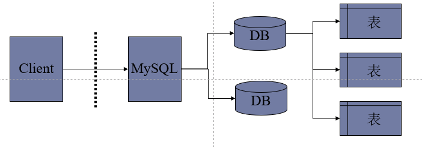

### 1.1 SQL简介

<hr>

数据库是指在计算机的存储设备上合理存放相关联、有结构的数据集合

SQL，指结构化查询语言（Structured Query Language），是用于访问和处理**数据库**的标准的计算机语言。 可让使用者访问和处理数据库。


- **数据库服务器、数据库和表的关系**




- **数据在数据库中的存储方式**


### 1.2 SQL能做什么

<hr>

- SQL 面向数据库执行查询

- SQL 可从数据库取回数据

- SQL 可在数据库中插入新的记录

- SQL 可更新数据库中的数据

- SQL 可从数据库删除记录

- SQL 可创建新数据库

- SQL 可在数据库中创建新表

- SQL 可在数据库中创建存储过程

- SQL 可在数据库中创建视图

- SQL 可以设置表、存储过程和视图的权限


### 1.3 数据库基本操作

<hr>

SQL对数库的操作语句，大致可分为：创建数据库、删除数据库、修改数据库等。

- **创建数据库**

```sql
create database if not exists WebData character set utf8;
--haracter set utf8 用于指定数据库的字符集类型
```

- **查看数据库**

```sql
show databases；
```

-  **查看数据库创建时的命令**

```sql
show create database student;
```

- **删除数据库**

```sql
drop database ding;
```

- **备份(导出)数据库**

```sql
mysqldump -uroot -p test > new.sql;
```

- **切换数据库**

```mysql
use db2；
```

- **恢复（导入）数据库**

```sql
--mysql导入
mysql -uroot -p123456 < abc.sql
--Source导入
Source 文件名.sql
```

- **数据库的存储引擎**

```mysql
show ENGINES;
```

数据库的主要的三种存储引擎：

**Mylsqm存储引擎：**

> 不支持事物，也不支持外键，所以访问速度较快。适用于：对事务没有要求的。使用MyISAM引擎创建数据库，将生产3个文件。文件的名字以表的名字开始，扩展名指出文件类型：fm文件存储表定义，数据文件的扩展名MYD，索引文件的扩展名是.MYI

**InnpDB储存引擎：**

> 支持事务，但会占用更多的空间，适用类型：需频繁更新、删除操作的，同时还对事务的完整性要求较高。

**Memory储存引擎：**

> 使用内存来存储数据，速度很快，但安全性较低。适用于：数据量少，需要进行快速访问的

存储引擎对比


#### 1.3.1 数据类型


##### 1.3.1.1 数值类型


##### 1.3.1.2 日期和时间类型


##### 1.3.1.3 字符串类型


##### 1.3.1.4 创建数据表字段类型选择


#### 1.3.2 运算符

MySQL主要有以下几种运算符：

- 算术运算符
- 比较笨运算符
- 逻辑运算符
- 位运算符


##### 1.3.2.1 算术运算符

MySQL支持的算术运算符包括：

| 运算符 | 作用                                          |
| ------ | --------------------------------------------- |
| +      | 加                                            |
| -      | 减                                            |
| *      | 乘                                            |
| /或DIV | 除，如果除数为0，将是非法除数，返回结果为null |
| %或MOD | 模，如果除数为0，将是非法除数，返回结果为null |

```mysql
#加
select 2-1;#结果为1
#减
select 1+2;#结果为3
#乘
select 2*2;#结果为4
#除
select 12/4;#结果为3
#模
select 12%5;#结果为2
```


##### 1.3.2.2 比较运算符

如果比较结果为真，则返回结果为1，如果比较结果为假，则返回结果为0。


```mysql
#等于
select 2=2;#结果为1
select null=null;#结果为null
#不等于
select 2<>2#结果为0
selecg 3!=1#结果为1
#大于
select 2<1;#结果为0
select 3>=2;#结果为1
#between and
select 2 BETWEEN 1 and 4;#结果为1
#in
select 3 in (1,2,3,4,5);#结果为1
#<=>
select null <=> null# 结果为1
#Like模糊查查询
select '1234' like '12%';#结果为1
select '1234' like '12_';#结果为0
#正则匹配
select "shanghai" regexp "ang";#结果为1
select "shanghai" regexp "as"#结果为0
#is null
select "as" is null;#结果为0
select null is null;#结果为1
#is not null
select "as" is null;#结果为1
```


##### 1.3.2.3 逻辑运算符

逻辑运算符用来判断表达式的真假，如果表达式为真，则返回结果为1，如果结果为假，则返回结果为0。

| 运算符 | 作用                           |
| ------ | ------------------------------ |
| NOT或! | 逻辑非                         |
| AND    | 逻辑与                         |
| OR     | 逻辑或                         |
| XOR    | 逻辑异或（即二进制不进位加法） |

```mysql
#逻辑与
select 1 and 0;#结果为0
select 1 and 2;#结果为1
select 0 and 0;#结果为0
select 3 and 5;#结果为1
#逻辑或
select 2 or 7;#结果为1
select 5 or 0;#结果为1
select 0 || 0;#结果为0
#NOT
select not 0;#结果为1
select !1;#结果为0
select not 5;#结果为0
#逻辑异或（即二进制不进位加法，如0+1=1，1+0=1，1+1=0（不进位））
select 0 xor 0;#结果为0
select 1 xor 0;#结果为1
select 1 xor 1;#结果为0
select 0 xor 1;#结果为1
```


##### 1.3.2.4 位运算符

位运算符是在二进制数上进行计算的运算符。位运算会先将操作数变成二进制数，进行位运算。然后再将计算结果从二进制数变回十进制数。

| 运算符号 | 作用     |
| -------- | -------- |
| &        | 按位与   |
| \|       | 按位或   |
| ^        | 按位异或 |
| !        | 取反     |
| <<       | 左移     |
| >>       | 右移     |


### 1.4 数据表基本操作

<hr>


#### 1.4.1 基本SQL语句

##### 1.4.1.1 SQl创建表操作

```mysql
#创建数据表时可以指定数据库存储引擎，如果不指定的化默认就是innodb存储引擎
create table student02(
    eid int(11) primary key,
    ename varchar(15)
) character set utf8
engine innodb;
#创建一个Myisam存储引擎的数据表
create table student02(
    eid int(11) primary key,
    ename varchar(15)
) character set utf8
engine myisam;
```


##### 1.4.1.2 查看所有表

```mysql
show tables;
```

| table     |
| --------- |
| student02 |


##### 1.4.1.3 查看建表语句

```mysql
show create table student02;
```

| Table     | Crate Table                                                  |
| --------- | ------------------------------------------------------------ |
| student02 | CREATE TABLE  student02(  eid int(11) DEFAULT NULL,  ename  varchar(15) DEFAULT NULL) ENGINE=InnoDB DEFAULT CHARSET=utf8 |


##### 1.4.1.4 查看表结构

```mysql
desc student02;
```


##### 1.4.1.5 修改表结构

通过SQl语句可以直接对表进行如下操作：表的重命名、向表中指定位置新增一列、修改表中字段的数据类型（modify）、移动表中字段的顺序（modify）、修改表中字段的名称（change）、删除表中的字段（drop）

```mysql
#重命名表名称
rename table student02 to student;
#向表中新增一列，数据类型位int，长度限制为4，新增列的位置在表最后面
alter table student add column classroom int(4); 
#向表中新增一列，数据类型为int，长度限制为3，新增列的位置在表的最前面
alter table student add column age int(3) first; 
#向指定位置新增一列
alter table student add column age int(3) after yourname;
#将新增的列的数据类型修改为varchar类型，长度设置为25
alter table student modify classroom varchar(25);
#修改列的顺序，将某个列移动到另一列的后面
alter table student modify age int(3) after ename;	
#修改某一列的属性名称
alter table student change eid id int(11);
alter table student change ename yourname varchar(20);
#删除表中的某一字段
alter table student drop age;
#删除表
drop table if exists student;
```


##### 1.4.1.6 对数据操作

student表结构如下：


1. 插入数据

插入数据方法一：插入一条数据

```mysql
#正确示范
#数据中的每个值必须与表中的字段相对应，不能少值或多值，数据类型不能错，各个值之间的顺序不能乱
insert into student values(1001,"小明",22,"1班");
<------------------------------------------------------------------------------------------------>
#错误示范一:少了一个字段值
#insert into student values(1001,"小明",22);
#错误示范二:多了一个字段值
#insert into student values(1001,"小明",22,"1班",'男');
#错误示范三:数据类型与表中不匹配
#insert into student values(1001,"小明",22,1班);
#错误示范四:数值顺序混乱
#insert into student values("小明",1001,22,"1班");
```

插入数据方法二：对表中的指定字段进行插入

```mysql
#插入数据时也可以选择对表中的指定字段进行插入，其他字段会根据建表时的设置进行填充，如果未设置就默认为空
#数据值要与字段相互对应
insert into student (id,yourname,age) values (1002,"小刚",20);
```

插入数据方法三：一次性插入多条数据

```mysql
#一次性插入多条数据，每条数据之间用英文 , 隔开
INSERT INTO student
VALUES
	( 1003, "小钉", 20, "2班" ),
	( 1004, "小胡", 20, "4班" ),
	( 1005, "小花", 21, "2班" ),
	( 1006, "小赵", 19, "3班" );
```

数据插入结果：


2. 查询数据

```mysql
# 查询全部字段
select * from student;
# 查询自定字段
select id,yourname from studnet;
# 设置查询条件
select * from student where age>20
```

3. 更新数据

```mysql
# 更新数据
update student set classroom="4班" where id=1002;
update student set age=18,classroom="我也不知道我是哪班的" where id=1003;
```

数据更新结果：


3. 删除数据

```mysql
# 删除一行数据
delete from  student where id =1003; 
```

删除数据结果：


#### 1.4.2 约束

> 这里的约束即字面意思，就像老师约束我们上课不能玩手机一样。在数据库中约束就是对某些字段进行约束，规定该字段中应该存什么类型的值，不应该存什么类型的值。
>
> 约束的作用：约束的作用就是防止数据库中含有不符合语义规定的数据


##### 1.4.2.1 约束的分类

- 键约束：主键约束、外键约束、唯一键约束
- 非空约束
- 检查约束
- 自增约束
- 默认约束


##### 1.4.2.2 主键约束


###### 主键约束特点

- 一个表有且只能有一个主键约束
- 主键约束意味着非空，并且唯一
- 主键约束格式：primary key
- 创建主键会自动创建对应主键索引，删除主键，对应的索引也随之消失


###### 主键约束分类

- 单列主键约束
- 多列主键约束（复合主键约束）


###### 创建单列主键约束

方式一：建表时直接指定主键

```mysql
create table student(
    id int(11) primary key,
    yourname varchar(15)
) character set utf8;
```

方式二：建表之后指定主键

```mysql
alter table student add primary key(id);
```


###### 创建多列主键约束

方式一：建表时直接指定主键

````mysqll
create table student(
    id int(11),
    yourname varchar(15),
    classroom varchar(20),
    primary key(id,yourname)
) character set utf8;
````

方式二：建表之后指定主键

```mysql
alter table student add primary key(id,yourname);
```


###### 删除主键约束

删除主键约束之后，相应的索引也会消失

```
alter table student drop primary key;
```


##### 1.4.2.3 外键约束

> 主表：主键用于与其他表相关联，并且作为在主表中的唯一性标识。主表是被参考的，被依赖的
>
> 从表：以主表的主键值为外键的表，可通过外键与主表进行关联查询
>
> 从表与主表通过外键进行关联查询，从表就是参考别的表，依赖别的表，如果对主表进行修改，那么从表上对应的数据也会做出相应的改动。

比如下图中的两个表，一个是专业信息表，一个是学生信息表。对于学生信息表，mid就是它的外键，通过这个外键把学生信息表与专业信息表联系了起来。

- 专业信息表为主表，因为表中mid字段被学生信息表所依赖
- 学生信息表为从表，因为它需要依赖专业信息表中的字段


**专业信息表**

| 字段名 | 说明   |
| ------ | ------ |
| mid    | 专业ID |
| mname  | 专业名 |

**学生信息表**

| 字段名 | 说明     |
| ------ | -------- |
| sid    | 学生ID   |
| sname  | 学生姓名 |
| mid    | 专业名   |


###### 外键约束特点

- 一个表可以有很多个外键约束，一个表可以同时关联很多个主表
- 外键约束是需要一个表的两个字段或两个表的两个字段之间建立外键约束
- 在从表中外键约束的列，与在主表中外键约束参考的列，这两个列的名称可以不同，但是意义、数据类型必须一致
- 外键约束是同时约束双方的行为的。对于主表来说，修改和删除就受约束了，因为如果删除主表中的某一条记录，这个记录正好被从表依赖，那么从表就可能会发生变化。对于从表来说，添加和修改就受约束了，因为从表只能添加和修改主表中有的记录
- 主表被参考的字段/列必须是键列
- 建表时，先建主表，再建从表。删表时，先删从表，再删主表


###### 约束等级

约束等级即当主表中的数据发生变化时，从表中的数据会发生什么样的变化，约束等级可以分为下面三类：

- Cascade（级联）方式：主动权在主表，如果主表被依赖的字段修改，那么从表上的外键也会跟着被修改；如果主表上被依赖的字段被删除了，那么从表上的外键字段也会被删除。
- Set null方式：主动权在主表，要求从表上的外键字段不能有非空约束（即字段值可以为空），如果主表被依赖的字段被修改了，从表对应的外键字段值变为null；如果主表上被依赖的字段被删除了，那么从表上的外键字段值变为null。
- No action和Restrict方式：主动权在从表，如果主表的被依赖字段的值被引用了，那么主表对该字段的修改和删除就被完全限制了。就不能修改和删除，必须先处理从表对应的值，然后才能修改和删除。


###### 创建外键约束

建表时创建外键约束

```mysql
create table student(
    id int(11) primary key auto_increment,
    mid int(11) not null default 101,
    yourname varchar(15),
    classroom varchar(20),
    foreign key(从表中的某字段) references 主表名（被参考字段）[on update 等级][on update 等级]
) character set utf8;
```

建表后创建外键约束

```mysql
alter table student add foreign key(从表中的某字段) references 主表名（被参考字段）[on update 等级][on delete 等级]
```

- [on update 等级]：设置更新数据时的约束等级

- [on delete 等级]：设置删除数据时的约束等级


练习：

```mysql
#创建主表
create table dept(
did int,
dname varchar(20)
) charset utf8;
```

```mysql
#创建从表
create table emp(
eid  int primary key,
ename varchar(20),
did int,
foreign key(did) references dept(did) on update cascade on delete set null
);
```


###### 删除外键约束

```mysql
drop table student drop foreign key 约束名;
```

```

create table emp(
eid  int primary key,
ename varchar(20),
did int,
foreign key(did) references dept(did) on update cascade on delete set null
);
```


##### 1.4.2.4 非空约束

###### 非空约束特点

- 非空约束关键字：not null
- 一个表可以有多个非空约束
- 非空约束只针对某一个字段
- 非空约束意味着该字段不能存入null值


###### 创建非空约束

建表时指定非空约束

```mysql
create table student(
    id int(11) primary key ,
    yourname varchar(15) not nul,
    classroom varchar(20) not null,
    gender char(2),
) character set utf8;
```

建表后指定非空约束

```mysql
alter table student modify gender char(2) not null; 
```


###### 删除非空约束

```mysql
alter table student modify gender char(2); 
```


##### 1.4.2.5 唯一约束

###### 唯一约束特点

- 唯一约束关键词：unique key
- 一个数据表中可以有多个唯一约束
- 唯一键约束是针对字段来说的，如果该字段设置了唯一约束，那么该字段中的值必须唯一，不能重复
- 设置唯一键约束的字段值可以为null，null不受唯一键的约束
- 创建唯一键约束，也会在对应列上建立索引，而且删除唯一键约束的方式是通过删除对应索引来实现的。


###### 唯一键约束分类

- 单列唯一键约束
- 复合唯一键约束


###### 创建单列唯一键约束

建表时创建唯一键约束

```mysql
create table student(
    id int(11) primary key ,
    yourname varchar(15) not nul,
    yourphone varchar(11) unique key,
    classroom varchar(20) not null,
) character set utf8;
```

建表后指定唯一键约束

```mysql
alter table student add unique key(yourphone); 
```


###### 创建复合唯一键约束

```mysql
create table student(
    id int(11) primary key ,
    yourname varchar(15) not null,
    yourphone varchar(11),
    youremail varchar(11),
    classroom varchar(20) not null,
    unique key(yourphone,youremail),
) character set utf8;
```

建表后指定唯一键约束

```mysql
alter table student add unique key(yourphone,youremail); 
```


###### 删除唯一键约束

> 删除唯一键约束使用删除索引的方式来实现的

查看表中都是有哪些索引

```
show index from 表名
```

删除唯一键约束

```mysql
alter table student droo index 索引名;
```


##### 1.4.2.6 自增约束

###### 自增约束特点

- 自增约束关键词：auto_increment
- 一个表中只能有一个自增约束
- 自增约束的列只能时整数列
- 自增约束的键一般为键列（主键、唯一键、外键），实际开发中一般设置主键为自增

###### 创建自增约束

建表时创建自增约束

```mysql
create table student(
    id int(11) primary key auto_increment ,
    yourname varchar(15) not null,
    classroom varchar(20) not null,
) character set utf8;
```

建表后创建自增约束

```mysql
alter table student mofify id int(11) auto_increment;
```


###### 删除自增约束

```mysql
 alter table student mofify id int(11);
```

###### 注意事项

- 对于自增列，在添加数据的时候自定义了自增列的值，那么就按自定义的值写入数据值，如果没有自定义值，就按自增写入数据
- 如果添加数据时，自增列指定的值为0或null，则还是按照自增的值来


##### 1.4.2.7 默认值约束

###### 默认值约束特点

- 默认值约束关键字：default
- 一个表中可以为多个字段设置默认值
- 默认值只是针对某一个字段来说的
- 一个字段设置了默认值，田间数据时如果该字段没有赋值，就会自动填充设置好的默认值进去

###### 创建默认值约束

建表时创建默认约束

```mysql
create table student(
    id int(11) primary key auto_increment ,
    yourname varchar(15) not null,
    classroom varchar(20) not null,
    nowstatus int(1) not null default 1;#0表示已毕业，1表示在读
) character set utf8;
```

建表后创建默认约束

```mysql
alter table student mofify nowstatus int(1) default 1;
```


###### 取消默认值约束

```mysql
alter table student mofify nowstatus int(1)
```


###### 使默认值生效

插入时直接使用默认值

```mysql
insert into student values(1,"小明","2班",default);
```

指定字段插入，不包含默认值

```mysql
#id自增，nowstatus默认
insert into student (yourname,classroom) values ("小华","4班")
```


#### 1.4.3 MySQL函数


#### 1.4.3 查询操作


##### 1.4.3.1 多表查询

创建员工表并添加数据

```mysql
#创建员工表
CREATE TABLE `employees` (
`emp_no` int(11) NOT NULL,
`birth_date` date NOT NULL,
`first_name` varchar(14) NOT NULL,
`last_name` varchar(16) NOT NULL,
`gender` char(1) NOT NULL,
`hire_date` date NOT NULL,
PRIMARY KEY (`emp_no`));
#添加四条数据
INSERT into employees values(10001,"1956-02-24","Zhang","San",'M',"1978-06-04");
INSERT into employees values(10002,"1987-04-21","Li","Si",'M',"2005-12-24");
INSERT into employees values(10003,"1974-12-24","Wang","Wu",'F',"1999-08-04");
INSERT into employees values(10004,"1966-05-05","Xiao","Ming",'M',"1988-06-04");
```

建表结果


创建部门表并添加数据

```mysql
#创建部门表
CREATE TABLE `dept_emp` (
`emp_no` int(11) NOT NULL,
`dept_no` char(4) NOT NULL,
`from_date` date NOT NULL,
`to_date` date NOT NULL,
PRIMARY KEY (`emp_no`,`dept_no`));
#添加两条数据
INSERT into dept_emp values(10001,'d001',"1986-06-24","9999-01-01");
INSERT into dept_emp values(10002,'d002',"1989-02-14","9999-01-01");
```

建表结果


###### 1.4.3.1.1 笛卡尔积

> 多表查询容易产生笛卡尔积的情况，dept_emp中有两条数据，employees中有四条数据，如果直接查询两表，结果会产生八条数据。
>
> 例如：A={1,2} B={a,b,c,d}
>
> 结果：C={(1,a),(1,b),(1,c),(1,d),(2,a),(2,b),(2,c),(2,d)}

```mysql
#直接查询两表
select * from employees,dept_emp
```

查询结果


这样查询容易导致查询结果重、混乱，所以需要用条件来筛选查询结果。


###### 1.4.3.1.2 内连接

> 不区分主从表，与连接顺序无关，两张表均满足条件则出现结果，on后跟查询条件。
>
> 关键词：inner join 	on

示意图


```mysql
#内连接，只查询出满足条件的数据
select * from employees as e INNER JOIN dept_emp as d on e.emp_no=d.emp_no
```

查询结果


###### 1.4.3.1.3 左连接（左外连接）

> 区分主从表，与连接顺序有关，以左表（主表）为依据，从右表（匹配表）中依次查询，右表（匹配表）中找不到数据用null代替，on后跟查询条件。
>
> 关键词：left join on / left outer join on

示意图


```mysql
select * from employees as e left join dept_emp as d on e.emp_no=d.emp_no
```

查询结果


###### 1.4.3.1.3 右连接（右外连接）

> 区分主从表，与左连接相似，与连接顺序有关，以右表（主表）为依据，从左表（匹配表）中依次查询，左表（匹配表）中找不到数据用null代替，on后跟查询条件。
>
> 关键词：right join on / right outer join on

示意图


```mysql
select * from employees as e RIGHT join dept_emp as d on e.emp_no=d.emp_no
```

查询结果


###### 1.4.3.1.4 自然连接

> 寻找两表中字段名相同的，数据类型相同的字段进行连接，自动去重复列（如果有多个字段符合要求，那么他们会被作为自然连接的条件）

```mysql
select * from employees NATURAL join dept_emp 
```

查询结果


###### 1.4.3.1.5 自连接

> 同一个表中的数据进行关联

```mysql
select e.emp_no,e1.first_name from employees as e ,employees as e1 where e.emp_no=e1.emp_no
```

查询结果


#### 1.4.4 联合查询

创建学生表并添加数据

```mysql
#创建学生表
create TABLE student(
cid int(11) not NULL,
classname varchar(20) not null,
age int(2) not null,
PRIMARY KEY(cid)
);
#添加数据
insert into student VALUES(1,"张三","3班",22);
insert into student VALUES(2,"李四","2班",18);
insert into student VALUES(3,"王五","1班",21);
insert into student VALUES(4,"小明","2班",18);
insert into student VALUES(5,"小王","6班",23);
insert into student VALUES(6,"赵四","2班",19);
insert into student VALUES(7,"二狗","3班",20);
insert into student VALUES(8,"铁蛋","4班",24);
insert into student VALUES(9,"轩辕麻子","2班",19);
insert into student VALUES(10,"小六","1班",18);
```

建表结果


##### 1.5.2.1 UNION

> 并集，所有内容都查询，重复的只显示一次

```mysql
#联合两个表，两个表中重复的内容只显示一次
select * from student where classname="2班" union select * from student where age>20
```

查询结果


##### 1.5.2.2 UNION ALL

> 并集，所有内容都查询，与UNION不同的是查询结果中重复的内容全部显示

```mysql
#联合两个表，如果出现重复的内容，会全部显示出来
select * from student where classname="2班" union all select * from student where age>20
```

查询结果


#### 1.5.3 子查询

> 子查询一般与in / not in 关键字连用，也可以用>=<

```mysql
select emp_no from employees where emp_no not in (select emp_no from dept_manager)
```


```mysql
 select emp_no from employees where emp_no in (select emp_no from dept_manager)
```


### 1.6 索引

> MySQL使用索引快速查找具有特定列值的行。如果没有索引，MySQL必须扫描整个表以找到相关的行。表越大，搜索速度越慢。
>
> 索引的目的在于提高查询效率，可以类比字典，如果要查“mysql”这个单词，我们肯定需要定位到m字母，然后从下往下找到y字母，再找到剩下的sql。如果没有索引，那么你可能需要把所有单词看一遍才能找到你想要的，如果我想找到m开头的单词呢？或者ze开头的单词呢？是不是觉得如果没有索引，这个事情根本无法完成？

如果合理的设计且使用索引的MySQL是一辆兰博基尼的话，那么没有设计和使用索引的MySQL就是一个人力三轮车。


##### 1.6.1 B+Tree和B-Tree

实际的数据库系统几乎没有使用二叉树或其进化品种红黑树实现索引，大部分数据库系统及文件系统都采用B+Tree或其变种B+Tree作为索引结构。

参考链接：[点我进入](https://blog.csdn.net/hao65103940/article/details/89032538)


##### 1.6.2 Mysql索引具体实现

##### 1.6.2.1 创建索引


- **未创建索引前**

```mysql
select * from employees where last_name="Facello"
```

查询结果：查询时间为0.065s


- **创建索引**

```mysql 
create index empno on employees(emp_no)
```

- **创建索引后**

```mysql
select * from employees where last_name="Facello"
```

查询结果：查询时间为0.053s


**分析查询**

```mysql
EXPLAIN select * from employees where last_name="Facello"
```


##### 1.6.2.2 删除索引

```mysql
 drop index index_name on table_name
 #如果索引在主键上
 drop index 'primary' on table_name
```


##### 1.6.2.3 显示索引

```mysql
#新增索引
create index deptno on dept_emp(dept_no)
#查看索引
 show index from dept_emp
```


### 1.7 存储过程

> 存储过程和函数是事先经过编译并存储在数据库中的一段SQL语句的集合，调用存储过程和函数可以简化应用开发人员的很多工作，减少数据在数据库和应用服务器之间的传输，对于提高数据处理的效率是有好处的。第一次接触存储过程可能会将它与函数弄混肴，其实存储过程和函数是不一样的。

存储过程和函数的区别在于函数必须有返回值，而存储过程没有。

- 函数：是一个有返回值的过程

- 存储过程：是一个没有返回值的函数


#### 1.7.1 创建存储过程

创建存储过程的语法格式：

```mysql
CREATE PROCEDURE sp_name(proc_parameter1,proc_parameter2,proc_parameter3)
begin 
  --sql语句
end;
```

- `CREATE PROCEDUR`创建存储过程的关键字
- `sp_name`为存储过程名称
- `proc_parameter1`为指定存储过程的参数列表，列表形式如下

```mysql
IN / OUT /INOUT param_name type
```

其中，`IN`表示输入参数，`OUT`表示输出参数，`INOUT`表示输入输出函数，`param_name`表示参数名称，type表示参数的类型，可以是Mysql数据库中任意类型。

```mysql
delimiter //

CREATE PROCEDURE test()
begin 
select 'Hello World';
  
end //
delimiter ;
```

`DELINTER //`语句的作用是将wysL的结束符设置为，因为`Mysql`默认的语句结束符号为分号。为了避免与存储过程中`SQL`语句结束符相冲突，需要使用`delimiter`改变存储过程的结束符，并以 `END //`结束存储过程。存储过程定义完毕之后再使用`delimiter`;恢复默认结束符。`delimiter`也可以指定其他符号作为结束符。当使用 `delimiter`命令时，应该避免使用反斜杠\字符，因为反斜线是`Mysql`的转义字符。


#### 1.7.2 创建存储函数

创建存储函数的语法格式：

```mysql
CREATE Function func_name(func_parameter1,func_parameter2,func_parameter3)
return types
begin 
  --sql语句
end;
```

- `CREATE Function`创建存储函数的关键字
- `sp_name`为存储函数名称
- `func_parameter1`为指定存储函数被的参数列表，列表形式如下

```mysql
IN / OUT /INOUT param_name type
```

其中，`IN`表示输入参数，`OUT`表示输出参数，`INOUT`表示输入输出函数，`param_name`表示参数名称，type表示参数的类型，可以是Mysql数据库中任意类型。

```mysql
delimiter //
CREATE Function test()
return int;
begin 
declare num int;
    select count(*) into num from mysql.user;
    return num;
end //
delimiter ;
```

如果在存储函数中的`RETURN`语句返回一个类型不同于函数的`RETURNS`子句中指定类型的值，返回值将被强制为恰当的类型。比如，如果一个函数返回一个`ENUM`或`SET`值，但是`RETURN`语句返回一个整数，对于`SET`成员集相应的`ENUM`成员，从函数返回的值是字符串。

> 指定参数为`IN`、`OUT`或`INOUT`只对`PROCEDURE`是合法的。（`FUNCTION`中总是默认为`IN`参数）。`RETURNS`子句只能对`FUNCTION`做指定，对函数而言这是强制的。它用来指定函数的返回类型，而且函数体必须包含一个`RETURN value`语句。


#### 1.7.3 复杂存储过程


##### 1.7.3.1 DECLARE

通过`DECLARE`可以定一个局部变量，该变量的作用范围只能在`BEGIN_END`

```mysql
delimiter //
create procedure a()
begin 
declare num int default 5;
select num+100;
end //
delimiter;
```


##### 1.7.3.2 set

对变量直接赋值使用`SET`，可以赋值常量或者表达式，具体语法如下。

```mysql
delimiter //
create procedure b()
begin
declare site varchar(20);
set site="www.dingzijun.top";
select site;
end //
delimiter;
```


##### 1.7.3.3 if 条件判断

```` mysql
delimiter //
create procedure pro_if_in(in height int)
begin
    declare descrip varchar(50) default '';
    if height >= 180 then
        set descrip = '身材高挑';
    elseif height >= 170 and height < 180 then
        set descrip = '标准身材';
    else
        set descrip = '一般身材';
    end if;
    select concat('身高: ', height, '对应的身材类型为: ', descrip);
end //
delimiter ;
````


##### 1.7.3.4  参数传递

