# 1. Spring简介

## 1.1 Spring是什么

Spring是分层的JavaSE/EE应用full-satck（全栈）轻量级开源框架，以**<font color="red">IOC</font>**（Inverse Of Control：反转控制）和**<font color="red">AOP</font>**（Aspect Oriented Programming：面向切面编程）为内核。

Spring提供了**<font color="red">展现层SpringMVC</font>**和**<font color="red">持久层Spring JDBCTemplate</font>**以及**<font color="red">业务层事务管理</font>**等众多的企业级应用技术，还能整合开源世界众多著名的第三方框架和类库（如Mybatis），逐渐称为使用最多的JavaEE企业应用开源框架。

> full-satck：此处的全栈与我们通常理解的全栈不同，此处的全栈是指Spring对各层都有对应的解决方案，如Web层有SpringMCV，Dao层有JdbcTemplate等。
>
> 轻量框架：框架比较小巧，API比较简单、学习成本比较低，则一般认为这个框架是轻量的

## 1.2 Spring发展历程

2017年9月份发布了Spring的最新版本Spring5.0通用版（GA）

## 1.3 Spring的优势

1. **<font color=red>方便解耦，简化开发</font>**

通过Spring提供的IOC容器，可以将对象间的依赖关系交由Spring进行控制，避免硬编码所造成的过度耦合。用户也不必再为单例模式类、属性文件解析等浙西很底层的需求编写代码，可以更专注于上层的应用。

简单来说就是把对象的创建权交由Spring来操作，不再通过new来创建对象，降低耦合性。

2. **<font color=red>AOP编码的支持</font>**

通过Spring的AOP功能，方便进行面向切面编程，许多不容易用传统OOP（面向对象编程）实现的功能可以通过AOP轻松实现。

3. **<font color=red>生命式事务的支持</font>**

可以将我们从单调的事务管理代码中解脱出来，通过声明的方式灵活的进行事务管理，提高开发效率和质量

4. **<font color=red>方便程序的测试</font>**

可以用非容器依赖的编程方式进行几乎所有的测试工作，测试不再是昂贵的操作，而是随手可做的事情。

其实就是项目中集成Junit，进行单元测试，测试起来更加方便

5. **<font color=red>方便集成各种优秀的框架</font>**

Spring支持很多优秀框架的集成，比如：Struts、Hibemate、Mybatis、Mybatis-plus

6. **<font color=red>降低JavaEE API的使用难度</font>**

Spring对JavaEE API（如JDBC、JavaMail、远程调用等）进行了薄薄的封装层，使这些API的使用难度大为降低。

简单来说，就是对繁琐的操作进行封装，对外提供一个丰富的工具类，比如JDBC使用时要进行注册驱动、获取连接、事务管理、获取Sql执行对象、遍历结果集等一系列操作，比较繁琐，Spring对JDBC的操作进行了封装，提供给用户更方便以用的JDBCTemplate（其实就是JDBC的工具类）

7. **<font color=red>Java源码经典学习典范</font>**

Spring源码设计非常精妙、结构清晰、匠心独用、处处体现着大师对Java设计模式灵活运用以及对Java技术的高深造诣。它的源代码无疑是Java技术的最佳实践范例

## 1.4 Spring体系结构

Spring体系结构如下

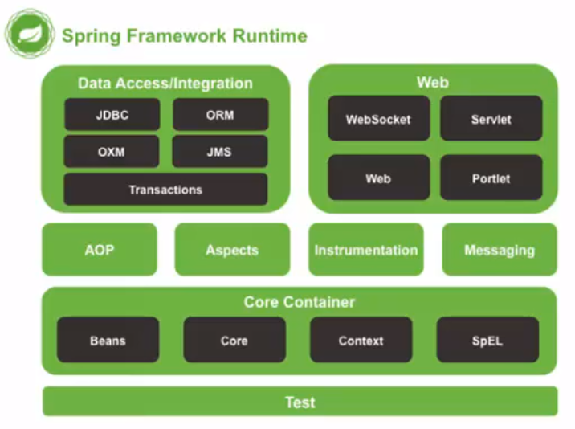

- Test层：最后一层Test表示Spring整个框架都可以进行测试

- Core Container：核心容器（可以理解为IOC）是重点部分，前两层的运行都要借助核心容器，核心容器中有Beans、Core、Context、SpEL，对应着四个Jar包
  - Beans：主要用来产生Bean，即产生对象
  - Core：表示核心
  - Context：Spring的上下文
  - SpEL：Spring表达式语言，与JSP中EL（表达式语言）类似

上面图中的关系是层层递进的

# 2. Spring快速入门

**<font color=red>提示：Spring是轻代码而重配置的框架（出了名的配置怪）</font>**

## 2.1 Spring程序开发步骤

需求：在`com.nanyu.service.UserServiceImpl`中需要调用 `com.nanyu.dao.UserDaoImpl`中`save()`和`update()`两个方法。

普通方法思路：

在`UserServiceImpl`类的内部new一个`UserDaoImpl`对象，通过对象调用类中的两个方法

```java
public class UserServiceImpl implents UserService {
    UserDao userDao=new UserDaoImpl();
    userDao.save();
    userDao.update();
}
```

**缺点：**

上面的实现思路导致两个类之间耦合度太高，比如`UserDaoImpl`的包名路径需要更改时，`UserServiceImpl`中引用的包名路径也要更改，当遇到更为复杂的情况时就会导致牵一发而动全身。

Spring提供的解耦思路：

一切皆以配置的形式产生，Spring提供一个核心配置文件，在此核心配置文件中可以配置很多信息

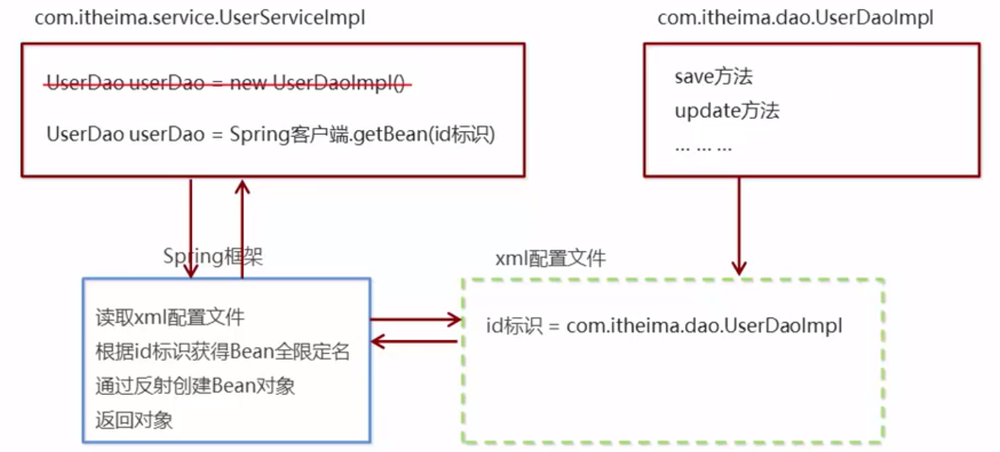

文字描述：

- 导入Spring开发的基本包坐标（依赖）
- 编写Dao接口和实现类
- 创建Spring核心配置文件
- 在Spring配置文件中配置UserDaoImpl
- 使用Spring的API获得Bean实例。

## 2.2 Spring入门程序

接下来将会按照上面Spring的入门步骤编写一个Spring入门程序。

1. 导入Spring开发的基本坐标

```xml
<dependency>
    <groupId>org.springframework</groupId>
    <artifactId>spring-context</artifactId>
    <version>5.3.12</version>
</dependency>
```

2. 创建Dao接口和实现类

```java
package com.nanyu.dao;
public interface UserDao {
    void save();
}
```

```java
package com.nanyu.dao.impl;
import com.nanyu.dao.UserDao;
public class UserDaoImpl implements UserDao {
    @Override
    public void save() {
        System.out.println("save is running!");
    }
}
```

3. 创建Spring核心配置文件

```xml
<?xml version="1.0" encoding="UTF-8"?>
<beans xmlns="http://www.springframework.org/schema/beans"
       xmlns:xsi="http://www.w3.org/2001/XMLSchema-instance"
       xsi:schemaLocation="http://www.springframework.org/schema/beans http://www.springframework.org/schema/beans/spring-beans.xsd">

</beans>
```

4. 在Spring配置文件中配置UserDaoImpl

```xml
<?xml version="1.0" encoding="UTF-8"?>
<beans xmlns="http://www.springframework.org/schema/beans"
       xmlns:xsi="http://www.w3.org/2001/XMLSchema-instance"
       xsi:schemaLocation="http://www.springframework.org/schema/beans http://www.springframework.org/schema/beans/spring-beans.xsd">

	<!--配置UserDaoImpl-->
    <bean id="userDao" class="com.nanyu.dao.impl.UserDaoImpl"></bean>

</beans>
```

属性解释：

- bean：用于配置对象，配置完之后外界可以获取到

- id：该对象的唯一标识，通过该Id获取该bean封装的对象

- class：需要配置的对象全限定名，即需要将哪个类配置为对象

5. 通过Spring的API获取Bean实例

```java
package com.nanyu.Test;

import com.nanyu.dao.UserDao;
import org.springframework.context.ApplicationContext;
import org.springframework.context.support.ClassPathXmlApplicationContext;

public class Test {
    public static void main(String[] args) {
        //创建容器
        ApplicationContext app = new ClassPathXmlApplicationContext("applicationContext.xml");
        // 从容器中通过配置的bean的id来获取到UserDaoImpl对象
        UserDao userDao = (UserDao) app.getBean("userDao");
        userDao.save();
    }
}
```

代码解释：

```java
ApplicationContext app = new ClassPathXmlApplicationContext("applicationContext.xml");
```

根据核心配置文件，创建容器（可以理解为IOC容器），可以将容器比作一个用来装东西的大盒子。之前已经配置好的Bean对象就存在于这个容器中。

```java
UserDao userDao = (UserDao) app.getBean("userDao");
```

如何获取到容器（盒子）中的对象？通过bean标签的唯一标识id即可获取到UserDao对象。这种方法不同于使用new关键字创建的对象，实现了解耦操作，当需要变更文件时只需要更改核心配置文件即可。

# 3. Spring配置文件

## 3.1 Bean标签的基本配置

Bean标签用于配置对象交由Spring来创建（即Spring用于配置对象的标签），**<font color=red>基本原理是反射</font>**，通过class配置全限定包名，通过反射机制获取到该类的对象，对外提供唯一的对象id，通过该id调取容器中的对象，因为是基于反射，所以默认情况下它**<font color=red>调用的是类中的无参构造器</font>**，如果该类中没有无参构造器则不能创建成功。

基本属性：

- id：Bean实例在Spring容器中的唯一标识
- class：Bean的全限定名
- scope：对象的作用范围，取值如下：

| 取值范围                             | 说明                                                         |
| ------------------------------------ | ------------------------------------------------------------ |
| **<font color=red>singleton</font>** | 默认的，**<font color=red>单例的</font>**                    |
| **<font color=red>prototype</font>** | **<font color=red>多例的</font>**                            |
| request                              | Web项目中，Spring创建一个Bean对象，将对象存入到request域中   |
| session                              | Web项目中，Spring创建一个Bean对象，将对象存入到session域中   |
| golbal session                       | Web项目中，应用在Portlet环境，如果没有Portlet环境那么golbal session相当于session |

scope最重要的两个属性值singleton、prototype，默认值为singleton，下面介绍这两个属性值的不同。

```xml
<!--配置UserDaoImpl-->
<bean id="userDao" class="com.nanyu.dao.impl.UserDaoImpl" scope="singleton"></bean>
<bean id="userDao" class="com.nanyu.dao.impl.UserDaoImpl" scope="prototype"></bean>
```

下面代码用于测试scope的两个属性创建对象的数量以及不同属性值下对象创建的时机。由于Spring对象的创建基于反射，反射又基于无参构造，所以为了更好的表现出对象创建的时机，对UserDaoImpl的无参构造器做了以下修改。

```java
package com.nanyu.dao.impl;
import com.nanyu.dao.UserDao;
public class UserDaoImpl implements UserDao {
    public UserDaoImpl(){
        System.out.println("无参构造被执行了，说明对象被创建了");
    }
    @Override
    public void save() {
        System.out.println("save is running!");
    }
}
```

- singleton：只在容器中创建一个对象，无论调用几次调用的都是最开始创建的那一个对象。

  创建对象的时机：在**容器刚创建时**（` new ClassPathXmlApplicationContext("applicationContext.xml");`），**就通过Bean标签生成了对象**，代码如下：

```java
package com.nanyu.Test;

import com.nanyu.dao.UserDao;
import org.springframework.context.ApplicationContext;
import org.springframework.context.support.ClassPathXmlApplicationContext;

public class Test {
    public static void main(String[] args) {
        //创建容器
        ApplicationContext app = new ClassPathXmlApplicationContext("applicationContext.xml");
        System.out.println("------分割线------");
        // 从容器中通过配置的bean的id来获取到UserDaoImpl对象
        UserDao userDao1 = (UserDao) app.getBean("userDao");
        UserDao userDao2 = (UserDao) app.getBean("userDao");
        // 根据对象的地址判断userDao1与userDao2是不是一个对象
        System.out.println(userDao1);
        System.out.println(userDao2);
    }
}
/*
输出结果
无参构造被执行了，说明对象被创建了
------分割线------
com.nanyu.dao.impl.UserDaoImpl@490ab905
com.nanyu.dao.impl.UserDaoImpl@490ab905
*/
```

输出结果显示两次的对象地址相同，说明这是一个对象，由此说明设定了`scope='singleton'`之后，调用同一个id的Bean时容器中只会生成一个Bean对象。

同时根据UserDaoImpl中无参构造器执行的次序可以了解到当执行了` new ClassPathXmlApplicationContext("applicationContext.xml");`这句话时就创建了对象。

- prototype：当使用`getBean()`获取对象时，如果传入的是同一id，每调用一次方法，就会创建一个对象。

  创建对象的时机：执行`getBean()`时创建对象

```java
package com.nanyu.Test;

import com.nanyu.dao.UserDao;
import org.springframework.context.ApplicationContext;
import org.springframework.context.support.ClassPathXmlApplicationContext;

public class Test {
    public static void main(String[] args) {
        //创建容器
        ApplicationContext app = new ClassPathXmlApplicationContext("applicationContext.xml");
        System.out.println("------分割线------");
        // 从容器中通过配置的bean的id来获取到UserDaoImpl对象
        UserDao userDao1 = (UserDao) app.getBean("userDao");
        UserDao userDao2 = (UserDao) app.getBean("userDao");
        // 根据对象的地址判断userDao1与userDao2是不是一个对象
        System.out.println(userDao1);
        System.out.println(userDao2);
    }
}
/*
输出结果
------分割线------
无参构造被执行了，说明对象被创建了
无参构造被执行了，说明对象被创建了
com.nanyu.dao.impl.UserDaoImpl@1ce92674
com.nanyu.dao.impl.UserDaoImpl@5700d6b1
*/
```

输出结果显示两次对象地址不同，表明这不是一个对象，由此说明了设定了`scope='prototype'`之后，每执行一次`getBean()`都会生成一个对象。

根据无参构造器执行的次序可以了解到` new ClassPathXmlApplicationContext("applicationContext.xml");`时并没有创建对象，而是当调用`getBean()`方法时才创建了对象

**总结：**

1）当scope的取值为singleton时

Bean的实例化个数：1个

Bean的实例化时机：当Spring核心文件被加载时，实例化配置的Bean实例

Bean的声明周期：

- 对象创建：当应用加载，创建容器时，对象就被创建了
- 对象运行：只要容器在，对象就一致活着
- 对象销毁：当应用卸载时，销毁容器时，对象就被销毁

2）当scope取值为prototype

Bean的实例化个数：多个

Bean的实例化时机：当调用getBean()方法时实例化Bean

- 对象创建：当使用对象时，创建新的对象实例
- 对象运行：只要对象在使用中，就一直活着
- 对象销毁：当对象长时间不用，会被Java的垃圾回收器回收

## 3.2 Bean声明周期配置

- init-method：指定类中的初始化方法名称
- destroy-method：指定类中的销毁方法

在核心配置文件的Bean标签中可以配置Bean的声明周期， 即对象的初始化时执行的方法和对象的销毁时执行的方法，在Bean标签上配置之前需要先在Bean标签对应的实体类中声明两个方法，一个作为初始化方法一个作为销毁时执行的方法

```java
package com.nanyu.dao.impl;

import com.nanyu.dao.UserDao;

public class UserDaoImpl implements UserDao {

    public UserDaoImpl(){
        System.out.println("无参构造被执行了，说明对象被创建了");
    }

    public void init(){
    System.out.println("init方法.....");
    }

    public void destroy(){
        System.out.println("destroy方法......");
    }

    @Override
    public void save() {
        System.out.println("save is running!");
    }
}
```

配置Bean对象的声明周期需要用到两个属性：

- init-method：标记初始化方法的标签（指定UserDaoImpl中的初始化方法）

- destroy-method：标记销毁方法的标签（指定UserDaoImpl中的销毁方法）

```xml
<!--配置UserDaoImpl-->
<bean id="userDao" class="com.nanyu.dao.impl.UserDaoImpl" scope="singleton" init-method="init" destroy-method="destroy">
```

```java
package com.nanyu.Test;

import com.nanyu.dao.UserDao;
import org.springframework.context.ApplicationContext;
import org.springframework.context.support.ClassPathXmlApplicationContext;

public class Test {
    public static void main(String[] args) {
        //创建容器
        ApplicationContext app = new ClassPathXmlApplicationContext("applicationContext.xml");
//        ClassPathXmlApplicationContext app1 = new ClassPathXmlApplicationContext("applicationContext.xml");

        UserDao userDao = (UserDao) app.getBean("userDao");
        System.out.println(userDao);
        // 关闭容器
        ((ClassPathXmlApplicationContext)app).close();
    }
}
/**
 * 结果输出
 *
 * 无参构造被执行了，说明对象被创建了
 * init方法.....
 * com.nanyu.dao.impl.UserDaoImpl@72d818d1
 * destroy方法......
 **/
```

根据输出结果可知：

先执行无参构造器创建对象，对象创建完毕之后，创建好的对象根据xml中的配置调用init()方法，执行初始化方法。当销毁容器时，即app关闭对象会根据xml配置调用destroy()方法，执行销毁方法

## 3.3 Bean实例化三种方式

- **<font color=red>无参构造</font>**方法实例化（重点）
- **<font color=red>工厂静态</font>**方法实例化（非重点）
- **<font color=red>工厂实例</font>**方法实例化（非重点）

1. 无参构造方法实例化

上面使用的方法均是采用无参构造方法进行实例化，所以不再进行演示

2. 工厂静态方法实例化

这种方法不再是根据无参构造器来创建对象，而是根据工厂来获取对象

创建一个工厂

```java
package com.nanyu.factory;

import com.nanyu.dao.UserDao;
import com.nanyu.dao.impl.UserDaoImpl;

public class StaticFactory {
    public static UserDao getUserDao(){
        return new UserDaoImpl();
    }
}
```

配置配置文件，使用静态工厂的话需要在class属性中填入工厂的全限定名，除此之外**增加一个**` factory-method`**属性用于指定工厂中的某个静态方法来获取对象。**

在调用`getUserDao`方法时不需要创建工厂的对象，而是直接`StaticFactory.getUserDao`，因为`getUserDao`方法是静态的。

```xml
<bean id="userDao" class="com.nanyu.factory.StaticFactory" factory-method="getUserDao"></bean>
```

之后便可以进行测试

```java
package com.nanyu.Test;

import com.nanyu.dao.UserDao;
import org.springframework.context.ApplicationContext;
import org.springframework.context.support.ClassPathXmlApplicationContext;

public class Test {
    public static void main(String[] args) {
        //创建容器
        ApplicationContext app = new ClassPathXmlApplicationContext("applicationContext.xml");
//        ClassPathXmlApplicationContext app1 = new ClassPathXmlApplicationContext("applicationContext.xml");

        UserDao userDao = (UserDao) app.getBean("userDao");
        System.out.println(userDao);
    }
}
/*
无参构造被执行了，说明对象被创建了
com.nanyu.dao.impl.UserDaoImpl@4bec1f0c
*/
```

3. 工厂实例方法实例化

创建一个班工厂

```java
package com.nanyu.factory;

import com.nanyu.dao.UserDao;
import com.nanyu.dao.impl.UserDaoImpl;

public class DynamicFactory {

    public UserDao getUserDao(){
        return new UserDaoImpl();
    }
}
```

这个工厂与上面的工厂不同之处在于获取UserDaoImpl的方法不是静态的，因此调用这个方法时需要先创建`DynamicFactory`的对象，在通过该对象调`getUserDao`方法来获取返回的对象。

核心配置文件中需要进行以下配置

```xml
<!--    获取工厂的Bean对象-->
<bean id="factory" class="com.nanyu.factory.DynamicFactory"></bean>
<!--    根据获取到的工厂的Bean对象获取UserDao的Bean对象-->
<bean id="userDao" factory-bean="factory" factory-method="getUserDao"></bean>
```

属性介绍：

- factory-bean：工厂对象，填入工厂Bean的id

- factory-method：工厂中获取UserDaoImpl对象的方法

测试代码

````java
package com.nanyu.Test;

import com.nanyu.dao.UserDao;
import org.springframework.context.ApplicationContext;
import org.springframework.context.support.ClassPathXmlApplicationContext;

public class Test {
    public static void main(String[] args) {
        //创建容器
        ApplicationContext app = new ClassPathXmlApplicationContext("applicationContext.xml");
//        ClassPathXmlApplicationContext app1 = new ClassPathXmlApplicationContext("applicationContext.xml");

        UserDao userDao = (UserDao) app.getBean("userDao");
        System.out.println(userDao);
    }
}
/*
无参构造被执行了，说明对象被创建了
com.nanyu.dao.impl.UserDaoImpl@4bec1f0c
*/
````

## 3.4 依赖注入

### 3.4.1 引言

下面是根据MVC模式构建的项目

Dao层

```java
package com.nanyu.dao.impl;

import com.nanyu.dao.UserDao;

public class UserDaoImpl implements UserDao {

    public UserDaoImpl(){
        System.out.println("无参构造被执行了，说明对象被创建了");
    }

    public void init(){
    System.out.println("init方法.....");
    }

    public void destroy(){
        System.out.println("destroy方法......");
    }

    @Override
    public void save() {
        System.out.println("save is running!");
    }
}
```

Service层

```java
package com.nanyu.service.impl;

import com.nanyu.dao.UserDao;
import com.nanyu.service.UserService;
import org.springframework.context.ApplicationContext;
import org.springframework.context.support.ClassPathXmlApplicationContext;

public class UserServiceImpl implements UserService {
    @Override
    public void save() {
        ApplicationContext app=new ClassPathXmlApplicationContext("applicationContext.xml");
        UserDao userDao = (UserDao)app.getBean("userDao");
        userDao.save();
    }
}
```

Controller层

```java
package com.nanyu.controller;

import com.nanyu.service.UserService;
import com.nanyu.service.impl.UserServiceImpl;

public class UserController {
    public static void main(String[] args) {
        UserService userService=new UserServiceImpl();
        userService.save();
    }
}
```

观察Service层的代码可以知道，`UserService`对象的获取还是通过new关键字的形式获得的，那么能不能让`UserService`对象也通过配置文件让Spring帮忙创建的形式获得呢？当然是可以的，在核心配置文件中再加入一个`bean`标签，该标签配置`userService`对象即可。

```xml
<bean id="userDao" class="com.nanyu.dao.impl.UserDaoImpl"></bean>
<bean id="userService" class="com.nanyu.service.impl.UserServiceImpl"></bean>
```

改进后的Controller层

```java
package com.nanyu.controller;

import com.nanyu.service.UserService;
import com.nanyu.service.impl.UserServiceImpl;
import org.springframework.context.ApplicationContext;
import org.springframework.context.support.ClassPathXmlApplicationContext;

public class UserController {
    public static void main(String[] args) {
        ApplicationContext app=new ClassPathXmlApplicationContext("applicationContext.xml");
        UserServiceImpl userService = (UserServiceImpl)app.getBean("userService");
        userService.save();
    }
}
```

**<font color=red>注意：</font>**但是这种使用方法存在一定的问题

问题描述：

目前UserService对象和UserDao对象都存在于Spring容器中，当前的做法是在容器外部获得UserService对象和UserDao对象，然后在Spring容器外部，手动把获取到的UserDao对象塞到UserService对象中（参考上面的例子），用下面的图来描述

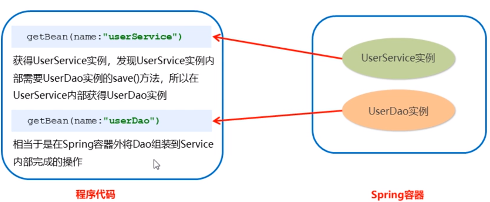

UserService对象的内部还需要调用UserDao对象来完成一定的操作，而Controller层最终需要的只有一个UserService对象，对于UserDao对象，Controller层不需要（不直接需要），所以它不管UserDao对象怎么来的，通过什么样的方法让UserService对象获取到。

> 既然Controller层不在乎UserService是通过什么方法获取到UserDao的，所以能不能给出一种解决方法使得在Spring容器内部就能使UserService获取到UserDao对象。

**因为UserService和UserDao都在Spring容器中，而最终程序直接使用的是UserService，所以可以在Spring容器中将UserDao设置到UserService内部**

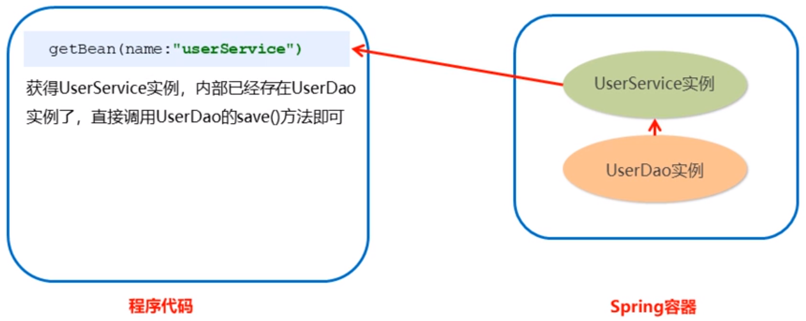

为了实现上面的思路，我们可以将UserDao设为UserService的一个属性，然后通过set方法或有参构造器的方法为该属性赋值。

### 3.4.2 依赖注入

依赖注入：（**Dependency Injection**）Spring框架核心IOC的具体体现。

在编写程序时，通过控制反转，将对象的创建交给了Spring，但是代码中不可能出现没有依赖的情况，IOC解耦知识降低了他们的依赖关系，但不会消除。列如：业务层仍会调用持久层的方法。

这种业务层和持久层的依赖关系，在使用Spring之后就交由Spring来维护了，简单的说就是坐等框架把持久层对象传入业务层，而不用我们自己去获取。

依赖注入的方式：

- **<font color=red>有参构造</font>**
- **<font color=red>set方法</font>**

#### 3.4.2.1 set方法依赖注入

先将UserDao作为UserServiceImpl的属性设置进去，然后设置get和set方法设置和获取UserDao，UserServiceImpl代码如下

```java
package com.nanyu.service.impl;
import com.nanyu.dao.UserDao;
import com.nanyu.service.UserService;
import org.springframework.context.ApplicationContext;
import org.springframework.context.support.ClassPathXmlApplicationContext;

public class UserServiceImpl implements UserService {

    private UserDao userDao;

    public UserDao getUserDao() {
        return userDao;
    }

    public void setUserDao(UserDao userDao) {
        this.userDao = userDao;
    }
    @Override
    public void save() {
        userDao.save();
    }
}

```

但是这样设置之后Spring并不知道我们做了这些操作，所以我们还需要通过配置文件告诉Spring我们要把UserDao注入到UserServiceImpl中

```xml
<bean id="userDao" class="com.nanyu.dao.impl.UserDaoImpl"></bean>
<bean id="userService" class="com.nanyu.service.impl.UserServiceImpl">
    <property name="userDao" ref="userDao"></property>
</bean>
```

- property：标识属性的意思，指为该bean对象（这里指`UserServiceImpl`对象）中的对应的属性设置值。
- name：表示为该Bean对象（这里指`UserServiceImpl`对象）中的哪个属性设置值，这里是为`UserServiceImpl`中的`userDao`属性设置值
- ref：表示为该属性设置什么值，ref表示对象引用，只能用来设置一个对象，这里是把`UserDao`（这个UserDao对象是SPring容器中，通过Bean标签配置出来的对象）设置给该属性。这里设置的时候传递的是上面获取UserDao的Bean对象的id

Controller中测试如下

```java
package com.nanyu.controller;

import com.nanyu.service.UserService;
import com.nanyu.service.impl.UserServiceImpl;
import org.springframework.context.ApplicationContext;
import org.springframework.context.support.ClassPathXmlApplicationContext;

public class UserController {
    public static void main(String[] args) {
        ApplicationContext app=new ClassPathXmlApplicationContext("applicationContext.xml");
        UserServiceImpl userService = (UserServiceImpl)app.getBean("userService");
        userService.save();
    }
}

/*
输出结果
save is running!
*/
```

上面这种方法能够运行成功，说明通过Spring配置成功地将UserDao对象注入到了UserServiceImpl内部，不用再使用new关键字在Spring外部手动创建对象。

如果使用new关键字创建UserServiceImpl对象会发生什么情况

```java
package com.nanyu.controller;

import com.nanyu.service.UserService;
import com.nanyu.service.impl.UserServiceImpl;
import org.springframework.context.ApplicationContext;
import org.springframework.context.support.ClassPathXmlApplicationContext;

public class UserController {
    public static void main(String[] args) {
        UserService userService=new UserServiceImpl();
        userService.save();
    }
}

/*
输出结果
Exception in thread "main" java.lang.NullPointerException
	at com.nanyu.service.impl.UserServiceImpl.save(UserServiceImpl.java:21)
	at com.nanyu.controller.UserController.main(UserController.java:14)
*/
```

从上面输出结果可知，发生了空指针异常，原因如下：

> ` (UserServiceImpl)app.getBean("userService");`获取到的UserServiceImpl对象是Spring容器内部的对象，把UserDao注入到UserServiceImpl的对象也是这个对象，这里的UserDao和UserServiceImpl对象都是Spring容器内部的对象，依赖注入也是在Spring容器内部发生的。通过new关键字创建出来的UserServiceImpl对象，属于Spring容器外部，与Spring容器内部的哪个UserServiceImpl对象是两个完全不同的对象，并且这个外部对象没有进行依赖注入，因此用new关键字创建出来的这个对象内部虽然具有userDao对象属性，但是没有赋值，所以调用的时候会发生空指针异常

#### 3.4.2.2 P命名空间注入

P命名空间注入本质也是set注入，但比起上述的set方法注入更加方便，主要体现在配置文件中，如下：

使用之前需要先引入P命名空间

```xml
xmlns:p="http://www.springframework.org/schema/p"
```

然后修改注入方式，也就是修改配置文件

```xml
<bean id="userService" class="com.nanyu.service.impl.UserServiceImpl" p:userDao-ref="userDao"></bean>
```

完整代码如下：

```xml
<?xml version="1.0" encoding="UTF-8"?>
<beans xmlns="http://www.springframework.org/schema/beans"
       xmlns:xsi="http://www.w3.org/2001/XMLSchema-instance"
       xmlns:p="http://www.springframework.org/schema/p"
       xsi:schemaLocation="http://www.springframework.org/schema/beans http://www.springframework.org/schema/beans/spring-beans.xsd">

    <!--    <bean id="userDao" class="com.nanyu.dao.impl.UserDaoImpl"></bean>-->
    <!--    <bean id="userService" class="com.nanyu.service.impl.UserServiceImpl">-->
    <!--        <property name="userDao" ref="userDao"></property>-->
    <!--    </bean>-->
    
    <bean id="userService" class="com.nanyu.service.impl.UserServiceImpl" p:userDao-ref="userDao"></bean>
</beans>
```

上面两种方法都属于set注入，只不过写的方法不同而已，最终效果都能够实现依赖注入。

一般来说还是用子标签的形式编写配置，因为读起来更简洁、更易懂

#### 3.4.2.3 有参构造依赖注入

有参构造即通过有参构造器实现依赖注入，这种方法需要被注入的一方内部提供一个有参构造器，该构造器的作用之一是为了给需要注入的属性赋值

UserDaoImpl中的代码保持不变

```java
package com.nanyu.dao.impl;
import com.nanyu.dao.UserDao;

public class UserDaoImpl implements UserDao {
    
    @Override
    public void save() {
        System.out.println("save is running!");
    }
}
```

在UserServiceImpl中增加一个有参构造，此时便不需要get和set方法了，代码如下：

```java
package com.nanyu.service.impl;
import com.nanyu.dao.UserDao;
import com.nanyu.service.UserService;

public class UserServiceImpl implements UserService {

    private UserDao userDao;
    
    public UserServiceImpl(UserDao userDao){
        this.userDao=userDao;
    }
    
    public UserServiceImpl(){}
    
    @Override
    public void save() {
        userDao.save();
    }
}
```

代码完成了，但是我们如果不告诉Spring容器，Spring容器不会知道我们要干什么，所以我们还要告诉Spring容器我要通过有参构造的形式将UserDao对象注入到UserServiceImpl中

**注意**：**<font color=red>这种注入还是在Spring内部完成的，操作的也是Spring容器中的Userdao Bean对象和UserServiceImpl对象，如果通过new关键字创建出来的UserServiceImpl不属于Spring容器内部，没有进行依赖注入</font>**

要告知Spring容器我们要通过有参构造的形式完成依赖注入还是需要通过核心配置文件的形式

```xml
<?xml version="1.0" encoding="UTF-8"?>
<beans xmlns="http://www.springframework.org/schema/beans"
       xmlns:xsi="http://www.w3.org/2001/XMLSchema-instance"
       xmlns:p="http://www.springframework.org/schema/p"
       xsi:schemaLocation="http://www.springframework.org/schema/beans http://www.springframework.org/schema/beans/spring-beans.xsd">

    <bean id="userDao" class="com.nanyu.dao.impl.UserDaoImpl"></bean>
    <bean id="userService" class="com.nanyu.service.impl.UserServiceImpl">
        <constructor-arg name="userDao" ref="userDao"></constructor-arg>
    </bean>
</beans>
```

属性介绍：

- constructor-arg：表示构造器参数，这是一个为构造器赋值的属性
- name：该属性指定要为有参构造的哪个参数赋值，userDao表示的是构造器的参数名
- ref：表示对象引用，表示为上面表示参数名的name赋什么值，即为userDao属性赋值

下面执行Controller测试：

```java
package com.nanyu.controller;

import com.nanyu.service.UserService;
import com.nanyu.service.impl.UserServiceImpl;
import org.springframework.context.ApplicationContext;
import org.springframework.context.support.ClassPathXmlApplicationContext;

public class UserController {
    public static void main(String[] args) {
        ApplicationContext app=new ClassPathXmlApplicationContext("applicationContext.xml");
        UserServiceImpl userService = (UserServiceImpl)app.getBean("userService");
        userService.save();
    }
}

/*
输出结果：
save is running!
*/
```

### 3.4.3 Bean依赖注入的数据类型

上面的操作注入的都是引用Bean（即将一个Bean对象注入到另一个中），除了对象的引用可以注入，普通数据类型、集合等都可以在容器中进行注入。

注入的数据类型主要有下面三种：

- 普通数据类型
- 引用数据类型
- 集合数据类型

#### 3.4.3.1 普通数据类型注入

在UserDaoImpl中新增两个普通数据类型属性（注String是引用数据类型，但可以直接为其赋值）

```java
package com.nanyu.dao.impl;

import com.nanyu.dao.UserDao;

public class UserDaoImpl implements UserDao {

    private String str;
    private int num;

    public UserDaoImpl(String str, int num) {
        this.str = str;
        this.num = num;
    }
    public UserDaoImpl(){}

    @Override
    public void save() {
        System.out.println("save is running!");
        System.out.println(str);
        System.out.println(num);
        System.out.println("属性注入成功！");
    }

}
```

编写Spring核心配置文件

```xml
<?xml version="1.0" encoding="UTF-8"?>
<beans xmlns="http://www.springframework.org/schema/beans"
       xmlns:xsi="http://www.w3.org/2001/XMLSchema-instance"
       xmlns:p="http://www.springframework.org/schema/p"
       xsi:schemaLocation="http://www.springframework.org/schema/beans http://www.springframework.org/schema/beans/spring-beans.xsd">

    <!--  有参构造器形式注入-->
    <bean id="userDao" class="com.nanyu.dao.impl.UserDaoImpl">
        <constructor-arg name="num" value="1"></constructor-arg>
        <constructor-arg name="str" value="你好"></constructor-arg>
    </bean>


</beans>
```

测试

```java
package com.nanyu.controller;
import com.nanyu.dao.UserDao;
import com.nanyu.dao.impl.UserDaoImpl;
import com.nanyu.service.UserService;
import com.nanyu.service.impl.UserServiceImpl;
import org.springframework.context.ApplicationContext;
import org.springframework.context.support.ClassPathXmlApplicationContext;

public class UserController {
    public static void main(String[] args) {
        ApplicationContext app=new ClassPathXmlApplicationContext("applicationContext.xml");
        UserDao userDao = (UserDaoImpl)app.getBean("userDao");
        userDao.save();
    }
}

/*
输出结果：
save is running!
你好
1
属性注入成功！
*/
```

通过set方法注入的配置如下，其他不再演示

```xml
<?xml version="1.0" encoding="UTF-8"?>
<beans xmlns="http://www.springframework.org/schema/beans"
       xmlns:xsi="http://www.w3.org/2001/XMLSchema-instance"
       xmlns:p="http://www.springframework.org/schema/p"
       xsi:schemaLocation="http://www.springframework.org/schema/beans http://www.springframework.org/schema/beans/spring-beans.xsd">
    <!--        set形式注入-->
    <bean id="userDao" class="com.nanyu.dao.impl.UserDaoImpl">
        <property name="num" value="1"></property>
        <property name="str" value="你好"></property>
    </bean>


</beans>
```

#### 3.4.3.2 集合数据类型注入

1. 先在UserDaoImpl中增加List、Map、properties属性，同时设置get、set、toString方法。

- [ ] Properties：也是一种集合，类似Map集合，只不过这种集合键值都是String类型

```java
package com.nanyu.dao.impl;
import com.nanyu.dao.UserDao;
import com.nanyu.pojo.User;
import java.util.List;
import java.util.Map;
import java.util.Properties;

public class UserDaoImpl implements UserDao {

private List<String> list;
private Map<String, User> map;
private Properties properties;

    public List<String> getList() {
        return list;
    }

    public void setList(List<String> list) {
        this.list = list;
    }

    public Map<String, User> getMap() {
        return map;
    }

    public void setMap(Map<String, User> map) {
        this.map = map;
    }

    public Properties getProperties() {
        return properties;
    }

    public void setProperties(Properties properties) {
        this.properties = properties;
    }

    public UserDaoImpl(){}

    @Override
    public String toString() {
        return "UserDaoImpl{" +
                "list=" + list +
                ", map=" + map +
                ", properties=" + properties +
                '}';
    }

    @Override
    public void save() {
        System.out.println("save is running");
        System.out.println(list);
        System.out.println(map);
        System.out.println(properties);
        System.out.println("集合已被注入。。。");
    }
}
```

2. 创建一个实体类User，用于上面Map集合中的对象引用（省去了get和set方法，以及toString也省去了）

```java
package com.nanyu.pojo;

public class User {
    private String username;
    private String password;
}
```

3. 编写配置信息

```xml
<bean id="user1" class="com.nanyu.pojo.User">
    <property name="password" value="1111111"></property>
    <property name="username" value="zhangsan"></property>
</bean>

<bean id="user2" class="com.nanyu.pojo.User">
    <property name="password" value="1111111"></property>
    <property name="username" value="zhangsan"></property>
</bean>

<bean id="userDao" class="com.nanyu.dao.impl.UserDaoImpl">
    <property name="list">
        <list>
            <!--如果是普通数据类型用value标签存值，如果是引用数据类型用ref标签-->
            <value>1</value>
            <value>2</value>
            <value>aaa</value>
        </list>
    </property>

    <property name="map">
        <map>
            <entry key="user1" value-ref="user1"></entry>
            <entry key="user2" value-ref="user2"></entry>
        </map>
    </property>

    <property name="properties">
        <props>
            <prop key="key1">key1</prop>
            <prop key="key2">key2</prop>
            <prop key="key3">key3</prop>
        </props>
    </property>
</bean>


```

从外到内属性介绍：

- property：为属性赋值
- name：指定为`com.nanyu.dao.impl.UserDaoImpl`类中的哪个属性赋值
- list：需要赋值的属性的数据类型，表示需要赋值的属性是List集合数据类型。value：为该属性的值，即向该List集合中添加值，如果是String类型或普通数据类型，直接使用value赋值即可，如果是引用数据类型用ref
- map：需要赋值的属性的数据类型，表示需要赋值的属性是Map集合数据类型
- entry：为Map的键值对赋值，key表示键值对的key，如果是引用数据类型就用key-ref，value表示键值对的值，如果是引用数据类型就用value-ref
- props：需要赋值的属性的数据类型，表示需要赋值的属性是Properties数据类型
- prop：为properties赋值的键值对，key表示键值对的键，键值对的值直接写在双标签中。

4. 测试代码：

```java
package com.nanyu.Test;

import com.nanyu.dao.UserDao;
import org.springframework.context.ApplicationContext;
import org.springframework.context.support.ClassPathXmlApplicationContext;

public class Test {
    public static void main(String[] args) {
        //创建容器
        ApplicationContext app = new ClassPathXmlApplicationContext("applicationContext.xml");
//        ClassPathXmlApplicationContext app1 = new ClassPathXmlApplicationContext("applicationContext.xml");

        UserDao userDao = (UserDao) app.getBean("userDao");
        System.out.println(userDao);
    }
}

/*
输出结果：
UserDaoImpl{list=[1, 2, aaa], map={user1=User{username='zhangsan', password='1111111'}, user2=User{username='zhangsan', password='1111111'}}, properties={key3=key3, key2=key2, key1=key1}}
*/
```

## 3.5 小结

这一小节的配置文件如下：

```xml
<?xml version="1.0" encoding="UTF-8"?>
<beans xmlns="http://www.springframework.org/schema/beans"
       xmlns:xsi="http://www.w3.org/2001/XMLSchema-instance"
       xmlns:p="http://www.springframework.org/schema/p"
       xsi:schemaLocation="http://www.springframework.org/schema/beans http://www.springframework.org/schema/beans/spring-beans.xsd">

    <!--    对象获取的三种方法-->

    <!--1. 无参构造方法获取Bean对象（反射原理）-->
    <!--    <bean id="userDao" class="com.nanyu.dao.impl.UserDaoImpl" scope="singleton" init-method="init" destroy-method="destroy"></bean>-->

    <!--2. 静态工厂获取Bean对象-->
    <!--    <bean id="userDao" class="com.nanyu.factory.StaticFactory" factory-method="getUserDao"></bean>-->

    <!--3. 动态工厂获取Bean对象-->
    <!--    <bean id="factory" class="com.nanyu.factory.DynamicFactory"></bean>-->
    <!--   根据获取到的工厂的Bean对象获取UserDao的Bean对象-->
    <!--    <bean id="userDao" factory-bean="factory" factory-method="getUserDao"></bean>-->


    <!--    依赖注入的两种方式-->


    <!--1. set方法依赖注入-->
    <!--    <bean id="userDao" class="com.nanyu.dao.impl.UserDaoImpl"></bean>-->
    <!--    <bean id="userService" class="com.nanyu.service.impl.UserServiceImpl">-->
    <!--        <property name="userDao" ref="userDao"></property>-->
    <!--    </bean>-->
    <!--    P命名空间依赖注入（本质还是set方法）-->
    <!--    <bean id="userService" class="com.nanyu.service.impl.UserServiceImpl" p:userDao-ref="userDao"></bean>-->


    <!--2. 有参构造方法依赖注入-->
    <!--    <bean id="userDao" class="com.nanyu.dao.impl.UserDaoImpl"></bean>-->
    <!--    <bean id="userService" class="com.nanyu.service.impl.UserServiceImpl">-->
    <!--        <constructor-arg name="userDao" ref="userDao"></constructor-arg>-->
    <!--    </bean>-->

    <!--    依赖注入的三种数据类型-->
    <!--1. 普通数据类型-->

    <!--    有参构造形式注入-->
    <!--    <bean id="userDao" class="com.nanyu.dao.impl.UserDaoImpl">-->
    <!--        <constructor-arg name="num" value="1"></constructor-arg>-->
    <!--        <constructor-arg name="str" value="你好"></constructor-arg>-->
    <!--    </bean>-->
    <!--    &lt;!&ndash;        set形式注入&ndash;&gt;-->
    <!--    <bean id="userDao" class="com.nanyu.dao.impl.UserDaoImpl">-->
    <!--        <property name="num" value="1"></property>-->
    <!--        <property name="str" value="你好"></property>-->
    <!--    </bean>-->

    <!--    2. 对象数据类型注入：不再介绍-->
    <!--    <bean id="userDao" class="com.nanyu.dao.impl.UserDaoImpl">-->
    <!--        <constructor-arg name="num" value="1"></constructor-arg>-->
    <!--        <constructor-arg name="str" value="你好"></constructor-arg>-->
    <!--    </bean>-->
    <!--    <bean id="userService" class="com.nanyu.service.impl.UserServiceImpl">-->
    <!--        <property name="userDao" ref="userDao"></property>-->
    <!--    </bean>-->

    <!--    3. 集合数据类型注入-->
    <bean id="user1" class="com.nanyu.pojo.User">
        <property name="password" value="1111111"></property>
        <property name="username" value="zhangsan"></property>
    </bean>

    <bean id="user2" class="com.nanyu.pojo.User">
        <property name="password" value="1111111"></property>
        <property name="username" value="zhangsan"></property>
    </bean>

    <bean id="userDao" class="com.nanyu.dao.impl.UserDaoImpl">
        <property name="list">
            <list>
                <!--如果是普通数据类型用value标签存值，如果是引用数据类型用ref标签-->
                <value>1</value>
                <value>2</value>
                <value>aaa</value>
            </list>
        </property>

        <property name="map">
            <map>
                <entry key="user1" value-ref="user1"></entry>
                <entry key="user2" value-ref="user2"></entry>
            </map>
        </property>

        <property name="properties">
            <props>
                <prop key="key1">key1</prop>
                <prop key="key2">key2</prop>
                <prop key="key3">key3</prop>
            </props>
        </property>
    </bean>


</beans>
```

我们不难发现一个问题，就是如果在一个完整的项目中我们可能会写更多的配置文件，到时候配置文件全都写在一个文件中会使得可读性非常的差并且维护起来也非常不容易，所以有了分模块开发的策略，即将一个大的模块划分为若干小的模块，每个模块编写对应的xml配置文件，当需要修改时只需要修改对应模块的配置文件即可，最后通过import，将这些分模块导入到一个核心的模块中进行加载。

如下：有一个user模块的xml配置`applicationContext-user.xml`，还有一个admin模块的xml配置`applicationContext-admin.xml`，另外还有一个Spring加载的核心配置文件`applicationContext.xml`先需要将user、admin两个分模块的配置文件加载到一个核心配置文件中

```xml
<?xml version="1.0" encoding="UTF-8"?>
<beans xmlns="http://www.springframework.org/schema/beans"
       xmlns:xsi="http://www.w3.org/2001/XMLSchema-instance"
       xmlns:p="http://www.springframework.org/schema/p"
       xsi:schemaLocation="http://www.springframework.org/schema/beans http://www.springframework.org/schema/beans/spring-beans.xsd">
    
    <!--    加载分模块配置文件-->
    <import resource="applicationContext-admin.xml"></import>
    <import resource="applicationContext-user.xml"></import>

</beans>
```

**<font color=red>Spring重点配置</font>**

| 标签            | 说明                 | 属性                                                         |
| --------------- | -------------------- | ------------------------------------------------------------ |
| bean            | 在容器中实例化对象   | id：对象在Spring容器中的唯一标识<br>class：要实例化的Bean的全限定名<br>scope：控制Bean的作用范围、对象创建个数、创建时机（singleton、prototype） |
| property        | set形式属性注入      | name：属性名称<br>value：属性值                              |
| list            | 为List集合注入内容   | value标签：向List中注入的值                                  |
| map             | 为Map集合注入内容    | entry标签：向Map中注入数据，key/key-ref：要注入的键，value/value-ref：要注入的值 |
| properties      | 为properties注入内容 | props标签：prop父标签，prop标签：要注入的数据                |
| constructor-arg | 构造器形式注入数据   | name：被注入的属性的名称<br>value/ref：注入的值，可以是普通数据类型，也可以是引用数据类型 |
| import          | 导入分模块           | resource：其他模块的配置文件名称                             |

# 4. Spring相关API

相关API着重分析，下面代码中的接口

```java
ApplicationContext app=new ClassPathXmlApplicationContext("applicationContext.xml");
UserService userService = (UserServiceImpl)app.getBean("userService");
UserDao userDao = (UserDaoImpl)app.getBean("userDao");
```

分析以下下面这句话：

```java
ApplicationContext app=new ClassPathXmlApplicationContext("applicationContext.xml");
```

这句话的含义是创建应用上下文对象，同时创建Spring容器，这句话是通过多态的形式实现的。

`ApplicationContex`t：**<font color=red>是应用上下文接口，可以通过它的实例获取到Spring容器中的Bean对象</font>**

`ClassPathXmlApplicationContext`：是该接口的实现类

## 4.1 ApplicationContext实现类

既然`ApplicaitonContext`是接口，那么他就应该有实现类，上面已经提到了`ClassPathXmlApplicationContext`就是他的一个实现类。但其实它还有很多实现类，不过比较重要的，目前我们需要用到的就下面三个，根据下面三个可以创建ApplicationContext的实例，通过该实例获取Spring容器中的Bean对象

- **<font color=red>ClassPathXmlApplicationContext</font>**：从根路径下加载配置文件（推荐使用这种）

```java
ApplicationContext app=new ClassPathXmlApplicationContext("applicationContext.xml");
```

- **<font color=red>FileSystemXmlApplicationContext</font>**：从磁盘路径上加载配置文件，配置文件可以在磁盘的任意位置（用的不多）

```java
ApplicationContext app=new FileSystemXmlApplicationContext("D:\\Appinstall\\Idea\\Project\\SpringStudy\\src\\main\\resources\\applicationContext.xml");
```

- **<font color=red>AnnotationConfigApplicationContext</font>**：当使用注解配置容器对象时，需要使用此类来创建Spring容器（它需要的参数是一个实体配置类），它用来读取注解。注解开发的时候需要，暂时不需要这个

## 4.2 getBean()方法

getBean()源码如下：

```java
public Object getBean(String name) throws BeansException {
    this.assertBeanFactoryActive();
    return this.getBeanFactory().getBean(name);
}

public <T> T getBean(String name, Class<T> requiredType) throws BeansException {
    this.assertBeanFactoryActive();
    return this.getBeanFactory().getBean(name, requiredType);
}
```

从源码文件中可以看到getBean()方法有以上两种（其实不止两种），两种getBean()需要的参数不同，

第一种需要的一个字符串，该字符串表示的是Bean对象在Spring容器中的唯一标识id。

```java
ClassPathXmlApplicationContext app=new ClassPathXmlApplicationContext("applicationContext.xml");
UserDao userDao = (UserDaoImpl)app.getBean("userDao");
System.out.println(userDao);
```

第二种需要的是字节码文件，传入一个字节码文件，Spring会在容器中寻找与该文件类型相同的Bean对象，找到后返回。

```java
ApplicationContext app = new ClassPathXmlApplicationContext("applicationContext.xml");
// UserDao userDao = (UserDao) app.getBean("userDao");
UserDaoImpl bean = app.getBean(UserDaoImpl.class);
System.out.println(bean);
```

**<font color=red>注意：</font>**

- 第一种方法使用没有限制，任何情况下都可以从Spring容器中通过Bean对象的唯一标识获取到该Bean对象
- **<font color=red>第二种只适用于Spring容器中只存在一个该类型的Bean对象，因为它的原理是进行类型一对一匹配，所以Spring容器中只能有一个与字节码文件相同类型的对象，否则会报错</font>**，比如`UserDaoImpl`这个对象在Spring容器中只能有一个（要想使用字节码形式获取Bean，创建对象不能使用`scope='prrototype'`，否则将会创建多个对象）
- 当某一类型的Bean在Spring中存在多个，只能用id的形式获取；当某一个类型的Bean在Spring中只有一个，可以用id也可以用字节码文件的形式获取。

# 5. Spring配置数据源

数据源：**数据库连接池**，以下数据源可理解为数据库连接池或连接池

## 5.1 连接池的作用

- 数据源（连接池）是提高程序性能出现的
- 事先实例化数据源（连接池），初始化部分连接资源
- 使用连接资源时从数据源（连接池）中获取
- 使用完毕后将连接资源还给连接池

常见的数据源：**<font color=red>DBCP、C3P0、BoneCP、Druid</font>**等

这些数据源的作用都是一样的，但每个数据源的底层实现可能不一样，每个数据源的性能也不一样，我们最常用的数据库连接池是C3P0、Druid

## 5.2 连接池使用步骤

- 导入数据库连接池的坐标和数据库驱动坐标
- 创建连接池对象
- 设置连接池的基本连接数据

- 使用连接池获取连接资源和归还连接资源

开发实战：

1. 导入数据库连接池坐标以及数据库驱动坐标

```xml
<!--c3p0数据库连接池-->
<dependency>
    <groupId>c3p0</groupId>
    <artifactId>c3p0</artifactId>
    <version>0.9.1.2</version>
</dependency>

<!--druid数据库连接池-->
<dependency>
    <groupId>com.alibaba</groupId>
    <artifactId>druid</artifactId>
    <version>1.1.24</version>
</dependency>

<dependency>
    <groupId>junit</groupId>
    <artifactId>junit</artifactId>
    <version>4.13</version>
</dependency>
```

2. 创建连接池对象
3. 设置连接池基本连接数据
4. 使用连接池获取连接资源和归还连接资源

```java
package com.nanyu.Test;

import com.mchange.v2.c3p0.ComboPooledDataSource;
import org.junit.Test;

import java.beans.PropertyVetoException;
import java.sql.Connection;

public class DataSourceTest {

    @Test
    // 测试手动创建c3p0数据源
    public void test() throws Exception {
        // 获取连接池对象
        ComboPooledDataSource dataSource=new ComboPooledDataSource();
        // 设置数据库驱动
        dataSource.setDriverClass("com.mysql.jdbc.Driver");
        // 设置数据库地址
        dataSource.setJdbcUrl("jdbc:mysql://localhost:3306/test");
        // 设置数据库访问名
        dataSource.setUser("root");
        // 设置数据库访问密码
        dataSource.setPassword("123456");
        
        // 获取数据库连接
        Connection connection = dataSource.getConnection();
        System.out.println(connection);
        connection.close();
    }
    
     @Test
    // 手动创建Druid数据库连接池
    public void test1() throws Exception{
        // 获取Druid连接池对象
        DruidDataSource dataSource=new DruidDataSource();
        // 设置连接池对象数据
        dataSource.setDriverClassName("com.mysql.jdbc.Driver");
        dataSource.setUrl("jdbc:mysql://localhost:3306/test");
        dataSource.setUsername("root");
        dataSource.setPassword("123456");
        DruidPooledConnection connection = dataSource.getConnection();
        System.out.println(connection);
        connection.close();
    }
}

/*
输出结果：
com.mchange.v2.c3p0.impl.NewProxyConnection@79698539（c3p0）
com.mysql.jdbc.JDBC4Connection@3cb5cdba（druid）
*/
```

## 5.3 JDBC配置文件抽取

上面的代码我们可以分析出一些弊端，即代码耦合性太强，如下面代码，数据库的信息都是直接写道字符串里，都是写死的，后期要更换数据库，可能要把数据库驱动、数据库连接地址、数据库密码、数据库用户名全部改掉，到时候还要找原源码，如果项目已经编译打包上线了，这样会更麻烦，所以这样写代码耦合性太强，有很多弊端。

```java
dataSource.setDriverClassName("com.mysql.jdbc.Driver");
dataSource.setUrl("jdbc:mysql://localhost:3306/test");
dataSource.setUsername("root");
dataSource.setPassword("123456");
```

既然上面代码耦合性太强，那么我们如何解耦？

其实我们完全可以仿照Spring的思路，使用配置文件的形式将数据库配置信息进行解耦，具体思路如下：

> 将数据库配置信息抽取到一个properties配置文件中，当项目编译打包后这个配置文件并不会受到影响，我们可以通过修改该配置文件来实现对数据库连接信息的修改

在resources下面创建一个jdbc.properties配置文件，用于配置数据库信息，**.properties中都是字符串形式的，里面的字符串不用引号**

```properties
jdbc.driver=com.mysql.jdbc.Driver
jdbc.url=jdbc:mysql://localhost:3306/test
jdbc.username=root
jdbc.password=123456
```

测试如下：

```java
@Test
// 手动创建C3P0连接池
public void test2() throws Exception{
    // 加载jdbc.properties配置文件
    ResourceBundle rb=ResourceBundle.getBundle("jdbc");
    // 获取配置文件中的信息
    String driver=rb.getString("jdbc.driver");
    String url=rb.getString("jdbc.url");
    String username=rb.getString("jdbc.username");
    String password=rb.getString("jdbc.password");
    ComboPooledDataSource dataSource=new ComboPooledDataSource();
    // 设置数据库驱动
    dataSource.setDriverClass(driver);
    // 设置数据库地址
    dataSource.setJdbcUrl(url);
    // 设置数据库访问名
    dataSource.setUser(username);
    // 设置数据库访问密码
    dataSource.setPassword(password);

    // 获取数据库连接
    Connection connection = dataSource.getConnection();
    System.out.println(connection);
    connection.close();
}
/*
输出结果：
com.mchange.v2.c3p0.impl.NewProxyConnection@73f792cf
*/
```

## 5.4 Spring配置连接池

上面是我们手动配置的数据库连接池信息，不管是我们创建.properties配置文件还是其他，其实都是我们手动配置的数据库连接池，那么Spring能不能接管连接池的配置呢？答案是可以的。

从上面的章节我们学习到了Spring创建一个Bean对象最简单的方式是通过无参构造（反射）。

回顾1：Spring环境搭建的步骤：

- 导入Spring-context坐标
- 创建需要放入Spring容器中的实体类（即上述例子中的UserDaoImpl、UserServiceImpl等）
- 在resource下创建Spring核心配置文件（名称任意，通常取applicationContext.xml）
- 编写配置，创建bean标签，创建Bean对象
- 通过Spring的API，getBean()获取对象

回顾2：Spring三种创建Beab对象的方法：

- 无参构造方法
- 工厂静态方法
- 工厂实例方法

回顾3：Spring依赖注入的两种方法：

- set方法依赖注入
- 有参构造方法依赖注入

创建Bean对象最简单的方法还是无参构造，也是用的最多的方法，如果要为Bean对象种的属性赋值，set方法和有参构造均可。那么现在抛出一个问题

> **<font color=red>如何让Spring创建连接池的Bean对象，如何把DataSource的创建权交由Spring？又如何为该连接池对象种的属性赋值？</font>**

观察下面代码，为数据库连接池赋值时，都是通过setXXX为对应参数赋值的，**说明连接池对象中存在get、set方法来为这些属性赋值**，通过这点刚好满足Spring创建Bean对象并且通过set方法为属性赋值的条件。

```java
dataSource.setDriverClassName("com.mysql.jdbc.Driver");
dataSource.setUrl("jdbc:mysql://localhost:3306/test");
dataSource.setUsername("root");
dataSource.setPassword("123456");
```

所以如果将dataSource的创建权交由Spring创建，那么代码形式是下面的形式

```xml
<!--创建Druid连接池对象-->
    <bean id="dataSource" class="com.alibaba.druid.pool.DruidDataSource">
        <property name="driverClassName" value="com.mysql.jdbc.Driver"></property>
        <property name="url" value="jdbc:mysql://localhost:3306/test"></property>
        <property name="username" value="root"></property>
        <property name="password" value="123456"></property>
    </bean>
```

IDEA中获取外部包全限定名的方式：

> **选中类名（如DruidDataSource）->鼠标右键->Copy/Paste Special->Copy Reference**

## 5.5 Spring加载properties文件

上面的代码虽然实现了把dataSource对象的创建权交给了Spring处理，但是从Spring配置文件中我们不难发现，property标签的value的值依然是字符串，相当于还是写死的，那么上面我们抽取的jdbc.properties相当于没什么用了。那么如何解决这种问题呢？有下面一种思路：

> **<font color=red>将jdbc.properties加载到Spring容器中，使用SpEL表达式的方式获取properties文件中的内容</font>**

如何将.properties加载进Spring核心配置文件呢？分为下面两步：

- 引入context命名空间

```xml
<?xml version="1.0" encoding="UTF-8"?>
<beans xmlns="http://www.springframework.org/schema/beans"
       xmlns:xsi="http://www.w3.org/2001/XMLSchema-instance"
       xmlns:p="http://www.springframework.org/schema/p"
       <!-- 1. 引入context命名空间-->
       xmlns:context="http://www.springframework.org/schema/context"
       xsi:schemaLocation=
       "http://www.springframework.org/schema/beans http://www.springframework.org/schema/beans/spring-beans.xsd
       <!-- 2. 引入context命名空间-->
       http://www.springframework.org/schema/context http://www.springframework.org/context/spring-context.xsd
        ">
```

- 加载配置文件

```xml
<context:property-placeholder location="classpath:jdbc.properties"></context:property-placeholder>
```

通过以上两个步骤就能将properties配置文件加载到Spring，加载到Spring容器之后，properties文件中的所有键值对相当于存在于Spring容器中，通过SpEL（Spring表达式语言，相当于JSP中的JSTL），直接从Spring容器中获取到properties的键值。

```xml
<!--创建Druid连接池对象-->
<bean id="dataSource" class="com.alibaba.druid.pool.DruidDataSource">
    <property name="driverClassName" value="${jdbc.driver}"></property>
    <property name="url" value="${jdbc.url}"></property>
    <property name="username" value="${jdbc.username}"></property>
    <property name="password" value="${jdbc.password}"></property>
</bean>
```

完整配置文件如下：

```xml
<?xml version="1.0" encoding="UTF-8"?>
<beans xmlns="http://www.springframework.org/schema/beans"
       xmlns:xsi="http://www.w3.org/2001/XMLSchema-instance"
       xmlns:context="http://www.springframework.org/schema/context"
       xsi:schemaLocation=
       "http://www.springframework.org/schema/beans http://www.springframework.org/schema/beans/spring-beans.xsd
       http://www.springframework.org/schema/context http://www.springframework.org/context/spring-context.xsd
        ">

	<!--加载外部properties配置文件-->
    <context:property-placeholder location="classpath:jdbc.properties"></context:property-placeholder>

    <!--创建Druid连接池对象-->
    <bean id="dataSource" class="com.alibaba.druid.pool.DruidDataSource">
        <property name="driverClassName" value="${jdbc.driver}"></property>
        <property name="url" value="${jdbc.url}"></property>
        <property name="username" value="${jdbc.username}"></property>
        <property name="password" value="${jdbc.password}"></property>
    </bean>

</beans>
```

Juit测试如下：

```java
@Test
// 通过Spring获取Druid的dataSource对象并配置连接池信息
public void test3() throws Exception{
    ApplicationContext app=new ClassPathXmlApplicationContext("applicationContext.xml");
    DruidDataSource dataSource = app.getBean(DruidDataSource.class);
    DruidPooledConnection connection = dataSource.getConnection();
    System.out.println(connection);
    connection.close();
}

/*
结果输出：
com.mysql.jdbc.JDBC4Connection@44821a96
*/
```

# 6. Spring注解开发

**以上均属于配置文件的形式开发项目，下面介绍注解形式开发项目**

相比于配置开发，注解开发好在哪？

> Spring是轻代码重配置的框架，配置比较繁重，影响开发效率，所以注解开发是一种趋势，注解代替xml配置文件可以大大简化配置，提高开发效率。
>
> 目前不止Spring，基本所有框架都存在两套配置，一套是xml配置，一套是注解配置。

Spring注解分为原始注解与新注解：原始注解与新注解的区分是按照注解出现的顺序，有部分注解出现的比较早就叫原始注解，有部分注解出现的比较晚就叫新注解

## 6.1 Spring原始注解

Spring原始注解主要用来代替<Bean>的配置

| 注解           | 说明                                                         |
| -------------- | ------------------------------------------------------------ |
| @Component     | 可使用在任何类上，用于实例化Bean（实例被标注的类为Bean对象） |
| @Controller    | 使用在web层类上用于实例化Bean（分层架构中用于将Web层的类实例为Bean对象） |
| @Service       | 使用在service层类上用于实例化Bean（分层架构中用于将Service层的类实例化为Bean对象） |
| @Repository    | 使用在dao层类上用于实例化Bean（分层架构中用于将Dao层的类实例化为Bean对象） |
| @Autowire      | 使用在字段上，用于根据类型依赖注入（用于注入引用数据类型的属性） |
| @Qualifier     | 结合@Autowired一起使用用于根据名称进行依赖注入（用于注入引用数据类型的属性） |
| @Resource      | 相当于@Autowired+@Qualifier，按照名称进行注入（用于注入引用数据类型的属性） |
| @Value         | 注入普通属性，包括String类型                                 |
| @Scope         | 标注Bean的作用范围                                           |
| @PostConstruct | 使用在方法上标注该方法是Bean的初始化方法                     |
| @PreDestory    | 使用在方法上标注该方法是Bean的销毁方法                       |

注解的使用：

下面将用注解的形式实现下面配置文件的配置

```xml
<?xml version="1.0" encoding="UTF-8"?>
<beans xmlns="http://www.springframework.org/schema/beans"
       xmlns:xsi="http://www.w3.org/2001/XMLSchema-instance"
       xmlns:context="http://www.springframework.org/schema/context"
       xsi:schemaLocation=
       "http://www.springframework.org/schema/beans http://www.springframework.org/schema/beans/spring-beans.xsd
       http://www.springframework.org/schema/context http://www.springframework.org/context/spring-context.xsd
        ">

    <!--加载外部properties配置文件-->

    <context:property-placeholder location="classpath:jdbc.properties"></context:property-placeholder>

    <!--创建Druid连接池对象-->
    <bean id="dataSource" class="com.alibaba.druid.pool.DruidDataSource">
        <property name="driverClassName" value="${jdbc.driver}"></property>
        <property name="url" value="${jdbc.url}"></property>
        <property name="username" value="${jdbc.username}"></property>
        <property name="password" value="${jdbc.password}"></property>
    </bean>

    <!--创建userDao与userService的Bean对象以及依赖注入-->
    <bean id="userDao" class="com.nanyu.dao.impl.UserDaoImpl">
        <property name="username" value="zhangsan"></property>
        <property name="num" value="1"></property>
    </bean>
    <bean id="userService" class="com.nanyu.service.impl.UserServiceImpl">
        <constructor-arg name="userDao" ref="userDao"></constructor-arg>
    </bean>

</beans>
```

### 6.1.1 @Component注解

下面的`@Component("userDao")`作用和xml配置文件中的`<bean id="userDao" class="com.nanyu.dao.impl.UserDaoImpl">`作用相同。

```java
// <bean id="userDao" class="com.nanyu.dao.impl.UserDaoImpl">
@Component("userDao")
public class UserDaoImpl implements UserDao {
    private String username;
    private int num;
    
    //get、set、toString方法已省略
    }
```

同理，下面的`@Component("userService")`的作用和xml配置文件中的`<bean id="userService" class="com.nanyu.service.impl.UserServiceImpl">`作用相同。

```java
// <bean id="userService" class="com.nanyu.service.impl.UserServiceImpl">
@Component("userService")
public class UserServiceImpl implements UserService {

    private UserDao userDao;
```

### 6.1.2 @Scope注解

```java
@Component("userService")
@Scope("singleton")
public class UserServiceImpl implements UserService {
    
}
```

该注解的作用和xml文件中的`<bean id="userService" class="com.nanyu.service.impl.UserServiceImpl" scope="singleton">`作用相同，主要有两个属性值：**singleton、prototype**

### 6.1.3 @PostConstruct、@PreDestory注解

```java
@PreDestroy
public void init(){
    System.out.println("init....");
}

@PostConstruct
public void destroy(){
    System.out.println("destroy.....");
}
```

这两个方法用来指定初始化时执行的方法和销毁时执行的方法，作用与xml中的`<bean id="userService" class="com.nanyu.service.impl.UserServiceImpl" init-method="init" destroy-method="destroy">`相同

PreDestroy：销毁前

PostConstruct：销毁后

### 6.1.4 @Value注解

```java
@Component("userDao")
public class UserDaoImpl implements UserDao {
    // <property name="username" value="zhangsan"></property>
    @Value("zhangsan")
    private String username;
    
    // <property name="num" value="1"></property>
    @Value("1")
    private int num;
    
    @Value("${jdbc.url}")
    private String url;

}
```

**@Value是用来注入普通数据类型的属性的**，如上： `@Value("zhangsan")`的作用与xml配置中的`<property name="username" value="zhangsan"></property>`作用一致，` @Value("1")`也是如此。

但是如果@Value这样用的话发挥不出来其价值，因为这样还不如在声明变量的时候就直接指定变量的值，这样使用@Value有点大材小用，所以**@Value一般搭配SpEL表达式一起使用**，如下：

```java
@Value("${jdbc.url}")
private String url;
```

这样使用SpEL直接从Spring容器中获取值，然后注入给该属性才能体现出@Value的价值。

### 6.1.5 @Autowired、@Qualifier、@Resource的使用

这三个注解一般是用于注入引用数据类型的属性时才会使用，比如将userDao注入到userService内部。

```java
@Component("userService")
public class UserServiceImpl implements UserService {

    @Autowired
    @Qualifier("userDao")
    private UserDao userDao;
    
    
    @Resource(name = "userDao")
    private UserDao userDao1;
    }
```

如下，`@Autowired、@Qualifier`两个注解要联合使用，一个表示要注入，另一个表示要将Spring容器中的哪个Bean对象注入给该属性。`@Qualifier("userDao")`中需要传递参数，该参数是一个id，是容器中其他Bean对象的唯一标识Id，含义就是将容器中该Id对应的Bean对象注入到该属性。
`@Resource(name = "userDao")`注解的作用与`@Autowired、@Qualifier`一起用相同

### 6.1.6 @Controller、@Service、@Repository注解

上面我们知道了，如果要将一个类实例化为Bean对象，那么需要在这个类上加上注解@Component，但是这样做有一个缺点：

> 如果采用分层思想，使用@Component注解无法区分哪个@Component注解标注的类是Dao层、哪个是Service层、哪个是Web层。为了让用户一目了然区分出Dao层、Service层、Web层，Spring提供了三个衍生注解。

这三个注解的作用与@Component注解相同，都是实例化类为Bean对象存储与Spring容器中，但不同的是这三个注解分别作用在不同的分层上。

@Controller需要标注在Web层实体类上；@Service需要标注在业务层实体类上；@Repository需要标注在Dao层实体类上；程序示例如下：

Dao层：

```java
// @Component("userDao")
@Repository("userDao")
public class UserDaoImpl implements UserDao {
}
```

Service层：

```java
// @Component("userService")
@Service("userService")
public class UserServiceImpl implements UserService {
}
```

Web层：

```java
@Controller
public class UserController {
}
```

## 6.2 组件扫描

**<font color=red>使用注解开发时，需要在Spring核心配置文件中配置组件扫描，作用是指定哪个包及其子包下的Bean需要进行扫描以便识别使用注解配置的类、字段和方法。</font>**

虽然我们已经配置好了注解，但是并没有告诉Spring，如果不告诉Spring，他就无法帮我们创建Bean对象，我们写的注解知识摆设。那么如何告诉Spring，让他识别我们的注解呢？

> 需要在xml中配置组件扫描，通过组件扫描的形式告知Spring我们在什么地方编写了注解，让其到对应的包下识别注解并帮我们完成生成Bean对象、依赖注入等操作

配置包扫描同样需要引入context命名空间

```xml
<!--配置组件扫描-->
<context:component-scan base-package="com.nanyu"></context:component-scan>
```

以上我们就完成了Spring注解开发的入门程序，完整代码如下：

- applicationContext.xml配置如下：

```xml
<?xml version="1.0" encoding="UTF-8"?>
<beans xmlns="http://www.springframework.org/schema/beans"
       xmlns:xsi="http://www.w3.org/2001/XMLSchema-instance"
       xmlns:context="http://www.springframework.org/schema/context"
       xsi:schemaLocation=
"http://www.springframework.org/schema/beans http://www.springframework.org/schema/beans/spring-beans.xsd
http://www.springframework.org/schema/context http://www.springframework.org/context/spring-context.xsd
        ">

    <!--加载外部properties配置文件-->
    <context:property-placeholder location="classpath:jdbc.properties"></context:property-placeholder>

    <!--配置组件扫描-->
    <context:component-scan base-package="com.nanyu"></context:component-scan>

</beans>
```

- UserDaoImpl如下：

```java
package com.nanyu.dao.impl;

import com.nanyu.dao.UserDao;
import org.springframework.beans.factory.annotation.Value;
import org.springframework.stereotype.Component;

// <bean id="userDao" class="com.nanyu.dao.impl.UserDaoImpl">
@Component("userDao")
// @Repository("userDao")
public class UserDaoImpl implements UserDao {

    @Value("zhangsan")
    private String username;
    @Value("1")
    private int num;
    @Value("${jdbc.url}")
    private String url;
    
    // get、set、toString方法已经省略

    @Override
    public void save() {
        System.out.println("save is running");
        System.out.println(username);
        System.out.println(num);
        System.out.println(url);
        System.out.println("集合已被注入。。。");
    }
}
```

- UserServiceImpl如下：

```java
package com.nanyu.service.impl;

import com.nanyu.dao.UserDao;
import com.nanyu.service.UserService;
import org.springframework.beans.factory.annotation.Autowired;
import org.springframework.beans.factory.annotation.Qualifier;
import org.springframework.context.annotation.Scope;
import org.springframework.stereotype.Component;

import javax.annotation.PostConstruct;
import javax.annotation.PreDestroy;
import javax.annotation.Resource;

// <bean id="userService" class="com.nanyu.service.impl.UserServiceImpl">
@Component("userService")
// @Service("userService")
@Scope("singleton")
public class UserServiceImpl implements UserService {

    @Autowired
    @Qualifier("userDao")
    private UserDao userDao;

    //get、set、toString等方法已省略

    @Override
    public void save() {
        userDao.save();
    }
}
```

- 测试代码如下（用的Junit进行测试）：

```java
package com.nanyu.Test;
import com.nanyu.service.impl.UserServiceImpl;
import org.junit.Test;
import org.springframework.context.ApplicationContext;
import org.springframework.context.support.ClassPathXmlApplicationContext;

public class Test {

    @Test
    public  void test() {
        ApplicationContext app = new ClassPathXmlApplicationContext("applicationContext1.xml");
        UserServiceImpl userService = app.getBean(UserServiceImpl.class);
        userService.save();
        System.out.println(userService);
    }
}

/*
输出结果：
save is running
zhangsan
1
jdbc:mysql://localhost:3306/test
集合已被注入。。。
UserServiceImpl{userDao=UserDaoImpl{username='zhangsan', num=1, url='jdbc:mysql://localhost:3306/test'}}
*/
```

## 6.3 Spring新注解

为什么要有新注解？

> **<font color=red>为了完全替代Xml配置。</font>**通过上面学习到的原始注解我们可以发现，要想使用注解完全代替xml配置吗，其实有些xml配置是原始注解实现不了的，比如组件扫描、加载properties配置文件、实例化非自定义类（下面有介绍）等。

为什么原始注解不能实例化非自定义的类？

> 非自定义的类就是我们导包导进来的类，比如Druid连接池的DruidDataSource类或者Math工具类，这些都不是我们自己写的类，都是别人写好，我们导包使用。
>
> 以连接池为例：无论是Druid、C3P0还是其他的连接池对象，他们均来自于我们导入的包，也就是说这些类并不属于我们，是别人帮我们写好的，我们只能导包使用，并不能修改其源码，不能修改源码意味着我们**不能**在这个类上增加注解将这些实体类实例化为Bean对象放在Spring容器中，只能通过Xml配置利用反射加无参构造器实现。
>
> 这是原始注解不能实现的功能之一（xml配置可以实现），因此引入了新注解来实现原始注解不能实现的这些Xml配置。

总结原始注解不能实现的配置如下几点：

- 非自定义的Bean的配置：`<bean>`
- 加载properties文件的配置：`<context:property-placeholder>`
- 组件扫描的配置：`<context:component-scan>`

**<font color=red>新注解的引入就是为了解决上面XML配置能实现，但原始注解无法实现的功能。新注解的使用完全替代了Xml配置，将加载Xml配置文件转为了加载核心配置类</font>**下面是Spring提供的新注解：

| 注解            | 说明                                                         |
| --------------- | ------------------------------------------------------------ |
| @Configuration  | 用于不指定当前类是一个Spring配置类，当创建容器时会从该类上加载注解 |
| @ComponentScan  | 用于指定Spring在初始化容器时要扫描的包<br>作用和在Spring的Xml配置文件中的<br>`<context:component-scan base-package=""/>` |
| @Bean           | 使用在方法上，标注该方法的返回值存储到Spring容器中           |
| @PropertySource | 用于加载.properties文件中的配置                              |
| @Import         | 用于导入其他配置类                                           |

### 6.3.1 @Configuration注解

该注解是标志Spring核心配置类的注解，因为需要完全替代xml配置，但又不能没有配置，所以要使用配置类。创建一个类作为配置，加上@Configuration注解就成为了Spring核心配置类。

```java
package com.nanyu.config;
import org.springframework.context.annotation.Configuration;
// 标志该类是Spring的核心配置类
@Configuration
public class SpringConfiguration {
}
```

- @ComponentScan注解的使用

该注解是用来配置包扫描，作用与xml配置文件中的`<context:component-scan base-package="com.nanyu"></context:component-scan`>作用相同。

它还有一个相似的注解：@ComponentScans，复数形式，表示里面可以配置多个扫描路径，里面是一个数组，使用方法如下：

`@ComponentScan(["com.nanyu","com.yinuo"])`

```java
// 标志该类是Spring的核心配置类
@Configuration
// 包扫描注解
@ComponentScan("com.nanyu")
public class SpringConfiguration {
}
```

### 6.3.2 @Bean注解

@Bean注解的作用：将一个方法的返回值，以指定的名称作为Bean对象存入Spring容器中。

这样就解决了非自定义类实例化为Bean对象的难题，先在方法中使用new创建一个对象，然后作为方法的返回值返回，使用@Bean注解接收这个方法的返回值，并将这个返回值塞进Spring容器中。

```java
@Configuration
// 配置包扫描
@ComponentScan("com.nanyu")
public class SpringConfiguration {

//将方法的返回值以指定的名称存入Spring容器中。
@Bean("dataSource")
public DataSource getDataSource(){
    // 获取Druid连接池对象
    DruidDataSource dataSource=new DruidDataSource();
    // 设置连接池对象数据
    dataSource.setDriverClassName("com.mysql.jdbc.Driver");
    dataSource.setUrl("jdbc:mysql://localhost:3306/test");
    dataSource.setUsername("root");
    dataSource.setPassword("123456");
    return dataSource;
}
}
```

### 6.3.3 @PropertySource注解

该注解的作用是加载properties配置文件，作用与XML核心配置文件中的`<context:property-placeholder location="classpath:jdbc.properties"></context:property-placeholder>`一致

该注解有一个相似的注解`@PropertySources(["classpath:jdbc.properties","classpath:user.properties"])`，该注解可以同时引入多个配置poperties文件，以数组的形式传递进去

```java
// 标志该类是Spring的核心配置类
@Configuration
// 配置包扫描
@ComponentScan("com.nanyu")
// 加载properties配置文件进Spring容器
@PropertySource("classpath:jdbc.properties")
public class SpringConfiguration {
}
```

此时properties配置文件已经进入了Spring容器，配置文件中的键值对可以用SpEL表达式直接获取。，如下一个小实例：

```java
// 标志该类是Spring的核心配置类
@Configuration
@ComponentScan("com.nanyu")
// 加载properties配置文件
@PropertySource("classpath:jdbc.properties")
public class SpringConfiguration {
    
    @Value("${jdbc.driver}")
    private String driver;
    
    @Value("${jdbc.url}")
    private String url;
    
    @Value("${jdbc.username}")
    private String username;
    
    @Value("${jdbc.password}")
    private String password;

    @Bean("dataSource")
    public DataSource getDataSource(){
        // 获取Druid连接池对象
        DruidDataSource dataSource=new DruidDataSource();
        // 设置连接池对象数据
        dataSource.setDriverClassName(driver);
        dataSource.setUrl(url);
        dataSource.setUsername(username);
        dataSource.setPassword(password);
        return dataSource;
    }
}
```

### 6.3.4 @Import注解

该注解用来加载其他注解，与xml配置文件中的`<import resource="applicationContext-admin.xml"></import>`作用相同。

Spring加载时只加载一个核心配置文件，但为了项目结构更清晰，更容易维护，所以往往会划分很多子的模块，每个分模块有一个配置文件。最终将分模块加载到核心配置中

```java
// 标志该类是Spring的核心配置类
@Configuration
@ComponentScan("com.nanyu")
// 加载分模块的配置文件
@Import(DataSourceConfig.class)
// 如果有多个配置文件：@Import({DataSourceConfig.class,xxx.clss})
public class SpringConfiguration {
}
```

### 6.3.5 Spring加载核心配置类

回顾：Spring加载配置文件的方式有三种，这三种是ApplicationContext的实现类

- **<font color=red>ClassPathXmlApplicationContext</font>**：从根路径下加载配置文件（推荐使用这种）

```java
ApplicationContext app=new ClassPathXmlApplicationContext("applicationContext.xml");
```

- **<font color=red>FileSystemXmlApplicationContext</font>**：从磁盘路径上加载配置文件，配置文件可以在磁盘的任意位置（用的不多）

```java
ApplicationContext app=new FileSystemXmlApplicationContext("D:\\Appinstall\\Idea\\Project\\SpringStudy\\src\\main\\resources\\applicationContext.xml");
```

- **<font color=red>AnnotationConfigApplicationContext</font>**：当使用注解配置容器对象时，需要使用此类来创建Spring容器（它需要的参数是一个实体配置类），它用来读取注解。注解开发的时候需要，暂时不需要这个

前两种都是加载xml配置的，最后一种AnnotationConfigApplicationContext是加载注解核心配置类的，使用方法如下：

```java
public class Test {

    @Test
    public void test() throws SQLException {
        //创建容器
        // ApplicationContext app = new ClassPathXmlApplicationContext("applicationContext1.xml");
        ApplicationContext app = new AnnotationConfigApplicationContext(SpringConfiguration.class);
        UserServiceImpl userService = app.getBean(UserServiceImpl.class);
        DataSource dataSource = app.getBean(DataSource.class);
        Connection connection = dataSource.getConnection();
        System.out.println(connection);
        userService.save();
        System.out.println(userService);
    }
}

/*
输出结果：
com.mysql.jdbc.JDBC4Connection@6ad82709
save is running
zhangsan
1
jdbc:mysql://localhost:3306/test
集合已被注入。。。
UserServiceImpl{userDao=UserDaoImpl{username='zhangsan', num=1, url='jdbc:mysql://localhost:3306/test'}}
*/
```

综合以上原始注解加新注解的使用，我们可以使用全注解的形式开发项目，从而完全替代配置文件

# 7. SPring整合Junit

## 7.1 原始Junit测试Spring

在测试类中，每个测试方法都要有以下两行代码：

```java
// ApplicationContext app = new ClassPathXmlApplicationContext("applicationContext1.xml");
ApplicationContext app = new AnnotationConfigApplicationContext(SpringConfiguration.class);
UserServiceImpl userService = app.getBean(UserServiceImpl.class);
```

这两行代码的作用是获取Spring‘容器，如果不写会报空指针异常，所以不能轻易删掉。这就造成代码的冗余

## 7.2 上述问题解决方案

- **让SpringJunit负责创建Spring容器**，但是需要将配置文件的名称告诉它
- 将需要进行测是Bean直接在测试类中进行注入。

## 7.3 Spring继承Junit步骤

- 导入spring继承junit坐标
- 使用@Runwith注解替换原来的运行期（之前进行测试直接找Junit，现在找Spring，Spring再去找Junit）
- 使用@ContextConfiguration指定配置文件或配置类
- 使用@Autowired注入需要测试的对象
- 创建测试方法进行测试

程序实例：

1. 导入spring Junit坐标

```xml
<!--Junit测试-->
<dependency>
    <groupId>junit</groupId>
    <artifactId>junit</artifactId>
    <version>4.13</version>
</dependency>
<!--Spring Junit接管Junit测试，此处坐标版本需要与SPring基本坐标spring-context版本号一致-->
<dependency>
    <groupId>org.springframework</groupId>
    <artifactId>spring-test</artifactId>
    <version>5.3.12</version>
</dependency>
```

2. 编写SpringJunitTest测试类；加上@Runwith注解；加上@ContextConfiguration注解；使用@Autowired注解注入需要测试的对象；创建测试方法进行测试

```java
package com.nanyu.Test;

import org.junit.Test;
import org.junit.runner.RunWith;
import org.springframework.beans.factory.annotation.Autowired;
import org.springframework.test.context.ContextConfiguration;
import org.springframework.test.context.junit4.SpringJUnit4ClassRunner;

import javax.sql.DataSource;
import java.sql.Connection;
import java.sql.SQLException;

// 使用@RunWith注解替换原来的运行期
@RunWith(SpringJUnit4ClassRunner.class)
// 使用@ContextConfiguration注解指定配置文件或配置类
@ContextConfiguration("classpath:applicationContext1.xml")
// 如果使用的配置方式是配置类而不是xml配置，则可以如下方式加载配置文件
// @ContextConfiguration(classes = {SpringConfiguration.class})
public class SpringJunitTest {

    // 注入需要测试的对象
    @Autowired
    private DataSource dataSource;

    @Test
    public void test() throws SQLException {
        Connection connection = dataSource.getConnection();
        System.out.println(connection);
    }
}
```

3. 注意：

加载配置文件的形式有两种，一种是配置文件的形式、一种是配置类的形式

```java
// 使用@ContextConfiguration注解指定配置文件或配置类
@ContextConfiguration("classpath:applicationContext1.xml")
// 如果使用的配置方式是配置类而不是xml配置，则可以如下方式加载配置文件
@ContextConfiguration(classes = {SpringConfiguration.class})
```

**<font color=red>另外Sping-test坐标的版本号需要与Spring基本坐标spring-context版本号一致。</font>**

# 8. Spring集成Web

## 8.1 三层架构与MVC

### 8.1.1 三层架构

三层架构是哪三层？

> **<font color=red>从下到上：Dao（持久层）、Service（业务层）、Controller（控制层）</font>**，每一层都有自己所负责的内容。


- 控制层：Controller层，包含了前端界面显示的View和后端的请求控制Controller（现阶段是以Servlet充当COntroller）
- 业务层：Service层，进行业务逻辑的处理，比如登录逻辑、注册逻辑、增删改查的逻辑等。
- 持久层：Dao层，对数据进行持久化，将数据从存入数据库，将数据从数据库取出，对数据进行修改等操作
- 实体类：该层其实也是属于三层架构中的内容

为什么要分层？

> 其实使用分层思想之前，很多程序员会将代码写到一起，比如对数据库操作的代码、登录、删除、搜索等业务代码、以及前端响应代码都会写到一起，导致代码整体没有层次感，想要维护时需要花费大量的时间翻找对应区块的代码，加大了维护负担，所以引入了分层思想，采用分而治之的思想开发项目，每一层负责不同的功能，后期如果要维护项目只需要对应的封层中更改代码即可。

各分层之间存在调用关系，上层会调用下层提供的方法，流程如下：

> 持久层与表现层都需要先创建接口，然后再创建对应的实体类来实现接口。持久层处于最底层，是负责与数据打交道的一层，在持久层中需要编写对应的方法来获取数据、修改数据或删除数据等操作。
>
> 持久层向上（业务逻辑层）提供持久层的接口，业务逻辑层先创建对应的接口，在创建的接口中创建登录、注册、增删改查的接口，通过调用具体的持久层中的方法并且实现业务逻辑层的接口来完成具体的登录、注册、删除、增加等业务逻辑。
>
> 业务逻辑层会向上（表现层），表现层包括控制层（Controller）和前端显示层（UI），控制层调用业务逻辑层完成前端用户的请求，对底层穿过来的数据进行加工（存入数组、列表、清洗等），然后将数据传递给前端显示层（UI），渲染给用户使用

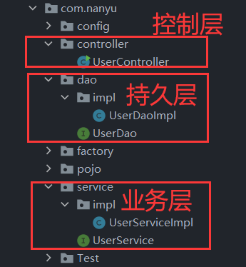

### 8.1.2 MVC

设计模式：典型二十三种设计模式（工厂模式、单例模式、观察者模式、代理模式、筑造者模式等等）,**<font color="red">MVC模式不属于设计模式</font>**，MVC由三个单词组成，分别代表不同的意思：

- Model：模型层，用JavaBean是实现，包括实体类、DAO层、Service层，用到的技术有JDBC/Mybatis/Mybatis-Plus等
  - entity层：实体类层（也可以写为Pojo），这一层编写的是与数据库中的表一一对应的Java类
  - dao层：database access object，dao层就是负责数据增删改查的接口
  - service层：负责调用dao层，实现具体的业务逻辑，如登录逻辑、修改数据的逻辑、删除数据的逻辑
- View：视图层，显示数据给用户看的，用到的技术有Html/JS/CSS/JSP/Ajax等前端技术
- Controller：控制层，现阶段的Servlet就是控制器，学了SpringMVC之后，Controller就叫控制器，职责就是负责接收请求，调用Model层获取用户想要请求的数据，然后将数据经过处理后返回给View层。

**补充：**

> JavaBeans :
>
> - 是Java中一种特殊的类（换言之：JavaBean就是一个Java类)，一个Java类 ，满足以下要求，则可称为一个JavaBean
>
>   a. public修饰的类，提供public 无参构造方法
>
>   b. 所有属性 都是private
>
>   c. 提供getter和setter方法
>
> - 从使用层面来看，JavaBean分为2大类：
>
>   a. 封装业务逻辑的JavaBean （eg:LoginDao.java 封装了登录逻辑）
>
>   b. 封装数据的JavaBean （实体类：eg：Student.java  Vedio.java 。往往对应于数据库中的一张表，即数据库中有个Student表，项目中就有个Student.java类）
>
> - JavaBean 是一个可以重复使用的组件，通过编写一个组件来实现某种通用功能，“一次编写、任何地方执行、任何地方重用”。

### 8.1.3 对比

三层架构其实是对MVC模式的更细的划分，**<font color=red>三层架构是将MVC的Model层划分为持久层、业务逻辑层</font>**

## 8.2 Web环境搭建

由于现阶段我们技术有限，所以使用的是Servlet充当我们的Web层，JSP作为前端展示页面。如果你使用的是Maven搭建的项目，比如原始项目结构如下

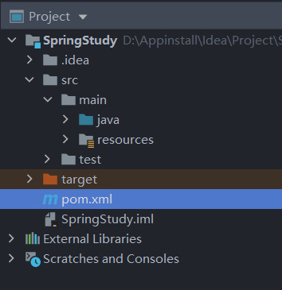

那么你可以按照下面的流程一步一步的集成web环境

1. pom.xml中添加下面坐标

> pom.xml中的<packaging>配置尤为重要，因为是Web项目，所以需要打包为war包，如果不加这个配置，则默认会打成jar包。

```xml
<!--Web项目需要打包为war包，如果不加这个配置，则默认会打成jar包。-->
<packaging>war</packaging>

<!--引入Servlet依赖-->
<dependency>
    <groupId>javax.servlet</groupId>
    <artifactId>javax.servlet-api</artifactId>
    <version>3.1.0</version>
    <scope>provided</scope>
</dependency>
<!--引入Jsp依赖-->
<dependency>
    <groupId>javax.servlet.jsp</groupId>
    <artifactId>javax.servlet.jsp-api</artifactId>
    <version>2.3.1</version>
    <scope>provided</scope>
</dependency>
```

2. 在main包下创建webapp目录，如下：


3.  补齐文件夹，如WEB-INF，web.xml等，只要是缺少的必要文件或目录直接手动创建补上即可。

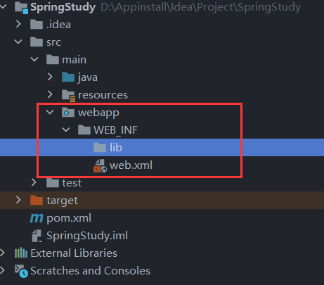

如果是自己创建的web.xml，内容应该是空的，那么你需要在web.xml中引入下面的头协议

```xml
<!DOCTYPE web-app PUBLIC
        "-//Sun Microsystems, Inc.//DTD Web Application 2.3//EN"
        "http://java.sun.com/dtd/web-app_2_3.dtd" >

<web-app>

</web-app>
```

4. 同时也可以在webapp目录下创建好存放静态文件、JSP页面的文件夹等。

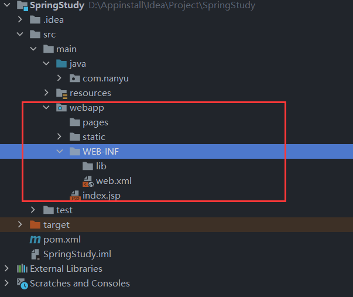

以上web的基本环境我们已经创建完成，但我们的项目目前还没办法让别人访问到，所有的测试都只是在我们本地电脑上运行。想要别人通过IP+端口号访问到我们，我们还需要一个web应用服务器，将我们的程序放到Web服务器中，Web服务器就可以向外部公开一个IP+端口，让别人访问到我们的项目，这个Web服务器我们通常选用Tomcat。

我们的程序通常需要先打包，再放到Tomcat上运行（当然不打包Tomcat也可以运行，但一般正式发布项目时是通过打包的方式让Tomcat运行），Tomcat可以直接运行war包，这也是为什么会在pom.xml中引入`<packaging>war</packaging>`这句话的原因，加上了这句话之后，Maven在进行打包的时候会把项目一整个打包成war包，然后Tomcat会自动执行这个war包。

有关项目集成Tomcat的方法，可以看我之前的文章：[项目集成Tomcat](http:www.dingzijun.top)，写的很清楚。

集成完毕之后项目如下，启动服务器之后，默认打开webapp目录下的index.jsp或index,html：

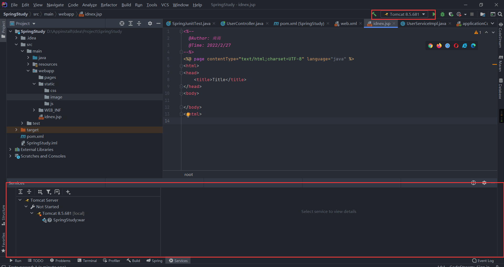

下面是一个Servlet充当Controller的测试：

```java
package com.nanyu.controller;

import javax.servlet.ServletException;
import javax.servlet.annotation.WebServlet;
import javax.servlet.http.HttpServlet;
import javax.servlet.http.HttpServletRequest;
import javax.servlet.http.HttpServletResponse;
import java.io.IOException;

@WebServlet("/user")
public class UserServlet extends HttpServlet {
    @Override
    protected void doPost(HttpServletRequest req, HttpServletResponse resp) throws ServletException, IOException {
        ApplicationContext app=new ClassPathXmlApplicationContext("applicationContext1.xml");
        DataSource dataSource = app.getBean(DataSource.class);
    }

    @Override
    protected void doGet(HttpServletRequest req, HttpServletResponse resp) throws ServletException, IOException {
        super.doGet(req, resp);
    }
}
```

## 8.3 ApplicationContext获取

在一个项目中我们通常会有很多Servlet，用户的一种请求，比如登录、注册、删除、注销、查询等都对应一个请求，一个请求又对应着一个Servlet，所以一个项目中我们通常需要非常多的Servlet。

从上面的代码中我们可以发现，**<font color=red>每次我们想获取容器中的Bean对象，就要执行下面获取ApplicationContext应用上下文的代码，这会造成配置文件被加载很多次，应用上下文对象被创建多次</font>**，这些代码往往只需执行一次，但又是每个Servlet中不可避免的，所以有没有一种方法能将创建容器，获取ApplicationContext应用上下文的代码抽取出来，只执行一次？

```java
ApplicationContext app=new ClassPathXmlApplicationContext("applicationContext1.xml");
DataSource dataSource = app.getBean(DataSource.class);
```

思路：

> 在Web项目中，我们可以通ServletContextListener监听Web应用的启动，当项目启动时就执行`new ClassPathXmlApplicationContext("applicationContext1.xml");`获取ApplicationContext应用上下文的对象，将获得app对象存入最大的域对象Application中，使用时通过Application.getAttribut()获得即可。
>
> 这样我们就能做到ApplicationContext对象只创建一次，所有使用的ApplicationContext对象都来自一此创建。

根据上面提供的思路，我们动手实验一下。

1. 创建一个listener包，在包中创建一个`ContextLoaderListener`，并让该类实现`ServletContextListener`接口，重写接口中的方法。

```java
package com.nanyu.listener;

import org.springframework.context.ApplicationContext;
import org.springframework.context.support.ClassPathXmlApplicationContext;

import javax.servlet.ServletContext;
import javax.servlet.ServletContextEvent;
import javax.servlet.ServletContextListener;

public class ContextLoaderListener implements ServletContextListener {
    /*
    项目启动时执行的方法
     */
    @Override
    public void contextInitialized(ServletContextEvent servletContextEvent) {
        // 项目只要启动就获取ApplicationContext应用上下文对象，并将其存入域对象中
        ApplicationContext app=new ClassPathXmlApplicationContext("applicationContext.xml");
        // 获取ServletContext域对象
        ServletContext servletContext = servletContextEvent.getServletContext();
        // 将Spring应用上下文对象存入ServletContext域对象中
        servletContext.setAttribute("app",app);
    }

    /*
    项目销毁时执行的方法
     */
    @Override
    public void contextDestroyed(ServletContextEvent servletContextEvent) {
        // 这里可以写关闭Spring应用上下文对象的代码
    }
}
```

在web.xml中配置监听器

```xml
<!DOCTYPE web-app PUBLIC
        "-//Sun Microsystems, Inc.//DTD Web Application 2.3//EN"
        "http://java.sun.com/dtd/web-app_2_3.dtd" >

<web-app>
<!--配置监听器-->
    <listener>
        <listener-class>com.nanyu.listener.ContextLoaderListener</listener-class>
    </listener>
</web-app>
```

测试是否成功

```java
package com.nanyu.controller;

@WebServlet("/user")
public class UserServlet extends HttpServlet {
    @Override
    protected void doPost(HttpServletRequest req, HttpServletResponse resp) throws ServletException, IOException {
        // 这的getServletContext()方法来自于HttpServlet的继承GenericServlet
        //ServletContext servletContext = this.getServletContext();
        // 这的getServletContext()来自于HttpServletRequest的继承ServletRequest
        ServletContext servletContext = req.getServletContext();
        ApplicationContext app = (ApplicationContext)servletContext.getAttribute("app");
        DataSource bean = app.getBean(DataSource.class);
        Connection connection = null;
        try {
            connection = bean.getConnection();
        } catch (SQLException throwables) {
            throwables.printStackTrace();
        }
        System.out.println(connection);
    }

    @Override
    protected void doGet(HttpServletRequest req, HttpServletResponse resp) throws ServletException, IOException {
        super.doGet(req, resp);
    }
}

/*
结果输出：
com.mysql.jdbc.JDBC4Connection@1ff6fd4
*/
```

## 8.4 代码优化

观察上面的代码，我们已经实现了Spring应用上下文ApplicationContext对象的获取，减少了代码冗余，但是上面代码还存在一定的耦合度。

比如配置文件的名不能以字符串的形式写死，我们可以将其写入配置文件。

另外对于ApplicationContext app对象的获取，我们可以封装到一个工具类内的静态方法中，通过调用工具类中的静态方法直接获取ApplicationContext对象，从而让开发者并不必单独记住ApplicationContext对象的名称叫app。

于是，上面获取ApplicationContext对象的代码优化如下：

1. 首先在web.xml中配置applicationContext1.xml的名称

```xml
<!DOCTYPE web-app PUBLIC
        "-//Sun Microsystems, Inc.//DTD Web Application 2.3//EN"
        "http://java.sun.com/dtd/web-app_2_3.dtd" >

<web-app>

    <!--通过全局初始化参数设置核心配置文件的名-->
    <context-param>
        <param-name>ApplicationContext</param-name>
        <param-value>applicationContext1.xml</param-value>
    </context-param>

    <listener>
        <listener-class>com.nanyu.listener.ContextLoaderListener</listener-class>
    </listener>

</web-app>
```

2. 修改监听器

```java
package com.nanyu.listener;

public class ContextLoaderListener implements ServletContextListener {
    /*
    项目启动时执行的方法
     */
    @Override
    public void contextInitialized(ServletContextEvent servletContextEvent) {
        ServletContext servletContext = servletContextEvent.getServletContext();
        
        // web.xml中的全局初始化参数获取到ApplicationContext配置文件的文件名
        String applicationContext = servletContext.getInitParameter("ApplicationContext");
       // 项目只要启动就获取ApplicationContext应用上下文对象，并将其存入域对象中
        ApplicationContext app=new ClassPathXmlApplicationContext(applicationContext);
        // 获取ServletContext域对象
        // 将Spring应用上下文对象存入ServletContext域对象中
        servletContext.setAttribute("app",app);
    }

    /*
    项目销毁时执行的方法
     */
    @Override
    public void contextDestroyed(ServletContextEvent servletContextEvent) {
        // 这里可以写关闭Spring应用上下文对象的代码
    }
}
```

3. 编写工具类

```java
package com.nanyu.utils;

public class ApplicationContextUtils {

    public static ApplicationContext getApplicationContext(ServletContext servletContext){
        return (ApplicationContext)servletContext.getAttribute("app");
    }
}
```

4. 修改Controller

```java
package com.nanyu.controller;

@WebServlet("/user")
public class UserServlet extends HttpServlet {
    @Override
    protected void doPost(HttpServletRequest req, HttpServletResponse resp) throws ServletException, IOException {
        ServletContext servletContext = req.getServletContext();
        ApplicationContext app = ApplicationContextUtils.getApplicationContext(servletContext);
        System.out.println(app);
        DataSource bean = app.getBean(DataSource.class);
        Connection connection = null;
        try {
            connection = bean.getConnection();
        } catch (SQLException throwables) {
            throwables.printStackTrace();
        }
        System.out.println(connection);
    }

    @Override
    protected void doGet(HttpServletRequest req, HttpServletResponse resp) throws ServletException, IOException {
        this.doPost(req,resp);
    }
}
/*
结果输出：
com.mysql.jdbc.JDBC4Connection@7e5b8e19
*/
```

以上就是代码的优化，只是为了减少代码耦合，提高代码的可读性和可维护性。

## 8.5 Spring获取ApplicationContext

回到我们最开始的问题上，我们为什么花费这么多精力要获取ApplicationContext对象？

其实就是为了减少代码冗余，避免在多个Servlet中多次编写获取ApplicationContext对象的代码。

那么Spring既然是一个非常强大的框架，Spring也考虑到了代码冗余的问题？其实上面的代码Spring已经替我们封装好了，思路和我们上面的思路一摸一样，我们经过简单配置就可以使用（之所以把上面的代码写一遍是为了更加了解Spring获取应用上下文对象的原理）。

> Spring提供的获取应用上下文对象的方法：
>
> Spring提供了一个监听器ContextLoaderListener，该监听器所作的功能就是在内部加载Spring配置文件（或配置类），然后创建ApplicationContext应用上下文对象，然后将这个对象放入域对象ServletContext中。
>
> Spring还提供了一个工具类WebApplicationContextUtils，这个工具类内部包含返回值类型为ApplicationContext对象的静态方法，静态方法中通过，servletContenxt.getAttribute()获取应用上下文对象并通过return返回。
>
> 思路与我们上面写的一摸一样，实现也基本一致

使用Spring提供的方法获取应用上下文对象，我们要做的只需要两步：

- 在web.xml中配置ContextLoaderListener监听器（导入spring-web坐标）
- 使用WebApplicationContextUtils获得应用上下文对象Application

程序实例：

1. 导入spring-web坐标

```xml
<!--Spring-web坐标-->
<dependency>
    <groupId>org.springframework</groupId>
    <artifactId>spring-web</artifactId>
    <version>5.3.12</version>
</dependency>
```

2. 在web.xml中配置监听器

```xml
<!DOCTYPE web-app PUBLIC
        "-//Sun Microsystems, Inc.//DTD Web Application 2.3//EN"
        "http://java.sun.com/dtd/web-app_2_3.dtd" >

<web-app>

    <!--spring-web提供的获取应用上下文对象的监听器-->
    <!--设置核心配置文件的名-->
    <context-param>
        <param-name>contextConfigLocation</param-name>
        <param-value>classpath:applicationContext1.xml</param-value>
    </context-param>
    <listener>
        <listener-class>org.springframework.web.context.ContextLoaderListener</listener-class>
    </listener>
    
    <!--自定义获取应用上下文的监听器-->
    <!--设置核心配置文件的名-->
    <!--    <context-param>-->
    <!--        <param-name>ApplicationContext</param-name>-->
    <!--        <param-value>classpath:applicationContext1.xml</param-value>-->
    <!--    </context-param>-->
    <!--    <listener>-->
    <!--        <listener-class>com.nanyu.listener.ContextLoaderListener</listener-class>-->
    <!--    </listener>-->

</web-app>
```

3. 使用WebApplicationContextUtils工具类获得应用上下文对象

```java
package com.nanyu.controller;

@WebServlet("/user")
public class UserServlet extends HttpServlet {
    @Override
    protected void doPost(HttpServletRequest req, HttpServletResponse resp){
        ServletContext servletContext = req.getServletContext();
        // ApplicationContext app = ApplicationContextUtils.getApplicationContext(servletContext);
        ApplicationContext app = WebApplicationContextUtils.getWebApplicationContext(servletContext);
        DataSource dataSource = app.getBean(DataSource.class);
        Connection connection = null;
        try {
            connection = dataSource.getConnection();
        } catch (SQLException throwables) {
            throwables.printStackTrace();
        }
        System.out.println(connection);
    }

    @Override
    protected void doGet(HttpServletRequest req, HttpServletResponse resp) throws ServletException, IOException {
        this.doPost(req,resp);
    }
}

/*
输出结果：
com.mysql.jdbc.JDBC4Connection@1c8c4dea
*/
```

综上，就是Spring为我们提供的获取Spring应用上下文对象的方法，还是回归到问题的最初，无论是我们自己写的获取Spring应用上下文对象的方法还是Spring提供的方法，最终都是为了解决由于多次创建导致代码冗余的问题。

# 9. SpringMVC简介

## 9.1 SpringMVC概述

**<font color=red>SpringMVC</font>**是一种基于Java的实现**<font color=red>MVC设计模型</font>**的请求驱动类型的**<font color=red>轻量级Web框架</font>**，属于**<font color=red>SpringFrameWork</font>**的后续产品，已经融合在Spring Web Flow中。

SpringMVC已经称为目前最主流的MVC框架之一，并且随着Spring3.0的发布，全面超越Struts2，成为最优秀的MVC框架。它通过一套注解，让一个简单的ava类成为处理请求的控制器，而无需实现任何接口。同时它还支持**<font color=red>RESTful</font>**编程风格的请求。

SpringMVC只是一个Web层的框架，它只负责接管Conrtroller层，对于Dao层、Service层SpringMVC不会接管，因为SpringMVC没有对Dao层、Service层的操作进行封装，它只对Web层的功能进行了封装，因此说SpringMVC是一个Web层框架。（后面我们会学到Dao层有其对应的封装好的框架MyBatis）

**为什么要引入SpringMVC这个Web层框架？**

> 解释说明：框架的作用是什么？框架的作用是封装大量重复性且繁琐的工作，对外部提供更友好、更易用的接口供用户使用，用户不必关心框架内部是怎么实现的，只需要使用框架提供的接口即可。
>
> 目前我们Web层用的是Servlet来接收请求，经过处理返回响应给浏览器客户端。使用Servlet接收请求其实有很多重复性操作，比如开发时Servlet接收到请求后做的工作无非就这么几个：接收请求参数、封装实体、访问业务层、接收返回结果、指派页面。

如下，使用Servlet充当Web层时的Servlet中做的基本操作：

```java
package com.nanyu.servlet;

@WebServlet("/register")
public class RegisterServlet extends HttpServlet {
    private UserService userService = new UserServiceImpl();

    @Override
    protected void doPost(HttpServletRequest req, HttpServletResponse resp) throws ServletException, IOException {
        // 1. 接收请求参数
        String username = req.getParameter("username");
        String pwd = req.getParameter("pwd");
        // 2. 封装实体
        UserVO userVO = new UserVO(username, pwd);
        // 3. 访问业务层并接收返回结果
        boolean flag = userService.register(userVO);
        // 4. 指派页面
        req.getRequestDispatcher("/register.jsp").forward(req, resp);
        }
    }
}
```

从上面的代码我们可以看出，Servlet收到请求之后做的操作无非就：接收请求参数、封装实体、访问业务层、接收返回结果、指派页面，上面我们也说过框架的作用其实就是对重复且繁杂的工作进行封装，对外提供简单易用的接口。

SpringMVC的作用就是如此，**<font color=red>SpringMVC存在的意义就是对接收请求参数、封装实体、接收返回结果、指派页面等这些重复性操作抽取出来，对其进行封装，提供给我们更加方便快捷的Web层操作。</font>**用下面的图来说明一下SpringMVC在项目中起到的作用

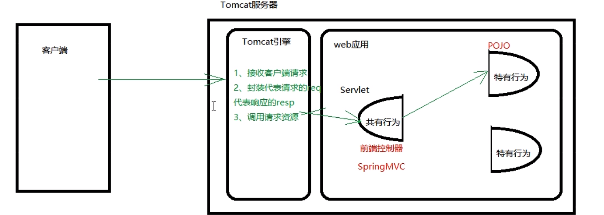

描述：

客户端发送请求到Tomcat服务器，Tomcat服务器对发送过来的请求数据封装到request对象中，然后请求继续去寻找对应的Servlet，**但SpringMVC把Servlet中的功能被划分为两部分，一部分是负责接收请求参数、封装实体、接收返回结果等的公共行为（调用业务层属于特有行为），还有一部分是特有行为，SpringMVC将公共行为与特有行为抽取出来，分离开来，所有请求到达服务器之后在访问资源之前都要先经过SpringMVC抽取出来的公共部分（<font color=red>这一部分叫做前端控制器，它其实还是一个Servlet</font>），然后通过SprimgMVC的路由分发器，将这个请求映射到包含对应特有行为的方法中，执行特有行为。**

## 9.2 SpringMVC开发步骤

理解了上面的图，我们下面来介绍一下SprimgMVC开发步骤

1. 导入SpringMVC包
2. 配置SpringMVC核心控制器DispathcerServlet：配置共有行为的Servlet，以该Servlet作为前端控制器，将Servlet的资源访问路径设为"/"，表示所有请求都会经过这个Servlet，执行共有行为（**<font color=red>这个Servlet不需要我们创建，SpringMVC已经帮我们控制好了，名叫DispathcerServlet，我们只需要对其进行配置即可</font>**）。
3. 创建Controller和视图页面：编写POJO，一般叫Controller，这个Controller就是上面所说的SprimgMVC抽离出来的具有特有行为部分，这个Controller内部往往负责调用业务层、封装数据、指派跳转视图等。
4. 使用注解配置Controller类中业务方法的映射地址：使用注解的方式将Controller这个POJO放到Spring的IOC容器中（@Comnponent或者@Controller）
5. 配置SpringMVC核心文件spring-mvc.xml：配置spring-mvc.xml配置文件，在这个配置文件中配置组件扫描，这个组件扫描的作用是专门扫描web层的Controller，不扫描的化就没办法告知SpringMVC此处是一个Controller，该Controller也就不会起作用。
6. 客户端发请求测试：执行访问测试

程序实例：

1. 导入SpringMVC坐标

注意：Spring-webmvc坐标与Spring-web坐标是不一样的，Spring-webmvc坐标SpringMVC框架所需的坐标，而Spring-web坐标是Spring集成Web环境所需要的坐标，如果不导入Spring-web这个坐标，Spring就无法集成web环境（如果使用纯Servlet形式进行开发，就不需要导入这些包，只需要配置一下就能集成Web环境，但现在使用的是Spring开发的项目，Web层也需要被Spring接管，所以需要导入必要的坐标）

```xml
<!--SpringMVC坐标：Web层框架-->
<dependency>
    <groupId>org.springframework</groupId>
    <artifactId>spring-webmvc</artifactId>
    <version>5.3.12</version>
</dependency>
```

2. 配置前端控制器DispathcerServlet

导入SpringMVC坐标之后其内部就有了DispathcerServlet这个前端控制器，但我们现在还不能使用，要想使用还需要进行一些配置。因为这个前端控制器本质上还是Servlet，我们一般对于Servlet、Filter、Listener的配置都会在web.xml中进行配置，所以这个前端控制器也需要在web.xml中进行配置。

```xml
<servlet>
    <servlet-name>DispatcherServlet</servlet-name>
    <servlet-class>org.springframework.web.servlet.DispatcherServlet</servlet-class>
    <!--服务器已启动就会创建这个DispatcherServlet对象，如果不配置则在第一次访问时才会后才会创建对象-->
    <load-on-startup>1</load-on-startup>
</servlet>

<servlet-mapping>
    <servlet-name>DispatcherServlet</servlet-name>
    <!--表示所有的访问都要经过这个Servlet（前端控制器），然后通过这个Servlet再找其对应的Controller-->
    <url-pattern>/</url-pattern>
</servlet-mapping>
```

3. 创建Controller和视图页面，使用注解配置Controller类中业务方法的映射地址

-  @RequestMapping("test")：翻译名为请求映射，就是将具体的请求映射到对应的方法中，在对应的方法中调用业务层，返回试图页面，完成整个请求的操作。该注解需要后需要跟路径，否则无法匹配到对应的执行方法。

```java
package com.nanyu.controller;

import org.springframework.stereotype.Controller;
import org.springframework.web.bind.annotation.RequestMapping;

@Controller
// 这个地方可以携带路径也可以不携带，如果携带则最后访问路径就是 /user/test,如果不携带最后访问路径是/test
@RequestMapping("/user")
public class UserController {

    // RequestMapping指映射地址，表示将请求映射到哪个方法中，映射到哪个方法中就执行哪个方法
    @RequestMapping("/test")
    public String userTest(){
        System.out.println("看到我表示执行成功");
        return "/user.jsp";
    }
}
```

4. 配置SpringMVC核心文件spring-mvc.xml

SpringMVC的配置也可以写到Spring核心配置文件中（applicationContext.xml），但是一般不建议这样写，因为还是本着分而治之的原则，避免后期SpringMVC的大量配置与Spring的大量配置混乱。在项目的resource目录下创建spring-mvc.xml配置文件。

注意：**<font color=red>spring-mvc配置包扫描只需要配置controller包即可，service层和dao层不需要Spring-mvc来扫，Spring核心配置文件会扫描service层和dao层的注解。两者是分开的。</font>**

回顾：

- Spring使用xml配置时如果要进行组件扫描，使用的是context命名空间下的`<context:component-scan base-package="com.nanyu"/>`
- Spring全注解开发时，以配置类形式进行配置，如果要进行包扫描需要在配置类上使用`@ComponentScan("com.nanyu")`

```xml
<?xml version="1.0" encoding="UTF-8"?>
<beans xmlns="http://www.springframework.org/schema/beans"
       xmlns:xsi="http://www.w3.org/2001/XMLSchema-instance"
       xmlns:context="http://www.springframework.org/schema/context"
       xsi:schemaLocation="http://www.springframework.org/schema/beans http://www.springframework.org/schema/beans/spring-beans.xsd
      http://www.springframework.org/schema/context http://www.springframework.org/schema/context/spring-context.xsd
">
    <!--先引入context命名空间-->
    <!--配置Controller组件扫描，与Spring中的组件扫描使用方法一摸一样-->
    <context:component-scan base-package="com.nanyu.controller"/>
</beans>
```

spring-mvc配置完成之后还需要告知使用者加载配置文件，我们要明白spring-mvc这个配置文件是谁在使用？配置了之后是为谁服务的？

> **<font color=red>spring-mvc这个配置文件是DispatcherServlet这个前端控制器使用的</font>**，所以我们要告知DispatcherServlet加载配置文件，因为DispatcherServlet是一个Servlet，所以我们可以通过初始化参数的形式将spring-mvc传递进去，DispatcherServlet中有对应的方法接收并加载这个配置文件。

修改web.xml文件

将spring-nvc配置文件以初始化参数的形式传递到DispatcherServlet内部被其加载。加载流程如下：

> 配置好的spring-mvc配置文件以初始化参数的形式让DispatcherServlet加载，当服务器一启动，会自动创建DispatcherServlet对象，然后DispatcherServlet从初始化参数中获取spring-mvc配置文件，完成DispatcherServlet对象的创建。

```xml
    <servlet>
        <servlet-name>DispatcherServlet</servlet-name>
        <servlet-class>org.springframework.web.servlet.DispatcherServlet</servlet-class>
<!--服务器一启动，会自动创建DispatcherServlet对象，然后DispatcherServlet从初始化参数中获取spring-mvc配置文件，完成DispatcherServlet对象的创建。-->
        <init-param>
            <param-name>contextConfigLocation</param-name>
            <param-value>classpath:spring-mvc.xml</param-value>
        </init-param>
        <!--服务器已启动就会创建这个DispatcherServlet对象，如果不配置则在第一次访问时才会后才会创建对象-->
        <load-on-startup>1</load-on-startup>
    </servlet>

    <servlet-mapping>
        <servlet-name>DispatcherServlet</servlet-name>
        <!--表示所有的访问都要经过这个Servlet（前端控制器），然后通过这个Servlet再找其对应的Controller-->
        <url-pattern>/</url-pattern>
    </servlet-mapping>
```

6. 请求测试

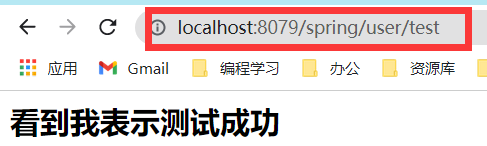

## 9.3 SpringMVC组件解析

SpringMVC执行的流程图如下：

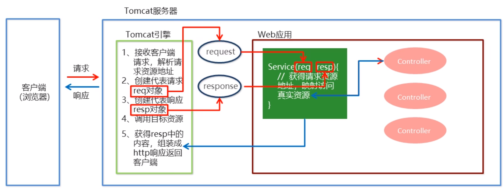

SpringMVC组件解析，对于浏览器传递过来的请求，都会先经过前端控制器DipatcherServlet，之前我们理解的是我们很多的工作都是DispatcherServlet进行封装的，其实并不是。

> **<font color=red>其实DispatcherServlet只是负责调度，SpringMVC内部有很多组件，DispatcherServlet就是负责调度这些组件来完成对应的功能。</font>**

SpringMVC一次请求过程：

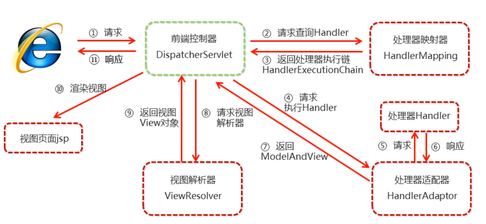

文字描述：

1. 用户发送请求至前端控制器DispatcherServlet。
2. DispatcherServlet收到请求，调用HandlerMapping处理器映射器（有很多种）
3. HandlerMapping会找到具体的处理器（可以根据xml配置、注解进行查找），生成处理器对象（Controller对象）以及处理器拦截器（如果有拦截器就会生成拦截器对象）一并返回给DispatcherServlet。
4. DispatcherServlet调用HandlerAdapter处理器适配器（有多种，有执行处理器对象的，也有执行拦截器对象）。
5. HandlerAdapter经过适配调用具体的处理器（包括Controller处理器，也可能有拦截器处理器）执行。
6. 经过Controller处理器的执行，Controller执行完成返回ModelAndView给HandlerAdapter处理器适配器
7. HandlerAdapter将Controller执行结果ModelAndView返回给DispatcherServlet
8. DispatcherServlet将ModelAndView传递给ViewReslover视图解析器。
9. ViewReslover解析后返回具体的view，返回给DispatcherServlet。
10. DispatcherServlet根据ViewReslover传递过来的View进行渲染视图（即将模型数据填充至视图中）。DispatcherServletg响应给客户端用户

SpringMVC有九大组件：

- [ ] 组件补充


# 10. SpringMVC组件


# 11. SpringMVC数据响应

