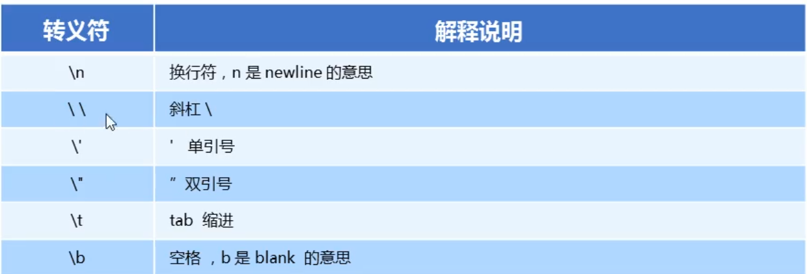
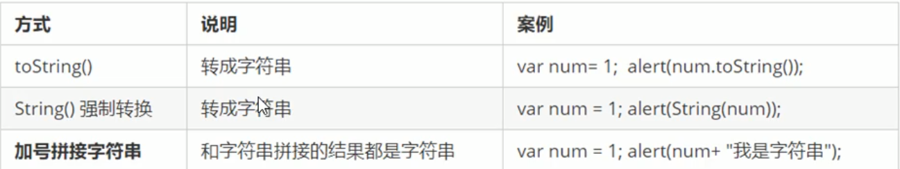

### 2.1 初识JavaScript

<hr>

由布兰登艾奇发明，最初命名为LiveScript，最后与网景公司合作，改名为JavaScript(简称JS)，但JS与Java没有任何关系。

 

#### 2.1.1 什么是JS

<hr>

- JavaScript是世界上最流行的语言之一, 是一种**运行在客户端**的脚本语言( Script是脚本的意思)

- **脚本语言**:不需要编译,运行过程中由js解释器(js引擎)逐行来进行解释并执行

- 现在也可以基于Node.js技术进行服务器端编程


#### 2.1.2JS能做什么

<hr>

- 表单动态校验 (密码强度检测) ( JS产生最初的目的)
- 网页特效
- 服务端开发(Node.js)
- 桌面程序(Electron)
- App(Cordova)
- 控制硬件-物联网(Ruff)
- 游戏开发(cocos2d-js)


#### 2.1.3 JS/CSS/HTML区别与联系

<hr>

**描述类语言：HTML/CSS标记语言**

HTML：html决定网页结构和内容（决定人看到什么），相当于人的身体。

CSS：CSS决定网页呈现给用户的样式，相当于人化妆、穿衣服。


**编程类语言：JS脚本语言**

JS：实现页面控制（决定功能）和业务逻辑，相当于人的各种动作。


#### 2.1.4 浏览器执行JS原理

<hr>

浏览器分成两部分:**渲染引擎和JS引擎**

- **渲染引擎**:用来解析HTML与CSS ，俗称内核,比如chrome浏览器的blink ,老版本的webkit。
- **JS引擎**:也称为JS解释器，用来读取网页中的JavaScript代码,对其处理后运行,比如chrome浏览器的V8。

>  浏览器本身并不会执行S代码，而是通过内置JavaScript引擎(解释器)来执行JS代码。
>
> JS 引擎执行代码时逐行解释每一句源码(转换为机器语言) ，然后由计算机去执行,，以JavaScript语言归为脚本语言，会逐行解释执行。


#### 2.1.5 JS三部分组成

<hr>


**ECMAScript:**

**<font color=red>ECMAScript</font>**是由ECMA国际(原欧洲计算机制造商协会)进行标准化的一编程语言, 这种语言在万维网上应用广

泛，ECMAScript规定了JS的编程语法和基础核心知识,是所有浏览器厂商共同遵守的一套S语法工业标准。它往往被

称为JavaScript或JScript ，但实际上后两者是ECMAScript语言的实现和扩展，可简单理解为ECMAScript就是JS。


**DOM-文档对象模型：**

**<font color=red>文档对象模型</font>**( Document Object Model ，简称DOM)，是W3C组织推荐的处理可扩展标记语言的标准编程接口。

通过DOM提供的接口可以对页面上的各种元素进行操作(大小、位置、颜色等)。


**BOM-浏览器对象模型：**

**<font color=red>浏览器对象模型</font>**(Browser Object Model ，简称BOM)，是指浏览器对象模型，它提供了独立于内容的、可以与浏览

器窗口进行互动的对象B结构。通过BOM可以操作浏览器窗口,比如B弹出框、控制浏览器跳转、获取分辨率等。


#### 2.1.6JS三种书写方式

<hr>

JS有三种书写方式（与CSS相同），分别为行内式、内嵌式、外联式

>  **行内式（一般不使用）：**
>
> <input type="button" value="钉子君" onclick="alter('南雨')">
>
> **内嵌式（使用最多）：**
>
>     <script>
>         alert('JS测试')
>     </script>
>
>  **外联式：**
>
> <script src="first.js"></script>


#### 2.1.7输入输出语句

<hr>

 


**prompt用法：**

> // 用户输入框
>
>   prompt('请输入姓名');


**alter用法：**

>  // 弹出框
>
>  alert('南雨');


**console.log用法：**

> // 输出到控制台，用于程序员观看分析
>
> console.log('程序员观看');


### 2.2变量

<hr>
白话:变量就是一个装东西的盒子。

通俗:变量是用于存放数据的容器。我们通过变量名获取数据，甚至数据可以修改。

本质:变量是程序在内存中申请的一块用来存放数据的空间。


#### 2.2.1 变量的使用

<hr>

变量在使用时分为两部分：声明变量、赋值


**变量使用方法一：**

```javascript
//生命变量
var age;
//给变量赋值
age=12;
console.log('程序员:' + yourname + '观看');
```


**变量使用方法二：**

```javascript
//声明变量并赋值
var age=12;
alert(yourname);
```


**变量使用方法三：**

```javascript
// 用户输入框
var yourname = prompt('请输入姓名');
// 弹出框
alert(yourname);
```

var是一个JS关键字，用来声明变量( variable变量的意思)。使用该关键字声明变量后，计算机会自动为变量分配内

存空间，不需要程序员管。

age是程序员定义的变量名，我们要通过变量名来访问内存中分配的空间。


#### 2.2.2 变量的使用

<hr>
**变量重新赋值：**

```javascript
// 用户输入框
var yourname = prompt('请输入姓名');
// 输出到控制台，用于程序员观看分析
console.log( yourname);
yourname = "南雨";
console.log(yourname);
```

**申请多变量：**

```javascript
var myname = "钉子君", age = 18, salary = 2000;
console.log(myname);
console.log(age);
console.log(salary);
```

**只声明变量不赋值：**

```javascript
//只声明变量不赋值，系统无法识别，结果是undefined，未识别的
var myname 
console.log(myname);
```

**不声明变量直接赋值：**

```javascript
//不声明变量直接赋值，可以直接使用
myname=1000
console.log(myname);
```

**变量值的交换：**

```javascript
var temp;
var qing = "青苹果"
var hong = "红苹果"
temp = qing;
qing = hong;
hong = temp;
console.log(qing);
console.log(hong);
```


#### 2.2.3 变量的命名规范

<hr>

- 由字母(A-Za-z)、数字(0-9)、 下划线( )、元符号($ )组成，如: usrAge, num01, name+
- 严格区分大小写。var app；和var App；是两个变量
- 不能以数字开头。18age 是错误的
- 不能是关键字、保留字。例如: var、for、 while
- 变量名必须有意义。MMD BBD n|- → age .
- 遵守驼峰命名法。首字母小写,后面单词的首字母需要大写 myFirstName


### 2.3 数据类型

<hr>

在计算机中,不同的数据所需占用的存储空间是不同的，为了便于把数据分成所需内存大小不同的数据，充分利用存储空间，于是定义了不同的数据类型。


变量是用来存储值的所在处,它们有名字和数据类型。变量的数据类型决定了如何将代表这些值的位存储到计算的

内存中。JavaScript 是一种弱类型或者说动态语言。这意味着不用提前声明变量的类型,在程序运行过程中，类型会被自动确定。

```javascript
// int num = 10; java
var num;//这里的num我们是不确定属于哪种数据类型的
var num =10; // num属于数字型
//js的变量数据类型是只有程序在运行过程中，根据等号右边的值来确定的
```


在代码运行时，变量的数据类型是由JS引擎根据=右边变量值的数据类型来判断的，运行完毕之后，变量就确定了数据类型。

```javascript
// js是动态语言变量的数据类型是可以变化的
varx=10;//x是数字型
x='pink';// x字符串型
```


#### 2.3.1 数据类型分类

<hr>

JS把数据类型分为两类:

- 简单数据类型( Number , String , Boolean, Undefined, Null )
- 复杂数据类型( object)
  

**简单数据类型：**


**数字型（Number）：**

```javascript
var num=10;//num为数字型
var num=10.0//num数字型
//数字型最大值
var num=Number.MAX_VALUE
//数字型最小值
var num=Number.MIN_VALUE
//数字型三个特殊值
var num=Number.MAX_VALUE*2//结果为Infinity
var num=Number.MIN_VALUE*2//结果为-Infinity
var num=‘钉子君’-12//结果为NaN
alert (Infinity) ;//Infinity ,代表无穷大,大于任何数值
alert(-Infinity) ; //-Infinity ,代表无穷小,小于任何数值
alert (NaN) ;//Not a number ,代表一个非数值
```


**字符串型（String）：**

字符串型可以是引号中的任意文本,其语法为双引号""和单引号"，因为HTML标签里面的属性使用的是双引号，JS这里我们更推荐使用单引号。

```javascript
var strMsg = "我爱北京天安门~"; // 使用双引号表示字符串
var strMsg2 = '我爱吃猪蹄~'; // 使用单引号表示字符串
var strMsg3 = '我爱吃"猪蹄"~'; //‘ ’里面套“ ”
var strMsg4 = "我爱吃'猪蹄'~"; //" "里面套 ' '
//常见错误
var strMsg3 =我爱大肘子;//报错，没使用引号,会被认为是js代码,但j s没有这些语法
```


**布尔类型（boolean）：**

布尔类型有两个值: true和false ，其中true表示真(对) ，而false表示假(错)。

```javascript
//布尔型
var flag = true;
var flag1 = false;
//进行数学运算时，true代表的是1，false代表的是0
console.log(true + 1);//2
console.log(false + 1);//1
```


**未定义类型(Undefined):**

如果一个变量声明时未被赋值，则输出结果就是Undefined

```javascript
var age;
console.log(age);//Undefined
console.log(age+'pink');//Undefinedpink
console.log(age + 1); // NaN(非数字) undefined 和数字相加最后的结果是NaN
```


**空值类型(null):**

```javascript
var age = null;
console.log(age + 'pink');//nullpink
console.log(age + 1);//1
```


**转义字符：**




```javascript
//字符串转义字符都是用 \ 开头但是这些转义字符写道引号里面
varstr1=“我是个'高富帅'的\n程序员";
alert('大大大大大大大大大\n小小小小小小小小小\n"收破烂啦~"')
```

 

#### 2.3.2 字符串length属性及拼接

<hr>

**字符串长度属性：length**

```javascript
var len = "钉子君".length;
alert(len);
var str = "南雨";
alert(str.length);
```

**字符串拼接：**

多个字符串之间可以使用+进行拼接,其拼接方式为字符串+任何类型=拼接之后的新字符串

```javascript
var len = "钉子君";
var str = "南雨";
console.log(len + "喜欢" + str + 2021);//钉子君喜欢南雨2021
console.log(12+12)//24
console.log("12"+12)//1212
```


#### 2.3.3 获取变量数据类型

<hr>

**typeof:**typeof可用来获取检测变量的数据类型

```javascript
var num = 10;
console.log(typeof num);//number
var str = "pink";
console.log(typeof str);//string
var flag = true;
console.log(typeof flag);//boolean
var variable = undefined;
console.log(typeof variable);//undefined
var times = null;
console.log(typeof times);//object
//prompt获取到的值是字符串型的
var age=prompt("请输入年龄：");
console.log(typeof age);//string
```


#### 2.3.4 数据类型的转换

<hr>

使用表单、prompt获取过来的数据默认是字符串类型的，此时就不能直接简单的进行加法运算，而需要转换变量

的数据类型。通俗来说，就是把一种数据类型的变量转换成另外一种数据类型。


编程中通常有三种形式的转换：**转换为字符串类型、转换为数字型、转换为布尔型**


##### 2.3.4.1 其他类型转换为字符串类型：




```javascript
var str = 10;
console.log(typeof str);//number
console.log(str.toString());//10
console.log(typeof str.toString());//string
console.log(String(str));//10
console.log(typeof String(str));//string
```


##### 2.3.4.2 其他类型转换为数字类型：


```javascript
var str = "10.0";
var str1 = "120px";
var str2 = "rem120px";
console.log(typeof str);//string
console.log(parseInt(str));//10
console.log(parseInt(str1));//120
console.log(parseInt(str2));//NaN
console.log(typeof parseInt(str));//Number
console.log(parseFloat(str));//10.0
console.log(typeof parseFloat(str));//Number
console.log(typeof Number(str));//Number
//隐式转换
console.log(str - 0);//10
console.log(typeof (str - 0));//Number
console.log("120" - "110");//10
console.log("120" * 1);//120
```


##### 2.3.4.3 其他类型转换为布尔类型：

> 代表空、否定的值会被转换为false，如"、 0、NaN、 null undefined
> 其余值都会被转换为true


```javascript
console.log(Boolean(''));//false
console.log(Boolean(0));//false
console.log(Boolean("12"));//true
console.log(Boolean(undefined));//false
console.log(Boolean(null));//false
console.log(Boolean(NaN));//false
console.log(Boolean(12));//true
```


### 2.4 扩展内容

<hr>

**编译语言与解释语言的区别：**

> 计算机不能直接理解任何除机器语言以外的语言，所以必须要把程序员所写的程序语言翻译成机器语言才能
>
> 执行程序。程序语言翻译成机器语言的工具，被称为翻译器。


- 翻译器翻译的方式有两种: 一个是编译，另外一个是解释。两种方式之间的区别**在于翻译的时间点不同**

- 编译器是在代码执行之前进行编译，生成中间代码文件（比如Java语言，执行代码时会用编译器编译成javac.class临时文件，当代码全部编译成javac.class文件后，再用解释器进行解释）

- 解释器是在运行时进行及时解释，并立即执行(当编译器以解释方式运行的时候,也称之为解释器)（比如JS语言，JS每读取一行代码，就直接被解释器解释）


类似于请客吃饭:

- **编译语言**:首先把所有菜做好，才能上桌吃饭
- **解释语言**:好比吃火锅，边吃边涮，同时进行


### 2.5 运算符

<hr>

运算符( operator )也被称为操作符，用于实现赋值、比较和执行算数运算等功能的符号。

JS中常用运算符：**算数运算符、递增和递减运算符、比较运算符、逻辑运算符、赋值运算符**


#### 2.5.1 算数运算符

概念:算术运算使用的符号，于执行两个变量或值的算术运算。


```javascript
console.log(1 + 1);//2
console.log(1 - 1);//0
console.log(1 / 1);//1
console.log(1 * 2);//2
console.log(4 % 2);//0
console.log(5 % 3);//2
console.log(3% 5;//3
```


**浮点数计算时有精度问题：**

浮点数值的最高精度是17位小数，但在进行算术计算时其精确度远远不如整数。**不能直接用浮点数来判断是否相等**

```javascript
console.log(0.1 + 0.2);//0.30000000000000004
console.log(0.07 * 100);//7.000000000000001
```


#### 2.5.2 自增与自减

> 如果需要反复给数字变量添加或减去1 ,可以使用递增( ++ )和递减( -- )运算符来完成。
>
> 在JavaScript中，递增( ++ )和递减( -- )既可以放在变量前面，也可以放在变量后面。放在变量前面时，我们可以称为前置递增(递减)运算符，放在变量后面时，我们可以称为后置递增(递减)运算符。
>
> **<font color=red>注意：递增和递减运算符必须和变量配合使用。</font>**


**递增：**

前置递增与后置递增单独使用时没有任何区别，但当他们用于其他情况时产生的结果就不一样了

**前置递增：**

**<font color=red>先加1，后返回值。</font>**

```javascript
var age=10;
++age;//类似于age=age+1
console.log(age);//11
console.log(++age +10)//21
```


**后置递增：**

**<font color=red>先后返回原值，后加1。</font>**

```
var age=10;
age++;//类似于age=age+1
console.log(age);//11
console.log(age++ +10)//20
```


#### 2.5.3 比较运算符

概念：比较运算符(关系运算符)是两个数据进行比较时所使用的运算符，比较运算后会返回一个布尔值( true / false 

)作为比较运算的结果。


```javascript
console.log(18 == '18');
console.log(15 >= 18);
//  左右的18数据类型不同
console.log(18 === '18');
```


#### 2.5.4 逻辑运算符

概念：逻辑运算符是用来进行布尔值运算的运算符，其返回值也是布尔值。后面开发中经常用于多个条件的判断。


**逻辑中断（短路与）：**

逻辑与短路运算：如果表达式1结果为真，则返回表达式2，如果表达式1为假，那么返回表达式1。

```javascript
console.log(123&&456);//456
console.log(0&&456);//0
console.log(0&&1+23&&4*56);//0
console.log(null&&1+23&&4*56);//null
console.log(''&&1+23&&4*56);//''
```

**逻辑中断（短路或）：**

逻辑或短路运算：如果表达式1结果为真，则返回的是表达式1，如果表达式1结果为假，则返回表达式2

```
console.log(123||456);//123
console.log(0||456);//456
console.log(0||4*56);//4*56
console.log(null||4*56);//4*56
```


#### 2.3.5 赋值运算符


### 2.6 流程控制

<hr>

在一个程序执行的过程中，各条代码的执行顺序对程序的结果是有直接影响的。很多时候我们要通过控制代码
的执行顺序来实现我们要完成的功能。

简单理解:流程控制就是来控制我们的代码按照什么结构顺序来执行

流程控制主要有三种结构，分别是**顺序结构、分支结构和循环结构**， 这三种结构代表三种代码执行的顺序。


**顺序流程控制**：顺序结构是程序中最简单、最基本的流程控制，它没有特定的语法结构，程序会按照代码的先后顺序，依次执行。

**分支流程控制：**由上到下执行代码的过程中，根据不同的条件,执行不同的路径代码(执行代码多选-的过程) ，从而得到不同的结果


```javascript
if(条件表达式){
//条件成立时执行的代码语句
}else if(条件表达式){
    //条件成立时的语句
}else{
    //条件不成立时的表达式
}
2.执行思路如果if里面的条件表达式结果为真true，则执行大括号里面的执行语句。如果if条件表达式结果为假，则不执行大括号里面的语句，则执行if语句后面的代码。
//if语句
if(2>1){
   console.log('你好');
   }
//if else语句
if(2>1){
   console.log('你好');
   }else{
     console.log('你不好');   
   }

```


**三元表达式：**条件表达式？表达式1 ：表达式2

如果条件表达式结果为真，则返回表达式1的值，如果条件表达式结果为假，则返回表达式2的值

```
var num=10;
num>5 ? '是的':'不是的';
```


**分支流程控制语句：**

switch语句也是多分支语句，它用于基于不同的条件来执行不同的代码。当要针对变量设置一系列的特定值的选项

时，就可以使用switch。

```javascript
//语法结构,break不可省略
switch(表达式){
case value1: 
break;
case value2:
break;
default;
}
//实例，break不可省略,case值与switch值必须全等（即类型与数值都相等）
var num=2;
switch(num){
        case 1;
        console.log('这是1');
        break;
       case 2;
        console,log('这是2');
        break;
        default;
        console.log('啥也不是');
       }
```

### 2.7 循环控制

<hr>

**三种主要循环：for循环、while循环、do while循环**

在程序中，一组被重复执行的语句被称之 为循环体，能否继续重复执行，取决于循环的终止条件。由循环体

及循环的终止条件组成的语句，被称之为循环语句

#### 2.7.1 for循环

```javascript
//语法结构
for(初始化变量;条件表达式;循环表达式){
//循环语句
}
//实例
for(var i=0;i<10;i++){
    console.log('你好！');
}
//求班级学生平均成绩案例
var num = prompt('请输入班级人数：') - 0;
var sum = 0;
for (var i = 1; i <= num; i++) {
  sum = sum + (prompt('请输入第' + i + '个同学的成绩') - 0);
}
var average = sum / num;
console.log(average);
```

**双重for循环**

很多情况下，单层for循环并不能满足我们的需求，比如我们要打印一个5行5列的图形、打印一个倒直角三角形

等，此时就可以通过循环嵌套来实现。**<font color=skyblue>循环嵌套</font>**是指在一个循环语句中再定义一个循环语句的语法结构，例如在

for循环语句中，可以再嵌套一个for循环，这样的for循环语句我们称之为双重for循环。

```javascript
//双重for循环语法结构
//外循环一次，里循环执行全部
for(外层初始化变量;外层条件表达式;外层的操作表达式){
for(里层初始化变量;里层条件表达式;里层的操作表达式){
//循环语句
}
}
for(var i=0;i<3;i++){
    console.log('外循环执行'+i+'次');
    for(var j=0;j<3;j++){
        console.log('内循环执行'+j+'次');
    }
        }
//打印五行五列
    var str = '';
    for (var i = 0; i < 5; i++) {
      for (var j = 0; j < 5; j++) {
        str = str + '*';
      }
      str = str + '\n'
    }
    console.log(str);
//打印九九乘法表
var str = '';
for (var i = 1; i <= 9; i++) {
for (var j = 1; j <= i; j++) {
  str = str + i + 'x' + j + '=' + i * j + ' ';
}
  str = str + '\n';
}
console.log(str);
```

#### 2.7.2 while循环

```javascript
//语法结构   当    成立的是时候，执行循环语句
while(条件表达式){
      循环体
      }
//当表达式结果为true时，执行循环体，否则则退出
var age = prompt('请输入年龄') - 0;
 while (age < 18) {
 console.log('未成年人禁止入内！')
  age++;//防止死循环
}
```

#### 2.7.3 do while循环

do... while语句其实是while语句的一一个变体。该循环会先执行次代码块 ，然后对条件表达式进行判断，如果条件

为真，就会重复执行循环体，否则退出循环。

```javascript
//do while循环语法结构
do{
//循环体
}while(条件表达式)
    //与while循环的不同之处在于它会先执行一遍循环体再执行条件表达式，如果条件为真，则继续执行，如果条件为假，则退出循环
var age = prompt('请输入年龄') - 0;
do {
  alert('禁止');
  age++;
} while (age < 18)
```

#### 2.7.4 continue关键字

continue关键宇用于立即跳出本次循环，继续下一次循环(本次循环体中continue之后的代码就会少执行一次)。例

如，吃5个包子，第3个有子，就扔掉第3个，继续吃第4个第5个包子，其代码实现如下:

```javascript
for (var i = 0; i < 3; i++) {
 if (i == 1) {
    continue;
}
 console.log('正在吃第' + i + '个包子');
}
```

#### 2.7.5 break关键字

break关键字用于立即跳出整个循环(循环结束)。例如,吃5个包子，吃到第3个发现里面有半个虫子，其余的不吃了，其代码实现如下:

```javascript
for (var i = 0; i < 5; i++) {
  if (i == 3) {
  break;
}
  console.log('正在吃第' + i + '个包子');
}
```

### 2.8 数组

<hr>

数组是指一组数据的集合 ，其中的每个数据被称作元素，在数组中可以存放任意类型的元素。数组是一种将一组

数据存储在单个变量名 下的优雅方式。 数组可以把一组相关的数据一 起存放，并提供方便的访问(获取)方式。

```javascript
//数组：即一组数据的集合，储存在单个变量下的优雅方式
//利用new创建数组
var arr=new Arrary();//空数组
//使用数组字面量来创建数组
var arr2=[];//空数组
var arr1=[1,2,3,4,5,'hahaha',true]
```

数组的字面量是方括号[ ]，声明数组并赋值称为数组的初始化。

#### 2.8.1数组的访问

```javascript
var arr = new Array();//创建了一个空数组
arr = [1, 2, 5, '钉钉'];
console.log(arr);//[1, 2, 5, "钉钉"]0: 1
/*
1: 2
2: 5
3: "钉钉"
length: 4
__proto__: Array(0)*/
```

**数组的索引：**

```javascript
var arr = new Array();//创建了一个空数组
arr = [1, 2, 5, '钉钉'];
console.log(arr[0]);//1
```

#### 2.8.2数组的遍历

```javascript
var arr = ['迪丽热巴', '鹿晗', 1, 2]
for (var i = 0; i < arr.length; i++) {
  console.log(arr[i]);//'迪丽热巴', '鹿晗', 1, 2
}

//案例，求数组和及平均数
var arr = [1, 1, 2, 3, 4, 7, 8, 6]
var sum = 0;
for (var i = 0; i < arr.length; i++) {
   sum += arr[i];
}
  var average = sum / arr.length;
 console.log(sum, average);//多结果输出

//求数组中最大值
var arr = [2, 4, 3, 6, 8, 1, 12];
var max = arr[0];
for (var i = 1; i < arr.length; i++) {
   if (max <= arr[i]) {
       max = arr[i]
}
}
console.log(max);
```

#### 2.8.3 spilt的使用方法

```javascript
var str = 'nihao nihaoma 1';
var arr = str.split(' ');//通过' '将字符串切割为数组
for (var i = 0; i < arr.length; i++) {
   console.log(arr[i]);
    }
```

#### 2.8.4 数组属性的修改

```javascript
//修改数组长度（扩容数组）
var arr=[1,2,3];
console.log(arr.length);//3
arr.length=5;//扩容数组

//修改数组索引
arr[3]=4;//新增元素
arr[4]=5;//新增元素
arr[1]=6;//修改索引为1的元素

//修改数组的数据类型
arr='优点意思'//不能直接给数名复制，否则会替换掉之前数组中的内容。
console.log(arr);//有点意思
```

#### 2.8.5 数组实操

- **筛选出大于10 的数组元素**

```javascript
 var arr = [1, 2, 3, 6, 8, 4, 23, 56, 6, 34, 76];
    var newarr = new Array();
    for (var i = 0, j = 0; i < arr.length; i++) {
      if (arr[i] > 10) {
        newarr[j] = arr[i];
        j++;
      }
    }
    for (var k = 0; k < newarr.length; k++) {
      console.log(newarr[k]);
    }
```

- **删除指定数组元素**

```javascript
var arr = [0, 56, 3, 3, 78, 0, 67, 0, 0, 67, 34];
var newarr = new Array();
for (var j = 0, i = 0; i < arr.length; i++) {
if (arr[i] != 0) {
  newarr[j] = arr[i];
  j++;
 }
    }
for (var k = 0; k < newarr.length; k++) {
console.log(newarr[k]);
    }
```

- **翻转数组**

```javascript
var arr = [1, 2, 3, 4, 5, 6];
var newarr = [];
for (var i = arr.length - 1; i >= 0; i--) {
   newarr[newarr.length] = arr[i];
}
 console.log(newarr);
```

- **冒泡排序**

  冒泡排序是一种简单的排序算法。它重复地走访过要排序的数列，一次比较两个元素，如果他们的顺序错误就

  把他们交换过来。走访数列的工作是重复地进行直到没有再需要交换，也就是说该数列已经排序完成。这个算

  法的名字由来是因为越小的元素会经由交换慢慢浮“到数列的顶端。

```javascript
var arr = [3, 5, 7, 9, 0, 1, 4];
for (var i = 0; i <= arr.length - 1; i++) {//外层循环管趟数
for (var j = 0; j <= arr.length - i - 1; j++) {//内层循环管交换次数
if (arr[j] > arr[j + 1]) {
   var temp = arr[j];
   arr[j] = arr[j + 1];
   arr[j + 1] = temp;
 }
 } 
}
    console.log(arr);
```

### 2.9 函数

<hr>

在JS里面,可能会定义非常多的相同代码或者功能相似的代码,这些代码可能需要大量重复使用。虽然for循环语句也

能实现一些简单的重复操作，但是比较具有局限性，此时我们就可以使用JS中的函数。

**<font color=red>函数</font>**:就是封装了一段<font color=red>可被重复调用执行的代码块</font>。通过此代码块可以实现大量代码的重复使用。


#### 2.9.1 函数的使用

>  函数的使用分为两部分：**声明函数和调用函数**

**函数的使用：**

```javascript
//声明函数方法一
function 函数名(){
//函数体（代码块）
}
//实例
function sayHi(){
consolge.log('Hi');
}

//声明函数方法二
var 变量名=function(){
}
//实例
var fun=function(num){
    console.log('我是函数表达式');
}
```

注意：

- function为声明函数的关键字，全部为小写
- 函数是做某件事情，函数名一般为动词
- 函数如果不被调用，自己是无法执行的

**函数的调用：**

```javascript
//函数名（）
sayHi();

//实例
//声明函数
function getSum() {
var sum = 0;
for (var i = 1; i <= 100; i++) {
  sum += i;
}
 console.log(sum);
}
//调用函数
 getSum();
```

注意：

调用函数时一定要加();

#### 2.9.2 函数的封装

函数的封装是把一个或者多 个功能通过函数的方式封装起来，对外只提供一个简单的函数接口


#### 2.9.3 函数的参数

**形参与实参：**

```javascript
//函数声明时，（）里是形参
function getSum(形参1,形参2,形参3){
//代码块
}
//调用时，传递的为实参
function cook(food){//food为形参
    
}
food('西红柿炒鸡蛋');//西红柿炒鸡蛋为实参
```

#### 2.9.4 函数形参与实参不匹配问题

在JS中，形参的默认值为undefinded。

```javascript
function getSum(num1,num2,num3){
console.log(num1+num2);
}
getSum(1,2,3)//3
getSum(1,2)//3
getSum(1)//NaN
getSum(1, 2, 3, 4);//3
```

#### 2.9.5 函数的返回值return

```javascript
//函数的返回值格式
//function 函数名(){
return 需要返回的值
}
//函数知只是实现某种功能，最终的结果需要返回给函数的调用者
function getResult(num){
    return num;
}
console,log(getResult(666));

function getSum(num1,num2){
    return num1+num2;
}
console.log(getSum(1,4));
```

#### 2.9.6 return使用时的注意事项

```javascript
//1.return为终止位置，return之后的代码不会被执行
function getSum(num1,num2){
return num1+num2;
alert('111');//不会被执行，return之后的代码不会被执行
}
//2.return只能返回一个值
function getSum(num1,num2){
    return num1,num1+num2;//只返回num1+num2的结果
}
//3.如果函数中有return，则返回return后的值，如果没有则返回undefined
function fun1(){
    return 666;
}
fun1();//返回666

function fun2(){
    
}
fun2();//返回值为undefined
```

#### 2.9.7 argument的使用

> 当我们不确定有多少个参数传递的时候，可以用arguments来获取。在JavaScript中， arguments实际上它是当前函数的一个内置对象。所有函数都内置了一个arguments对象， arguments对象中存储了传递的所有实参。

**argument的使用：**

```javascript
function fun(){
console.log(arguments)//里面存储了所有传递过来的实参
}
fun(1,2,3,4)//返回[1,2,3,4]伪数组


function fun1(){
    for(var i=0;i<arguments.length;i++){
        console.log(arguments[i]);
    }
}
fun1(1,2,3,4,5,6)
```

**伪数组：**

- 具有数组的length属性

- 按照数组的索引进行存储
- 没有真正数组的一些方法，比如pop()、push()

#### 2.9.8 函数封装冒泡排序

```javascript
function sort(arr) {
for (var i = 0; i < arr.length - 1; i++) {
for (var j = 0; j < arr.length - 1 - i; j++) {
   if (arr[j] > arr[j + 1]) {
   var temp = arr[j];
   arr[j] = arr[j + 1];
   arr[j + 1] = temp;
}
}
}
   return arr;
}
var arr1 = sort([1, 4, 3, 8, 5]);
console.log(arr1);
```

### 3 作用域

<hr>

通常来说,，一段程序代码中所用到的名字并不总是有效和可用的，而限定这个名字的可用性的代码范围就是这个

名字的作用域。作用域的使用提高了程序逻辑的局部性,增强了程序的可靠性,减少了名字冲突。

#### 3.0.1 全局变量与局部变量

**JS的作用域：**全局作用域、局部作用域

```javascript
//全局作用域（在整个代码中都会起作用）
var num=10;
//在函数内部就是局部作用域，只在函数内部起作用
function fun(){
var num1=10;
}
```

从执行效率来看全局变量和局部变量

- 全局变量只有浏览器关闭的时候才会销毁，比较占内存资源

- 局部变量当我们程序执行完毕就会销毁， 比较节约内存资源 

#### 3.0.2 块级作用域

```javascript
if(i<10){
var num=10;
}
console.log(num);//10
```

### 3.1 预解析

<hr>
JS引擎运行JS代码时分为：预**解析、代码执行**

预解析JS引擎会把JS里面所有的var还有function，提升到当前作用域的最前面。

> 预解析分为：**变量预解析(变量提升 )**和**函数预解析( 函数提升)**
>
> 变量提升：就是把所有的变量声明提升到当前的作用域最前面不提升赋值操作
>
> 函数提升：就是把所有的函数声明提升到当前作用域的最前面但不调用函数

**须注意点：**

```javascript
//情形一
console.log(num);//结果报错
//情形二  变量提升var num提升到最前边，但不提升赋值
console.log(num);//结果为undefined
var num=10;
//情形三   函数提升
fun();//结果为10
function fun(){
console.log(10);
}
//情形四   变量提升，提升var fun,但不提升后边的function（）
fun();//结果报错
var fun=function(){
console.log(10);
}
```

### 3.2 JS对象（Object）

<hr>

**什么是对象？**

现实生活中：万物皆对象，对象是一个具体的事物 ，看得见摸得着的实物。例如，一本书、一辆汽车、 一个人

可以是”对象”，一个数据库、一张网页、 一个与远程服务器的连接也可以是“对象”。

> 在JavaScript中，对象是一组无序的相关属性和方法的集合 ，所有的事物都是对象，例如字符串、 数值、数
>
> 组、函数等。对象是由属性和方法组成的。
>
> - 属性:事物的特征，在对象中用属性来表示(常用名词)
> - 方法:事物的行为，在对象中用方法来表示(常用动词)

**为什么需要对象？**

保存一个值时，可以使用变量，保存多个值( 一组值)时，可以使用数组。如果要保存一个人的完整信息（身高、体重和、年龄等属性）呢?

例如：

用数组储存钉子君的各种属性

> var person=['钉子君',''男",21,175,147];//不合适，表述不清楚

用对象储存钉子君的属性

> dingzijun.名字= '钉子君'；          person.name='钉子君'；
>
> dingzijun.性别='男'；                   person.sex='男'； 
>
> dingzijun.年龄=21 ;                         person.age=21 ;     
>
> dingzijun.身高=175;                         person.height=175;        

#### 3.1.1 创建对象的三种方式

- **利用字面量创建对象**

**<font color=red>对象字面量：</font>**即花括号{}里面包含了表达这个具体事物（对象 ）的属性和方法

```javascript
//创建对象
var obj = {
    //键值对的形式，多个属性之后用 ， 隔开
      uname: '钉子君',
      age: 21,
      uheight: 175,
      uweight: 147,
    //方法冒号后面跟匿名函数
      sayHi: function () {
        console.log('这是' + num + '呀！');
}
 }
//调用对象中的方法
obj.sayHi(2);
//调用对象中的属性
console.log(obj.age);
//第二种调用方式
console.log(obj['age']);
```

- **利用new object创建对象**

**<font color=red>new object创建对象：</font>**与创建数组 new Arrary（）原理类似

```javascript
//创建对象
var obj = new Object();
//添加属性
obj.uname = '钉子君';
obj.age = 21;
obj.uheight = 175;
obj.sayHi = function (num) {
   console.log('这是' + num + '呀！');
}
//调用对象
console.log(obj.age);
obj.sayHi(2);
```

- **利用构造函数来创造对象**

使用上述两种方法一次只能创建一个对象，具有一定的局限性，因此可以利用函数的方法将属性封装如函数中，即为构造函数。

> 构造函数：将对象里面相同的属性和方法抽象出来封装到函数里

```javascript
//使用方法
function start(属性1,属性2){
this.属性1=属性1;
this.属性2=属性2;
}
//调用
new start(实参1,实参2)
function(uname,age,sex){
this.name='刘德华
this.sex='男'
this.age=18
    this.sang=function(sang){
        console.log(sang)
    }
}

var ldh=new start('刘德华',18,'男','冰雨')
console.log(typeof ldh)//object
console.log(ldh.age)//18
ldh.sang('冰雨')
```

#### 3.1.2 遍历对象

for - in 遍历对象

```javascript
for(变量in对象){

}
//实例
var obj={
name:'钉子君';
age:18
sex:'男';
}
for(var k in obj){
console.log(k);//结果为属性名
console.log(obj[k]);//结果为属性值
}
```

### 3.3 JS内置对象

<hr>
JS中的对象分为:内置对象 、自定义对象、浏览器对象

>  内置对象：指JS语言自带的对象，这些对象供开发者使用，并提供了一些常用的或是最基本必要的功能

#### 3.3.1 查阅文档

**MDN：**https://developer.mozilla.org/zh-CN/

#### 3.3.2 内置对象Math

```javascript
//内置对象Math的几种方法
Math.PI //圆周率
Math.floor();//向下取整
Math.ceil();//向上取整
Math.round();//四舍五入取整
Math.abs();//绝对值
Math.max();//最大值
Math.min();//最小值
Math.random();//返回一个[0,1)之间的随机数
```

#### 3.3.3 内置对象Date

**日期对象必须通过构造函数来创建**（即通过new关键字来创建）

```javascript
//构造日期对象函数
//若Date（）里无参数，则返回系统的当前时间
var date = new Date();
console.log(date);
//若有参数，在参数写法如下
var date1=new Date(2021,2,22);//数字型
console.log(date);//返回的是3月，不是2月
var date1=new Date('2020-2-22 8:8:8');//字符串型
console.log(date);//返回的是2月
```

**格式化日期格式**

```javascript
var date = new Date();
console.log(date.getFullYear());//返回当前日期的年
var date1 = new Date();
console.log(date1.getMonth()+1);//返回当前月份，不过返回的月份比当前的月份小一个月（国外原因），因此需要加1
```


**获得时间戳**

```javascript
var date=new Date();
console.log(valueOf());//获得现在到1970年的毫秒数
console.log(getTime());//获得现在到1970年的毫秒数
console.log(Date.now());//获得现在到1970年的毫秒数
```

**时间戳转换为时分秒格式**

```javascript
var nowTime= +new Date();//获取当前的毫秒数（时间戳）
var times=nowTime/1000//获取总的秒数
var day=parsentInt(times/60/60/24);//获取天数（整数）
var hours=parsentInt(times/60/60%24);//获取小时数（整数）
var mintues=parsentInt(times/60%60);//获取分钟数（整数）
var seconds=parsentInt(times%60);//获取当前秒数（整数）
```

#### 3.3.4 内置对象Array

**检测是否为数组**

```javascript
var arr=[];//数组
var obj={};//对象
cosole.log(arr instanceof Array);//true 为数组
cosole.log(obj instanceof Array);//false 不为数组
Array.isArray(arr);//ture 为数组
Array.isArray(obj);//false 不为数组
```

**在数组末尾添加数组元素**

```javascript
var arr=[1,2,3];//数组
arr.push(1,'丁')//在数组末尾新增两个数组元素，返回数组的长度
```

**在数组开头添加数组元素**

```javascript
var arr=[1,2,3];//数组
arr.unshift(1,'丁')//在数组开头新增两个数组元素，返回数组的长度
```

**删除数组的最后一个元素**

```javascript
var arr=[1,2,3];//数组
arr.pop()//删除数组最后一个元素，一次只能删除一个，返回的结果为被删除的元素
```

**删除数组的第一个元素**

```javascript
var arr=[1,2,3];//数组
arr.shift()//删除数组第一个元素，一次只能删除一个，返回的结果为被删除的元素
```

**数组排序**

```javascript
var arr=[1,2,3];//数组
Array.reverse();//数组翻转3,2,1
var arr=[4,2,3];//数组
arr.sort();//数组排序2,3,4
```

**数组索引**

```javascript
var arr=[1,2,3];//数组
console.log(arr.indexOf(1));//返回结果为0
console.log(arr.indexOf(5));//找不到元素，返回结果为-1
console.log(arr.latindexOf(1));//从后面开始查找，但结果不变，返回结果为0（与indexOf（）效果一样）
```

**数组转换为字符串**


```javascript
var arr=[1,2,3];//数组
console.log(arr.toString());//1,2,3 使用toString（）转化
console.log(arr.join());//1,2,3 使用join（）转化
console.log(arr.join('-'));//1-2-3 使用join（）转化，可自定义分隔符
```

**其他方法**


#### 3.3.5 内置对象字符串

**基本包装数据类型**

```javascript
var str='ding';
//把简单数据类型包装成为复杂数据类型
var temp=new String('ding');
//把临时变量赋值给str
str=temp;
//销毁临时变量
temp=null;
```

**字符串不可变性**

```javascript
var str='ding';
str='nanyu';
console.log(str);//nanyu
```

> 字符串的不可变指的是里面的值不可变，虽然看上去可以改变内容，但其实是地址变了，内存中新开辟了一个内存空间。字符串所有的方法，都不会修改字符串本身(字符串是不可变的)，每次对字符串的操作完成都会返回一个新的字符串（开辟了一个新的地址）。

```
var str='';
for(var i=0;i<10000000;i++){
str+=i
}
console.log(str);//这个结果需要计算很久，非常消耗电脑内存
```

**根据字符返回字符的位置**


**字符串操作方法**


### 3.4 简单数据类型与复杂数据类型

简单类型又叫做基本数据类型或者**值类型**，复杂类型又叫做引用类型。

- **值类型**︰简单数据类型/基本数据类型，在存储时变量中存储的是值本身，因此叫做值类型。string , number

   , boolean , undefined , null。其中简单数据类型null返回的是一个空的对象object

```javascript
var times=null;
console.log(typeof times);//object
```

- **引用类型**∶复杂数据类型，在存储时变量中存储的仅仅是地址(引用)，因此叫做引用数据类型通过new关键字

  创建的对象（系统对象、自定义对象），如Object、Array、Date等


#### 3.4.1 堆和栈

**堆空间和栈空间分配区别**

>  1、栈(操作系统）︰由**操作系统自动分配**释放存放函数的参数值、局部变量的值等。其操作方式类似于数据结构中的栈。**简单数据类型存放到栈里面**
>
> 2、堆（操作系统）∶存储复杂类型(对象)，一般由程序员分配释放，若程序员不释放，由垃圾回收机制回收。**复杂数据类型存放到堆里面**


#### 3.4.2 简单数据类型内存分配

> 值类型（简单数据类型) : string , number , boolean , undefined , null
>
> 值类型变量的数据直接存放在变量(栈空间)中
>
> 简单数据类型直接存放在栈中，存放的是值。如下图中的age就是简单数据类型


> 引用类型(复杂数据类型)∶通过new关键字创建的对象（系统对象、自定义对象），如Object、Array、Date等。
>
> 引用类型变量（栈空间)里存放的是地址，真正的对象实例存放在堆空间中
>
> 复杂数据类型首先在栈中存放地址（十六进制表示），然后这个地址再指向堆中的值。如下图中的数组。


#### 3.4.3 简单数据类型传参


#### 3.4.4 复杂数据类型传参


### 3.5 WebAPIs


#### 3.5.1 Web APIs与JS基础的关联性

**JS的组成：**

**在JS基础阶段学习的主要是ECMAScript，而Web APIs阶段主要学习DOM和BOM。**


**<font color=red>JS的基础阶段：</font>**

- 学习的是ECMAscript标准规定的基本语法

- 要求掌握Js基础语法

- 只学习基本语法，做不了常用的网页交互效果

- 目的是为了Js 后面的课程判基础、做铺垫

**<font color=red>Web APIs阶段：</font>**

- web APIs是w3c组织的标准

- web APIs 主要学习DOM和BOM

- web APIs是JS所独有的部分

- 主要学习页面交互功能

- 需要使用Js基础的课程内容做基础


JS基础学习ECMAscript基础语法为后面作铺垫，WEB API是JS的应用，大量使用JS基础语法做交互效果


#### 3.5.2 API与Web API

**<font color=red>API：</font>**

APl( Application Programming Interface,应用程序编程接口)是一些预先定义的函数，目的是提供应用程序与开发人员基于某软件或硬件得以访问一组例程的能力，而又无需访问源码，或理解内部工作机制的细节。

简单理解︰**<font color=red>API是给程序员提供的一种工具，以便能更轻松的实现想要完成的功能。</font>**


**<font color=red>Web API：</font>**

Web API是浏览器提供的一套操作浏览器功能和页面元素的API( BOM和DOM)。现阶段我们主要针对于浏览器讲

解常用的API，主要针对浏览器做交互效果。

比如我们想要浏览器弹出一个警示框，直接使用alert(‘弹出’)

MDN API参考：https://developer.mozilla.org/zh-CN/docs/Web/API

**总结：**

- API是为我们程序员提供的一个接口，帮助我们实现某种功能，我们会使用就可以了，不必纠结内部何实现.
- Web API主要是针对于浏览器提供的接口，主要针对于浏览器做交互效果。
- Web API一般都有输入和输出（函数的传参和返回值），Web API很多都是方法（函数），比如alert()方法。
- 学习Web API可以结合前面学习内置对象方法的思路学习


### 3.6 DOM

**什么是DOM：**

文档对象模型(Document Object Model，简称DOM)，是W3C组织推荐的处理**可扩展标记语言(**HTML或者XML 

)的标准**编程接口**。

W3C已经定义了一系列的DOM接口，通过这些DOM接口可以改变网页的内容、结构和样式。


**DOM树：**


**文档**：一个页面就是一个文档，DOM中使用document表示

**元素**：页面中的所有标签都是元素，DOM中使用element表示

**节点**︰网页中的所有内容都是节点（标签、属性、文本、注释等），DOM中使用node表示


#### 3.6.1 获取元素

> DOM在我们实际开发中主要用来操作元素。

如何来获取页面中的元素呢?

获取页面中的元素可以使用以下几种方式:

- 根据ID获取

- 根据标签名获取

- 通过HTML5新增的方法获取

- 特殊元素获取

  

#####  3.6.1.1 根据ID获取元素

```javascript
  <body>
<div id='time'>钉子君</div>
<!-- 因为HTML文档是从上往下依次读取，因此获取元素时，需要先有标签，才能写script，因此要写到标签下面 -->
<script>
//get 获得 Elemnet 元素 BYId 通过Id 驼峰命名法
//里面的参数是大小写敏感的字符串
//返回的元素是一个对象
var timer = document.getElementById('time');
console.log(timer); //返回结果 <div id='time'>钉子君</div>
console.log(typeof timer); //object
//打印我们返回的元素对象，更好的查看里面的属性和方法
console.dir(timer);
</script>
</body>
```

##### 3.6.1.2 根据标签名获取

使用getElementsByTagName()方法可以返回带有指定标签名的对象的集合。

```javascript
     <ol>
        <li>作业雨疏风骤，浓睡不消残酒</li>
        <li>作业雨疏风骤，浓睡不消残酒</li>
        <li>作业雨疏风骤，浓睡不消残酒</li>
    </ol>
//返回的是获取过来元素对象的集合以伪数组的形式存储的
var result = document.getElementsByTagName('li');
console.log(result);
console.log(result[0]);//获取第一个li标签里的内容 
console.log(result[0]); //获取第一个li标签里的内容
for (var i = 0; i < result.length; i++) {
    console.log(result[i]);
}

//如果页面中只有一个li返回的还是伪数组的形式

//如果页面中没有这个元素返回的空的伪数组的形式
```

因为得到的是一个对象的集合，所以我们想要操作里面的元素就需要遍历。**得到元素对象是动态的**


**获取某一父元素内指定的子元素**

- 复杂版：

```javascript
    <ol>
        <li>昨夜雨疏风骤</li>
        <li>昨夜雨疏风骤</li>
        <li>昨夜雨疏风骤</li>
    </ol>
    <ul>
        <li>浓睡不消残酒</li>
        <li>浓睡不消残酒</li>
        <li>浓睡不消残酒</li>
    </ul>

//如果想获取的是ol里面的li标签，而不要ul里面的
var ol = document.getElementsByTagName('ol'); //先通过ol标签名获取所有ol标签（存入数组中），又因为文档中只有一个ol标签，因此数组中的下标为0返回的是一个数组对象 
console.log(ol[0].getElementsByTagName('li')); //再通过ol[0]获得整个ol标签，最后通过父元素来获得li标签
```

- 简单版：

```javascript
    <ol id='ol'>
        <li>昨夜雨疏风骤</li>
        <li>昨夜雨疏风骤</li>
        <li>昨夜雨疏风骤</li>
    </ol>
    <ul>
        <li>浓睡不消残酒</li>
        <li>浓睡不消残酒</li>
        <li>浓睡不消残酒</li>
    </ul>
      //为父元素加个id，通过id获取父元素对象
     var ol=document.getElementsByTagName('ol');
     //再通过父元素对象，获得子元素标签
     console.log(ol.getElementsByTagName('li'));
```

##### 3.6.1.3 H5新增获取元素

**通过类名获得标签元素**

```javascript
<div class="box1">盒子1</div>
<div class="box2">盒子2</div>
<script>
//根据类名获取元素
var box = document.getElementsByClassName('box1');
console.log(box);
</script>
```

**H5新增方法（query'Selector）**

返回指定选择器的第一个元素对象

```javascript
 <div class="box">盒子1</div>
    <div class="box">盒子2</div>
    <ol id='ol'>
        <li>昨夜雨疏风骤</li>
        <li>昨夜雨疏风骤</li>
        <li>昨夜雨疏风骤</li>
    </ol>
//H5新增方法querySelector
 var firstbox = document.querySelector('.box'); //类选择器
 var firstol = document.querySelector('#ol'); //id选择器
```

返回指定选择器的所有对象

```javascript
 <div class="box">盒子1</div>
    <div class="box">盒子2</div>
    <ol id='ol'>
        <li>昨夜雨疏风骤</li>
        <li>昨夜雨疏风骤</li>
        <li>昨夜雨疏风骤</li>
    </ol>
//H5新增方法querySelector
 var firstbox = document.querySelectorAll('.box'); //类选择器
 var firstol = document.querySelectorAll('#ol'); //id选择器
```

##### 3.6.1.3 获取body元素

```javascript
<script>
  var getBody = document.body;
  console.log(getBody);
  </script>
```

##### 3.6.1.4 获取html元素

```javascript
 <script>
        var getHtml = document.documentElement;
        console.log(getHtml);
    </script>
```

#### 3.6.2 事件基础

**事件概念：**（触发---响应机制）

JavaScript使我们有能力创建动态页面，而事件是可以被JavaScript侦测到的行为。

>  网页中的每个元素都可以产生某些可以触发JavaScript的事件，例如，我们可以在用户点击某按钮时产生一个事件，然后去执行某些操作。

**事件有三部分组成（事件三要素）：事件源、事件类型、事件处理程序**

**事件源：**事件被触发的对象

**事件类型：**如何触发？什么事件？比如鼠标点击（onclick）还是鼠标经过，还是键盘按下

**事件处理程序：**通过一个函数赋值的方式完成

比如点击一个按钮，弹出对话框

```
//事件源
 var btn = document.getElementById('btn');
 btn.onclick事件类型（点击）
 btn.onclick = function() {
 //事件处理程序 弹出对话框
            alert('南雨');
 }
```

##### 3.6.2.1 执行事件的步骤

- 获取事件源

- 注册事件（绑定事件）

- 添加事件处理程序（采取函数赋值的形式）

```javascript
<div>123</div>
//获取事件源
var div=document.querySelector('div');
//注册事件（绑定事件）
div.onclick
//添加事件处理程序（采取函数赋值的形式）
div.onclick= function(){
alert('我被选中了');
}
```

**常见鼠标事件**


#### 3.6.3 操作元素

JavaScript的DOM操作可以改变网页内容、结构和样式，我们可以利用DOM操作元素来改变元素里面的内容、属性等。注意以下都是属性

##### 3.6.3.1 改变元素内容

从起始位置到终止位置的内容,但它去除 html标签，同时空格和换行也会去掉

```javascript
element.innerText
```

起始位置到终止位置的全部内容，包括html标签，同时保留空格和换行```

```javascript
element.innerHTML
```

**element.innerText**

```javascript
<body>
    <button id='btn'>显示当前系统时间</button>
    <div>当前时间</div>
    <script>
        //需求 当点击按钮，div里面的时间会发生变化
        //获取元素（事件源）
        var btn = document.querySelector('button');
        var div = document.querySelector('div');
        //注册事件
        btn.onclick = function() {
            var timer = new Date();
            div.innerText = timer;
        }
    </script>
</body>
```

元素可以不添加事件(只要刷新页面就会执行)

```javascript
 //不用注册事件
 var p = document.querySelector(".p1");
 p.innerText = getDate();
```

**element.innerHTML与element.innerText的区别**

- element.innerHTML不识别Html标签，非标准

  **innerHTML可以识别引号里面的HTML标签**

```javascript
<div id='test'>测试</div>
var test = document.querySelector('#test');
test.innerHTML = '<strong>今天是：</Strong>2021年';
```

- element.innerText识别Html标签，W3S标准

**innerText不可以识别引号里面的HTML标签**

```javascript
<div id='test'>测试</div>
var test = document.querySelector('#test');
test.innerTests = '<strong>今天是：</Strong>2021年';
```

这两个属性是可读取的 可以获取元素里面的内容

```javascript
<p>
我是用来测试的
<span>我也是</span>
 </p>
 <script>
 var p = document.querySelector('p');
 console.log(p.innerText);//innerText会去除空格和标签 我是用来测试的 我也是
  console.log(p.innerHTML);//会空格和标签
/**我是用来测试的
        <span>我也是</span>**/
 
</script>
```

##### 3.6.3.2 常用元素的属性操作

案例一：通过点击不同的图片，会展示出不同的图片。

```javascript
 <button class="ding">钉子君</button>
    <button class="yu">南雨</button>
    
    <script>
        var ding = document.querySelector('.ding');
        var yu = document.querySelector('.yu');
        var img = document.querySelector('img');
        ding.onclick = function() {
            img.src = 'image/ding.jpg';//修改图片链接属性
            img.alt = '这是钉子君';
        }
        yu.onclick = function() {
            img.src = 'image/yu.png';//修改图片链接属性
            img.alt = '这是我老婆';
        }
    </script>
```

案例二：根据不同的时间显示不同的图片，不同的问候语

```javascript
	
<script>
//获取图片元素
var img = document.querySelector('img');
//获取时间对象
var nowTime = new Date();
//获取时间格式
function getHour() {
    var nowhour = nowTime.getHours();
    return nowhour;
}
// console.log(getHour());
if (getHour() < 7) {
    alert('现在是凌晨' + getHour() + '点,还不睡？等着猝死呢！');
} else if (7 <= getHour() && getHour() < 10) {
    alert('记得吃早饭哦！')
} else if (10 <= getHour() && getHour() < 14) {
    alert('吃午饭了吗！亲')
    img.src = 'image/zhongwu.jpg'
} else if (18 <= getHour() && getHour() < 20) {
    alert('晚饭不要吃太多哦！')
} else if (20 <= getHour() && getHour() <= 23) {
    alert('干哈呢！都晚上' + getHour() + '点了,还不睡？快睡觉去~')
}
</script>
```

##### 3.6.3.3 表单属性修改

```javascript
 <button>按钮</button>
    <input type="text" value="点我">
    <script>
        var btn = document.querySelector('button');
        var input = document.querySelector('input');
        btn.onclick = function() {
            input.value = '皮一下'; //修改input中的value属性
            btn.disabled = true; //禁用点击
        }
    </script>
```

**仿登录隐藏密码案例：**


