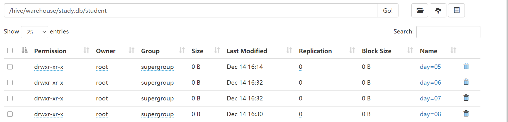
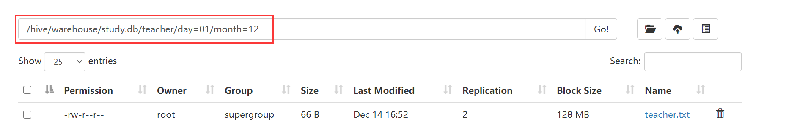

### 3.1 Beeline命令

<hr>
Beeline是 Hive 0.11版本引入的新命令行客户端工具,基于SQLLine CLI的JDBC客户端。

Beeline支持内嵌模式(embedded mode)和远程模式(remote mode)。在嵌入式模式下，运行嵌入式的Hive(类似Hive CLI)，而远程模式可以通过Thrift连接到独立的HiveServer2进程上。从Hive 0.14版本开始，Beeline使用HiveServer2工作时，它也会从HiveServer2输出日志信息到STDERR。

- **Hive的三种安装方式**

> 内嵌模式：不需要额外安装元数据库，采用的是Hive默认的Derby数据库，但这种模式有极大的缺陷就在于只允许一个 Hive 会话连接。
>
> 独立模式：在安装 Hive 的节点上安装一个 MySQL 服务端，并且将 `hive.metastore.local` 设置为 `true`
>
> 远程模式：将 Hive 服务端与元数据的存储地址分开，元数据直接存储在远程的数据库服务器上即可。因此这里我们采用的是 node01 安装 Hive 服务端，而node03 安装 MySQL，以此来实现 Hive 与元数据的解耦操作。

Beeline和其他工具有一些不同，执行查询都是正常的SQL输入。

- create databases;【创建数据库】

- select * from table_name;【查询表】

但是如果是一些管理的命令，比如进行连接，中断，退出，执行Beeline命令需要带上“!”，不需要终止符。

- **!connect url** 【连接不同的Hive2服务器】
- **!exit** 【退出shell】
- **!help** 【显示全部命令列表】
- **!verbose** 【显示查询追加的明细】


### 3.2 hive  -e

<hr>

不用进入交互窗口就能执行数据库相关命令

```sql
[root@node02 ~]# hive -e "show databases";
## 以下是结果
which: no hbase in (/usr/local/sbin:/usr/local/bin:/usr/sbin:/usr/bin:/opt/apps/jdk1.8.0_261/bin:/opt/apps/jdk1.8.0_261/jre/bin:/opt/apps/hadoop-3.1.4/bin:/opt/apps/hadoop-3.1.4/sbin:/opt/apps/hive-3.1.2/bin:/root/bin)
SLF4J: Class path contains multiple SLF4J bindings.
SLF4J: Found binding in [jar:file:/opt/apps/hive-3.1.2/lib/log4j-slf4j-impl-2.10.0.jar!/org/slf4j/impl/StaticLoggerBinder.class]
SLF4J: Found binding in [jar:file:/opt/apps/hadoop-3.1.4/share/hadoop/common/lib/slf4j-log4j12-1.7.25.jar!/org/slf4j/impl/StaticLoggerBinder.class]
SLF4J: See http://www.slf4j.org/codes.html#multiple_bindings for an explanation.
SLF4J: Actual binding is of type [org.apache.logging.slf4j.Log4jLoggerFactory]
Hive Session ID = e308f3e6-6cac-4e85-b4a1-2f53376dc53c

Logging initialized using configuration in file:/opt/apps/hive-3.1.2/conf/hive-log4j2.properties Async: true
Hive Session ID = 2b23427f-3062-4ad0-a6e4-5c51159af89d
OK
database_name
default
student
teaceher
Time taken: 3.745 seconds, Fetched: 3 row(s)
```


### 3.3 hive -f 

<hr>

不用进入交互窗口，用`vim`或`vi`创建一个文件，写入一些sql命令，通过hive -f 即可执行。

```sql
[root@node02 apps]# vim hive.sql
## 文件中的内容
show databases;
## 以下是执行结果
[root@node02 apps]# hive -f hive.sql
which: no hbase in (/usr/local/sbin:/usr/local/bin:/usr/sbin:/usr/bin:/opt/apps/jdk1.8.0_261/bin:/opt/apps/jdk1.8.0_261/jre/bin:/opt/apps/hadoop-3.1.4/bin:/opt/apps/hadoop-3.1.4/sbin:/opt/apps/hive-3.1.2/bin:/root/bin)
SLF4J: Class path contains multiple SLF4J bindings.
SLF4J: Found binding in [jar:file:/opt/apps/hive-3.1.2/lib/log4j-slf4j-impl-2.10.0.jar!/org/slf4j/impl/StaticLoggerBinder.class]
SLF4J: Found binding in [jar:file:/opt/apps/hadoop-3.1.4/share/hadoop/common/lib/slf4j-log4j12-1.7.25.jar!/org/slf4j/impl/StaticLoggerBinder.class]
SLF4J: See http://www.slf4j.org/codes.html#multiple_bindings for an explanation.
SLF4J: Actual binding is of type [org.apache.logging.slf4j.Log4jLoggerFactory]
Hive Session ID = 1bf5a42e-f5e7-4bd4-87cb-a5d8aa719c62

Logging initialized using configuration in file:/opt/apps/hive-3.1.2/conf/hive-log4j2.properties Async: true
Hive Session ID = 1fe787c1-bac7-42bf-9cb6-2254f95fab17
OK
database_name
default
student
teaceher
Time taken: 3.399 seconds, Fetched: 3 row(s)
```


### 3.4 其他命令

<hr>

- 退出hive客户端命令（非beeline模式下）

```sql
hive(default)>exit; 
hive(default)>quit;
```

- 退出hive客户端命令（beeline模式下）

```sql
hive(default)>!quit;
```

- 通过客户端用命令行来查看HDFS的文件系统

```sql
hive (default)> dfs -ls /;
Found 4 items
drwxr-xr-x   - root supergroup          0 2020-12-06 20:09 /data
drwxr-xr-x   - root supergroup          0 2020-12-02 12:53 /hive
drwxr-xr-x   - root supergroup          0 2020-11-03 16:42 /system
drwxrwxrwx   - root supergroup          0 2020-11-28 19:04 /tmp
```

- 查看本地的文件系统（即虚拟机上的文件系统）

```sql
hive (default)> ! ls /opt/apps;
data
hadoop-3.1.4
hive-3.1.2
hive.sql
jdk1.8.0_261
```

- 查看历史记录(即hive客户端的操作记录)

```sql
## 必须进入主目录才行
[root@node02 apps]# cat .hivehistory
cat: .hivehistory: 没有那个文件或目录
[root@node02 apps]# cd ~
[root@node02 ~]# cat .hivehistory
exit;
show tables;
exit;
```


### 3.5 HQL

<hr>

> HiveQL（简称HQL）是支持的类似的查询语言，HQL大体分为DDL、DDL、DML、UDF 四种类型。
>
> 
>
> - DDL:  （database definition language） 数据定义语言 引起的是结构上变化，不会影响数据 create drop alter
>
> - DML: DataManipulationLanguage 数据操作语言 不会引起结构上的变化 引起的是数据的变化 update
>
> - DQL: 数据查询语言 不会引起结构上的变化，也不会引起数据的变化，select where

DDL可以创建数据库、创建表、进行数据库和表的删除；DML可以进行数据的添加、查询；UDF还支持用户自定义查询函数。


### 3.6 Hive之DDL

<hr>

> （Database Definition Language） 数据定义语言 引起的是结构上变化，不会影响数据 create drop alter。
>
> **DDL主要负责的是数据库的创建、查看、修改、删除、表的创建、修改。**（主要侧重于对数据库、表的操作）


- **内部表：**

由Hive进行管理，创建内部表时，把内部表对应的数据会一并复制到对应的HDFS上（数据仓库）HIve所对应的目录下

- **外部表**

不由Hive管理，在创建外部表时，同时指定一个指向实际数据的路径作为表的信息一同储存在映射表中，用户可以通过查询表中这一数据知道该映射结构表的实际数据在什么位置。创建外部表时，仅记录数据所在的路径，不会对数据位置进行任何改变

**内部表和外部表的区别：**

> - 内部表和外部表在结构上没有任何区别，但在删除数据时，内部表可以用Hive进行删除，同时会把数据仓库上（HDFS上）对应的数据删掉。外部表则只是删除数据库中的数据信息，但不会真正的数据。
>
> - 创建外部表时，要加一个External

- **分区表：**

分区表实际上就是对应一个 HDFS 文件系统上的独立的文件夹，该文件夹下是该分区所有的数据文件。Hive 中的分区就是分目录，把一个大的数据集根据业务需要分割成小的数据集。在查询时通过 WHERE 子句中的表达式选择查询所需要的指定的分区，这样的查询效率会提高很多。（例如，将数科所有班级存入一张大表中（**其实是个目录**），为了利于管理，看起来更加系统，将这个大表进行分区，将数科191、数科192、数科201、数科202划分为四个区，辅导员需要哪个班级的数据时直接调对应分区的表即可。）


#### 数据库操作


##### 3.6.1 创建数据库

创建数据库的SQL格式

```sql
CREATE (DATABASE|SCHEMA) [IF NOT EXISTS] database_name
  [COMMENT database_comment]
  [LOCATION hdfs_path]
  [WITH DBPROPERTIES (property_name=property_value, ...)];
  --------------------------------------------------------------------------------------
  --(DATABASE|SCHEMA)：必须有的参数
 -- [IF NOT EXISTS]：可有可无（判断数据库是否已经存在）
 -- [COMMENT database_comment]：可有可无，对数据库加以说明
 -- [LOCATION hdfs_path]：指明数据库创建的路径
```


```sql
--if not exists 用于判断数据库是否已经存在，不存在就创建（可有可无），COMMENT用于对数据库做介绍（可有可无）
create database if not exists books COMMENT "第一个数据库";
--什么也不加
create database  books;
--指定创建位置
create database  books location "/school";
```


#####  3.6.2 查看数据库

```sql
--查看数据库
show databases;
--过滤显示数据库
show databases like "student";
--显示数据库的基本信息
desc database student;

OK
db_name	comment	location	owner_name	owner_type	parameters
student		hdfs://node01:9000/hive/warehouse/student.db	root	USER	
Time taken: 0.185 seconds, Fetched: 1 row(s)
--显示数据库的详细信息
 desc database extended  student;
 
OK
db_name	comment	location	owner_name	owner_type	parameters
student		hdfs://node01:9000/hive/warehouse/student.db	root	USER	
Time taken: 0.108 seconds, Fetched: 1 row(s)
```

##### 3.6.3 修改数据库

```sql
# 修改数据库的属性
ALTER (DATABASE|SCHEMA) database_name SET DBPROPERTIES (property_name=property_value, ...);
-- (注意: 在 Hive 0.14.0 增加了 SCHEMA 选项)

# 修改数据库的拥有者和角色
ALTER (DATABASE|SCHEMA) database_name SET OWNER [USER|ROLE] user_or_role; 
-- (注意: Hive 0.13.0 以上版本可用;在 Hive 0.14.0 增加了 SCHEMA 选项)
# 修改数据库的存储路径
ALTER (DATABASE|SCHEMA) database_name SET LOCATION hdfs_path;
-- (注意: Hive 2.2.1, 2.4.0以及以上版本可用)

```

##### 3.6.4 删除数据库

```sql
--删除空数据库
drop database books;
--如果存在的话删除空数据库
drop database if exists books;
--强制删除数据库
drop database books cascade;
```


#### 表操作

##### 3.6.3 创建内部表

```sql
create table if not exists studen(
    stuid int, --学生学号
    stuname string, --学生姓名
    stuage int --学生年龄
)
-- 每行字段以 \t分割
row format delimited fields terminated by '\t'

-- 根据查询结果创建表：有数据
create table if not exists student2 as select * from student;
create table if not exists student4 as select count(*) from teacher1;

--根据已经存在的表创建表（类似复制一张表）
create table if not exists student3 like student;

OK
student3.sno	student3.sname	student3.sage	student3.ssex
Time taken: 0.773 seconds

```

- 加载数据到表中

```sql
load data local inpath '/opt/apps/data/teacher.txt' into table teacher;
```

-  查看表的类型

```sql
desc formatted student3;
```


##### 3.6.4 创建外部表

外部表的创建与内部表没什么区别，只不过是在创建时要加上一个**<font color=red>external</font>**关键字即可。

```Sql
create external table  tea(
    stuid int,
    stuname string,
    stuage int
)
row format delimited fields terminated by '\t';	
```

- 加载数据到表中

```sql
load data local inpath '/opt/apps/data/teacher.txt' into table teacher;
```

-  查看数据

```sql
select * from ext_stu;
```

- 查询表的类型

```sql
desc formatted ext_stu;
```

- 删除表

```sql
drop table tea;
drop table student3;
```


#####  3.6.5 创建分区表

- 创建分区表

```sql
create table student(id int,name string )
partitioned by(day string comment 'study')
row format delimited fields terminated by '\t';
```

- 上传数据到分区中

```sql
load data local inpath '/opt/apps/data/student.txt' into table student partition (day='01');
```

- 增加分区

```sql
--增加单分区
alter table student add partition(day='05');
--增加多分区
alter table student add partition(day='06') partition(day='07');
```

- 删除分区

```sql
alter table student4 drop partition (day='183');
```

- 查看分区结构

```sql
desc formatted student;
```

study.db为数据库；student为表（其实再HDFS文件系统中是一个目录）；表里面的day05、day06、day07、day08为分区表。




- 创建二级分区

```sql
create table teacher(id int,name string)
partitioned by(day string ,month string )
row format delimited fields terminated by '\t';
```




- 分区数据关联的三种方式

```sql
  -- 方式一：先hadoop上传，后修复
  dfs -put /opt/data/student.txt /hive/warehouse/student.db/student/day=04;

  -- 查看
  select * from student;

  -- 执行修复
  msck repair table student;

  -- 查看
  select * from student;

  -- 方式二：先hadoop上传，后修改
  dfs -mkdir /hive/warehouse/study.db/student/day=06;
  dfs -put /opt/data/teacher /hive/warehouse/study.db/student/day=06;
  alter table student add partition(day='06');

  -- 方式三：先上传，后加载
  dfs -mkdir /hive/warehouse/study.db/student/day=07;
  load data local inpath '/opt/data/teacher.txt' into table student partition(day='07');
```


##### 3.6.6 修改表

- 表的重命名

```sql
alter table student rename to student6;
```

- 添加列

```sql
alter table student6 add columns(new string);
```

- 更改列：将某一列更改

```sql
alter table student6 change column new bb string;
```

- 替换所有列：后面跟的是新的列名

```sql
alter table student6 replace columns(ids int,names string,newb string);
```

- 修改内部表 student2 为外部表

```sql
alter table student2 set tblproperties('EXTERNAL'='TRUE');
```


### 3.7 Hive之DML

<hr>

>  Hive 数据真正存放在 Hadoop 之上，因此最简单的数据导入方式就是将数据上传至 HDFS 相应目录即可，但是此操作会非常不方便，因此 Hive 为我们提供了以下数据加载的方式。
>
> **DML负责数据的导入、导出、更新、删除**等操作（主要负责对数据的操作）。


#### 3.7.1 数据导入

Hive的数据是存放在Hadoop之上的，因此Hive在处理数据时需要将数据上传到HDFS中去。比如创建内部表时，需要将数据复制到HDFS上指定的目录中去。

>  Hive提供以下五种数据上传到HDFS上的方法，分别是：Load模式、Import模式、Insert模式、as select模式、Location模式


##### 3.7.1.1 导入数据（Load模式）

**创建普通数据表**

```sql
create table test(id int,name string) 
    row format delimited fields terminated by '\t';
```

- 从本地(Linux)上传数据

```sql
load data local inpath '/opt/data/student' into table test;
```

- 从本上传数据并覆盖原有

```sql
load data local inpath '/opt/data/student' overwrite into table  test;
```

**创建分区表**

```sql
create table test02(id int,name string)
partitioned by (num string)
row format delimited fields terminated by '\t';
```

- 向分区表中加载数据

```sql
load data local  inpath '/opt/apps/data/student.txt' into table test02 partition (num='01');
```

- 向分区表中加载数据,但是不指定分区(可以上传成功,但会报错)

```sql
load data local  inpath '/opt/apps/data/student.txt' into table test02;
## 错误如下
Query ID = root_20201218174108_6408e79a-4ec5-4aa1-9d5e-52558c638b98
Total jobs = 3
Launching Job 1 out of 3
Number of reduce tasks not specified. Estimated from input data size: 1
In order to change the average load for a reducer (in bytes):
  set hive.exec.reducers.bytes.per.reducer=<number>
In order to limit the maximum number of reducers:
  set hive.exec.reducers.max=<number>
In order to set a constant number of reducers:
  set mapreduce.job.reduces=<number>
Starting Job = job_1608280545793_0001, Tracking URL = http://node02:8088/proxy/application_1608280545793_0001/
Kill Command = /opt/apps/hadoop-3.1.4/bin/mapred job  -kill job_1608280545793_0001
Hadoop job information for Stage-1: number of mappers: 0; number of reducers: 0
2020-12-18 17:41:19,840 Stage-1 map = 0%,  reduce = 0%
Ended Job = job_1608280545793_0001 with errors
Error during job, obtaining debugging information...
FAILED: Execution Error, return code 2 from org.apache.hadoop.hive.ql.exec.mr.MapRedTask
MapReduce Jobs Launched: 
Stage-Stage-1:  HDFS Read: 0 HDFS Write: 0 FAIL
Total MapReduce CPU Time Spent: 0 msec
```


##### 3.7.2 导入数据(insert模式)

>  也可以使用 insert 子句将查询结果插入表中 (这种插入方法只能一条一条的插入)。

**创建分区表**

```sql
create table test03(id int ,name string)
 partitioned by(age int)
 row format delimited fields terminated by '\t';
```

- 向分区表中加载数据

```sql
insert into table  test03 partition(age=1) values(1001,'zhangsan'),(1002,'lisi');
```

